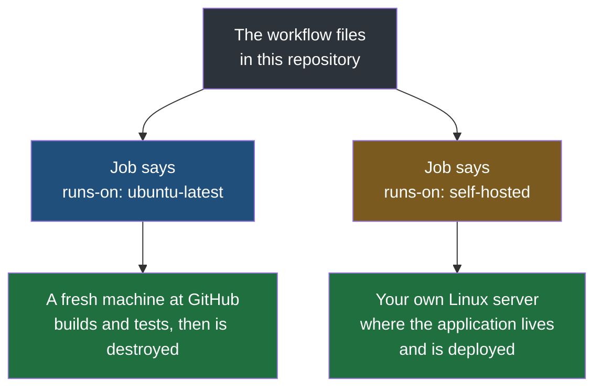

The test workflow from the previous note stops broken code being merged, and it cost one file in the repository. What it cannot do is deploy. A machine GitHub creates for ninety seconds and then destroys has no business reaching into a server of yours, and the application has to run somewhere permanent regardless — so the last step of the pipeline needs a runner of your own.

This is the right moment to set one up, because the trade is now concrete rather than hypothetical. The work below buys exactly one thing: the step the previous note's workflow could not take.

> [!important] Two pipelines, one application, one port.
> The workflow files added here live in the same repository as the `Jenkinsfile`, and they deploy the same jar to the same server. That is a sensible thing to do exactly once, while you are moving from one tool to the other and want to see both do the identical job. It is not a way to run a service. Two copies of the calculator cannot both listen on 8081, so before the workflow below is allowed to deploy, the systemd service the Jenkins pipeline installed is stopped with `sudo systemctl stop calculator`. Leave both pipelines armed against one application and they will eventually fight over it.

## Installing a runner of your own

The instructions come from the repository itself, under **Settings → Actions → Runners → New self-hosted runner**, and they matter because **the download they give you is specific to the operating system and processor of the machine you are installing on**. Pick the wrong architecture and the runner will not start.

The processor is worth checking rather than assuming, since Apple Silicon machines and many cloud instances are ARM while most older servers are x64:

```bash
# on the server
uname -m
```

On the Multipass virtual machine used in these notes this reports `aarch64`, the 64-bit ARM architecture, so the ARM64 download is the right one.

![[Devops/05-CI-CD/Images/new-self-hosted-runner.png]]

**Set the runner image and the architecture before copying anything.** The commands underneath are generated from those two choices — the page rewrites the download URL and the archive name the moment either changes. Copying the x64 commands and correcting them by hand afterwards is the usual way to end up with a runner that downloads without complaint and then refuses to start.

> [!warning] The yellow banner on that page is describing a real attack.
> Anybody can fork a public repository and open a pull request against it. If a workflow is triggered by `pull_request` and runs on `self-hosted`, then the code in that fork executes on your machine — the stranger writes what runs, and your server runs it, without their ever having been given any access to your repository. On a runner GitHub destroys afterwards this costs little. On a machine of your own it means somebody you have never met got to run commands on it.
>
> **The rule that keeps you safe is narrow and easy to hold: nothing triggered by an unmerged pull request may run on your own runner.** The two workflows in this note satisfy it — the test workflow runs on `ubuntu-latest`, so fork code only ever touches a throwaway machine, and the deploy workflow cannot start until a pull request has actually been merged, which only somebody with write access can do. That `if` condition is doing two jobs at once: it stops rejected work being deployed, and it is also what keeps a stranger's branch off your server. A private repository removes the problem altogether, since there are no outside forks to worry about.

The page then gives a sequence to paste, one command at a time, which does four things:

| Step                                         | What it does                                                                                          |
| -------------------------------------------- | ----------------------------------------------------------------------------------------------------- |
| Create a directory and enter it              | Everything the runner needs lives in one folder, by convention `actions-runner` in the home directory |
| Download the runner package                  | A single archive, with a checksum to verify it                                                        |
| Extract it                                   | Produces the runner's own scripts, including the two used below                                       |
| Run `./config.sh` with a token from the page | Registers this machine with your repository                                                           |

The token in that last command is generated for you and is short-lived. It is a credential: it authorises a machine to attach itself to your repository and receive work, so it does not get pasted into a note, a ticket or a chat message.

**Configuration then asks a few questions**, and the defaults are right for all of them:

```
Enter the name of the runner group: [press Enter for Default]
Enter the name of runner: [press Enter for <hostname>]
Enter any additional labels: [press Enter to skip]
Enter name of work folder: [press Enter for _work]
```

The runner's name is how you will recognise it in the repository's list, so a descriptive one helps when there is more than one machine. The work folder is where the runner will check out code and do its building — `_work` inside the runner directory, and there is no reason to change it.

Configuration finishes with:

```
√ Runner successfully added
√ Runner connection is good

# Runner settings
√ Settings Saved.
```

**The runner then has to actually be started:**

```bash
# on the server, in the actions-runner directory
./run.sh
```

```
√ Connected to GitHub

Current runner version: '2.337.0'
Listening for Jobs
```

That last line is the runner's resting state. It holds a connection open to GitHub and waits. In the repository's runner list it now appears as **Idle**, which means connected and ready but not currently working.

> [!warning] `./run.sh` stops when you close the terminal.
> It runs in the foreground, tied to the session that started it, exactly like starting an application by hand rather than under systemd — the problem the earlier notes solved for the deployed application with a service unit. For anything beyond a demonstration, install the runner as a service instead, using the script that ships in the same directory: `sudo ./svc.sh install` then `sudo ./svc.sh start`, with `sudo ./svc.sh status` to check on it. It then starts with the machine and survives logging out.

> [!note] The runner directory is this tool's workspace.
> The earlier note on executors and workspaces described the directory Jenkins keeps per job, where it checks out the code and does the building. `actions-runner/_work` is the same idea under a different name: scratch space belonging to the tool, holding a copy of the repository while a job is running. Neither is where your application lives, and neither should be treated as permanent.

### Asking for it in the workflow

Once the runner exists, a job asks for it by name:

```yaml
    runs-on: self-hosted
```

`self-hosted` is a **label**, not a machine name. The runner gives itself several labels automatically when it registers — `self-hosted`, plus its operating system and architecture, such as `Linux` and `ARM64` — and `runs-on` matches against them. A job asking for `self-hosted` will be picked up by any of your own runners; asking for more specific labels narrows it to a subset, which is how a repository with several machines sends each job to the right one.



## One thing to fix in the project first

Before this workflow can work, the packaged jar needs a predictable name. The test workflow never needed one, because running tests does not care what the jar is called; a deployment that has to copy the jar by name does.

By default Maven names the jar after the project and its version — `calculator-0.0.1-SNAPSHOT.jar`. That name changes whenever the version changes, and a deployment script that has to copy the jar somewhere would have to be edited every time it did. The Jenkins pipeline sidestepped this by copying whatever jar it found and renaming it by build number; the workflow here takes the simpler route and fixes the name at build time:

```xml
<!-- pom.xml -->
<build>
    <finalName>app</finalName>
</build>
```

The packaged file is now always `target/app.jar`, whatever the version says, and the deployment steps below can refer to it literally.

## The deploy workflow

```yaml
# .github/workflows/deploy.yml
name: Deploy To Ubuntu

on:
  pull_request:
    branches:
      - master
    types:
      - closed

jobs:
  deploy:
    if: github.event.pull_request.merged == true

    runs-on: self-hosted

    steps:
      - name: Checkout Master
        uses: actions/checkout@v7
        with:
          ref: master

      - name: Java Setup
        uses: actions/setup-java@v6
        with:
          distribution: temurin
          java-version: '21'

      - name: Check Java Version
        run: java -version

      - name: Build Application
        run: |
          chmod +x mvnw
          ./mvnw clean package -DskipTests

      - name: Stop Old Application
        run: |
          if [ -f /home/ubuntu/calculator/app.pid ]; then
            PID=$(cat /home/ubuntu/calculator/app.pid)

            if kill -0 "$PID" 2>/dev/null; then
              kill "$PID"
              sleep 2
            fi

            rm -f /home/ubuntu/calculator/app.pid
          fi

      - name: Copy New Application
        run: |
          mkdir -p /home/ubuntu/calculator
          cp target/app.jar /home/ubuntu/calculator/app.jar

      - name: Start Application
        run: |
          cd /home/ubuntu/calculator

          RUNNER_TRACKING_ID="" nohup java -jar app.jar > app.log 2>&1 &

          echo $! > app.pid
```

Five things in that file are worth stopping on.

**The trigger is a closed pull request, and the condition is what makes it safe.** A pull request closes whether it was merged or abandoned, so the event alone would deploy rejected work. The `if` line asks GitHub for the pull request's own record of whether it was merged, and the job does not start unless the answer is yes. Everything about the job — including occupying the runner — is skipped otherwise.

**It runs on the self-hosted runner**, because this is the half that has to touch the server the application lives on. The previous workflow ran on GitHub's machine because building and testing need nothing of yours.

**Tests are skipped here on purpose.** `-DskipTests` looks careless and is the opposite: these exact tests already ran, on this exact code, in the workflow that gated the merge. Running them again costs a minute and proves nothing new. The sequence only makes sense as a pair — skipping tests at deploy time is defensible precisely because the gate exists.

**The application is deployed under the home directory**, `/home/ubuntu/calculator`, rather than to `/opt/cicd/calculator` where the Jenkins pipeline puts the very same jar. That is a deliberate simplification: `/opt` is owned by root, which is what forced the whole business of creating the directory, changing its owner, and granting the build user a narrowly scoped sudo rule. A directory inside the runner user's own home is already writable by the process doing the work, so none of that setup is needed. It is the right trade for a demonstration and the wrong one for a real service, where an application directory owned by a login user is a security and tidiness problem. Seeing both locations side by side is the clearest possible statement of what that setup work in the earlier note was buying.

**The process is detached deliberately, and `RUNNER_TRACKING_ID=""` is the interesting part.** The earlier note on preparing the server explained why a Jenkins build cannot simply start an application: when the build ends, Jenkins kills the processes it started, and the application dies with it. The GitHub Actions runner does exactly the same thing, tracking the processes a job spawns and cleaning them up when the job finishes. Clearing that tracking variable for this one command is what tells the runner this process is not its business. `nohup` and `&` then put it in the background, its output goes to `app.log`, and `echo $! > app.pid` writes the new process id to a file so the next deployment's stop step can find and kill it.

> [!note] A pid file is the poor relation of a service manager.
> Stopping and starting by pid file is the do-it-yourself version of what systemd did for the calculator in the earlier notes, and it is visibly more fragile: it depends on a file staying in step with reality, and it has no answer if the application dies on its own at three in the morning. The Jenkins notes went the other way and made systemd own the process, which is what a real deployment should do. Shown here as it is, the difference between the two approaches is easy to see.

## Why those two Java steps are in there

`Java Setup` and `Check Java Version` are the two steps most likely to look redundant in that file, and leaving them out produces the single most confusing failure on a self-hosted runner. It is worth knowing what they prevent.

Without them, the build fails like this:

```
[ERROR] Failed to execute goal ... (default-compile) on project calculator:
Fatal error compiling: error: release version 21 not supported

Process completed with exit code 1
```

**This error already appeared in this folder**, when the Jenkins pipeline hit it because the server had only a Java runtime and no compiler. It means the same thing here: the project asks for Java 21 output and the compiler doing the work is older than 21 and cannot produce it.

What makes it so hard to place is that everything about it looks impossible. The identical build runs perfectly on the developer's machine. The server has Java 21 installed, and `java -version` at a login shell says so plainly. The test workflow, in the same repository, compiles the same code without complaint.

The difference is not in either machine. It is in what each workflow assumes:

| | `pre-tests.yml` | A `deploy.yml` without those steps |
|---|---|---|
| Runs on | A fresh GitHub machine | Your own server |
| Java it compiles with | The 21 it installed for itself | Whatever the machine happens to default to |
| Breaks when | Essentially never | The machine has an older JDK first on its path |

**A self-hosted runner uses whatever is already on the machine, and what is already there is whatever history left behind.** A server can easily carry several JDKs and default to an older one, and the runner process has its own environment, which need not match what you see when you log in and type `java -version` yourself. A hosted runner has no history to inherit, which is why installing Java feels obviously necessary there and deceptively optional here.

So the deploy workflow installs its own Java, exactly as the test workflow does. `Check Java Version` then prints what it got into the log — one line that costs nothing and means the answer is already in the output the next time something like this comes up, instead of being an investigation.

> [!important] The general rule, worth more than this one fix.
> **A workflow should declare what it needs rather than inherit it.** The hosted runner enforces this automatically, because it starts empty and gives you nothing to inherit. A self-hosted runner quietly allows the other habit, and a workflow that leans on the machine's existing state works right up until the machine changes — a different server, a reinstalled package, a second runner added next year. Declaring the toolchain is what makes a workflow reproducible, and reproducible is the whole reason for running builds outside somebody's laptop.
>
> The same applies to anything else the build reaches for. If a workflow needs Maven, Node, a particular Python, or a command line tool, the workflow installs it. Anything it merely hopes to find is a failure waiting for the day somebody rebuilds the box.

## Merging, and the deploy that follows

Back to the pull request left sitting earlier with its checks green and its merge button waiting. Pressing that button closes the pull request as merged, which is the event this second workflow has been waiting for. On the server, the runner that has been sitting idle since `./run.sh` was started picks the job up, and its terminal changes from `Listening for Jobs` to `Running job: deploy`.

## Proof that it deployed

The way to be sure is to ask the application, not the pipeline. The server's address comes from the virtual machine manager:

```bash
# on the developer's machine
multipass info devops
```

Then the endpoints, on the port the calculator was given back when it was first written:

```
http://<the VM's IPv4 address>:8081/health              →   {"status":"UP","service":"calculator","version":"0.0.1-SNAPSHOT"}
http://<the VM's IPv4 address>:8081/api/add?a=10&b=5    →   {"a":10,"b":5,"result":15}
```

Nobody connected to the server. Nobody built a jar by hand, copied one anywhere, or restarted anything. A pull request was merged, and the running application changed.

## Watching the gate hold

The last thing to do is break it deliberately, because a gate nobody has seen stop anything is only assumed to work.

A new branch changes what `/api/add` returns — the sum now comes back under a key named `sum` instead of `result` — and **the test that asserts the old shape is left alone**. That is not a contrived mistake; it is the single most common way a test suite goes red in real work. The change is perfectly good code. It compiles, it runs, and it quietly breaks every caller written against the old response.

The pull request goes up, and the check fails:

```
Some checks were not successful
1 failing check

PR Tests / tests (pull_request)    Failing after 20s
```

The merge button is no longer the obvious green thing to press. The second workflow never runs, because it listens for a merged pull request and there is no merge. **The server is untouched**, still serving the previous version, and `/api/add?a=10&b=5` on the deployed application still answers `{"a":10,"b":5,"result":15}` exactly as it did before.

That is the entire value of the arrangement in one screen: the broken change is visible, attributed, and stopped while it is still a proposal.

> [!tip] Start a new branch for every change.
> Once a branch has been merged, leave it alone and cut a fresh one from the updated `master` for the next piece of work. Reusing a merged branch means working on top of history that has already been integrated, which is how divergences like the one above get created in the first place.

## The two tools, side by side

Both halves of this folder now exist, and the comparison is the useful thing to keep.

| | Jenkins | GitHub Actions |
|---|---|---|
| Where the engine lives | Software you install and maintain on your own server | Built into the repository host |
| How it learns about a change | Asks the repository repeatedly, or is told by a webhook you configure | Already knows, because it is the same system |
| Pipeline written in | Groovy, in a `Jenkinsfile` at the repository root | YAML, in files under `.github/workflows/` |
| Machine that builds | An agent you provide | A fresh machine per run, or your own if you want one |
| Setup before the first build | A virtual machine, Java, the package, plugins, tool configuration | A file in the repository |
| Can react to issues, comments, reviews | Only with a plugin and a webhook wired up, because it sits outside | Built in, because it sits inside |
| Works with any Git host | Yes | Only with GitHub |

That last row is the honest cost. The reason Jenkins remains widespread is that it does not care where the code is kept, which matters to organisations that host their own Git server or use something other than GitHub. The concepts move across regardless — a stage is a job, an agent is a runner, a trigger is an event — and someone who has built a pipeline in one can read a pipeline in the other.
