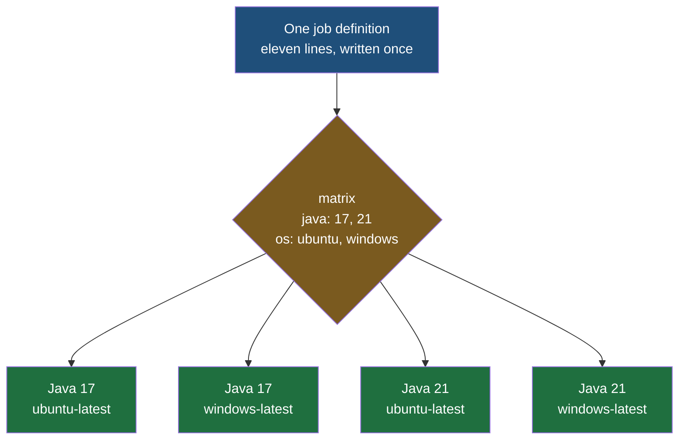
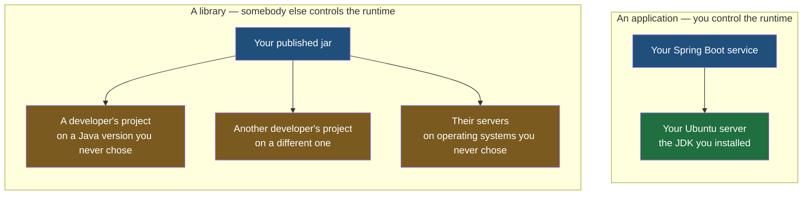

Both halves of the pipeline are now real: a workflow that tests a proposal before it can be merged, and a workflow that deploys once it has been. Both of them, though, answer a narrower question than the green tick suggests, and this note is about the gap between what was proved and what was assumed.

## What the green tick actually proved

Look again at the test workflow and read the two lines that decide where it runs:

```yaml
# .github/workflows/pre-tests.yml
jobs:

  tests:
    runs-on: ubuntu-latest

    steps:

      - name: Java Setup
        uses: actions/setup-java@v6
        with:
          distribution: temurin
          java-version: '21'
```

That workflow has been passing for several notes now, and what it proves is precise: **this code compiles and its tests pass on Ubuntu, using Java 21.** It says nothing whatsoever about Java 17. It says nothing about Java 8, and nothing about Windows. Those were never tested, so the tick is silent about them — and a tick that is silent about something reads exactly like a tick that has cleared it.

**Java runs newer on older, never older on newer.** Code written for Java 8 will generally run on a Java 21 runtime, because the platform works hard to keep old programs working. The reverse fails outright: compile against Java 21 and hand the result to a Java 8 runtime and it refuses to load. So proving the newest version works proves nothing about the older ones, which is the direction the risk actually runs.

## The version you would write first

Suppose you decide the project must work on Java 17 and Java 8 as well as 21. Everything needed to do that is already in hand, so the obvious move is three jobs:

```yaml
# .github/workflows/pre-tests.yml
jobs:

  test-java-8:
    runs-on: ubuntu-latest
    steps:
      - uses: actions/checkout@v7
      - uses: actions/setup-java@v6
        with:
          distribution: temurin
          java-version: '8'
      - run: ./mvnw test

  test-java-17:
    runs-on: ubuntu-latest
    steps:
      - uses: actions/checkout@v7
      - uses: actions/setup-java@v6
        with:
          distribution: temurin
          java-version: '17'
      - run: ./mvnw test

  test-java-21:
    runs-on: ubuntu-latest
    steps:
      - uses: actions/checkout@v7
      - uses: actions/setup-java@v6
        with:
          distribution: temurin
          java-version: '21'
      - run: ./mvnw test
```

This works. Three jobs, three machines, all three running at once, and the answer you wanted on all three versions.

It is also the same nine lines written three times with one character different, which is the duplication a pipeline was supposed to abolish. Add a step and you add it three times. Add Java 25 and you paste the block again. Forget to update one of them and the file now lies about what it checked.

## One job, many configurations

**A matrix is a list of values attached to a job, and a promise to run that job once for every value.** It lives under a `strategy` key:

```yaml
# .github/workflows/pre-tests.yml
jobs:

  tests:
    strategy:
      matrix:
        java: [8, 17, 21]

    runs-on: ubuntu-latest

    steps:

      - name: Checkout Code
        uses: actions/checkout@v7

      - name: Java Setup
        uses: actions/setup-java@v6
        with:
          distribution: temurin
          java-version: ${{ matrix.java }}

      - name: Run Unit Tests
        run: |
          chmod +x mvnw
          ./mvnw test
```

`java` is a name you invent. `[8, 17, 21]` is the list of values it takes. And `${{ matrix.java }}` is how a step reads whichever value this particular run was given.

**That `${{ ... }}` is new, and it is worth naming properly because the rest of this folder leans on it.** Everything written in a workflow file so far has been a fixed value: `ubuntu-latest`, `temurin`, `'21'`. An expression is the escape hatch from that — **anything between `${{` and `}}` is evaluated when the workflow runs, and the result is substituted in.** What you may refer to inside one are contexts: named collections of information about the run. `matrix` is the context holding this run's values from the list above, and it exists only inside a job that declared a matrix. There are others, and the next notes use two of them.

One job definition, three runs, three separate machines, each with a different JDK installed. The file went from twenty-seven lines to eleven and stopped being able to drift out of sync with itself.

## Why it is called a matrix

A single list is the easy case. The mechanism earns its name on the second one.

Suppose the question is not only which Java versions the code works on, but which operating systems — because a build that passes on Linux can still fail on Windows over a path separator, a line ending or a case-sensitive filename. Written as separate jobs that is four blocks, one per pairing. Written as a matrix it is two more words:

```yaml
# .github/workflows/pre-tests.yml
jobs:

  tests:
    strategy:
      matrix:
        java: [17, 21]
        os: [ubuntu-latest, windows-latest]

    runs-on: ${{ matrix.os }}

    steps:

      - name: Checkout Code
        uses: actions/checkout@v7

      - name: Java Setup
        uses: actions/setup-java@v6
        with:
          distribution: temurin
          java-version: ${{ matrix.java }}

      - name: Run Unit Tests
        run: |
          chmod +x mvnw
          ./mvnw test
```

**Every combination runs.** Two versions times two operating systems is four jobs, generated from one description, and note that `runs-on` is now an expression too — the machine itself is one of the things being varied.



That cross-multiplication is where the name comes from: two lists crossed against each other produce a grid, and every cell of the grid is a run. A third list multiplies again — three operating systems, three Java versions and two database versions is eighteen jobs from one block of YAML. **The ceiling is 256 jobs per matrix per workflow run**, which sounds generous until you notice how quickly multiplication gets there; four lists of four values is already 256 exactly.

> [!tip] The step contents almost never change.
> Compare the matrix version with the original single-version workflow and the steps are identical. That is the property worth noticing: a matrix does not ask you to write your job differently, it asks you to pull the varying values out into a list and refer to them by name. Everything that made the job work still works.

> [!note] One failure stops the rest, unless you say otherwise.
> If any job in a matrix fails, the others are cancelled — that is `fail-fast`, and it defaults to true. It is usually what you want, because the first red answer is normally enough. When you would rather see the full grid, because knowing it fails on Java 8 only or on every version changes what you do next, set `strategy.fail-fast: false` and let them all finish. There is also `strategy.max-parallel`, which caps how many run at once, for when a matrix of twenty would otherwise flood your runners.

## The question underneath: why would anyone need this?

Here is the objection, and it is a good one. Your end users do not run your code. They open a web page, or an app, which calls your API; the Java runs on your server. You chose that server. You installed that JDK. You are never going to wake up and find your production machine has quietly moved to Java 8 — so who exactly is running your code on a version you did not pick?

**Nobody, as long as what you are building is an application.** The objection is correct for a web application, and it is worth stating plainly rather than dodging, because a matrix across operating systems on a service that will only ever run on one Linux box is cost with no benefit.

The answer is that an application is not the only thing people write code to produce.



**Write a library and the runtime stops being yours.** Publish a jar that does something useful — parses a date format, talks to an internal service, wraps an API — and the developers who depend on it are on whatever Java version their own project uses. You have no say in it and no visibility of it. If your library only works on 21 and somebody's project is on 17, the failure is theirs to discover and yours to have caused. A matrix across versions is how you find that out before they do.

**And dependencies travel.** A library is not run in isolation; it is pulled into somebody else's build and packaged into whatever they deploy. Their server might be Windows where yours was Linux. Anything in your code that assumed a path shape or a shell will break there, in an application you have never seen, reported as a bug in your name.

A matrix does not make any of that work by itself, and it is worth being honest about the boundary. **Where a step genuinely differs by platform, you still write both versions** — a shell command that exists on Linux and not on Windows has to be handled, usually by branching on `matrix.os` or by keeping the platform-specific part to one step. In practice that is a small surface for most projects, because the build tool absorbs the difference: `./mvnw test` is the same instruction everywhere. The matrix runs the job; making the job survive four environments is still work.

> [!important] You write libraries more often than you think you do.
> The reflex is to assume libraries come from somewhere else — that they are what large companies publish and everyone else consumes. Most organisations of any size have their own internal ones: shared clients for internal services, common models, an authentication wrapper, a logging convention, the utilities every team ended up needing. They are versioned, published to an internal repository, and depended on by teams whose build settings you do not control. That is the same problem as a public library with a smaller audience, and it is the situation most working developers are actually in.

There is one more case where the objection fails outright, and it is the distinction to keep: **a web application runs on your server, but installed software runs on the user's machine.** A desktop application, a command line tool, an agent, anything that ships as something a person downloads — that lands on hardware and an operating system you had no part in choosing, and testing it on one configuration tells you about exactly one configuration.

| | What a matrix buys you |
|---|---|
| A web service you deploy | Very little — you own the runtime and can simply pin it |
| A library or framework others depend on | The core of the thing: every version and platform a consumer might be on |
| An internal shared library | The same, at company scale, for teams you cannot poll |
| Installed software, desktop or command line | Essential — the runtime belongs to the user |

> [!question] Does the matrix mean the code now has to work everywhere?
> No, and it is worth being clear about which job is whose. A matrix does not make code compatible; it reports whether it is. Deciding to support Java 8, and writing code that stays within what Java 8 offers, is a development decision about who the users are. The pipeline's job is to hold that decision honest — to notice the day somebody uses a newer language feature and the promise quietly stops being true. Automation tells you the truth about the code; it does not change the code to suit.
