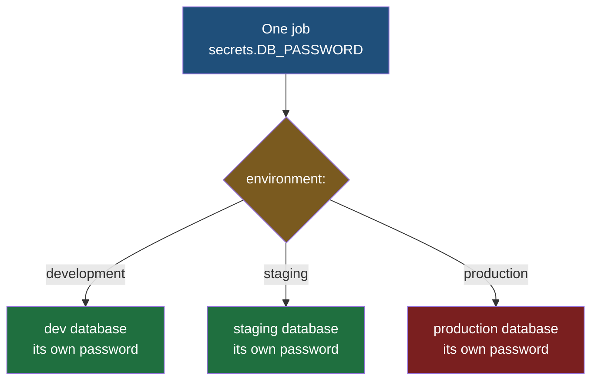

A matrix changes what a workflow runs on. This note is about something a workflow needs that cannot be written into the workflow file at all, and about the fact that the same pipeline has to mean different things depending on where it is deploying.

## The values that cannot go in the repository

Every real application holds values that are not code and are not configuration either. The database it connects to needs a password. The cloud account it deploys into needs an access key. The image registry it pushes to needs credentials. A service that calls a hosted language model — ChatGPT, DeepSeek, any of them — needs an API key that somebody is paying for by the request, and a leaked one is spent by strangers on your bill.

> [!info] The calculator in this folder has nothing worth hiding, so this note borrows a bigger application.
> The service the previous notes build and deploy does arithmetic and talks to nothing, which makes it a poor example for credentials. The examples below assume an application of the ordinary kind — one that stores data in a database and deploys to a cloud account. The pipeline it hangs off is the same pipeline; only the application behind it is larger.

None of those can go in the repository, and the reason is stronger than it first looks:

> [!danger] A credential pushed to Git is a credential you have to replace, not one you can delete.
> Git does not store the current state of a file, it stores every state the file has ever had. Delete the password in the next commit and it is still sitting in the previous one, readable by anyone who can clone the repository, for as long as the repository exists. There is no undo — the only real remedy is to change the password everywhere it is used, which is exactly the emergency you were trying to avoid. GitHub now scans pushes for recognisable credential formats and blocks or warns on them, which catches the obvious cases, but it is a safety net and not a plan.

So the first rule is one that belongs to writing the application rather than the pipeline. **A credential is never a literal in the source.** Not this:

```java
// src/main/java/com/bookcart/catalogue/BookRepository.java
String dbPassword = "prod_QmR7x2";
```

The value is read from the environment instead, and the file that holds it locally is listed in `.gitignore` so it never reaches the repository in the first place.

## Which creates a new problem

The runner is a machine that was created a minute ago and has a fresh clone of the repository on it. It does not have the file you deliberately never pushed. So a job that has to run integration tests against a database, or deploy to a cloud account, now cannot — the credential is missing precisely because you protected it properly.


**GitHub secrets are the way across that gap.** They are values stored against the repository rather than inside it, held encrypted, and injected into a workflow run on request. They live under Settings → Secrets and variables → Actions, they are never part of a commit, and nothing about them appears in the repository's history.

A stored secret is used through the same expression syntax as everything else:

```yaml
# .github/workflows/deploy.yml
jobs:

  deploy:
    runs-on: self-hosted

    steps:

      - name: Start Application
        env:
          DB_PASSWORD: ${{ secrets.DB_PASSWORD }}
        run: java -jar target/app.jar
```

`secrets` is a context, like `matrix` in the previous note, and `DB_PASSWORD` is the name the value was stored under. The `env` block puts it into the step's environment, which is where the application already expects to find it. The workflow file names the secret; it never contains it.

The rules worth knowing before you rely on this:

| | |
|---|---|
| Naming | Letters, digits and underscores only, no spaces, cannot start with a digit or with `GITHUB_`. Names are stored uppercase and matched case-insensitively |
| Size and count | 48 KB per secret; up to 100 per repository and 100 per environment |
| In the logs | Redacted automatically — a secret printed by accident appears as `***` |
| From a fork | **Not passed at all.** A workflow triggered by a pull request from a forked repository gets no secrets |

> [!warning] The fork rule is a defence, not an inconvenience.
> The deploy workflow already refuses to run on anything but a merged pull request, because a job on `self-hosted` executes whatever code the pull request contains on a machine you own. Secrets being withheld from forks is the second half of that same protection: a stranger can open a pull request against your repository, but the workflow that runs on it cannot read your production database password. Both rules exist because a pull request is untrusted code, and both should stay in mind whenever you are tempted to loosen one.

> [!note] Anyone with write access can change a workflow file, and that is fine.
> A reasonable worry: if a teammate can edit the YAML, can they add a step that prints the secret? They can write it, but the change is a commit — attributed, reviewable, permanently in the history and visible to `git blame`. The protection is not that the file cannot be changed; it is that a change cannot be made quietly.

## Secrets and variables are not the same thing

This is the distinction people get wrong, and getting it wrong is how a secret store fills up with things that were never secret.

Alongside secrets, the same settings page holds **variables** — values stored the same way but not hidden, readable in logs, and referenced as `${{ vars.NAME }}`. The mistake is putting ordinary configuration into secrets because that is where the important-looking values go:

```yaml
      - name: Java Setup
        uses: actions/setup-java@v6
        with:
          java-version: ${{ secrets.JAVA_VERSION }}
```

**The Java version is not a secret.** Nobody learning that this project builds on Java 21 can do anything with the knowledge; it is not a credential, it cannot be used to reach anything, and hiding it costs you the ability to read your own workflow logs. Worse, it teaches the wrong instinct about what the secret store is for.

| | Is it a secret? |
|---|---|
| Database password, API key, cloud access key, registry password | Yes — it grants access to something |
| Java version, region name, service name, image tag, feature flag | No — it configures behaviour and nothing more |

The test is a single question: **if a stranger read this value, could they do something with it?** If not, it is configuration, and it belongs in a variable or in the repository.

## The same key, three different values

Now the second half. An application does not exist in one copy — it runs in several environments, and they are genuinely separate systems:

| | What it is for |
|---|---|
| **Development** | Where changes are tried. Broken most of the time by design |
| **Staging** | A rehearsal of production, used to test a change under realistic conditions before release |
| **Production** | The real thing, with real users and real data |

Each has its own database, its own Redis, its own Kafka — its own everything, because the separation is only worth anything if it is complete. Which means `DB_PASSWORD` is not one value. It is three values with one name.

> [!important] The environments do not share a database, and assuming they do is the expensive mistake.
> The instinct that development and staging just point at production with different settings is common and wrong. They are separate servers holding separate data, and the reason is not tidiness. If a single database sits behind all three, then anybody with development access can reach production data, and one mistyped query written in the confidence of a test environment deletes or corrupts real customer records. The separation is what makes a development environment safe to be careless in. The database engine is usually the same product in all three; the servers, the data and the credentials are not.

> [!tip] Separate data does not have to mean unrealistic data.
> Staging is only a useful rehearsal if it resembles production, which is why teams commonly run a scheduled job that copies production data down into staging overnight. The data is similar; the credentials are still different, and the copy is one-directional.

**Environment secrets** are how one workflow reaches the right value. An environment is created in the repository settings, secrets are attached to it, and a job declares which one it is running against:

```yaml
# .github/workflows/deploy.yml
jobs:

  deploy-staging:
    runs-on: self-hosted
    environment: staging

    steps:

      - name: Start Application
        env:
          DB_PASSWORD: ${{ secrets.DB_PASSWORD }}
        run: java -jar target/app.jar
```

**The expression did not change.** `${{ secrets.DB_PASSWORD }}` is written identically whichever environment the job targets; the `environment` key is what decides which stored value it resolves to. Change that one line to `production` and the same job, with the same steps, connects somewhere else entirely.



Where the same name exists at both levels, **the environment secret wins** — the more specific value takes precedence over the repository-wide one.

## What else an environment can do

Naming an environment turns out to buy more than a set of values, because it gives GitHub a place to attach rules. All of them must pass before the job is sent to a runner at all:

| Rule | What it does |
|---|---|
| **Required reviewers** | Up to six people or teams; one of them must approve before the job starts. A deployment that waits for a human |
| **Wait timer** | A delay in minutes between the job becoming eligible and actually running |
| **Deployment branches** | Restricts which branches may deploy to this environment at all |

Required reviewers is the interesting one, because it reintroduces a human deliberately. Everything in this folder so far has been about removing people from the path between a merge and a deployment — and for staging that is exactly right. For production, plenty of organisations want the automation to do all the work and then stop and ask, so that the release happens when somebody decides it should rather than the moment a pull request is merged. The wait timer serves a similar purpose without a person: a gap between merge and deploy during which a change that is obviously wrong can still be caught.

Deployment branch restrictions close a hole worth seeing. Without them, a job that names `environment: production` can be triggered from any branch — including one somebody just created. With them, production is reachable only from `master`, and the environment's secrets are reachable only from there too.

> [!important] Very few people should hold production credentials, and this is how that is enforced.
> In practice, developers are given credentials for development and staging as a matter of course, and production credentials go to a small number of people who have a specific reason to need them — someone investigating a live problem that cannot be reproduced anywhere else. Environments are the mechanism that makes this workable rather than merely stated: the production values live in one place, access to that place is restricted, and a pipeline can deploy to production without any individual ever seeing the password it used.
