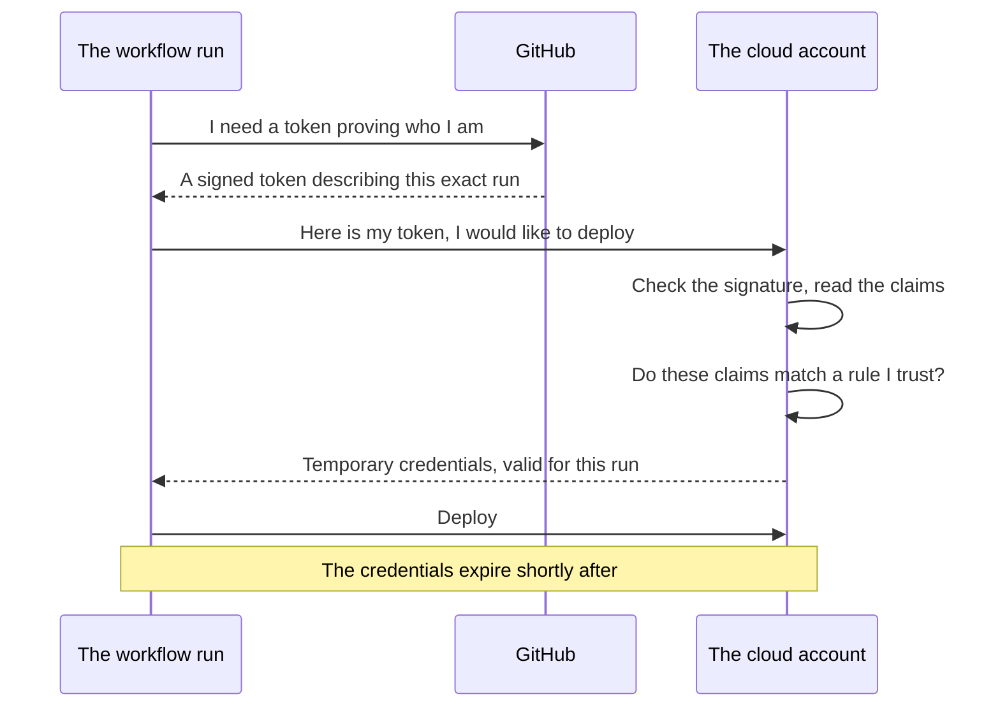

Secrets solved the problem of a credential sitting in the repository. They do not solve the problem of the credential existing, and this note is about the difference.

## A stored secret is still a secret that can leak

Put a cloud access key into the secret store and it is encrypted, kept out of the history, redacted from logs and withheld from forks. All of that is real protection. None of it changes one fact: **somewhere there is a string that grants access to your cloud account, and it works for anybody who has it.**

Things leak. Not usually through the mechanism you hardened — through a screenshot in a support ticket, a laptop that was not encrypted, a log that a third-party tool collected before the redaction applied, a former employee's access that was never revoked, a dependency that turned out to be reading environment variables. Every one of those is ordinary.

What makes it expensive is how long the key stays useful:

> [!danger] The damage is the length of the window, not the moment of the leak.
> Cloud access keys are commonly issued with no expiry at all, or rotated on a schedule measured in months. Suppose yours leaks in the first week of a six-month rotation. The attacker does not need to act quickly, does not need to act at all until it suits them, and has almost six months of valid access — during which nothing looks wrong, because the key being used is the same key your pipeline uses legitimately. **You will normally not know the leak happened.** The response, once you do, is to rotate that credential and every system that depended on it, under time pressure.

The obvious improvement is to shorten the window. Rotating monthly is better than yearly; weekly is better again. But rotation is manual work that somebody has to remember, and each rotation is itself a chance to break a deployment or leave a copy lying around. Pushed to its conclusion, the question becomes: what if the credential were only valid for the one deployment it was issued for?

## What a hotel does

Consider how a hotel handles the same problem, because it has exactly the same shape and solves it well.

You arrive at reception and you do not receive a key to the building. You prove who you are — a booking reference, a name, a document — and reception checks that against what they already know. Only then do they hand you a card, and that card is not a key to the hotel. It opens one room, for the nights you booked, and stops working at checkout.

| | A master key | The card you actually get |
|---|---|---|
| Opens | Everything | One room |
| Valid | Indefinitely | The length of your stay |
| If it is stolen | Every room is exposed, indefinitely | One room, until checkout |
| Getting a new one | An emergency | Ask at reception, prove who you are again |

**Nobody solves this by making the master key harder to lose.** They solve it by never issuing one — by making identity the thing you present, and access something granted narrowly and briefly in response.

## OIDC does the same thing for a pipeline

OpenID Connect, OIDC, is a standard way for one system to prove its identity to another. Applied here, it removes the stored cloud credential entirely and replaces it with a conversation.



Nothing long-lived is stored anywhere. The workflow asks GitHub for a token, hands it over, and receives credentials that will be useless within the hour.

The workflow side of this is small. A job has to be allowed to request the token, which is a permission rather than a secret:

```yaml
# .github/workflows/deploy.yml
permissions:
  id-token: write
  contents: read
```

`id-token: write` is what lets the run request an identity token at all, and `contents: read` is what checkout needs. The rest is done by an action the cloud provider publishes, which performs the exchange and leaves the temporary credentials in place for later steps to use.

## What the token actually claims, and why it matters

The interesting part is what GitHub puts in that token, because it is what the cloud account gets to make decisions about. The token identifies the run in detail: which organisation, which repository, which branch or tag, and which environment. The cloud side stores a rule about which of those it is prepared to trust, written against the token's subject claim:

```
repo:bookcart/calculator-service:ref:refs/heads/master
repo:bookcart/calculator-service:environment:production
```

**Read those as a sentence and the whole mechanism is in them.** The first says: issue credentials to a workflow run in the `calculator-service` repository of the `bookcart` organisation, on the `master` branch. The second says: on the production environment. Anything that does not match is refused.

Which means the trust is specific in a way a stored key never is:

| The situation | A stored access key | OIDC |
|---|---|---|
| Somebody forks the repository and runs a workflow | Secrets are withheld, so this is already handled | Refused — the repository in the claim is theirs, not yours |
| Somebody pushes a workflow on a feature branch that deploys to production | Works, if they can read the secret | Refused — the branch in the claim does not match |
| The key leaks out of the organisation entirely | Valid until somebody notices and rotates it | There is no key to leak |
| A deployment needs to run right now | Read the stored secret | Prove identity, get a fresh credential |

That third row is the point. **The credential is no longer a thing that exists between deployments.** It is produced on demand, scoped to one run, and gone. A leak of it is worth nothing by the time anybody could use it, and there is no rotation schedule to keep because nothing persists long enough to need rotating.

> [!tip] You have used this pattern already, from the other side.
> A one-time code from an authenticator app is the same idea: it proves you are who you say for the next thirty seconds and is worthless afterwards. Nobody worries much about a screenshot of an expired code. Short-lived credentials make a leaked cloud key about as interesting.

> [!note] The pipeline side is the small half.
> Everything above describes what the workflow does. The other half lives in the cloud account — creating a role, attaching the permissions it may use, and writing the trust rule that says which repositories, branches and environments may assume it. That configuration belongs to the provider rather than to GitHub, and it is where the real care goes: a trust rule written loosely enough to match any branch in the organisation gives back most of what the mechanism was for.

The general principle outlives the specific tool, and it is the thing to carry: **prefer a credential that is issued for one use over a credential that is stored for reuse.** Where you cannot have that, prefer a short life over a long one. Every hour a credential remains valid is an hour somebody else can use it.
