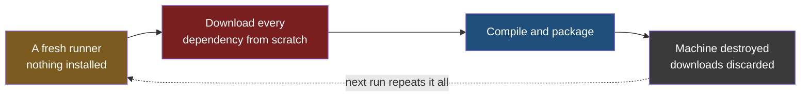
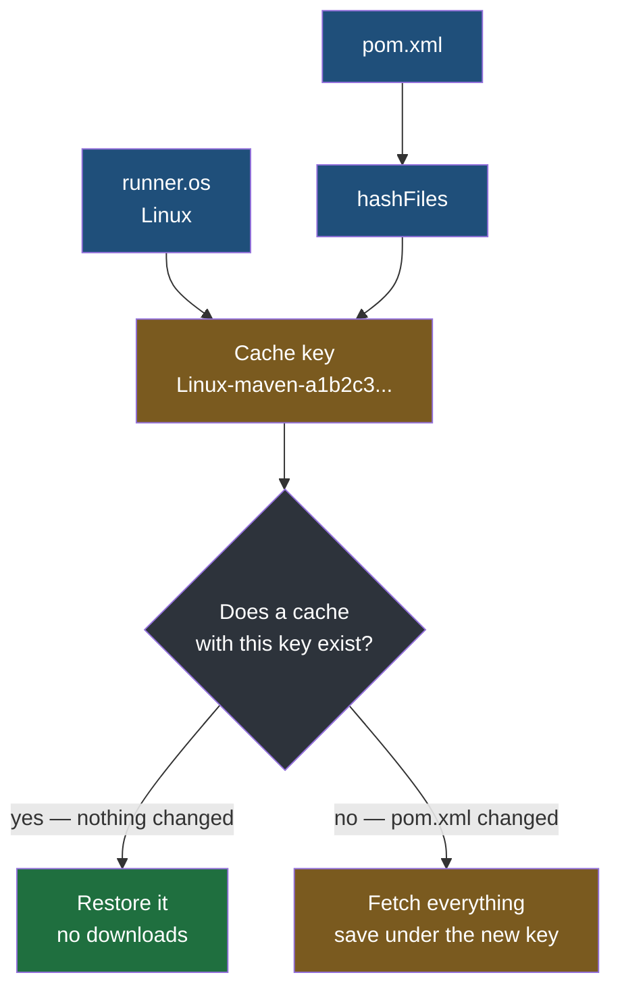

Credentials are what a pipeline needs to be allowed to do its work. This note is about two things it produces while doing it — one that exists to make the next run faster, and one that exists so you can go back to this run later.

## What a build actually produces

The deploy workflow packages the application with one command:

```yaml
      - name: Build Application
        run: ./mvnw clean package -DskipTests
```

What comes out the far end is a single file. **A jar is your compiled code, every library it depends on, and its configuration, collected into one archive** — the name is short for Java archive. Every ecosystem has its own version of the same idea, and they are worth recognising because the pipeline treats them identically:

| Ecosystem | What a build produces |
|---|---|
| Java, Maven | A `.jar` file |
| Node.js | A bundle, commonly a `.tgz` |
| Python | A wheel, a `.whl` file |
| Docker | An image |

Two things about that file matter to the rest of this note. It is **built from dependencies that had to be fetched from somewhere**, and it is **the exact thing that gets deployed** — so it is worth keeping.

## The runner starts with nothing

Here is the cost nobody notices locally. The first time you build a Spring Boot project on your own machine, Maven downloads a few hundred jars into `~/.m2/repository` and it takes a while. The second time it takes seconds, because everything is already there. That folder is a cache, and it has been quietly saving you time for years.

A GitHub-hosted runner has no such folder. It is a machine created moments ago, with an operating system and nothing else, destroyed as soon as the job finishes. So every run pays the first-time cost again — every dependency, every time, on every pull request from every developer.



On a project built several times a day, that is the same set of files fetched over and over for no reason — and it lands on the most visible part of the pipeline, the check a developer is sitting there waiting for.

> [!note] This is one place a self-hosted runner is ahead by accident.
> The Jenkins pipeline earlier in this folder never had this problem, and not because anyone solved it. It builds on a server that persists between runs, so `~/.m2/repository` on that machine is already full from last time. The fresh machine that makes a hosted runner safe and reproducible is the same property that makes it slow, and caching is how you buy back the speed without giving up the freshness.

## A cache you have to invalidate correctly

The fix is to save the dependency folder at the end of a run and restore it at the start of the next. Which immediately raises the question that matters more than the saving does: **what happens when the dependencies change?**

Add a library to `pom.xml`, push it, and a pipeline that blindly restores the previous cache builds against the old dependency list. Either the build fails confusingly, or worse, it succeeds using something stale. A cache that returns the wrong answer quickly is worse than no cache.

A time limit is the first idea and it does not work. Say the cache expires after a day: change a dependency an hour after the last build and the next run still uses the old set, because the clock has nothing to do with whether the content changed. Any fixed window is wrong in both directions — too long and it serves stale dependencies, too short and it never helps.

**The answer is to key the cache on the content of the file that defines the dependencies.** Hash `pom.xml`. If a single character changes anywhere in it, the hash changes completely, so the key changes, so the stored cache no longer matches and the dependencies are fetched properly. If nothing changed, the hash is identical and the cache is restored. Correctness is not a policy anybody has to maintain; it falls out of the fact that the same content always hashes to the same value and different content does not.

That is the whole mechanism, and it is written like this:

```yaml
# .github/workflows/pre-tests.yml
      - name: Cache Maven Dependencies
        uses: actions/cache@v6
        with:
          path: ~/.m2/repository
          key: ${{ runner.os }}-maven-${{ hashFiles('**/pom.xml') }}
          restore-keys: |
            ${{ runner.os }}-maven-
```

`path` is what gets saved. `key` is the label it is saved under, and it has two parts: `runner.os`, because a dependency set is not portable between operating systems, and `hashFiles('**/pom.xml')`, which is the hash of every `pom.xml` in the project.



> [!tip] For a standard setup you do not need the step at all.
> `actions/setup-java` will do the caching itself if you ask it to, and it builds the same kind of key internally:
> ```yaml
>       - name: Java Setup
>         uses: actions/setup-java@v6
>         with:
>           distribution: temurin
>           java-version: '21'
>           cache: maven
> ```
> The accepted values are `maven`, `gradle` and `sbt`. Reach for `actions/cache` directly when you need to cache something it does not know about.

> [!note] What `restore-keys` is for.
> If no cache matches the exact key, `restore-keys` offers prefixes to fall back on — here, the most recent Linux Maven cache regardless of which `pom.xml` produced it. That is deliberately an imperfect match: the build still resolves dependencies properly against the current `pom.xml`, but it starts from a folder that already contains most of them rather than an empty one. A partial hit on a one-line dependency change is most of the benefit.

**A cache miss is never a failure.** It costs the time you would have spent anyway, and the run proceeds. That is the property that makes caching safe to add: the worst case is the behaviour you had before.

## Artifacts are the opposite kind of storage

A cache holds the **inputs** to a build, and it is disposable by design. Delete every cache you have and you lose nothing but time.

The built package is the other thing entirely. It is the **output**, and it is the precise bytes that were tested and deployed. Rebuilding from the same commit will usually give you something equivalent, but it is a new build, with whatever has changed in the world since — a dependency republished, a base image updated, a transitive version resolved differently.

**An artifact repository is where built packages are kept deliberately and for a long time**, indexed by version, and not thrown away when the run that produced them ends. **Nexus** is the common self-hosted one, holding jars, wheels, archives and images alike; container images are also commonly kept in a registry built for them, Docker Hub being the public one.

| | A cache | An artifact store |
|---|---|---|
| Holds | Dependencies, the inputs | The built package, the output |
| Lifetime | Short, evicted freely | Long, until you delete it |
| Losing it costs | Time on the next build | The ability to redeploy or inspect that exact build |
| Correctness depends on | Invalidating it properly | Never overwriting a published version |

The reason to keep them is the day a release turns out to be broken. **Going back to the previous version is a question of fetching a file that already exists**, which takes seconds and is guaranteed to be what was running before. Rebuilding an old commit instead means waiting for a full build and then hoping it produced the same thing, at the one moment when hoping is least appropriate.

> [!important] Keeping the artifact is what makes a rollback a decision rather than a project.
> Every deployment strategy worth the name assumes you can put the previous version back quickly. That assumption is only true if the previous version still exists somewhere as a finished, deployable package. An artifact store is not a convenience for archaeology — it is the thing that makes the undo button real.
