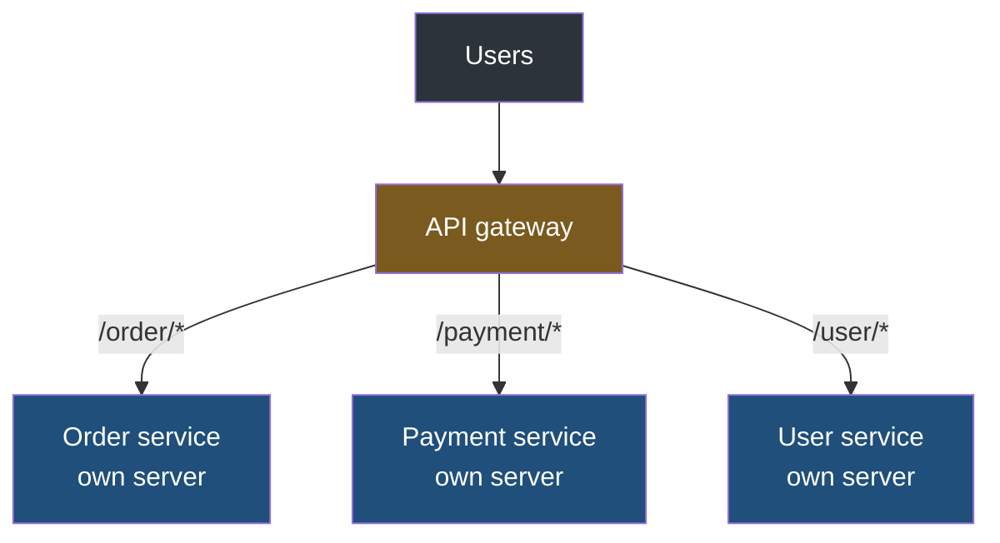
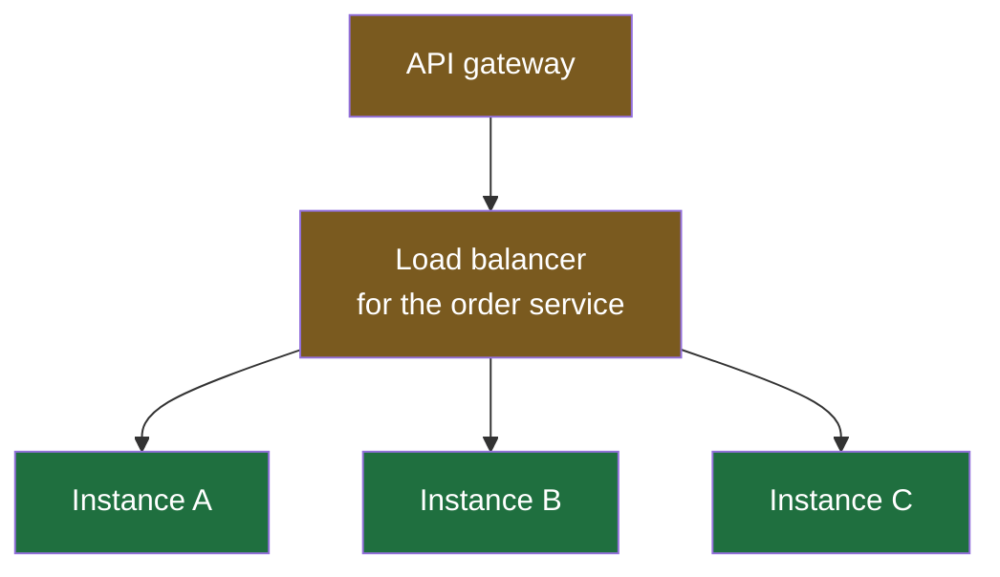
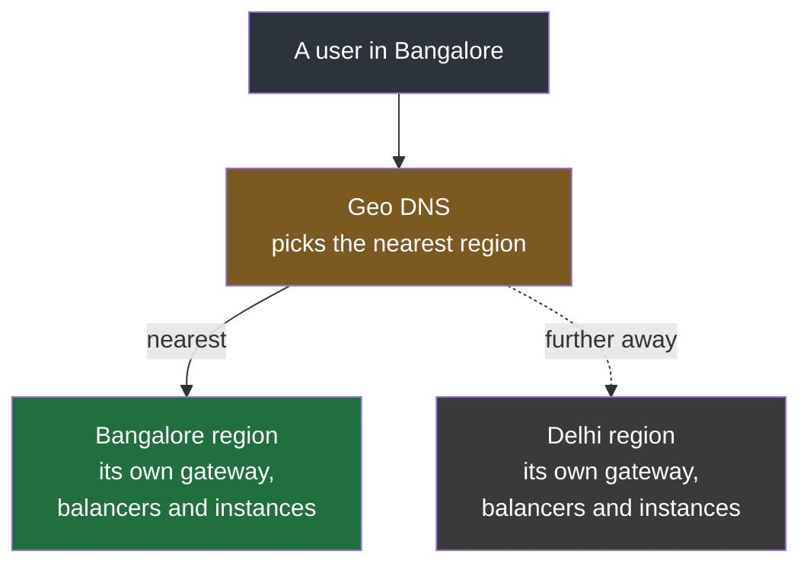

Putting a new version of an application onto a server sounds like one action, and for a small project it is: stop the old process, put the new files in place, start it again. The application is unavailable for a few seconds and nobody minds, because the only person using it is you.

Everything in this folder is about what that same action becomes when people are using the thing while you do it — when stopping the old process means somebody's payment fails, and when the new version turns out to be broken in a way nobody found before it shipped. There are several established ways to handle that, they make different trades, and none of them can be explained without first knowing the shape of the system they act on. So this note builds that shape, starting from one server.

## One server, one application

The simplest arrangement is a single application on a single machine. All of the code for an online bookshop — browsing, ordering, payment, user accounts — compiled into one artifact and installed on one server, with every request from every user arriving at that one place. An artifact is the finished, deployable package a build produces: for a Java application, a single jar, versioned and kept, which is the thing that actually gets copied onto a server.

This is called a **monolith**, and it is not a slur. It is easy to reason about, easy to deploy, and correct for a great many applications.

The trouble is what a small change costs. Suppose one variable in the ordering code is badly named — `userDetails`, where `personalUserDetails` would be clearer. That is a rename, the smallest change there is. To get it into production you branch, make the change, run the entire test suite for the whole application, build the entire application, package the entire application and deploy the entire application. **The work is proportional to the size of the codebase, not the size of the change**, and on a large system that is tens of minutes for a rename, with the whole application offline during the swap.

It also means the ordering code and the payment code go live together whether or not both were ready, and both stop when the server stops.

## Splitting it up

The response is to stop treating the bookshop as one program. Break it into services, each owning one area, each deployed on its own server:

Now the rename touches the order service and nothing else. It is tested, built and deployed on its own, in a fraction of the time, and payment and user accounts carry on serving traffic throughout because nothing about them changed or stopped. That is **microservices**, and the deployment benefit above is most of why people accept the considerable costs that come with it.

> [!info] The word service means two different things, and they get confused constantly.
> Inside a single codebase, service is the name of a layer — a Spring Boot project conventionally splits into a controller that receives the request, a service that holds the business logic and a repository that talks to the database. That service is a set of classes, and there are dozens of them in one application. The service in microservices is something else entirely: a separately built, separately deployed program with its own server and its own address. **One is a way of organising code inside a program; the other is a program.** A monolith is full of the first kind and is still one of the second kind.

Which creates a routing problem. A user's browser knows one address for the bookshop, not three, and it should stay that way. So something has to sit in front and decide which service each request belongs to. That is the **API gateway**: one public entrance, which reads the path and forwards accordingly. A request to `/order/create` goes to the order service; anything beginning `/payment/` goes to the payment service; anything beginning `/user/` goes to the user service.

**It knows where they are because it was told.** Each service registers itself — its address, and what it is responsible for — so the gateway holds a current map of what exists. That registration mechanism is called service discovery, and it matters here only because it is what lets services move, multiply and disappear without anybody editing the gateway by hand.

> [!note] A gateway wears several hats at once, which is why the names blur.
> Forwarding a request to a machine behind it is what a reverse proxy does, so an API gateway is doing a reverse proxy's job among other things. In practice one piece of software usually does all of them — nginx will reverse proxy, terminate TLS and balance load in a single configuration — and a gateway typically also handles authentication, rate limiting and rewriting requests on the way through, so that every service behind it does not have to. They are separate ideas deployed as one component. Treat the names as roles rather than as products.

## One of anything is a single point of failure

Each service now runs on its own server, which fixes the deployment problem and introduces a different one. There is exactly one order service. If that machine dies — a disk, a power cut, a bad release, anything — **nobody can order anything** until somebody notices and fixes it. The bookshop is down in the way that matters, even though payment and user accounts are perfectly healthy.

So a service is not run once. The same build is deployed to several servers, and each running copy is an **instance**:

**They are not different services. They are the same service, the same code, the same version, running in several places at once.** Lose one and the others carry the traffic. How many there should be is a capacity question rather than a safety one once you are past two, and systems that adjust the count automatically as load rises and falls are doing what is usually called auto scaling.

Something now has to spread requests across them, and that is the **load balancer**. One sits in front of each service's instances, and the arrangement has a property worth pausing on:

> [!important] The gateway cannot see the instances, and that is the point.
> Once a load balancer is in front of each service, the gateway is configured with three addresses — the three balancers — and knows nothing about what is behind them. Add a fourth order instance, remove one, replace all of them: the gateway is not told and does not care, because from where it stands the load balancer is the order service. That hiding is what makes it possible to change the instances underneath a running system at all, and every strategy in this folder depends on it.

## How the balancer chooses

Given four healthy instances and a request to hand out, something has to pick one. The methods divide into two kinds.

| | How it decides | Examples |
|---|---|---|
| **Static** | By a fixed rule that ignores what the servers are doing | Round robin, weighted round robin, IP hashing |
| **Dynamic** | By looking at the current state of the instances | Fewest active connections, fastest response time, least loaded |

Round robin is the simplest thing that works: first request to A, second to B, third to C, fourth to D, fifth back to A. It assumes every instance is equally able to take the next request, which is usually near enough true when the instances are identical.

A dynamic method drops that assumption. If one instance is already handling far more work than the others — a slow request, a heavier user, a machine having a bad day — a balancer that measures will stop sending it new work until it recovers. Underneath all of them is a **health check**: the balancer polls each instance regularly, and one that stops answering is taken out of rotation rather than being sent requests that will fail.

## When one region is not enough

Everything above sits in one place. The servers are physical machines somewhere, and somewhere has a location.

If they are all in Delhi, then a request from Bangalore travels to Delhi and the response travels back, and that round trip costs time on every single request no matter how fast the code is. **This is a common and badly diagnosed cause of a slow site** — the front end is fine, the back end is fine, and the delay is distance.

The fix is to run the whole arrangement in more than one region and send each user to the nearest one:

**Geo DNS** is the piece that does the choosing: it answers the same name with a different address depending on where the question came from. Each region then holds its own complete copy of the architecture, gateway and balancers and instances alike — and since a single gateway would itself be a single point of failure, there are several of those too, with balancing in front of them. A real production diagram has redundancy at every level, which is exactly why it is easier to learn one level at a time.

> [!important] There is no one correct architecture, and looking for one is the wrong instinct.
> Nothing above is a template. Whether the load balancer is a separate component or a job the gateway does itself, whether every service gets its own balancer or several share one, how many regions there are — all of it is decided per application, against its traffic, its budget and what it actually needs. The productive way to learn this is one element at a time: what a gateway is for, what a reverse proxy is for, what a load balancer is for, on their own. Only then do the combinations make sense, because a real system is those pieces assembled to fit one situation, and the next real system assembles them differently.

> [!tip] A CDN solves the distance problem, but only for some of the traffic.
> A content delivery network keeps copies of files in many locations and serves each user from a near one. That works beautifully for things that are the same for everybody — HTML, CSS, JavaScript, images, and video, which is how streaming services deliver at the scale they do. It does nothing for a request that has to run your code and read your database. Placing an order is a decision your order service has to make; no cache can make it on its behalf. **Static content goes to the edge; logic stays where the service is**, which is why multiple regions and a CDN are complementary rather than alternatives.
