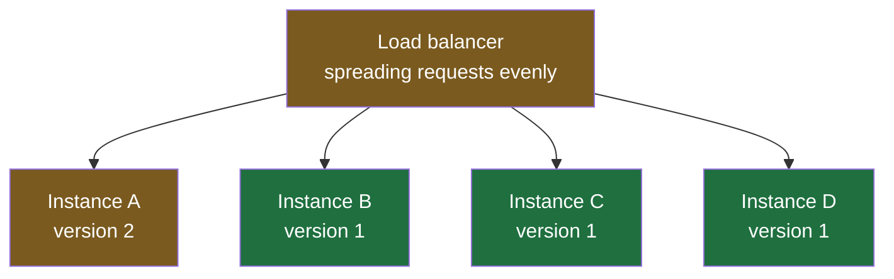

The order service now runs as four identical instances behind a load balancer, and the gateway cannot tell them apart. That is the arrangement a new version has to be installed into, and this note is about the first and most common way of doing it.

Assume the change itself has been through everything a change goes through: it was reviewed, the tests passed, it was built and packaged, and an automated pipeline is standing by to put it on the servers. A pipeline is a predefined sequence of steps that carries source code from a commit through building, testing and packaging to deployment, run automatically rather than by hand. The question here is not how the artifact gets made. It is which servers get it, and in what order.

## The version everybody writes first

The obvious instruction to give the pipeline is: deploy to all four. A, B, C and D, in one go. Thirty seconds later every instance is running version 2, the old version is gone, and the release is done.

And most of the time that works, which is exactly what makes it dangerous.

**You cannot be certain that code works.** Not after review, not after a green test suite, not after staging — a rehearsal of production, running on its own servers with its own data, where a change is tried under realistic conditions before it is released. Tests check the cases somebody thought of; the failures that reach production are the ones nobody thought of, which is why they reached production. A release process built on the assumption that the tested code is correct has no answer for the day it is not — and on that day, with all four instances updated at once, **100% of users hit the broken version simultaneously.**

So the useful question is not how to be sure. It is: **when this goes wrong, how many people does it go wrong for?**

> [!important] Blast radius is the term, and it is worth adopting.
> Borrowed from exactly where it sounds like it is borrowed from — how far the damage reaches from the point of the explosion. Applied to a release, it is the proportion of users exposed to a change that turns out to be broken. **Every strategy in this folder is a different way of keeping it small while still, eventually, shipping to everybody.** It is common vocabulary in this work, and you will hear it in incident reviews long before anybody draws a diagram.

## One instance at a time

A rolling deployment replaces the instances one after another instead of all at once, and waits in between.

Start with all four on version 1. Deploy version 2 to instance A alone. The load balancer is still spreading requests across all four, so roughly a quarter of traffic now reaches the new code and three quarters still reach the old:

**25% exposure, chosen deliberately.** If version 2 is broken, a quarter of orders fail and three quarters succeed — which is bad, and is enormously better than everything failing. It also produces the odd but familiar symptom of a partial outage: your order will not go through, your friend's does, and the only difference is which instance the balancer happened to pick.

Then the pipeline waits. Not for a fixed ritual reason — it waits because **the waiting is when you find out.** During that window the new code is serving real requests from real users doing things nobody anticipated, which is the only test that was ever going to catch this.

What you watch during the wait is not the application itself but everything reporting on it:

| | |
|---|---|
| What is being watched | Error rates, failed requests, response times, and the logs the application writes |
| Where it is watched | A monitoring system collecting all of it live — Grafana, New Relic and Datadog are the ones you will meet |
| How you find out | Not by staring at a dashboard. These tools alert — a threshold is crossed and somebody gets a mail or a page |

If the numbers hold, the pipeline moves on: B gets version 2, and exposure goes to 50%. Wait again. Then C, 75%. Then D, and the rollout is complete with every instance on the new version.

If the numbers do not hold, the rollout stops where it is — and the instances already updated are **rolled back**, which means putting version 1 back on them. Nothing else is touched. B, C and D never received the broken build, so most users never saw it, and the recovery is one instance's worth of work rather than the whole fleet's.

> [!tip] The waits get shorter as you learn more.
> The interval does not have to be constant, and usually should not be. Half an hour before the second instance is reasonable when 25% of traffic is the only evidence you have. By the time three quarters of users have been on the new version for a while without a single unusual error, fifteen minutes is plenty before the last one. Confidence genuinely does increase as exposure rises, so the schedule can tighten as it goes.

## Why not skip ahead once the first one is fine

The reasonable objection: if instance A ran the new code without a single failure, the code works. Why crawl through B, C and D instead of finishing the job?

Because **rare things are rare until they have had enough chances to happen.** A fault that shows up in one request out of ten thousand will very probably not appear at all in the first slice of traffic. Raising exposure from 25% to 50% does not just double the users — it doubles the number of opportunities for the unusual path to be taken, which is why a defect that survived the first stage regularly surfaces in the second.

Here is the kind of thing that hides that well. A food delivery application, early in its life, sent users to a separate payment app to complete an order. One path through that handover was never considered: leave the payment app without paying and press back. The order came back marked as paid. It was placed, it was cooked, a delivery arrived, and nobody asked for money at the door because the system already believed the payment had succeeded. A callback that was not handled properly, worth real money every time it happened, and it spread the way these things spread — somebody noticed by accident, told a friend, and the friend tried it.

**No test suite had a case for that, because no one imagined it.** Neither did the developer, the reviewer, or the QA who signed it off. It was not incompetence; it was an edge case sitting outside everybody's model of how the feature would be used.

> [!note] The hardest defects are the ones you cannot reproduce on demand.
> The familiar version of this is watching an application crash, going to look at the logs, trying the same thing again and having it work perfectly. It is maddening, and it is the normal shape of a production bug — dependent on timing, on a particular sequence, on state that existed for a moment. **This is the real argument for a gradual rollout.** If defects reliably appeared the first time you exercised the code, testing would find them all and none of this would be necessary. They do not, so exposure has to be bought slowly.

The stakes are worth stating plainly, because they explain why organisations invest in this. A serious defect that reaches all users is not just a bad day for the person who wrote it. Real money is lost, sometimes a great deal, and the consequences land on the developer, the reviewer, the QA who approved it and the product manager who wrote the specification without the case in it. Entire teams have been dismissed over a single release. That is the environment these techniques exist in — not caution for its own sake, but a considered response to how expensive a mistake can be.

## What rolling actually requires

Very little, which is why it is the default nearly everywhere.

| | |
|---|---|
| Instances | More than one. The percentages come from how many — four gives you 25% steps, ten gives you 10% |
| Capacity | Enough headroom to run with one instance out of service while it is being replaced |
| A way to reach each server | Whatever your pipeline already uses to deploy: SSH to a machine you own, or the cloud provider's own mechanism |
| Monitoring | Genuinely required. Rolling without watching the gaps is just a slower way to break everything |

**Geography makes no difference.** Four instances in one rack and four spread across three regions roll out the same way, because the pipeline reaches each one by address and does them in order regardless of where they physically are.

The name describes the shape exactly: the new version rolls across the fleet, one instance at a time, and at every moment some users are on the old version and some are on the new. Which is the property to hold on to, because it is also rolling deployment's main limitation — **for the length of the rollout, two versions of your code are running at the same time and serving the same users.** Every technique that follows is, in part, a different answer to that.

> [!info] Varying who sees a change is a separate idea from varying which servers run it.
> Rolling works at the level of machines: this server has the new build, that one does not. There is a different mechanism, called a feature flag, that limits a blast radius without involving servers at all, and it is often used alongside rolling rather than instead of it. It is the last technique this folder covers.
