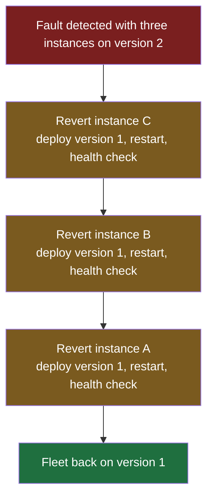
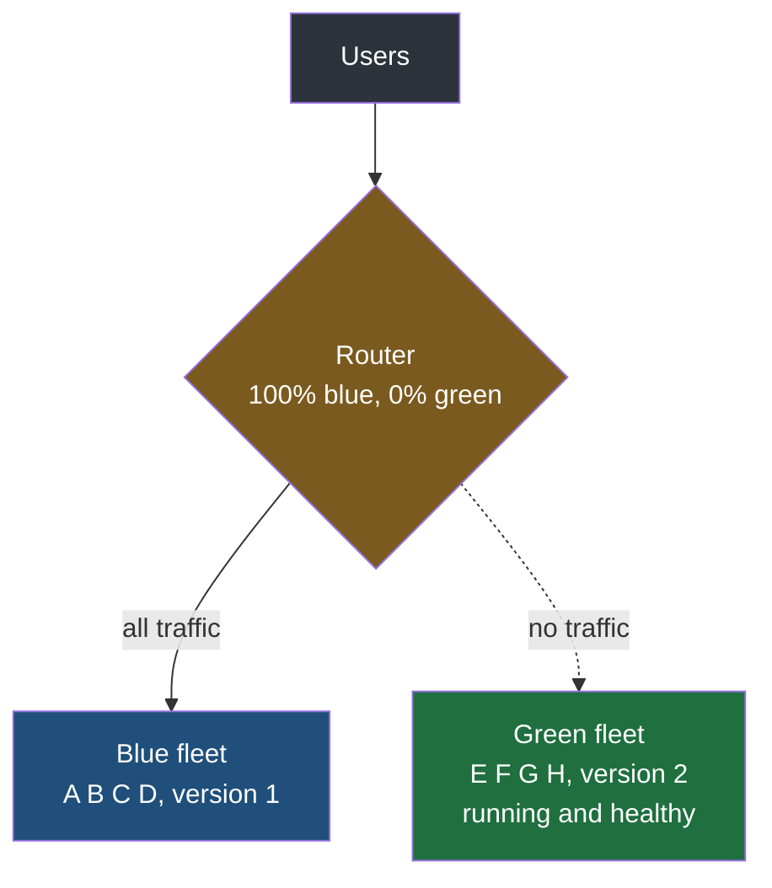
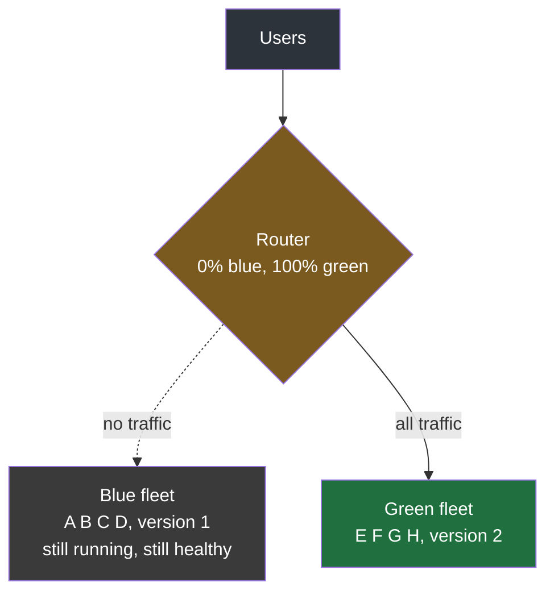
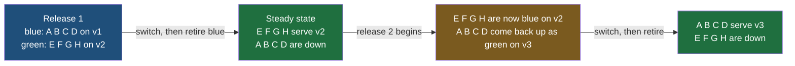

Rolling deployment limits how many people meet a broken version, and it does that well. What the previous note passed over quickly is the other half of the story: what happens after you decide to abandon a release. Getting out turns out to be the expensive part, and it is the part this technique is built to fix.

## What it costs to undo a rolling deployment

Recall the shape. Four instances of the order service, A, B, C and D, all on version 1. Version 2 goes onto A, then a wait, then B, then a wait, then C, then D. Exposure climbs 25%, 50%, 75%, 100%, and the waits are where problems are supposed to surface.

Now suppose one does. The fault is subtle enough that it only shows up once a decent volume of traffic has hit the new code, so you are at C before the error rate moves. Three instances are now running version 2 and you want all three back on version 1.

**Every one of those instances has to be deployed to again.** Putting version 1 back is not a different kind of operation from putting version 2 on — it is the same operation with an older artifact. C has to be taken out, reverted, health-checked and returned to the pool; then B; then A. It is the same slow, one-at-a-time procedure that got you here, run backwards, and the whole time it is running there are still instances serving the broken code.

There is a second problem underneath the first, and it is the one that really hurts. **Version 1 is gone.** Each instance was overwritten in place, so there is no running copy of the old version anywhere to fall back to — the recovery depends on being able to rebuild and redeploy the previous artifact, correctly, under time pressure, while the site is misbehaving. That is the worst possible moment to discover that something about that process has rotted.

So rolling gives you a small blast radius and a slow exit. The question blue-green asks is whether the exit can be made instant.

## A second fleet instead of a replaced one

The move is to stop deploying into the instances that are serving traffic. Leave them completely alone. Instead, **stand up a second, complete set of instances alongside them and put the new version there.**

The set currently serving real users is called **blue**. The new set, built beside it, is called **green**. The colours carry no meaning at all — they are labels chosen because they are easy to say and impossible to confuse with a version number. Blue is whatever is live; green is whatever is being brought in.

So the order service that was four instances becomes eight for a while. A, B, C and D are blue, still on version 1, still taking every request. E, F, G and H are green, freshly started, running version 2, fully healthy and receiving nothing.

The router in that diagram is not a new kind of component. It is the same thing that was already spreading requests across the four instances — it has simply been given a second decision to make first. Before choosing an instance, it chooses a fleet. In practice this is a setting on the load balancer that already existed rather than a separate box.

> [!info] Green is live before it is used, and that is most of the value.
> The green fleet is not a staging copy and it is not a rehearsal. It is running the real build, on real machines, with the real configuration, connected to the real dependencies — it simply has no traffic pointed at it. That means everything that can go wrong at startup has already gone wrong or already not gone wrong by the time anybody makes a decision: the application booted or it did not, it reached the database or it did not, it passed its health checks or it did not. A deployment that fails to start never becomes an outage, because it never had any users.

## The switch, and the switch back

When you are satisfied with green, you change one setting: **100% to green, 0% to blue.** Not 25% and then 50%. All of it, at once, in the time it takes the router to reload.

Blue is not torn down at this point. It stays up, still running version 1, still healthy, now receiving nothing — exactly the position green was in a moment ago. **That idle fleet is the entire reason this technique exists.**

Because if version 2 misbehaves — a rising error rate, failed payments, anything — the recovery is to set the router back the way it was. One value. Every request returns to instances that were never touched, never overwritten and never stopped, and are still running the version that was working an hour ago.

| | Rolling | Blue-green |
|---|---|---|
| To roll back you | redeploy the old artifact to each updated instance in turn | change one routing value |
| How long that takes | as long as the deployment did, roughly | seconds |
| The old version is | gone, and has to be rebuilt | still running, untouched |
| While it happens | some instances are still serving the broken code | nobody is |

**Rollback stops being a deployment and becomes a routing decision.** That is the sentence worth keeping, because it is the whole of blue-green in one line. Every other property of the technique follows from having refused to overwrite the thing that was working.

## What it costs

The obvious objection is money. For the length of the changeover you are paying for eight instances where four were doing the work, and you are doing that on every release.

Two things take most of the sting out of it.

**The cost is known in advance.** It is not an open-ended risk, it is arithmetic: the extra capacity equals the size of one fleet, and it lasts from the moment green comes up to the moment blue goes down. You can work out what that is in currency before you adopt the technique, compare it against what an hour of degraded checkout costs you, and make an actual decision. Very few engineering trade-offs are that easy to put a number on.

**And you are not buying a new fleet every release.** Once green has been serving for long enough to be trusted — an hour, a day, whatever the team has settled on — blue is scaled down. The machines are released. At the next release, that same hardware comes back up carrying the newest build, and the fleets swap roles.

Eight machines exist; four are live at any settled moment; the extra four are only paid for during changeovers. **Blue and green are roles that move, not machines that are dedicated.** The fleet serving traffic today is blue by definition, whatever it was called last week.

There is a smaller cost that is easy to overlook. The router now holds state that matters enormously and is edited rarely, which is a bad combination — a routing rule that is only touched on release days is a routing rule nobody is fluent in. It has to be configured correctly, tested, and understood by whoever is on call at two in the morning.

> [!note] Can capacity be added for a fixed window and then taken away?
> Yes, and it is ordinary rather than exotic. Adding instances when they are needed and removing them when they are not is auto scaling, and it is normally driven by load — traffic rises, instances are added, traffic falls, they are removed. Blue-green uses exactly that capability, just triggered by a release instead of by demand. The related idea for keeping such a pool cheap to resize is consistent hashing, which arranges keys and servers so that adding or removing one server only moves the keys near it rather than reshuffling almost everything, but that belongs to system design rather than to deployment.

## What it guarantees, and what it does not

**It guarantees a fast return to a known-good version.** Not a fast fix — a fast return. The previous version is running, healthy and one setting away for the whole of the risky period, which converts the worst case from an incident into an inconvenience.

**It does not limit how many users meet the problem.** This is the honest weakness and it is the exact opposite of rolling's. At the moment of the switch, every single user moves to version 2 together. If version 2 is broken, 100% of them are affected — briefly, because the way back is quick, but completely. Rolling would have capped that at 25%.

| | Rolling | Blue-green |
|---|---|---|
| Peak share of users exposed to a bad release | 25% with four instances | 100% |
| Time to get back to the working version | a full deployment | seconds |
| Extra capacity needed | one instance's worth of headroom | a second fleet, during the changeover |
| The old version during the release | overwritten | running beside the new one |

So the two techniques trade against each other rather than one being better. Rolling buys a small blast radius with a slow recovery. Blue-green buys an instant recovery with a total blast radius.

> [!important] The two names are used loosely, and the distinguishing question is simple.
> You will hear blue-green used for anything involving two sets of servers, including arrangements where traffic is moved across gradually rather than all at once. When the label is ambiguous, the thing to ask is how traffic moves: **blue-green switches all of it in one step, which is what makes the switch back a single action.** A scheme that shifts traffic in slices is doing something different, with a different purpose, and that is the subject of the next note.
