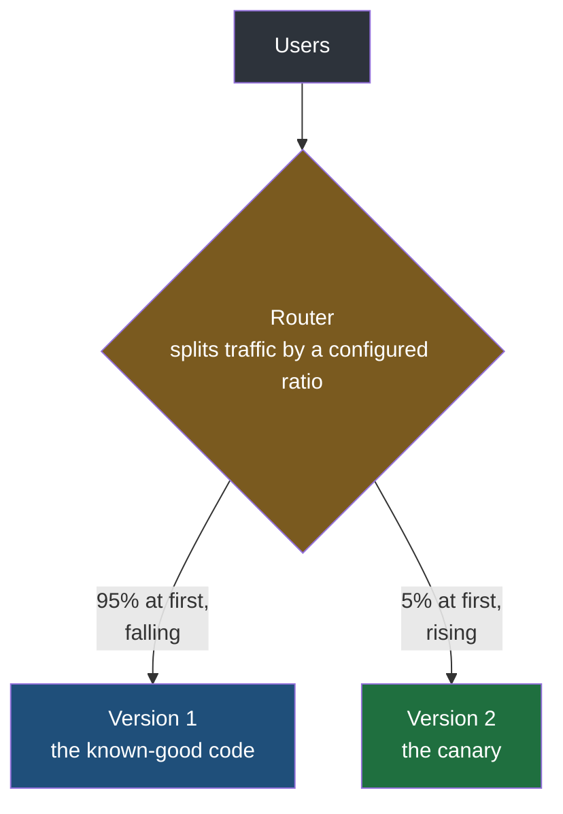
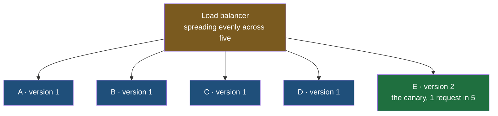

Two techniques are on the table and each is strong exactly where the other is weak. Rolling keeps the share of affected users small but takes a full deployment to reverse. Blue-green reverses in seconds but moves everybody onto the new version in one step, so if that version is bad then everybody meets it. The obvious question is whether you can have the small exposure and the fast reversal at the same time, and the answer is the third technique.

## Where the name comes from

Coal miners once carried caged canaries underground. The reason was carbon monoxide, which is colourless, has no smell and kills people who have no idea it is there — and a small bird, needing far more oxygen for its size than a person and breathing through a far more efficient set of lungs, takes the gas up much faster than its handlers do. The bird would show distress and stop singing while the air was still survivable for the miners, who then had time to get out. The practice was introduced in 1896, after an investigation into a colliery explosion in Wales concluded that carbon monoxide was the cause, and it ran until Britain replaced the birds with handheld electronic detectors in 1986.

**The bird is a deliberately small thing put in harm's way first, so that the cost of finding out is one canary rather than a shift of miners.** That is precisely the arrangement being borrowed. A canary deployment sends a small, chosen slice of real traffic to the new version and watches what happens to it, on the understanding that if something is wrong there it is better to learn it from 5% of users than from all of them.

## Moving users rather than machines

Put a router in front, with version 1 behind it and version 2 beside that, and start where blue-green started — everything on the old version.

Then, instead of switching, move the dial. Send 5% of requests to version 2 and keep 95% on version 1. Wait. If nothing has gone wrong, make it 10% and 90%. Wait again. Then 15 and 85, and onward.

| Step | Version 2 | Version 1 |
|---|---|---|
| Start | 0% | 100% |
| First slice | 5% | 95% |
| Then | 10% | 90% |
| Then | 15% | 85% |
| Continuing | 20%, 50%, 70% … | the remainder |
| Nearly done | 95% | 5% |
| Cutover | 100% | 0% |

The steps do not have to be 5% and the wait does not have to be a minute — both are yours to choose, and both usually widen as confidence grows, in the same way a rolling deployment's waits shorten as it proceeds. The last move is normally a jump: once 95% of traffic has been on version 2 without incident, holding the final 5% back proves nothing, so it goes to 100%.

**The quantity being controlled is the share of users, and it is controlled directly.** That is the difference from everything so far. Rolling produces exposure as a side effect of how many instances have been updated; blue-green produces 0% and then 100%. Here the number is the setting.

## The same thing, expressed in instances

The dial is a useful way to think about it, but a load balancer does not have a percentage knob — it has a list of instances and it spreads requests across them. So the ratio is produced by the composition of the pool.

Start from the familiar four instances, A, B, C and D, all on version 1. Bring up one more, E, running version 2, and add it to the pool. The balancer now distributes across five instances, so roughly **one request in five, 20%, reaches the new code.** One extra machine bought a 20% canary.

If the error rates hold, bring up F on version 2 and take A out of the pool. Then G, and take out B. Then H, and take out C, and finally D. At every step the share on version 2 rises and the share on version 1 falls, and at the end the pool is entirely new.

| Pool | On version 2 | Share reaching version 2 |
|---|---|---|
| A B C D | none | 0% |
| A B C D E | E | 20% |
| B C D E F | E F | 40% |
| C D E F G | E F G | 60% |
| D E F G H | E F G H | 80% |
| E F G H | all | 100% |

With requests spread evenly, the share reaching the new version is simply the number of new instances divided by the size of the pool. You get the ladder by changing the composition, not by configuring a percentage.

> [!note] The two versions are instances of one service, and nothing else about them differs.
> Version 1 and version 2 are the same application, built from the same repository, deployed the same way. The port is the same, the configuration is the same, the dependencies are the same, and the load balancer treats them identically — it does not know that one of them is newer. That is what makes the arrangement work at all: if the canary needed different settings to run, it would be testing the settings as well as the code, and a failure would not tell you which one was at fault.

## Why this is the affordable answer

Blue-green needed a whole second fleet standing at once. Canary needs one extra instance at a time — add one, watch, remove one, add the next. **The peak extra capacity is a single machine rather than a duplicate of everything you own.**

That is the direct answer to the cost objection against blue-green. If the reason for rejecting blue-green was that doubling the fleet on every release is not affordable, canary gets you a controlled, reversible rollout without ever paying for more than one spare.

And the reversal is still fast, because the old version never went away. Throughout the rollout there are instances still running version 1 and serving users successfully. Pulling the canary out of the pool is a routing change, not a deployment — the same property blue-green had, for the same reason.

| | Peak extra capacity | Peak share exposed | Getting back |
|---|---|---|---|
| Rolling | one instance's headroom | 25% before the second step | a deployment per updated instance |
| Blue-green | a second fleet | 100% at the switch | one routing change |
| Canary | one instance | whatever you set, from 5% | one routing change |

What canary pays for that is time. A rollout in twenty steps with a wait at each one takes far longer than a switch, and for the whole of it you are operating a mixed fleet.

## Rolling and canary look identical, and are not

This is the objection that always comes, and it deserves a straight answer: if canary brings one instance up and takes one instance down, waiting in between, then what exactly is rolling deployment?

**Mechanically, almost nothing.** Both replace instances one at a time, both wait between steps, both end with the entire fleet on the new version, and if you watched the machines without being told which technique was in use you would often not be able to say. The difference is not in what happens to the servers.

The difference is what the procedure is organised around, and that shows up in what its operator is watching.

| | Rolling | Canary |
|---|---|---|
| The unit it thinks in | the instance | the user |
| The question it answers | how many servers have the new build | how much of the audience is on the new behaviour |
| Blast radius measured in | servers | users |
| What makes it stop | an instance failing to come up healthy, or error rates moving | the measured behaviour of the exposed slice |
| Exposure is | a consequence of the fleet's composition | the thing being set |

Blast radius, from the rolling note, is the share of users a broken change reaches. Both techniques exist to keep it small — but rolling keeps it small by updating few machines, and canary keeps it small by exposing few people, and those come apart the moment your instances do not receive equal traffic.

> [!important] Naming by intent rather than by mechanism is normal in this field, not sloppiness.
> The same situation has already appeared in this folder. An API gateway, a reverse proxy and a load balancer overlap heavily, one piece of software routinely performs all three roles at once, and they remain three names because they answer three different questions — where does this request belong, which machine should serve it, and how do I hide what is behind me. The same happens in object-oriented design, where patterns with effectively identical structure are held apart by what they are for. So when somebody says their team does rolling deployment, they are telling you they roll a version out machine by machine; when they say canary, they are telling you they have something in front whose job is to control how much of the user base is on the new code. Both sentences describe similar machinery and different reasoning.

## Bringing a server up is usually a figure of speech

One thing that quietly confuses every diagram in this folder, and is worth saying plainly.

When a rollout is drawn as bring up a new instance, then take the old one down, that is a way of drawing it. **Almost no organisation buys hardware per release.** A company has a fixed number of machines, or a fixed budget of cloud instances, and the same ones get reused. What actually happens on the metal is that a machine running version 1 has version 2 installed on it and is restarted.

So a new instance in these descriptions means an instance now running the new version. It does not mean a machine that did not exist this morning. Drawing it as two boxes is a way of showing that the pool contains two versions at once, which is the fact that matters; it is not a claim about procurement.

Blue-green is the partial exception, and only partial. Both fleets there really do exist as separate sets of instances, because the entire point is having the old version still running while the new one takes traffic — but even there, as the previous note described, the same eight machines rotate through the two roles rather than eight new ones appearing.

## The three, side by side

| | Rolling | Blue-green | Canary |
|---|---|---|---|
| What moves | instances, one at a time | all traffic, in one step | traffic share, in slices |
| Exposure grows | 25, 50, 75, 100 with four instances | 0 then 100 | by however much you set |
| Extra capacity | headroom for one instance | a second fleet | one instance |
| Rollback | redeploy each updated instance | one routing change | one routing change |
| Rollout duration | moderate | shortest | longest |
| Organised around | servers | fleets | users |

All three are variations on one manoeuvre: change which servers a user can reach, and control the damage by controlling how many of them are running the new code. Which means all three need more than one server before they mean anything at all. There is a fourth technique that does not.
