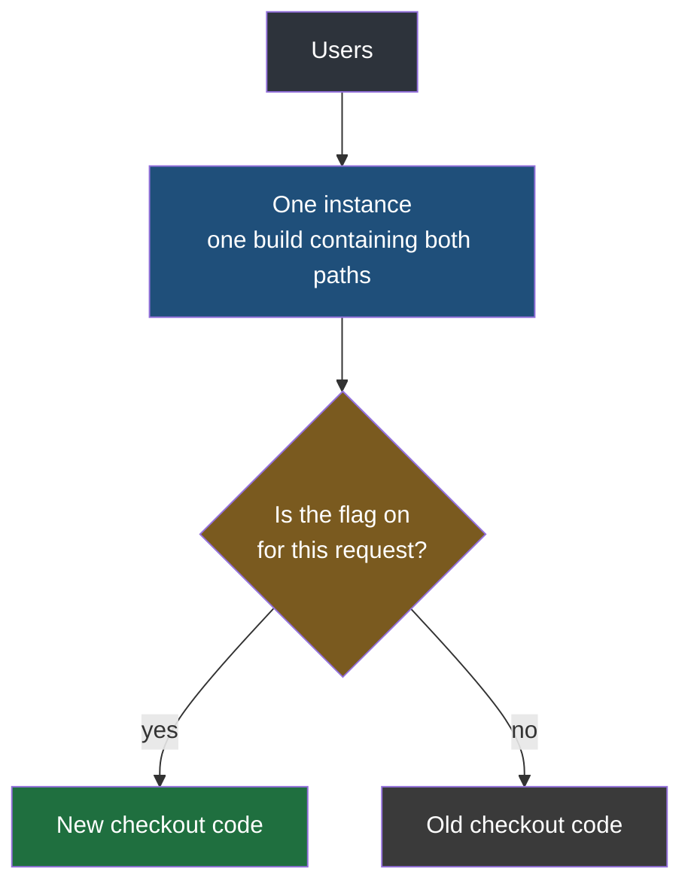
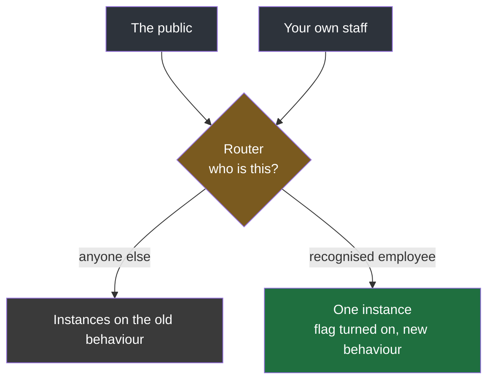

Rolling, blue-green and canary all work the same lever. Each of them decides which servers a user can reach and controls the damage by controlling how many of those servers carry the new code. That lever needs a fleet: with one instance there is nothing to roll, no second colour to switch to, and no slice to send anywhere. The fourth technique needs none of it, because it does the splitting inside the running program.

## Two behaviours in one build

A **feature flag** is a value the application checks at run time to decide which of two code paths to take. Both paths are compiled into the same artifact and deployed to the same server. One user's request goes down the new path, the next user's goes down the old one, and the machine, the build and the process are identical for both.



That relocates the whole problem. The three server techniques are infrastructure work — they live in load balancers, routing rules and deployment pipelines, and they are arranged by whoever operates the system. **A feature flag is written by the developer, in the source, at the time the feature is built.** It is a decision made months before the release, and a release strategy that was not planned for during development is simply not available later.

## The flag

Take the bookshop's order service and a change to how checkout works. The instinct is to replace the old checkout code with the new. The flag approach keeps both and asks a question:

```java
// src/main/java/com/bookcart/order/CheckoutService.java
@Service
public class CheckoutService {

    @Value("${features.new-checkout-enabled:false}")
    private boolean newCheckoutEnabled;

    public OrderResult checkout(Cart cart) {
        if (newCheckoutEnabled) {
            return newCheckout(cart);
        }
        return oldCheckout(cart);
    }
}
```

The flag itself is not in the code. It is configuration, read at start-up from wherever this application already reads its settings:

```yaml
# src/main/resources/application.yml
features:
  new-checkout-enabled: false
```

Any store that holds configuration will do — a settings file, an environment variable, the secret store the deployment pipeline injects from. What matters is that the value lives outside the artifact, so that changing it does not mean producing a new one.

> [!info] The old path goes in the else branch, not in the history.
> An if and an else are a branching strategy, in the plainest sense of the word: two paths exist and something chooses between them. Version control already gives you branches, but a branch in Git is only reachable by deploying it, which is exactly the slow operation all of this is trying to avoid. Keeping the old code in an else branch means both versions are present in the artifact that is already running, and choosing between them costs a comparison.

## Shipping with it off

The flag is merged to the main branch and deployed with the value set to false. The new code is now on production servers, and not one user has touched it — every request evaluates the condition, finds it false, and takes the path it has always taken. Behaviour is unchanged, and the release carried no risk at all, because nothing about what users experience was altered.

Turning it on means changing one value from `false` to `true`. **There is no build, no package and no redeployment of the application** — the artifact on the server is already the one you want, which is the property that makes this fast. What that costs in practice depends on how the configuration reaches the application: a value read once at start-up needs a restart to be picked up, while configuration delivered by a dedicated service or a flag platform can take effect without one. Either way it is a configuration change rather than a release.

Rolling back is the same change in the other direction. Set it to false and every request goes back to the path that was working.

| | A normal release | A flag flip |
|---|---|---|
| What changes | the artifact on the server | one configuration value |
| What has to run | build, test, package, deploy | nothing, or a restart |
| To undo it | build and deploy the previous artifact | set the value back |
| The old behaviour is | gone from the server | sitting in the else branch |

One thing this first form does not give you is a dial. `true` and `false` are 100% and 0%, so this is a switch — everybody moves together, exactly as in blue-green, and with the same weakness. What it buys over blue-green is that no second fleet was required to get it.

You can carry as many as you need, each independent: `features.new-checkout-enabled` for one change, `features.new-order-method-enabled` for another. Each is its own switch, flipped on its own schedule.

> [!note] This replaces a habit a lot of people have.
> A common way of protecting yourself before a risky change is to copy the current file somewhere safe, edit the original, and copy the saved version back if something goes wrong. It works, and it is entirely manual — the recovery is a file operation performed by a person who has to remember where they put the copy. The flag does the same job structurally: the old behaviour is preserved by the language rather than by a copy, and reverting is a value rather than a procedure.

## Taking the flag out again

A flag is temporary, and forgetting that is how a codebase fills with permanent dead branches.

Once the new checkout has run in production for long enough to be trusted — a week, two weeks, whatever the change deserves — it gets cleaned up. A follow-up branch deletes the else arm, deletes the condition, and deletes the configuration entry:

```java
// src/main/java/com/bookcart/order/CheckoutService.java
@Service
public class CheckoutService {

    public OrderResult checkout(Cart cart) {
        return newCheckout(cart);
    }
}
```

The reason to bother is that every live flag doubles the number of paths through the code it guards, and they compound: three forgotten flags in one request path is eight possible combinations, most of which nobody has ever run together and none of which anybody is testing. **The flag is scaffolding, and scaffolding that is never removed becomes part of the building.**

## Mixing flags with servers

Flags and the server techniques are not alternatives, and the combination is where a lot of the practical value sits.

Deploy the build carrying the flag to one instance, turn the flag on there, and leave the rest of the fleet on the old behaviour. Then make that one instance unreachable from outside: take it off the public path, and route to it only for people you can identify as your own — matched by the address they signed in with, or by the network their request came from.



The new code is genuinely in production — real servers, real data, real traffic patterns — and if it breaks, it breaks in front of people who work for you. They are the ones who file the report, and no customer was involved.

This has a name that predates all of this. **Alpha testing is done inside the organisation, by its own staff; beta testing is done outside it, by real users who know they are early.** Routing your employees to a flagged instance is the alpha form, built out of a feature flag and a routing rule rather than out of a separate test environment — and the reason to do it in production rather than in staging is that staging is a rehearsal, while this is the real thing with a small, known, forgiving audience.

## Letting probability choose the share

The boolean is all or nothing. The third form turns the flag into a proportion, and it is what most current flag platforms are doing underneath.

Instead of asking whether the flag is on, give each request a random number from 1 to 10 and ask whether that number is one of the ones assigned to the new path:

```java
// src/main/java/com/bookcart/order/CheckoutService.java
@Service
public class CheckoutService {

    private final FeatureProperties features;
    private final Random random = new Random();

    public CheckoutService(FeatureProperties features) {
        this.features = features;
    }

    public OrderResult checkout(Cart cart) {
        int bucket = random.nextInt(1, 11);
        if (features.getNewCheckoutBuckets().contains(bucket)) {
            return newCheckout(cart);
        }
        return oldCheckout(cart);
    }
}
```

```java
// src/main/java/com/bookcart/order/FeatureProperties.java
@ConfigurationProperties("features")
public class FeatureProperties {

    private List<Integer> newCheckoutBuckets = new ArrayList<>();

    public List<Integer> getNewCheckoutBuckets() {
        return newCheckoutBuckets;
    }

    public void setNewCheckoutBuckets(List<Integer> newCheckoutBuckets) {
        this.newCheckoutBuckets = newCheckoutBuckets;
    }
}
```

Start with a single bucket and one request in ten takes the new path:

```yaml
# src/main/resources/application.yml
features:
  new-checkout-buckets:
    - 10
```

Widening the rollout is widening the list. Two buckets is a fifth of traffic, four is two fifths, and all ten is everybody:

```yaml
features:
  new-checkout-buckets: [10, 9, 8, 7]
```

| Buckets configured | Share on the new path |
|---|---|
| none | 0% |
| `[10]` | 10% |
| `[10, 9]` | 20% |
| `[10, 9, 8, 7]` | 40% |
| `[10, 9, 8, 7, 6, 5, 4, 3, 2, 1]` | 100% |

Emptying the list sends everybody back to the old path in one edit, which is the rollback, and the cleanup at the end is the same as before — a follow-up branch that deletes the buckets, the roll and the old arm.

**What makes this better than a schedule is that you are setting a proportion rather than advancing a clock.** A canary rollout moves when the next step is due. This moves when you decide the share should be larger, and in between it holds a genuine, measurable split of your user base across two implementations — which means you can compare them. Error rate on the new path against error rate on the old, on the same day, with the same traffic, on the same machines.

> [!important] The proportion is expected, not guaranteed, and the difference matters at small volumes.
> Each request draws independently, so the share that actually lands on the new path is only the configured share on average. Running the code above with one bucket in ten, over twelve separate batches of 100 users, gave 6, 14, 17, 8, 10, 7, 15, 8, 11, 11, 7, 10 — an intended 10% behaving as anything from 6% to 17%. Nothing is broken; that is what randomness looks like at that scale. It matters in two directions: a batch that happens to come in low may not exercise the new path enough to prove anything, and one that comes in high has exposed more people than you intended. At production volumes the spread narrows and the configured number becomes reliable, so treat the early steps of a rollout as noisier than they look.

> [!tip] Rolling the dice per request is the simplest version, not the finished one — this goes beyond what is strictly necessary to explain the mechanism.
> A fresh random number on every request means a single user can get the new checkout, then the old one on their next click, then the new one again. For a change they cannot see that is harmless. For anything they can — a redesigned page, a different checkout flow, a different price — it is worse than either version on its own, because the application appears to be malfunctioning. The fix is to derive the bucket from something stable about the user instead of from a fresh draw, typically by hashing their account identifier, so that the same person lands in the same bucket every time and the population is still split in the proportion you asked for. The arithmetic of the rollout is unchanged; only the source of the number differs.

## What flags cost

They are the only technique here that requires nothing of your infrastructure, and that is genuinely why they are everywhere. They are also the only one that requires something of your code, permanently.

| | The three server techniques | Feature flags |
|---|---|---|
| Needs more than one server | yes | no |
| Who implements it | whoever operates the system | whoever writes the feature |
| When it has to be decided | at release time | while the feature is being built |
| What it splits on | which machine you reach | which branch your request takes |
| What it leaves behind | nothing | a condition that has to be deleted later |

**And they change what a deployment means.** With the three server techniques, code arriving on a server and code affecting users are the same event, which is why so much care goes into controlling the arrival. With a flag they come apart: the code ships inert, and some time later somebody changes a value and the behaviour begins. Deploying and releasing stop being the same act, and the risky one is no longer the one involving servers.
