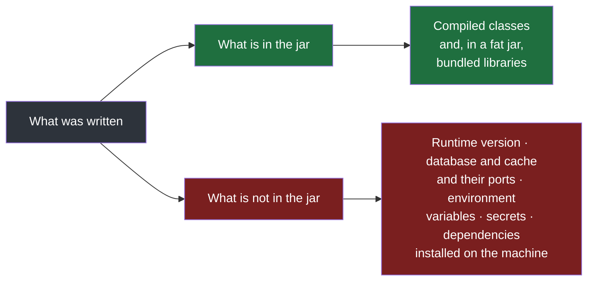
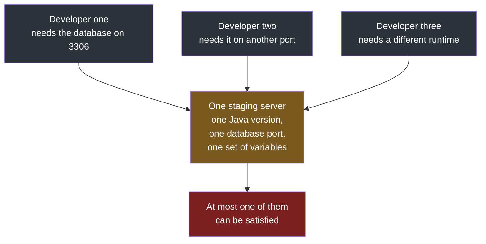
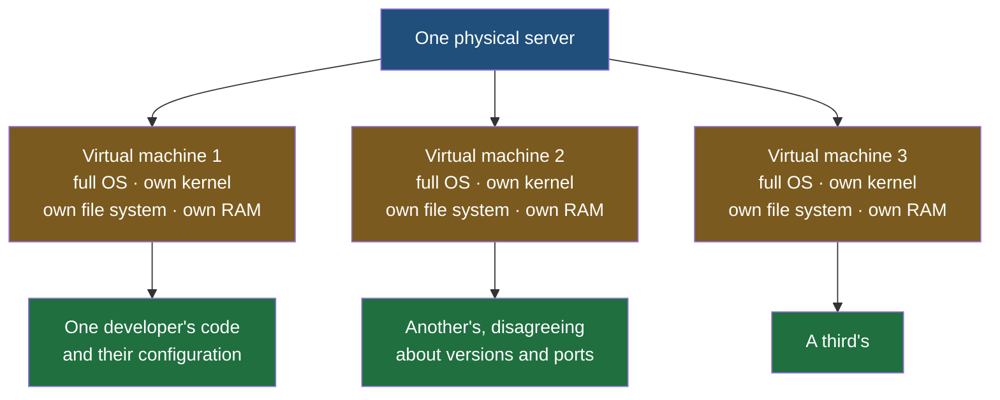
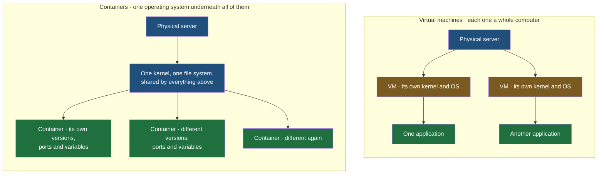

The job is to get code onto a server and keep it working there. Everything in this folder follows from one awkward fact about that job: code that runs perfectly on the machine it was written on has a habit of refusing to run anywhere else, and the reasons are almost never in the code.

Anybody who has worked on a team has met the sentence that comes next. A developer hands their work over, it fails on the other machine, and the first response is:

> It works on my machine.

It is famous enough to be printed on t-shirts, and it is usually said with complete sincerity, because it is true — it did work. The trouble is that **a developer's job was never to make code run on their own machine.** It was to make it run on a server, and the gap between those two things is the subject here.

## An application is more than the code

Consider what actually changes hands. A Java project is built into a jar, and the jar goes to whoever needs to run it. That feels like handing over the application, and it is not.

Adding a feature to an application is not only writing code. Alongside it you write configuration — a flag that turns the new behaviour on and off, the address and port of the database, the address and port of the cache, the user the application connects as. You set environment variables and secrets on your machine, quietly, months ago, and you have long since stopped thinking about them. And underneath all of it sits a set of things you did not write at all: which version of Java this compiles and runs against, which version of the database is installed, which libraries the build pulls in.

| What an application is made of | Where it lives |
|---|---|
| Code | in the jar |
| Libraries and dependencies | in the jar, if it is a fat jar; otherwise on the machine |
| Configuration | partly in the jar, partly in files on the machine |
| Environment variables and secrets | on the machine, and deliberately not in the jar |
| Runtime version | installed on the machine |
| Database, cache and their versions and ports | installed on the machine |

A jar carries the first row reliably and the second row sometimes. **Everything below that is a property of the machine, not of the artifact** — and a modern fat jar, which bundles libraries and often some configuration, is a recent convenience. Older ones carried compiled code and nothing else.

## The two machines

Put numbers on it. One developer builds against Java 21, with MySQL installed on its default port of 3306, a Redis cache running on its default 6379, and a handful of environment variables set on their laptop last spring.

The machine it is sent to has Java 8. Its MySQL is on a different port. It has no Redis installed at all. It has none of those environment variables, because they were never written down anywhere that could be shared.

| | The machine it was built on | The machine it was sent to | What happens |
|---|---|---|---|
| Java | 21 | 8 | The classes will not load |
| Database | MySQL on 3306 | MySQL on another port | The connection is refused |
| Cache | Redis on 6379 | not installed | Anything that writes to the cache fails |
| Environment variables | set | absent | Configuration reads come back empty |

Four failures, none of them a bug. The code is identical in both places.

> [!important] The Java version failure only runs in one direction, and it is worth getting the direction right.
> Java works hard to keep old programs running on new runtimes, so code written for Java 8 will generally run on a Java 21 runtime. The reverse is not true and is not meant to be: something compiled for 21 will not load on an 8 runtime, because it may use classes and language features that did not exist yet. So the machine with the newer runtime is the safe one and the machine with the older runtime is where the handover breaks — which is the awkward way round, because the older machine is usually the one nobody has updated.

## Putting it on a shared server does not fix it

The obvious objection is that nobody passes jars between laptops. You put the build on a server — not production, but a staging server, a Linux box that exists to run everybody's work and see whether it holds up.

That helps exactly once. The server has Java 21; your code needs 23; you say so, somebody installs Java 23, and now it runs. Fine.

Then a second developer arrives whose project expects the database on a different port from yours. **The server can hold one configuration.** Setting it to their port breaks your build; leaving it on yours means theirs never runs. There is no arrangement of one machine that satisfies both, and this gets worse with every person added.

## Cutting the server into smaller machines

If the problem is that one machine holds one configuration, the first-principles response is to stop having one machine.

This is already an ordinary thing to do. A single laptop can run its own operating system and, at the same time, a Linux system inside a **virtual machine** — a complete computer simulated in software, with its own operating system, running on hardware it shares with its host. One physical computer, two independent machines.

So divide the staging server the same way. Create five virtual machines on it, give each developer one, and let each of them install whatever they need inside it: their runtime version, their database on their port, their cache, their variables. The virtual machines do not have to agree with each other and do not have to run the same operating system.

This genuinely works. Everybody's code can be tested separately on one piece of hardware, and whatever passes can be promoted. It is a real solution, and it is worth seeing it work before seeing what is wrong with it — because the same reasoning will be needed again on production, where each service has the same disagreements.

## Why a virtual machine is the wrong size for this

Two questions break it.

**How many can you fit?** Not many, and the answer is not a matter of tuning.

**Is a virtual machine lightweight?** Not remotely. A virtual machine is an entire operating system. It has its own kernel, its own file system, its own allocation of memory and its own share of the processor, and all of that exists before a single line of your application has run. You are not paying for your code; you are paying for a second, third and fourth computer.

The natural objection is that the hardware underneath is the same hardware, so what is actually being duplicated. The answer is that virtualising it is exactly what costs: **each machine is given a kernel of its own, a file system of its own, memory of its own and processor time of its own, and none of it is shared.** The duplication is the entire mechanism, not an overhead on top of it.

So the shape of what is wanted is now clear. The isolation of a virtual machine — each developer's versions and ports kept away from everybody else's — without a full operating system underneath each one.

## Containers

Divide the server into **containers** instead.

Give each developer a container. Inside it goes their code, their runtime version, their database port, their variables, their dependencies. It runs independently of every other container on the machine and cannot interfere with them, which is the property the virtual machines were bought for.

Because there is no operating system per tenant, far more containers fit on a server than virtual machines ever could. The limit that made the virtual machine answer impractical simply moves a long way out.

**Dividing an application and everything it needs into containers like this is called containerization**, and the tool that brought it to ordinary use is **Docker**. It is not optional knowledge for this work.

## What a container actually is

The definition, stated plainly:

> A container packages an application together with the environment, configuration and dependencies required to run it.

That is the whole idea, and it is worth reading against the table near the top of this note. Every row that was a property of the machine — runtime version, database port, environment variables, installed dependencies — becomes a property of the package instead. It works on my machine stops being an excuse and starts being a description, because the machine travels with the code.

> [!warning] A container is not a virtual machine, and the convenient way of picturing it is wrong.
> It is extremely common to be told that a container is a lightweight virtual machine. That sentence is useful for getting a first grip on the idea, and it is false. **Containers do not get their own kernel. They do not get their own file system. They do not get their own memory.** They share the host's, and what makes them useful is that each one is presented with a view of the system that makes it appear otherwise. A container feels like a machine of its own from the inside; it is not one. Carrying the wrong version of this into an interview or a design discussion is a real and frequent mistake, and the correct form is simply that containers are isolated processes sharing one operating system.

Two follow-on confusions are worth naming because they come from the same root. **Creating a container is not creating a virtual machine** — if it were, nothing would have been gained and the whole argument of this note would have gone in a circle. And **running an application in a container is not running it on a virtual machine**, because running it on a virtual machine means there really is a separate kernel, file system, memory and processor allocation underneath it, and here there is not.

One more, worth heading off because it comes from reading the diagram too literally: the containers above are one per developer, not one per user. Nothing here says that a thousand people using an application need a thousand containers. The containers are holding different configurations that disagree with each other, and it is developers who disagree about which version of Java they need — end users never enter into it.

Containers do still have to talk to each other, and when they do it is ordinary server-to-server communication over the network, with the same protocols and the same security concerns as between any two machines. A database in one container and an application in another are, as far as the conversation between them goes, two servers.
