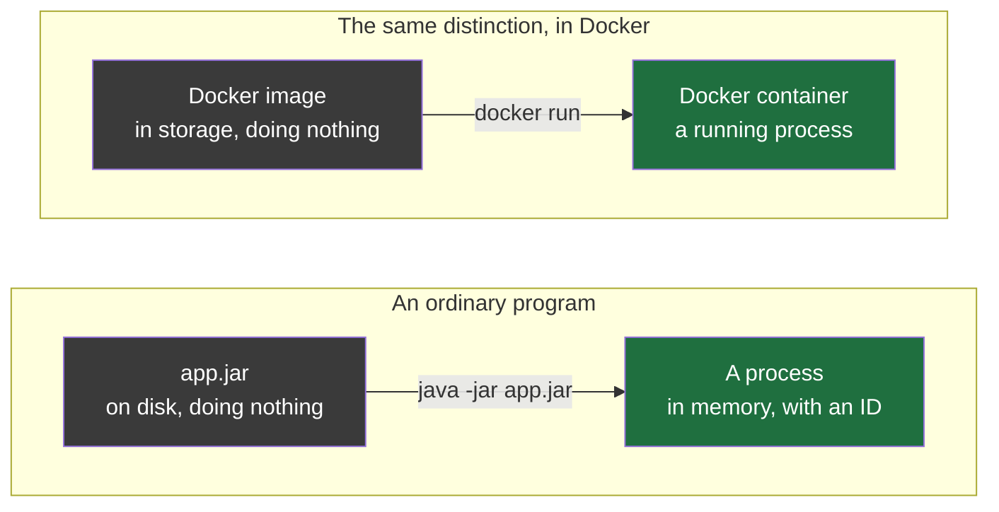
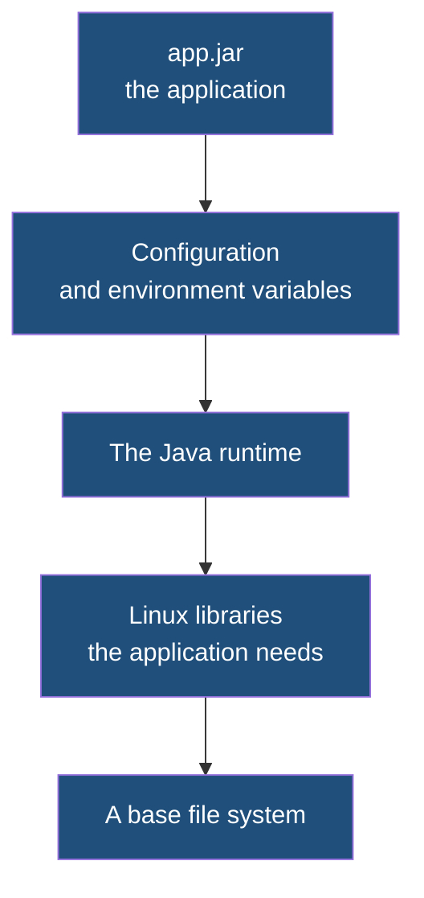
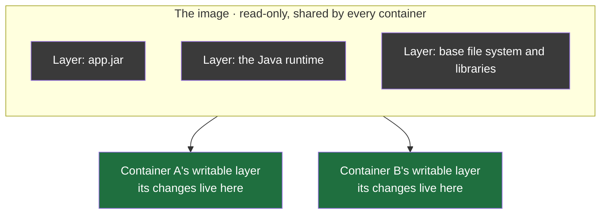
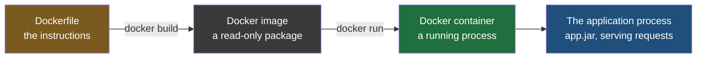

The previous note ended with a name and not much behind it: containerization is the idea, and Docker is the tool that made it ordinary. That leaves the obvious question unanswered. If Linux is what actually isolates the process, and the isolation is what does the work, then what is Docker for, and what exactly are you handling when you use it?

## Docker did not invent any of this

Isolated processes were possible on Linux before Docker existed. The facilities were there, and somebody who knew them well could build what this folder has been calling a container, by hand, out of ordinary Linux commands.

What that took was knowing a great deal about Linux internals. **Docker's contribution is not the container. It is that you no longer have to know how to build one.** It wrapped the mechanism up, gave it a vocabulary, and left you with a handful of commands that work the same way on every machine that runs it.

Which makes the obvious question easy to answer: what is the alternative to Docker? Building it yourself. You can create the isolated processes directly with Linux commands, and it will work, and it will be laborious. The same answer applies to asking what the alternative to Git is — you can track your own versions by hand, in folders, with dates in the filenames. Nobody says it is impossible. They say the tool exists because doing it by hand is not worth the time.

> [!tip] This subject is best taken one step at a time, and the order matters more than usual.
> Docker has a small number of ideas that only make sense in sequence, and trying to hold all of them at once is where the confusion comes from rather than from any one of them being hard. This note establishes what you are handling. The next establishes how you describe what you want. Only then is it worth running anything.

## A package that is sitting still, and a package that is running

Before the Docker words are worth anything, one distinction has to be solid, because the whole vocabulary is built on it.

Take the bookshop's order service. The source is compiled, the tests run, and the build produces its artifact, `app.jar` — a single deployable file sitting on disk. It is not doing anything. Nothing about it is consuming processor time. It is bytes in storage, and it will sit there indefinitely.

Then you run it:

```bash
java -jar app.jar
```

Now it has been read off the disk into memory and given to the processor, and it is doing work. The operating system gives it a **process ID**, a number identifying that running thing among everything else running on the machine, and from here on it can be watched, measured and killed.

The same thing happens every time you open an application. Chrome on your machine is a set of files on disk that nobody is using; the moment you open it, it becomes something running, with an ID of its own. Jenkins sitting on a build server is the same — an installed program until it is started, a process afterwards, with a number and a memory footprint and a place in the output of every tool that lists what the machine is doing. **Identical bytes, two completely different states**, and the one word covering both is what gets confused.

| | Sitting on disk | Running |
|---|---|---|
| What it is called | a program, a package, an artifact | a process |
| Where it lives | storage | memory, with processor time |
| How many can exist | one copy of the file | as many as you start |
| What it is doing | nothing | work |

## The two words

Docker's two central words map onto exactly that distinction, and once you see it there is very little left to memorise.

A **Docker image** is the package. It is a file, it sits in storage, it does nothing on its own, and it contains everything needed to run an application.

A **Docker container** is the image running. It is a process on a server, doing the work, serving the requests.



There is a second way of reading the same relationship that lands faster for anybody who has written object-oriented code. **The image is the class and the container is the object.** A class is a blueprint that describes what something will be; it is not itself a thing. An object is an instance of it, created from it, with its own state. A `Human` class is a description; a particular human made from it is a thing that exists.

And that analogy carries the property that matters most: **one class, many objects.** One image, many containers. You build the image once and start as many containers from it as you need, and they are all the same application.

> [!info] You cannot have a container without an image, and that is not an arbitrary restriction.
> A container is an image that is running, so the image is the thing there is to run. The order is fixed — image first, then container, always, in the same way that a class has to exist before an object can be made from it. Every other Docker operation sits somewhere on that line.

## What is actually inside an image

It is tempting to assume an image holds your jar and some configuration. It holds a great deal more than that, and the contents are the reason a container behaves like a machine.

Going from the bottom up, an image for the order service holds a base file system — the directory structure a Linux system expects, so that a process inside it can look around and find the layout it was written for. On top of that, the Linux libraries the application depends on. On top of that, the Java runtime, because the code needs something to run on and the machine underneath is not being asked to supply it. Then the application's own configuration. Then finally `app.jar` itself.



Read that against the problem the previous note opened with. Every row was something that lived on the machine and differed between machines: which runtime was installed, which libraries were present, where the configuration was. **All of it is now inside the package.** That is the whole trick, stated concretely rather than as a promise.

These sections are called **layers**, and an image is built out of a stack of them. Why an image is divided that way rather than being one solid block is a question with a good answer, and it belongs with the file that produces the layers, so it is taken up in the next note.

## An image cannot be changed, and that is deliberate

An image is a **read-only template**. Once it is built, it is not edited. You can read it, run it, copy it and delete it; you cannot open it up and alter what is inside.

That sounds like a limitation until you look at what it buys. Suppose the order service's checkout code changes — a variable renamed, a bug fixed, anything. The new build produces a new `app.jar`. The instinct is to put the new jar into the existing image.

Instead you build a **new image**. The old one still exists, unchanged, containing the old jar.

The reason shows up the first time something goes wrong.

Release 1.4 of the order service goes out on Monday and runs fine all week. On Thursday release 1.5 goes out, and orders start failing in a way nobody can reproduce. The decision is to put 1.4 back while it is investigated. **That only works if the image built for 1.4 is still there, exactly as it was on Monday** — if building 1.5 had overwritten it, there is nothing to go back to. The old jar is gone, the old configuration is gone, and **the fastest way out of an incident has been closed off**.

The second problem is quieter and worse. Two servers are both told to run the image called `order-service`. One of them pulled it in March, the other pulled it last week. If an image could change while keeping its name, **those two servers are now running different code while every deployment record reports them as running the same thing.** Nothing has failed and nothing has raised an error, and there is no way to find out short of going and looking inside both machines.

Being unable to edit an image removes both problems at once. A name refers to one fixed thing, permanently — so what is running is knowable, and what you roll back to is still there when you reach for it.

| | If images could be edited | Because they cannot be |
|---|---|---|
| A code change means | modifying the existing image | building a new image |
| Last month's image is | whatever it has become since | exactly what it was |
| Rolling back means | hoping the old state is recoverable | running the previous image |
| Two servers running the same image name are | possibly running different code | running identical code |

## Where a container's changes go

If the image is read-only, and a container is that image running, then a container that cannot change anything would be useless. Applications write files, write logs, and change state constantly.

So a container does not get a read-only copy of the world. **The image's layers stay read-only underneath, and the container adds one more layer of its own on top, which is writable.** Everything the container changes happens in that layer.



This answers a question that otherwise has no answer: if two containers came from one image, how can their contents differ? Because each has a writable layer of its own. Change a file in container A and the change is written into A's layer. Container B's view of that file is still the one in the image, because B's layer has nothing to say about it.

> [!important] The image layers are shared between containers, not copied into each one, and this is what makes containers cheap.
> Starting a container does not duplicate the image. Every container running from the same image reads the same underlying layers, and only the writable layer on top belongs to any one of them. When a container modifies a file that lives in a read-only layer, **that single file is copied up into the container's writable layer and modified there** — a mechanism called copy-on-write, because the copy happens at the moment of writing rather than in advance. **A 500 MB image starting ten containers costs 500 MB and ten writable layers, not 5 GB.** If it worked the other way, containers would cost what virtual machines cost, and the entire argument of the previous note would collapse.

## Containers are meant to be thrown away

A container stops or crashes. The reflex from working with servers is to get into it and repair it.

That is not what is done. **You delete it and start a new one from the image.** The image is untouched and still correct, so a replacement is one command and a few seconds away, and the replacement is guaranteed to be in a known state rather than in whatever state the broken one had drifted into.

This is what people mean by calling containers disposable, and it is only sensible because they are cheap. You would not throw away a virtual machine over a crash — there is an entire operating system in there and rebuilding it is a real operation. A container has no operating system of its own to rebuild.

## What disposability costs, and what volumes are for

Follow that through and there is a problem waiting.

Put MySQL in a container and it accumulates data — that is what a database is for. Now delete the container. **The writable layer is deleted with it, and the data is gone**, because the data was never anywhere else. The image is unchanged, which is the correct behaviour and no comfort at all.

So anything that has to survive is not kept inside the container. It is kept outside, in storage that Docker manages separately and attaches to the container, called a **volume**. The container reads and writes through it as though it were part of its own file system, and when the container is deleted the volume is still there, with the data in it, ready for the next container.

| | Written inside the container | Written to a volume |
|---|---|---|
| Lives in | the writable layer | storage outside the container |
| When the container is deleted | it is gone | it survives |
| Suitable for | scratch files, logs you do not need, anything rebuildable | database files, uploads, anything you would miss |

> A volume is **created and managed by Docker** rather than by you, and **stored in** **Docker's own area on the host machine** rather than anywhere inside the container. You give it a name, and you say where in the container's file system it should appear:

```bash
docker run -v order-data:/var/lib/mysql mysql
```

Everything the database writes under `/var/lib/mysql` now goes into the volume named `order-data`. Delete the container and the volume is still there, untouched — Docker does not remove volumes when the containers using them go away, which has to be done deliberately. Start a replacement container with the same volume attached and it finds the data exactly as the previous one left it.

That is the rule the whole mechanism exists to enforce: **a container is a place to run something, not a place to keep something.**

## The step that has not been explained yet

Everything above describes the pieces and how they relate. The chain runs like this:



The right-hand half of that chain is now accounted for: an image run becomes a container, and inside the container the application runs as an ordinary process. The left-hand half is not. Nothing so far says where the image comes from, or how a jar sitting in a build directory turns into one.

The answer is a file called a **Dockerfile** — **a configuration file listing what has to be done to turn your code into an image**. Building it produces the image. It plays exactly the role that a pipeline definition plays for a build server: a file, kept alongside the code, describing the steps so that a machine can carry them out the same way every time instead of a person doing it by hand.
