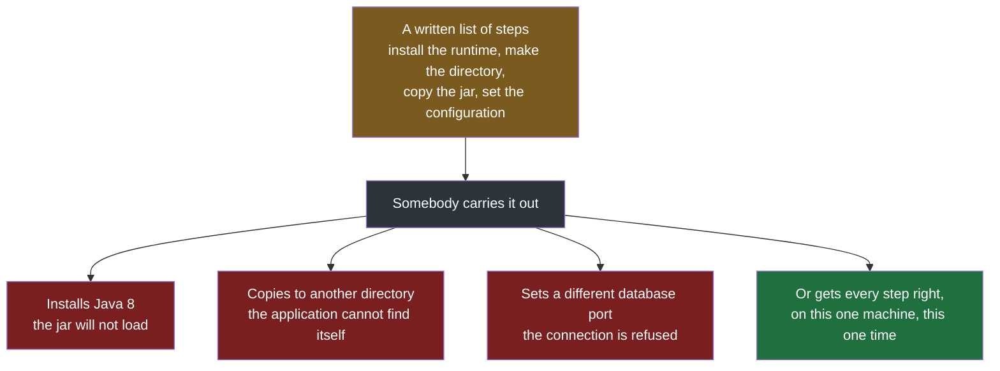
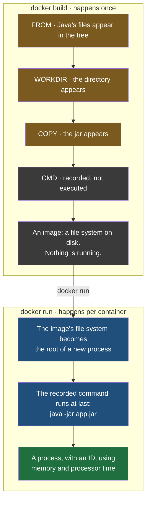
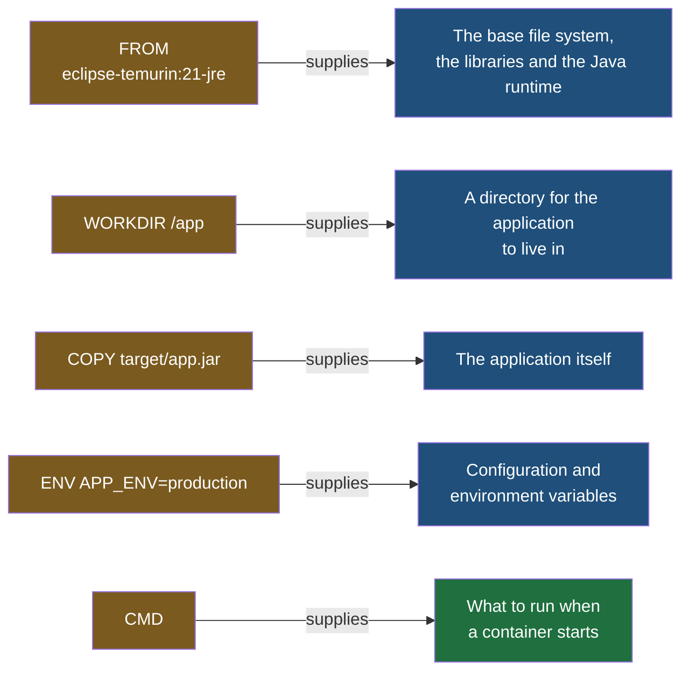
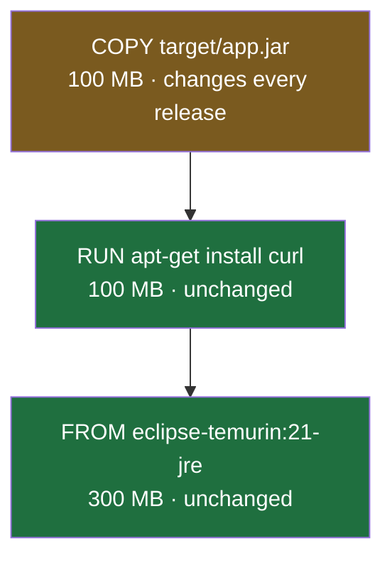
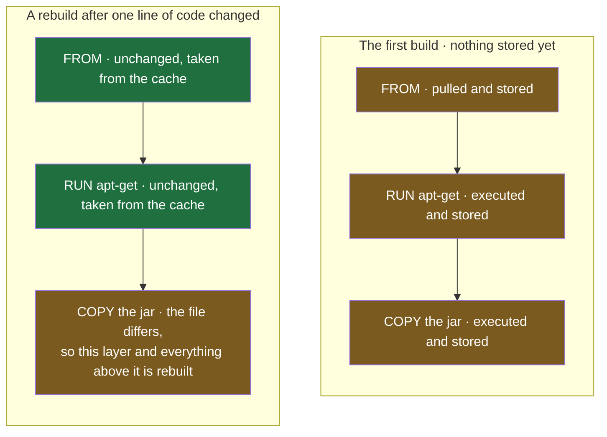

The previous note left one gap in the chain. An image run becomes a container, and a container runs your application — but nothing said where the image comes from. A jar in a build directory is not an image, and something has to turn it into one. That something is a file, and this note is about what goes in it.

## Start by handing the work to a person

Before the file makes sense, it helps to see what it replaces.

Suppose you hand somebody `app.jar` for the order service and ask them to run it on their machine. From the first note in this folder you already know it will not simply work, so you write down what they have to do first:

- Install Java 21, because the code was compiled against it and an older runtime will not load it.
- Create a directory at `/app`, because that is where the application expects to be.
- Copy `app.jar` into `/app/app.jar`.
- Point the application at the database by setting the port it should connect on.
- Set an environment variable holding the database password.
- Then run `java -jar app.jar`.

You put that list in a `README.md`, hand it over, and hope.

Now watch it fail. They install Java 8 instead of 21, because that is what was already on their machine, and the jar will not load. Or they put the file in a different directory, and the application cannot find itself. Or they set the database port to something else, and the connection is refused. Every one of those is a person following instructions imperfectly, which is the normal outcome of asking a person to follow instructions.

And the deeper problem is that it does not end. **The next server needs the same list, carried out again, by hand.** You have automated nothing; you have only written the manual down.



> [!info] This is the same argument that produces a build pipeline, applied one level lower.
> A pipeline exists because a sequence of build and deployment steps carried out by a person is slow and is performed differently each time, so the steps are written into a file and a machine executes them identically on every run. A Dockerfile does exactly that for the environment the application runs in rather than for the steps that build it. Both are the same move: **take the instructions out of a person's head, put them in a file next to the code, and let a machine follow them.**

## The file that carries out the list

A **Dockerfile** is a text file holding that same list of steps, written in a form a machine can execute rather than in a form a person has to follow. You write it once, and building it produces an image.

It is a recipe rather than a description. The file says what to do, and building is when the doing happens.

Here is the whole list above, as a Dockerfile:

```dockerfile
# Dockerfile
FROM eclipse-temurin:21-jre
WORKDIR /app
COPY target/app.jar app.jar
CMD ["java", "-jar", "app.jar"]
```

## What building actually does, and what it leaves for later

It is worth being exact about what carrying out those instructions means, because the obvious reading of it is wrong and leads somewhere confusing.

**The build carries out the setup steps, and a setup step produces files.** Installing Java means a set of binaries and libraries now exist in certain directories. Creating `/app` means a directory now exists. Copying the jar means a file now sits in that directory. Every one of those changes a file system, and **not one of them starts anything running.**

So what a finished build leaves behind is a directory tree: a `/usr` with Java's binaries in it, the libraries they need, an `/app` holding the jar, and the rest of the layout a Linux process expects to find around it. That tree is the image.

**The last of the four lines is not a setup step and is not executed during the build at all.** `CMD` names a command to run later, and building the image records it and moves on. Which means that at the end of a completely successful build, **Java is installed and has never been started, and the jar is in place and has never been loaded.** Nothing has a process ID, nothing is using memory, nothing is serving anything.

That leftover is not an oversight. **It is exactly the work a container does**, and it is the answer to the reasonable objection that if the image already has everything then the container has nothing to do.

| | `FROM`, `WORKDIR`, `COPY`, `ENV` | `CMD` |
|---|---|---|
| When it happens | while the image is being built | every time a container starts |
| What it produces | files and directories inside the image | a running process |
| How often | once, no matter how many containers follow | once per container |



The split is one you already work with under a different name. Running `mvn package` resolves the dependencies, compiles the classes and packs `app.jar`, and every step of it is genuinely carried out — **and your application is still not running.** Starting it is a separate act, `java -jar app.jar`, and that is the act that produces a process. **`docker build` is `mvn package` and `docker run` is `java -jar`**, one level further out: the artifact produced is an entire file system rather than a single jar, but the line between making the thing and executing it falls in exactly the same place.

> [!question] If the image contains an installed Java runtime, and the image is stored on the host machine, does that mean Java is now installed on the host?
> No, and the distinction is worth being precise about. The bytes really are on the host's disk — Docker keeps images in its own storage area, which on Linux is `/var/lib/docker` — and there is nowhere else they could be, since the host is the only physical machine involved. But **nothing was installed on the host.** Its own `/usr/bin` has no java in it, nothing was added to its path, and typing `java -version` in a terminal on that server still fails. What exists is a directory tree sitting in Docker's storage, which Docker will later hand to a process as that process's entire file system. **Installed into a directory tree, not installed onto a machine** — and that is why the host can hold images for six applications needing six different runtime versions without any of them colliding.

One last detail about the words carried out, since a build is easy to picture as something abstract. Each instruction that changes the file system is really executed, inside a temporary container started from the layer beneath it — `mkdir` genuinely runs, a package installer genuinely runs — and the file system changes it leaves behind are saved as the next layer, after which that container is thrown away. **So containers do exist during a build.** They run setup commands, they live for a few seconds, and what survives them is only the files.

With that settled, the four lines map onto the four things you would have told a person, and each one is worth taking separately.

## FROM — start from something that already exists

`FROM` names an image to build on top of. Your image is not assembled from nothing; **it starts as a copy of another image**, and your instructions are added to it.

`eclipse-temurin:21-jre` is an image that already contains a Java 21 runtime, correctly installed, **with its environment set up.** **By naming it you are saying: whatever that image did to get Java 21 working, do that, and then continue.**

Which raises the obvious objection. Why not just write the install command yourself?

Because somebody already worked out how to install Java 21 properly on Linux — which packages, which paths, which environment variables — and published the result. Writing it again in every Dockerfile that needs Java would be the same work repeated by everybody who ever needs a Java runtime. **You reference the finished thing instead of reproducing the recipe.**

The same applies to every other runtime. `FROM node:21` starts from an image with Node.js 21 installed. `FROM python:3.13` starts from one with Python 3.13. Each of them is an image somebody built and published, with the installation already done inside it.

> [!info] These live on Docker Hub, and it is the same idea as a shared build action.
> Docker Hub is a public registry of ready-made images — runtimes, databases, web servers, operating system bases — that anybody can build on top of. A build pipeline works the same way: rather than writing the commands to install a Java toolchain into your pipeline file, you reference a published step that does it, because it is maintained by people who care about getting it right. The base image is that idea applied to the environment instead of to the build.

The tag after the colon matters. `21-jre` is a runtime only — enough to run a jar and nothing more. There is also a `-jdk` variant containing the full development kit, compiler included, which is what you would need to compile inside the image and is dead weight if you are only running an already-built jar.

## WORKDIR — make a directory and move into it

`WORKDIR /app` does two things at once: it creates `/app` if it does not exist, **and it makes it the current directory for every instruction that follows.**

That second half is why the rest of the file is short. Because `WORKDIR` has already moved you into `/app`, the next line can name files relative to it rather than spelling out full paths every time.

## COPY — put your code into the image

`COPY target/app.jar app.jar` takes a file **from the machine doing the build and puts it inside the image.**

The first path is where the file is on the build machine. Maven, the build tool this project uses to compile and package Java, puts the finished jar in a directory called `target/`, so that is where it is read from. The second path is where it lands inside the image — and because `WORKDIR` already put us in `/app`, the bare name `app.jar` means `/app/app.jar`.

Both halves are yours to choose. Writing `COPY target/app.jar /app/app.jar` would be identical, just longer. And you can rename on the way: `COPY target/app.jar order-service.jar` copies the same file in under a different name, which is occasionally useful and is why the second argument is a path rather than a directory.

## CMD — what runs when the container starts

`CMD ["java", "-jar", "app.jar"]` is the command the container runs when it starts. It is the one instruction a build does not carry out: everything above it happens once, while the image is built, and this happens every time a container starts from that image.

The array form is not decoration. Each element is one piece of the command — the program `java`, then the flag `-jar`, then the argument `app.jar` — kept separate rather than handed over as one string for a shell to split up. Keeping them apart means nothing has to guess where one argument ends and the next begins, and it makes the list easy to extend. Handing the JVM a memory setting is one more element:

```dockerfile
CMD ["java", "-Xmx512m", "-jar", "app.jar"]
```

> [!note] There is a second instruction that also names what runs, and the difference between them is about who gets the last word.
> `ENTRYPOINT` sets the executable the container always runs, and `CMD` supplies default arguments to it. The rule that separates them is what happens when somebody passes arguments to `docker run`: **those arguments replace `CMD` entirely, and are appended to `ENTRYPOINT`.** So a container whose behaviour should be fully replaceable from the command line uses `CMD` alone; a container that must always run one particular program, with arguments the operator may vary, sets that program as `ENTRYPOINT` and puts the defaults in `CMD`. For an application image that exists to run one jar, `CMD` on its own is the ordinary choice.

## ENV — set an environment variable inside the image

The list handed to a person included setting an environment variable. `ENV` does that:

```dockerfile
ENV APP_ENV=production
```

**Anything built from this image carries that variable**, and the application reads it the way it would read any environment variable on any machine. Because each container has its own environment, **two containers from the same image can be given different values without either affecting the other.**

Taken together, the instructions account for every row of what the previous note said an image contains:



## Turning the file into an image

One command reads the Dockerfile and carries out every instruction in it:

```bash
docker build -t order-service .
```

`-t` is the tag — the name the finished image is given, so that you can refer to it afterwards instead of by an unreadable identifier. `order-service` is that name.

The trailing dot is easy to skim past and is doing real work. It is the **build context**: the directory whose contents are made available to the build. `COPY target/app.jar` can only find that file **because the dot handed the current directory to the build in the first place.** A Dockerfile at the root of that directory is used automatically, which is why the file is conventionally named exactly `Dockerfile` and placed alongside the code.

## Why an image is built in layers

The previous note said an image is a stack of layers and deferred the reason. The reason is a cost, and it is best seen by watching what would happen without them.

The order service's image is 500 MB — a Java runtime, libraries, the file system underneath them, and the jar. It is built, deployed, and running.

Then one line of application code changes. The branch is merged, a new jar is produced, and it needs to go out. Because an image cannot be edited, that means **a new image**.

If an image were one solid 500 MB block, a new image would mean producing and moving 500 MB — nearly all of it identical to what is already there. A one-line change would cost the same as the first build, every time, forever.

So it is not one block. **Each instruction in the Dockerfile produces its own layer**, and the image is those layers stacked:

```dockerfile
# Dockerfile
FROM eclipse-temurin:21-jre
RUN apt-get update && apt-get install -y curl
WORKDIR /app
COPY target/app.jar app.jar
CMD ["java", "-jar", "app.jar"]
```



Now change the jar and rebuild. The `FROM` layer is unchanged. The `curl` layer is unchanged. Only the `COPY` layer contains something different, so **only that layer is rebuilt**, and the 400 MB underneath it is reused exactly as it stands. A one-line code change costs 100 MB of work instead of 500.

That also explains something about how Dockerfiles are written. **The more separate instructions you give, the more finely the image is divided, and the more of it can survive a change.** A single instruction doing five things is one large layer that has to be redone whenever any of the five changes.

> [!important] The package manager depends on the base image, which is a real trap when copying a line between Dockerfiles.
> `apt-get` is Debian and Ubuntu's package manager, and it works here because the default `eclipse-temurin` images are Ubuntu-based. An image built on Alpine Linux uses `apk` instead and has no `apt-get` at all, so the same line fails outright. **The base image decides what commands exist inside it**, which is worth remembering the first time a line lifted from somebody else's file stops the build.

## The build cache

Layers are stored, and reusing them is not something you ask for — it happens automatically, through the **build cache**.

When a build runs, each instruction is checked against what has been built before. If that exact instruction has already been carried out and nothing it depends on has changed, the stored layer is reused rather than executed again. **Only from the first instruction that genuinely differs does the build start doing real work, and everything after it is rebuilt because it sits on top of something new.**

This is why a second build of an unchanged project finishes in seconds while the first took minutes.



The cache is not confined to one Dockerfile. **A layer built by one file can be reused by another**, provided the instruction is the same. Six services whose Dockerfiles all begin with the same base image and the same `apt-get` line share those layers: the work is done once, and every later build of every one of them starts from the stored result.

## What to keep out of a Dockerfile, and what to keep in

Three habits follow directly from everything above.

> [!warning] Never put a secret in a Dockerfile.
> A password, token or key written into the file ends up in the image and in the history of every image built from it, and anybody who can pull that image can read it back out. The file itself is also meant to be shared — it sits in version control next to the code, and other people read it and copy from it. **Pass secrets in at run time as environment variables, from wherever your deployment already keeps them**, so that the image stays something you can hand to anybody.

**Do not install what you do not need.** If the application needs Java, the image needs Java and nothing else — not Node.js, not Python, not a text editor that seemed handy while debugging. Every extra package is size, and size is what gets pulled over the network every time the image is deployed, on top of being one more thing that can carry a vulnerability. This is the same reason to prefer the `-jre` tag over `-jdk` when nothing inside the image ever compiles anything.

**Use `FROM` rather than rebuilding what somebody has already built.** A published base image with a runtime in it is a layer that is already cached, already correct, and already maintained. Installing that runtime by hand in your own file produces a larger image, a slower build, and a thing you now have to keep up to date yourself.
