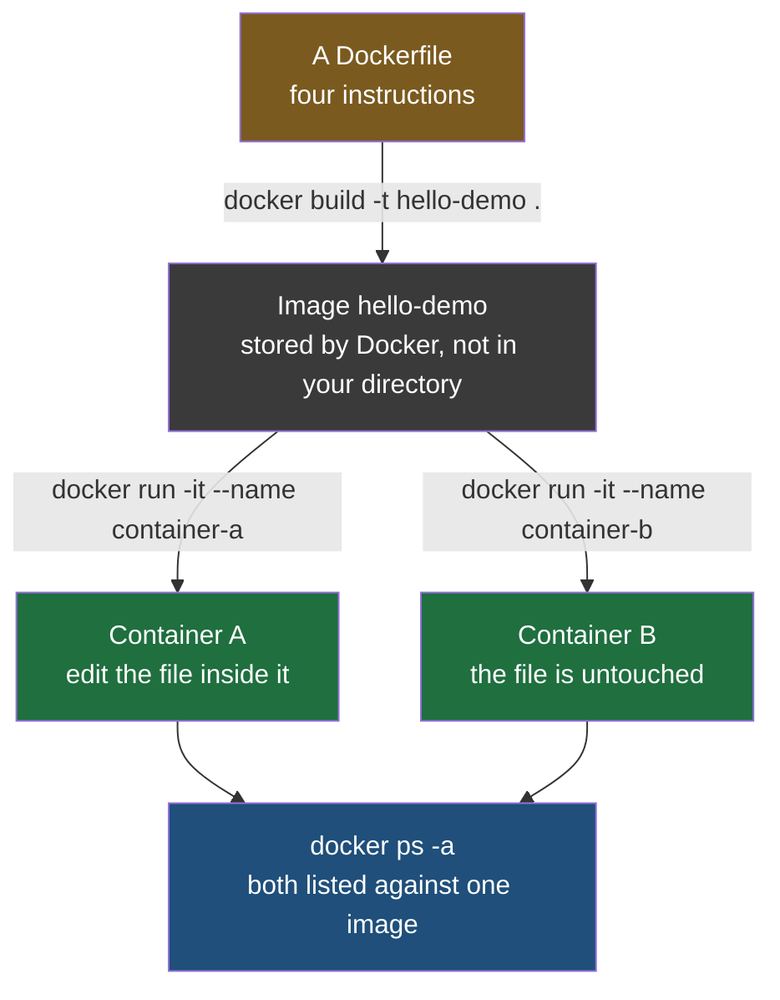
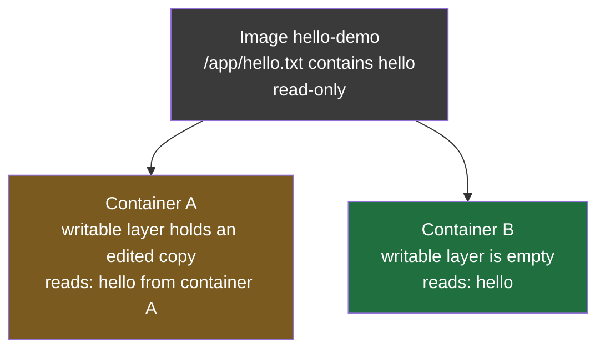

Everything so far has been described rather than done. The previous note explained what goes in a Dockerfile and what building it produces; this one walks the whole sequence end to end — a file on disk, an image, two containers from it, and a change made in one that the other never sees.



## The smallest thing that proves it

The order service would work here, and it would also get in the way. Building a Spring Boot jar takes a Maven build, and none of that has anything to do with what is being demonstrated.

So use something smaller. **Code is files.** A Java class is a file with a `.java` extension, a JavaScript module has `.js`, a Python module has `.py`, and the compiled package that comes out the other end is a file too. What matters for this demonstration is that an image carries a file into a container and the container can read it.

So the code, for the moment, is a text file containing one word:

```
hello
```

If that can be built into an image, carried into two containers, changed in one and left alone in the other, then the same is true of a jar, because nothing about the mechanism cares which extension the file has.

## The Dockerfile

```dockerfile
# Dockerfile
FROM alpine
RUN mkdir /app
RUN echo hello > /app/hello.txt
CMD ["sh"]
```

Three of those four instructions are already familiar. The one that is new is the base image.

`alpine` is Alpine Linux, one of the smallest base images in common use — little more than a shell, a package manager and the bare file system a Linux process expects to find. There is no Java in it, no Python, no application runtime of any kind, which is exactly right here because none is needed. The earlier Dockerfile started `FROM eclipse-temurin:21-jre` because it had a jar to run; this one has nothing to run but a shell.

`RUN mkdir /app` creates the directory. `RUN echo hello > /app/hello.txt` writes the file into it, using the shell's redirection to send the text into a file rather than to the screen. Both are ordinary Linux commands, run at build time, with their results baked into the image.

`CMD ["sh"]` starts a shell when a container starts. Since the point of this exercise is to get inside a container and look around, a shell is the thing worth starting.

## Building it

```bash
docker build -t hello-demo .
```

The image is named `hello-demo` by the tag, and the trailing dot **hands the current directory to the build as its context.** Each instruction is carried out in order, and each produces a layer.

**Nothing new appears in the directory afterwards.** Running `ls` shows the same `Dockerfile` that was there before, and this is the first thing that surprises people. The image was not written into the working directory — Docker keeps images in its own storage, and the way to see them is to ask Docker rather than to look at the file system.
## Starting the first container

```bash
docker run -it --name container-a hello-demo
```

Three things are being asked for. `-i` keeps the input stream open, so that what you type is delivered to the process inside rather than discarded. `-t` allocates a terminal for it, so that the shell behaves like a shell instead of like a program reading from a pipe. Together they are what makes it possible to work inside the container interactively, and they are almost always written as the single `-it`.

`--name container-a` gives the container a name. Without it Docker generates one, and naming it yourself means the next command can refer to it legibly.

The prompt changes, and that change is the signal that the commands you type are now running inside the container rather than on the host. The file the Dockerfile created is there:

```bash
cat /app/hello.txt
```

It contains `hello`, because `RUN echo hello > /app/hello.txt` put it there at build time and the image carried it in.

## Changing it, and leaving

```bash
echo "hello from container A" > /app/hello.txt
```

Reading the file again shows the new text. Then leave:

```bash
exit
```

**That change did not go into the image.** The image is read-only; what changed was the writable layer belonging to this container, which is the layer described two notes ago as the one thing a container has that its image does not.

## The second container

```bash
docker run -it --name container-b hello-demo
```

Same image, same command, a different name. And inside it:

```bash
cat /app/hello.txt
```

It contains `hello`.

Not the edited text. The original, exactly as the image built it. **Container B was made from the same image and is completely unaffected by anything container A did**, because A's edit lives in A's writable layer and B has a writable layer of its own with nothing in it.



## Seeing what exists

```bash
docker ps -a
```

`docker ps` on its own lists running containers. Both of these have been exited, so without `-a` — show all containers, rather than just the running ones — neither would appear at all, which is a confusing first encounter with a container you are certain you created.

The listing gives a container ID, the image each was created from, the command it runs, when it was created, its current status, any published ports and its name. The useful thing to read off it here is the image column: **both rows name `hello-demo`**, which is the one-image-many-containers relationship made visible rather than asserted.

## Adding a file rather than changing one

The same isolation holds for creating things, not only for editing them. Back inside container A:

```bash
echo "second file" > /app/hello2.txt
ls /app
```

Container A's `/app` now holds two files. Ask container B and its `/app` still holds one, because the directory each of them is looking at is its own.

| | Container A | Container B |
|---|---|---|
| Files in `/app` | `hello.txt`, `hello2.txt` | `hello.txt` |
| Contents of `hello.txt` | hello from container A | hello |
| Where its version lives | A's writable layer | the image, unchanged |

## What the sequence establishes

Four claims from the earlier notes were asserted there and are demonstrated here.

| The claim | What showed it |
|---|---|
| A Dockerfile is built into an image | `docker build -t hello-demo .` produced something runnable from four lines of text |
| One image, many containers | two containers, both listed against `hello-demo` |
| The image is read-only | the edit in A left the image untouched, so B still saw the original |
| The container has a writable layer | the edit worked at all, and stayed local to the container that made it |

What it does not explain is **why** the two containers could not see each other's files. Nothing in these commands asked for that, and nothing configured it. They had the same paths, the same file names, and the same image, on one machine under one operating system, and they did not collide. The mechanism that makes that true is the subject of the next note.
