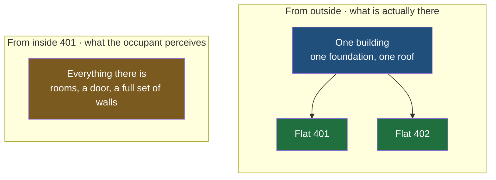
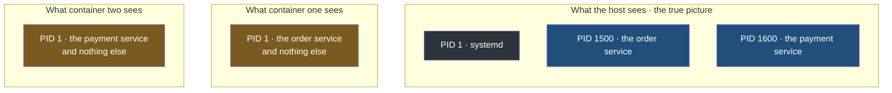
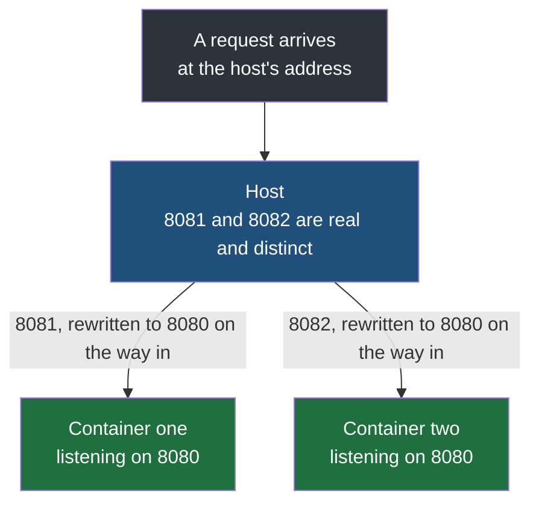
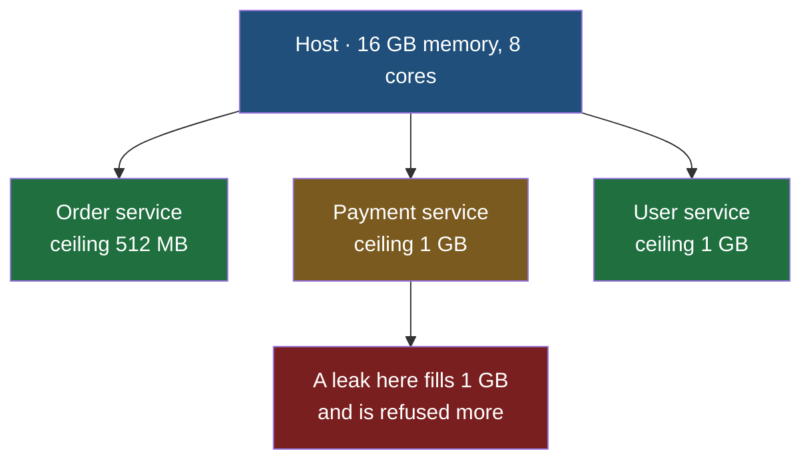

Two containers were started from one image, a file was changed inside the first, and the second was left holding the original. Nothing was configured to keep them apart. They ran on one machine, from one image, under one operating system, and they did not collide. This note is about why, because the mechanism underneath is where the difference between a container and a virtual machine finally becomes concrete.

## What a container believes

A container behaves as though it were a machine of its own. From inside it, there is a file system starting at `/` with nothing else on the disk. There are network ports, all of them apparently free. There is an address. There is memory. Look around from inside a container and you will find no evidence that anything else exists.

None of it is true. There is one file system, one set of ports, one block of memory, and one operating system, belonging to the host, and **every container on the machine is being shown a version of it edited for their benefit.**

This is the exact point where a container and a virtual machine part company, and it is worth being precise rather than impressionistic about it.

That a virtual machine has a kernel of its own and a container does not is already established. What has not been said is what that means for the resources each one is given, and it is the sharper half of the distinction.

A virtual machine's resources are **real and reserved**. Give a virtual machine 8 GB of a host's 16 GB and 2 of its 8 processor cores, and those are genuinely set aside: the guest operating system inside it stores what it stores within that 8 GB, schedules its threads across those 2 cores, and the remaining 8 GB and 6 cores are not available to it under any circumstances. **It is partitioned hardware, and the partition is enforced by there being a second operating system managing it.**

A container's resources are **the host's, shown selectively**. There is no reserved block of memory that belongs to the container in the way the virtual machine's 8 GB belongs to it. There is one machine, one pool of memory, one set of cores, and the container is a process on that machine which has been given a deliberately partial view of all of it.

| The discriminating question | Virtual machine | Container |
|---|---|---|
| Is its memory allocation real | yes, reserved and unavailable to anything else | no, a ceiling applied to a shared pool |
| What enforces it | a second operating system | the host's own kernel |
| What is it, underneath | a simulated computer | a process |

> [!info] A container does get its own user space, and that is what makes the illusion convincing.
> An operating system is divided in two: the kernel, which drives the hardware, and the user space above it, which is the file system, the libraries and the programs. **Containers share the kernel and get their own user space.** That is why a container can hold a completely different set of libraries, a different runtime and a different directory layout from the machine it runs on, and still not be a separate operating system — everything that differs sits above the kernel, and the kernel is the part being shared.

Two mechanisms produce that partial view, and between them they are the whole basis of Docker. One decides what a container can see. The other decides how much it can use.

## Namespaces — what am I allowed to see

A **namespace** is the kernel's way of giving a process a **restricted view of some part of the system.** The process sees what its namespace contains and has no way of perceiving anything outside it — not restricted from it in the sense of being refused, but genuinely unable to see that there is anything there.

The shape of it is easier with a building.

A block of flats has one entrance and many flats inside it. Two people walk in and go to different flats — one to 401, the other to 402. Once inside, each has a front door, rooms, furniture and everything needed to live. Neither can see into the other's flat. Neither has any evidence, from where they are standing, that the other flat is occupied, or that it exists.

From outside, obviously, it is one building with many flats sharing one foundation, one roof and one water supply. From inside 401, it is simply where you live.



A namespace is that, applied to a part of the operating system. There is more than one kind, because there is more than one thing worth hiding.

A view in SQL is a **query given a name and treated like a table**: you select from it exactly as you would from a table, and what comes back is real data. But the view is not a table. It is a presentation of one or more real tables, possibly showing only some columns and only some rows, and a user handed nothing but the view has no way to tell the difference and no way to reach the rest. **A namespace does that to the operating system** — the process queries a file system, or a list of processes, or a set of ports, and gets real answers from a genuinely restricted presentation of the real thing.

## The process namespace

Every running process on a Linux machine has a **process ID**, a number identifying it. Those numbers are unique across the machine, and **PID 1 is special**: it is the first process started at boot, the one every other process descends from. On a modern Linux system that is `systemd`, **the program that starts and supervises everything else.**

Go into a container running the order service and ask it what is running, and it answers that one process is running, `app.jar`, at **PID 1**. Go into a second container running a different service and ask the same question, and it answers that one process is running, its own jar, also at **PID 1**.

Both cannot be true. PID 1 is unique and belongs to `systemd`.

Ask the host, and the real picture comes back: `systemd` at PID 1 as expected, the first container's application at some ordinary number like 1500, the second's at 1600. Two normal processes among everything else the machine is doing.



The container is not lying and it is not mistaken. **It is being shown a different numbering**, in which its own main process is the first one, and nothing else on the machine appears at all. The host keeps the real numbers, because the host is the one that actually has to schedule them.

## The network namespace

The same treatment is applied to the network, and this is the one with the most practical consequence.

Whatever runs inside a container is an ordinary program with ordinary expectations about the network. It might be the order service. It might equally be nginx.

Two instances of the order service, in two containers, both want port 8080 — which is reasonable, because it is the same application and the port is written into its configuration. On one machine, two processes cannot both hold port 8080.

Inside their own network namespaces they can. Each container has its own set of ports, its own network interface, and its own address, and each of them holds 8080 without either being aware of the other.

**The host cannot pretend, though, because the host is where requests actually arrive.** So when a container is started, its ports are **published**: a port on the host is nominated to stand in for a port inside the container.

```bash
docker run -p 8081:8080 order-service
```

**The order is host first, then container.** This says: traffic arriving on the host's port 8081 is to be delivered to port 8080 inside this container. Start a second one with `-p 8082:8080` and the host now has two distinct doors, 8081 and 8082, leading to two containers that both believe they are on 8080.



**The rewriting is the part worth holding on to.** The application inside the container was never modified and never told about any of this. It binds to 8080, because that is what its configuration says, and requests arrive on 8080 as far as it can tell. The translation from 8081 happens outside it, in the host, on the way through.

The same applies to addresses. Each container has its own address inside its namespace . A container might hold `192.0.2.10` and a second `192.0.2.11`, while the **host holds the address the outside world actually reaches**. Requests land on the host's address and are directed onward based on which port they arrived at.

And this is exactly the problem the first note in this folder opened with, now solved. Two developers who need the same port no longer have to negotiate: both applications keep the port they were written for, and the host maps each to a free one of its own.

> [!question] So which port does somebody outside actually use?
> The published one. A browser, another service, or anything else reaching this machine from outside addresses the host and the host's port — `8081` for the first container, `8082` for the second. **The container's own 8080 is not reachable from outside and is not meant to be**; it exists only inside that container's namespace. The number written in the application's configuration and the number typed by whoever calls it are two different things, and the mapping is what connects them. If nothing is published at all, the application runs perfectly well and simply cannot be reached from off the machine.

## The mount namespace

The third one covers the file system, and it is what the two containers in the demonstration were relying on.

Each container is given its own root. Inside, there is a `/` with the usual directories beneath it — `/app`, `/usr`, `/etc` — and it looks like a complete Linux file system because it is one, **assembled from the image's layers.** **The host meanwhile has its own complete file system, with everything on the machine in it.**

> **Neither container can see the other's, and neither can see the host's.** A container may create, modify and delete anything within its own view and cannot reach outside it.

Which means **two containers may use the same paths without any conflict at all**. Both can have `/app/hello.txt`. Both can have `/app/app.jar`. These are different files that happen to share a name, in the way that two people in two flats can both have a kitchen.

| | What container A reports | What container B reports | What the host holds |
|---|---|---|---|
| Files in `/app` | `hello.txt` | `hello.txt` | both containers' storage, separately |
| Contents of `hello.txt` | whatever A wrote | the image's original | both versions, unconnected |
| Add `/app/hello2.txt` in A | two files | still one file | A's layer grows; B's is untouched |

## Cgroups — how much am I allowed to use

Namespaces answer what a container can see. They say nothing whatever about how much it can consume, and on their own they leave a serious hole.

Consider a **memory leak**: a program that keeps allocating memory and never releases what it has finished with. Nothing is broken enough to crash immediately; the process simply grows, and keeps growing, for as long as it runs.

Now put that leaking application in a container on a host with 256 GB of memory, alongside other containers running other services. **By default a container has no resource limit at all** — it can use as much memory and as much processor time as the host's kernel will give it. So the leak does not stop at the container's edge. It consumes the host's memory, and the other containers, which did nothing wrong, run out and fail.

> A partial view of the system does not help here, because **the leaking process is not trying to see anything it should not.** It is asking for memory, which is an ordinary request, and nothing is set up to refuse it.

**Control groups**, universally shortened to **cgroups**, are the kernel mechanism that refuses it. A cgroup places a ceiling on what a group of processes may consume — memory, processor time, and other resources — and enforces it.

So on a host with 8 processor cores and 16 GB of memory, three containers can be given ceilings before they start:

```bash
docker run --memory 512m order-service
docker run --memory 1g payment-service
docker run --memory 1g user-service
```

Each container now behaves as though that were all the memory in the world. The order service can use 512 MB and not a byte more. Processor cores are limited the same way, and every thread the application runs is scheduled within whatever share it was given.



Now run the leak again. The payment service grows until it reaches 1 GB and is refused further memory. It will fail — there is no fixing a leak by containing it — but **it fails alone**. The user service and the order service never notice, because the memory the leak wanted was never theirs to lose.

That is the guarantee worth stating precisely. **Cgroups do not prevent a service from failing. They prevent one service's failure from becoming every service's failure.** Which is the property that makes it reasonable to put unrelated applications on the same machine at all.

> [!important] A container with no limit set is unlimited, not modestly provisioned.
> It is easy to assume there is a sensible default ceiling and that setting one is a refinement. There is not. **With no limit specified, a container may consume as much of the host as the kernel allows**, and one container is enough to take down every other container on the machine. Limits are the thing that makes the isolation real rather than merely apparent, and on a shared host they are not optional. When a limit is set, the floor is 6 MB.

## Why this still is not a virtual machine

Capping a container's memory and cores looks exactly like sizing a virtual machine, and it is a fair thing to notice. The commands read the same way and the effect on the application is similar.

The difference is everything underneath. Giving a virtual machine 1 GB reserves 1 GB and hands it to a second operating system, with its own kernel, which manages that memory independently of the host. Giving a container 1 GB sets a ceiling enforced by the host's own kernel on a process running on the host.

Which is why the two things that are genuinely impossible for a container stay impossible no matter how carefully it is sized. **It cannot run a different operating system from its host** — no Windows container on a Linux machine, because there is only one kernel and it is Linux's. And **it cannot be given a kernel of its own**, because sharing the kernel is the entire reason it is light enough to start in a second and cheap enough to run fifty of.

The view is false. The isolation is real. Both statements are true at once, and holding both is what it means to understand the mechanism rather than the analogy.
