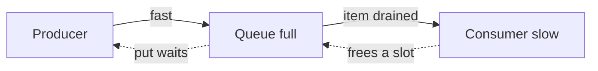

#asyncio #queues #backpressure #api #python

---

# `asyncio.Queue` — Bounded vs Unbounded, `put` vs `put_nowait`

You've decided you want a queue between two coroutines. `asyncio.Queue` has a handful of methods and one constructor argument that decides everything else. This note walks through the API and the reasoning behind each choice.

---

## The Constructor

```python
queue = asyncio.Queue()                # unbounded (default — maxsize=0)
queue = asyncio.Queue(maxsize=10)      # bounded — at most 10 items in flight
```

A type hint version (the queue holds a specific type):

```python
queue: asyncio.Queue[MyEvent] = asyncio.Queue()
```

The `[MyEvent]` is **purely for the reader and your IDE**. Python does not enforce it at runtime. You could put a string into a `Queue[MyEvent]` and Python wouldn't complain.

---

## Bounded vs Unbounded — the Core Trade-off

### Unbounded (`maxsize=0` or omitted)

The queue grows as long as items are added. `put` and `put_nowait` always succeed instantly. The only risk is **memory** — if a producer dramatically outpaces a consumer for a long time, the queue grows without limit.

> [!success] Safe when:
> - Producer is naturally rate-limited (it only emits a few items per request).
> - Consumer is fast enough on average.
> - Lifetime is short — the queue dies in seconds, not hours.
> - Items are small.

### Bounded (`maxsize=N`)

The queue caps at `N` items. Once full, the producer is forced to do *something*: wait for space, or handle the overflow.

> [!success] Use when:
> - Producer can run far ahead of consumer (background ingestion, long-lived pipelines).
> - You want **backpressure** to flow naturally back to the producer.
> - Items are large enough that uncontrolled growth would matter.

> [!danger] Common myth — "bounded = lossy"
> A bounded queue does **not** silently drop items. It either makes the producer wait (backpressure) or raises an exception. Loss only happens if your code chooses to throw items away after catching the exception.

---

## Producer and Consumer Methods (overview)

Each side of the queue has a "wait if needed" version and a "do it now or fail" version:

| Side | "Wait" version | "Now or fail" version |
|---|---|---|
| Producer | `await queue.put(item)` | `queue.put_nowait(item)` → `QueueFull` |
| Consumer | `await queue.get()` | `queue.get_nowait()` → `QueueEmpty` |

Detailed walk-through of each pair lives in its own note — see [[put-vs-put-nowait]] for the producer side and [[get-vs-get-nowait]] for the consumer side.

---

## Consumer Side — `get` vs `get_nowait`

```python
item = await queue.get()      # async — pauses the consumer until an item arrives
item = queue.get_nowait()     # sync — instant or raises QueueEmpty
```

| | `await get()` | `get_nowait()` |
|---|---|---|
| Queue has items | Returns the next item | Returns the next item |
| Queue is empty | **Pauses the consumer** until something is put | **Raises `asyncio.QueueEmpty`** immediately |
| Right for a "wait forever for the next item" loop | **Yes** | No — would force you to poll |
| Right for "check if anything's there, otherwise do something else" | No | Yes |

For a streaming-style consumer that just sits in a loop and forwards every event as it arrives, `await queue.get()` is the right call — the consumer sleeps for free until something arrives.

```python
while True:
    event = await queue.get()
    yield serialize(event)
```

`get_nowait` is for the rare case where you want to opportunistically check the queue but have other work to do if it's empty — for example, "drain whatever's there into a batch, then send the batch on a timer."

---

## Backpressure — the Concept Behind All of This

> [!info] Backpressure
> A way for a slow consumer to **automatically** signal "I can't keep up" back to the producer, so the producer slows down instead of building up an unbounded backlog.

In a queue with bounded `maxsize`, backpressure happens naturally: when the queue fills up, `await put()` makes the producer wait. The producer's effective rate matches the consumer's rate. No explicit coordination needed — the queue's full state is the signal.

In an unbounded queue, **there is no backpressure**. The producer can push as fast as it wants; the queue just grows. That's fine when bounded growth is guaranteed by the producer's behavior (small number of items per request). It's dangerous when it isn't.



The dotted arrows are the backpressure feedback. Without `maxsize`, those arrows don't exist — the producer just keeps shoveling.

---

## Other Useful Methods

```python
queue.qsize()       # how many items are waiting
queue.empty()       # bool — is it empty right now?
queue.full()        # bool — is it at maxsize? (always False if unbounded)

queue.task_done()   # consumer marks an item as fully processed
await queue.join()  # blocks until task_done has been called for every put item
```

`task_done` / `join` are only needed when you want to wait for "everything that was put has been *processed*" (not just retrieved). For a fire-and-forget streaming pipeline, you don't need them.

---

## Mental Model To Remember

> [!info] Two axes, two pairs of methods.
>
> **Axis 1 — Bounded vs unbounded:** decides whether you have backpressure at all.
>
> **Axis 2 — "wait" vs "nowait":** decides whether the operation can pause the coroutine, or must succeed/fail instantly. (See [[put-vs-put-nowait]] for the producer side and [[get-vs-get-nowait]] for the consumer side.)
>
> Default for short-lived per-request streams: **unbounded queue**, "nowait" on producer, "wait" on consumer. Reach for bounded + `await put` only when you need backpressure for a long-lived pipeline.
