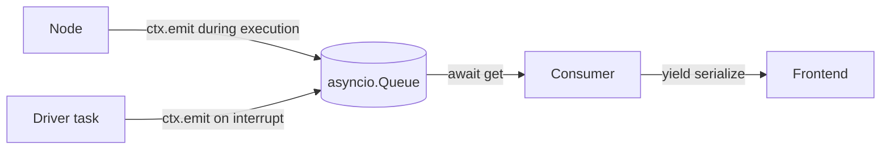
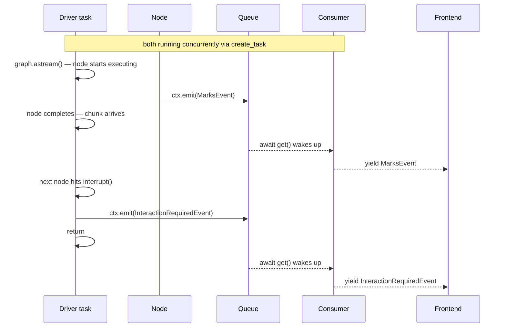

#langgraph #asyncio #driver-pattern #create-task #streaming #funnel-pattern

---

# Two Event Sources, One Queue — How to Funnel Graph-Level and Node-Level Events Together

> Prerequisite: [[architecture-inversion]], [[per-request-queue-scoping]], [[coroutines-and-event-loop]], [[what-interrupt-actually-is]] — establish nodes-emit pattern, the per-request queue, coroutine concurrency, and the `__interrupt__` signal.

Nodes push their own events onto the queue via `ctx.emit()`. But graph-level signals — interrupts and terminal responses — appear in the graph stream outside of any node. How do both sources end up on the same queue so the consumer can forward them all to the frontend?

---

## What `graph.astream()` Actually Gives You

With `stream_mode="updates"`, each chunk from the graph stream is a **diff** — only what changed after a node completed.

```python
async for chunk in graph.astream(input_data, config=config, stream_mode="updates"):
    print(chunk)
```

A normal node completion looks like:

```python
{"fetch_student": {"marks": {...}, "student_profile": {...}}}
```

The key is the node name. The value is what that node wrote to state.

When `interrupt()` is called inside a node, that node never completes. LangGraph injects a special key instead:

```python
{"__interrupt__": (Interrupt(value={"options": [...]}, resumable=True),)}
```

So every chunk is one of two things:

| Chunk shape | Means |
|---|---|
| `{"node_name": {...}}` | Node completed, here is the state diff |
| `{"__interrupt__": (...)}` | Graph paused, human input needed |

---

## The Problem — Two Things Need to Run at the Same Time

The consumer's job is to drain the queue and stream events to the frontend:

```python
while True:
    event = await ctx.event_queue.get()   # suspends here until something arrives
    yield serialize(event)
```

But someone also needs to run `async for chunk in graph.astream(...)` and translate graph-level signals into queue events.

These two cannot be in the same coroutine. When the consumer hits `await ctx.event_queue.get()` it suspends — it cannot simultaneously be iterating the graph stream. They need to run **concurrently**.

---

## The Solution — `asyncio.create_task()`

Spawn the graph iteration as a separate task. `asyncio.create_task()` schedules a coroutine to run on the event loop and **returns immediately** — it does not enter the coroutine or wait for it.

```python
driver_task = asyncio.create_task(driver(graph, input_data, config, ctx))
# driver has NOT started yet — it is scheduled, not running

while True:
    event = await ctx.event_queue.get()   # consumer suspends here
                                          # NOW the event loop picks up the driver
```

The moment the consumer hits `await` and suspends, the event loop looks for the next ready task — finds the driver — and starts running it.

---

## What the Driver Does

The driver's only job is to iterate the graph stream and translate interrupts into queue events:

```python
async def driver(graph, input_data, config, ctx):
    async for chunk in graph.astream(input_data, config=config, stream_mode="updates"):

        if "__interrupt__" in chunk:
            raw = chunk["__interrupt__"][0]
            ctx.emit(InteractionRequiredEvent(content=dict(raw.value)))
            return

    # graph finished normally — sentinel pushed in finally
```

Nodes still call `ctx.emit()` directly for their own events. The driver calls `ctx.emit()` only for graph-level signals. Both write to the same queue.

---

## How They Take Turns

There is one thread. Both the driver and the consumer run on the same event loop, switching at every `await` point.

```
Driver:   ----run----await(graph I/O)----run----emit----await(graph I/O)----run----emit
Consumer: ----await(queue empty)------------------wake--yield--await(queue empty)--wake
                                                   ↑ queue got something    ↑ queue got something
```

Step by step:

1. `create_task(driver(...))` — driver is scheduled, not yet running
2. Consumer hits `await ctx.event_queue.get()` — suspends, queue is empty
3. Event loop picks up driver — driver starts iterating graph stream
4. Driver hits internal `await` inside `graph.astream()` — suspends waiting for graph I/O
5. Graph produces a chunk (node completed or interrupt) — driver wakes up
6. If it is a node completion — nodes already emitted their own events via `ctx.emit()` during execution, nothing extra needed
7. If it is an `__interrupt__` — driver calls `ctx.emit(InteractionRequiredEvent(...))`, event lands on queue
8. Consumer was waiting on `await ctx.event_queue.get()` — wakes up, serializes event, yields to HTTP response
9. Consumer goes back to `await ctx.event_queue.get()` — suspends again
10. Event loop picks up driver — cycle continues

> [!info] The thread is never idle. At every `await` point, the event loop switches to whoever is ready next. Driver and consumer take turns sharing one thread cooperatively.

---

## The Funnel

Both sources write to the same queue. The consumer reads from one place and never needs to know which source an event came from.





---

## Mental Model To Remember

> [!info] Nodes own their events — they emit directly via `ctx.emit()` during execution. The driver owns graph-level signals — it watches the stream and translates `__interrupt__` into a queue event. One queue, two writers, one reader. The consumer never needs to know which source an event came from.
