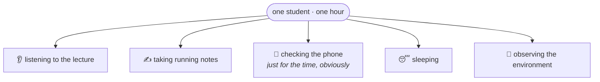
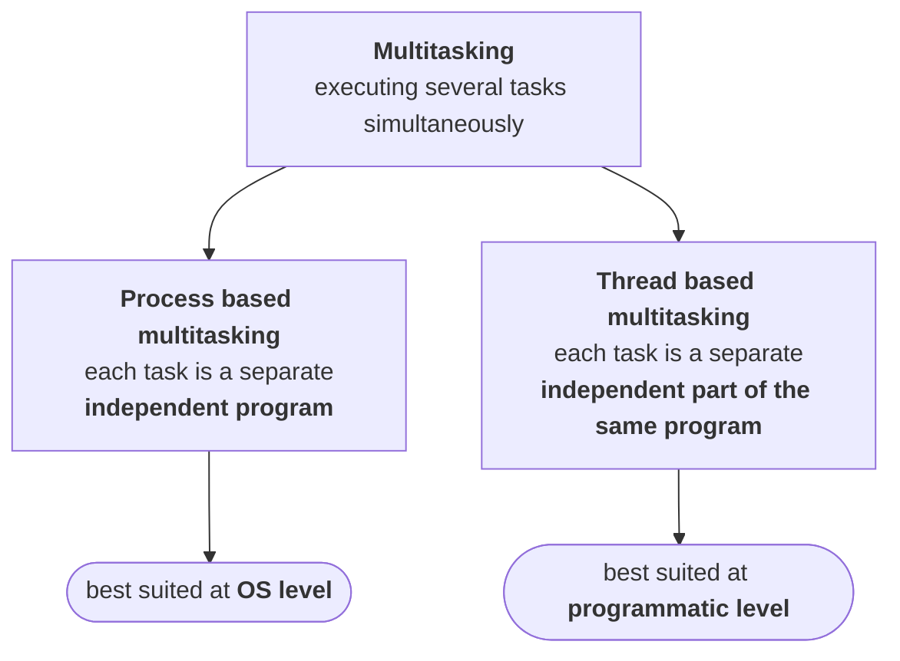
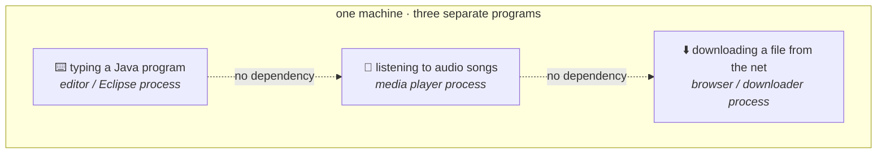
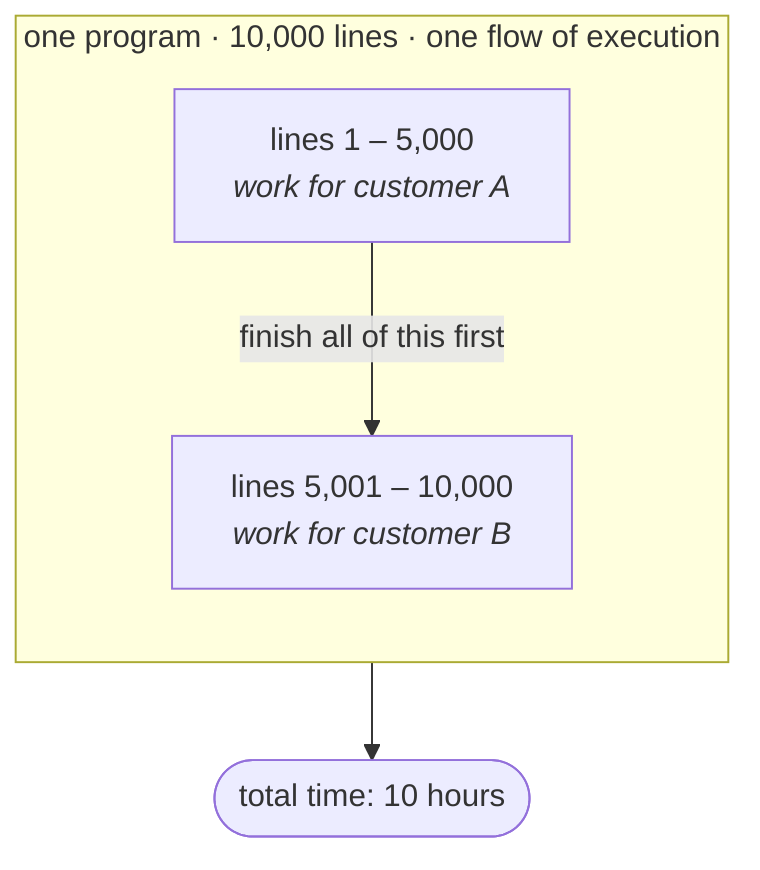
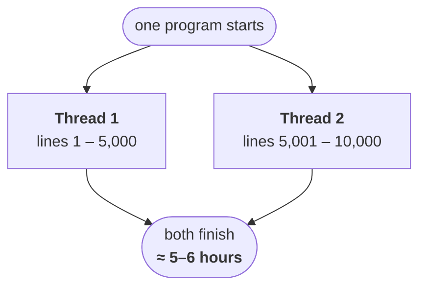
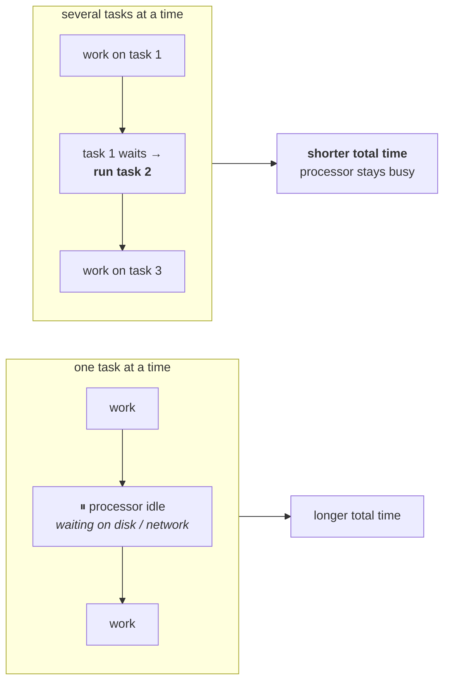

## Multitasking

> **Executing several tasks simultaneously is the concept of multitasking.**

That is the whole definition, and it is worth writing down in exactly those words. Everything in this chapter is a variation on it.

### The example you already live in

Forget computers for a moment. **A student sitting in a classroom is the cleanest example of multitasking there is**, because they are visibly doing several unrelated things at once.

The point of the example is not the list. It is that **the combination is arbitrary**. One student listens and takes notes. Another listens and checks the phone. A third takes notes and sleeps — which sounds impossible until you have taught a class. Any subset of those activities can be running at the same time in the same person.

That is multitasking: several tasks, progressing together, in one place.

### Two flavours of it

Everything that follows hangs off one split. Multitasking comes in exactly two kinds, and the difference between them is **what counts as a "task"**.

Read the two boxes side by side and notice that only four words change: *independent program* becomes *independent part of the same program*. That is the entire distinction, and interviewers ask for it constantly.

> [!important] **Same definition, different granularity.** Both are "several tasks at once". Process based multitasking runs several **programs**. Thread based multitasking runs several **parts of one program**. Nothing else separates them at the level that matters to you as a programmer.

The rest of this note defines each one properly, because the pair of definitions — and the difference between them — is standard interview material.

---

## Process based multitasking

Stated the way you would write it in an exam:

> **Executing several tasks simultaneously, where each task is a separate independent process, is called process based multitasking.**

The load-bearing word is **independent**. Not "unrelated in theme" — independent in the sense that task 2 does not need task 1 to have finished, or even to exist.

### The example

Look at what your machine is doing right now while you type a Java program.

Three tasks, running together, and no arrow of dependency between any pair of them. The editor does not care whether the song is playing. The download does not wait for you to finish a line of code. Each is a **separate process** with its own program behind it.

Hence: process based multitasking.

> [!info] This is not an artificial classroom setup. Walk past a bay of four desks in any software company and three of them are running exactly this combination — editor open, headphones in, something downloading in the background.

### Where it lives: the OS, not your program

Here is the part that decides whether the concept is any use to you.

> **Process based multitasking is best suitable at OS level.**

Picture the conversation that makes this concrete. A client comes to you with a requirement:

> *"Can you build this for me?"*
> *"Yes — in Java."*
> *"Tell me something good about Java."*
> *"Java provides support for multitasking."*
> *"Meaning what, in plain words?"*
> *"While your program runs in the foreground, you can listen to MP3 songs and download a file in the background."*

And at that point the client, entirely reasonably, throws you out of the room.

> [!important] **Ask who owns the benefit.** Listening to songs while an application runs is not a feature of *your application* — it is a feature of the **operating system**, which is willing to schedule three processes at once. You wrote none of it, you control none of it, and you cannot bill for it.
>
> Process based multitasking is real and useful. It is just not something a programmer *implements*. It is something the OS *provides*.

So the concept is worth knowing and worth being able to define — it is where the split comes from, and it is a standard question — but it is not the concept you will be programming with.

For a benefit that lives inside your program, you need the other kind.

---

## Thread based multitasking

### Start with the problem

You have one program. Ten thousand lines of code. Nothing exotic — it just runs.

The JVM works through it top to bottom: line 1, then line 2, then line 3, and so on to the end. Say the whole thing takes **10 hours** to complete.

Now you sit down and actually read the code, and you notice something:

**The first 5,000 lines and the second 5,000 lines have nothing to do with each other.** The first half processes customer A. The second half processes customer B. The second half does not read anything the first half wrote, and does not wait on anything the first half does.

So ask the obvious question: **why is the second half waiting?**

It is waiting for one reason only — because that is the order the lines happen to sit in the file. Not because the logic requires it.

### Split the flow

If the two halves are independent, run them as two flows instead of one.

Same program. Same 10,000 lines. Same machine. The work now finishes in roughly **5 to 6 hours** instead of 10, because two independent halves stopped queueing behind each other.

That is thread based multitasking, and here is the definition:

> **Executing several tasks simultaneously, where each task is a separate independent part of the same program, is called thread based multitasking. And each independent part is called a thread.**

> [!question]- The two halves are equal, so why isn't 10 hours cleanly halved?
> Because splitting work is not free, and because nothing in a real program is perfectly independent. The two threads still share one CPU, one heap, one disk. They take turns being scheduled, they compete for memory bandwidth, and there is setup work at the start and joining-up at the end that did not exist in the single-flow version.
>
> Keep this instinct for the whole chapter: **more threads buys you less than the arithmetic promises.** Doubling the threads never quite halves the time, and past a point it stops helping at all.

---

## Telling the two apart

This is the single check that separates the flavours, and it is worth doing out loud every time: **count the programs.**

| | Process based | Thread based |
|---|---|---|
| How many **programs** are running? | three (editor, player, downloader) | **one** |
| How many **independent parts** are running? | one per program | **two or more inside that one program** |
| A "task" is… | a separate independent **process** | a separate independent **part of the same program** |
| Best suited at | **OS level** | **programmatic level** |

> [!important] **A thread is not a program. A thread is an independent path of execution inside one program.** When someone asks "how many threads does this program have", they are asking how many separate flows are moving through the code at once — not how many things are installed on your machine.

### The differences your OS course cares about

*"Difference between process based and thread based multitasking"* is also a standard question in the operating systems paper, and there the answer goes further than the definition. Two points come up every time:

| | Processes | Threads |
|---|---|---|
| **Context switching** | expensive and difficult | cheap and easy by comparison |
| **Address space** | every process gets its **own** address space | all threads of a program **share one** address space |

> [!info] **Those two facts are the same fact.** Threads share an address space, so switching between them does not mean tearing down and rebuilding a memory mapping — which is exactly why the switch is cheap.
>
> And the sharing is not free either. It is the reason two threads can step on each other's data, which is the entire reason **synchronization** exists later in this chapter. Cheap switching and shared state are two sides of one coin.

At a programmatic level, though, none of that changes what you write. Being a programmer, you work with the definition:

> Each task a separate independent **process** → process based.
> Each task a separate independent **part of the same program** → thread based.

Beyond that, no difference you need to act on.

---

## Why do any of this — the actual objective

Whether it is process based or thread based, multitasking exists for one reason.

> **The main objective of multitasking is to reduce the response time of the system and to improve performance.**

The mechanism behind that sentence is worth making concrete: **you do not want your processor sitting idle.**

Doing one thing at a time means that every pause in that one thing is a pause in *everything*. Doing several means the processor always has something else to get on with — so the same total work finishes in less wall-clock time, and the system responds faster.

That is the payoff, and it is the same payoff at both levels. The next note is about where it actually gets used.
