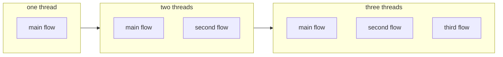
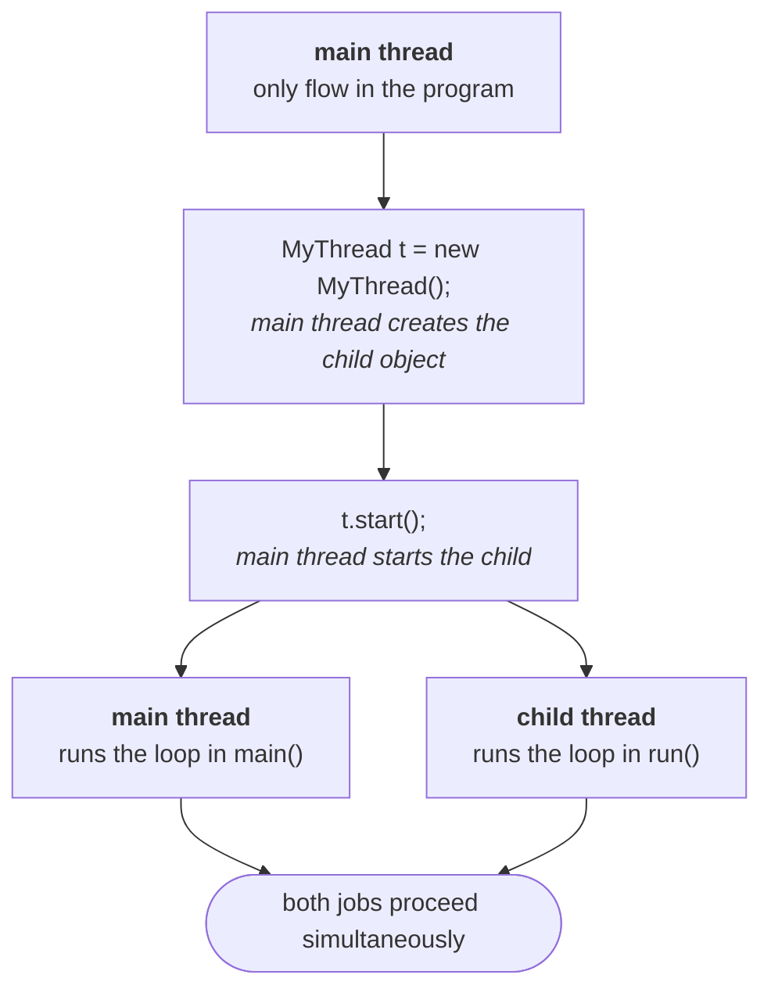
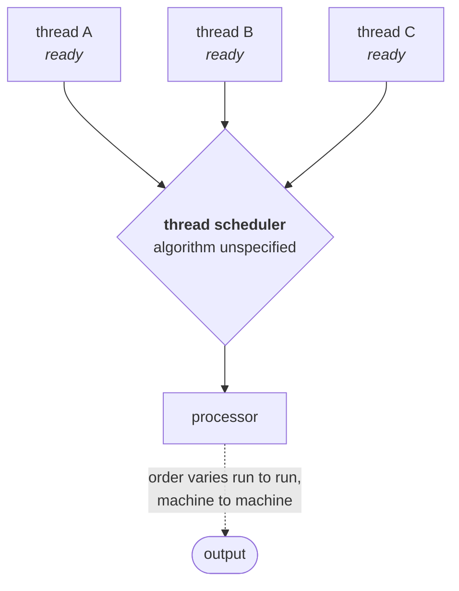
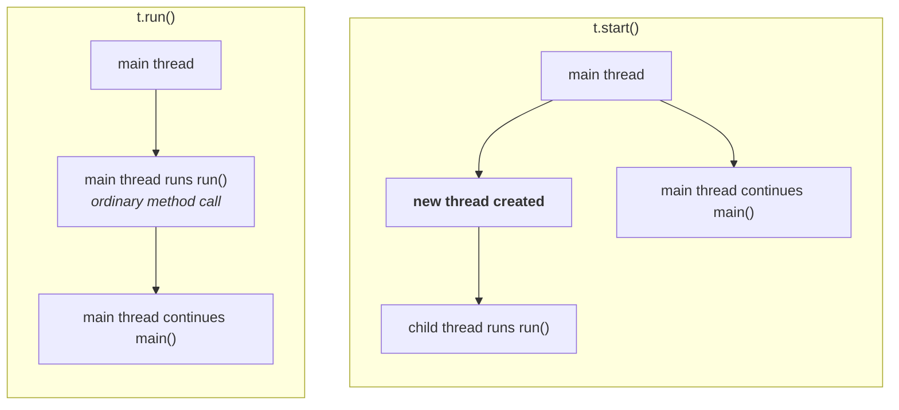
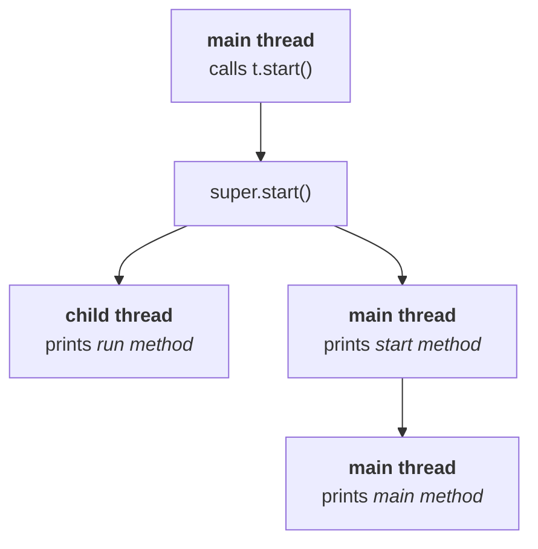
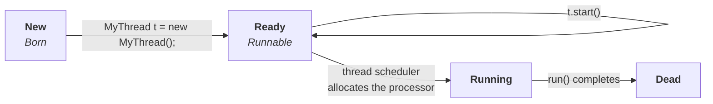
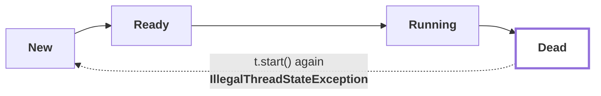

The introduction is done: multitasking, the two kinds, and why thread based multitasking is the one you program with. Now the mechanics start, and they start with a word that will be used ten thousand times over the next two days.

---

# Defining a thread by extending `Thread`

## What is a thread

Ask the question and you get a spread of answers: *a flow of execution*, *an independent job*, *a lightweight process*. All of them are in circulation, all of them are accepted, and they are pointing at the same object. For everything that follows, use this one:

> **A thread is a separate flow of execution.**

One flow means one thread. Add another flow and you have two threads. Each of those flows is running *something* — so the second half of the idea follows immediately:

> **Every thread has a job.**



Put the two halves together and the design rule from the case study falls out on its own: **two independent jobs → two threads.** Both run at once, both jobs finish inside the time one of them used to take.

---

## Two ways to define a thread

> **We can define a thread in the following two ways:**
> 1. **By extending `Thread` class**
> 2. **By implementing `Runnable` interface**

*"In how many ways can you define a thread?"* is frequently the first question asked on this topic, and the follow-up is always *which one is better*. This note does the first way. The second way, and the comparison, come next.

---

## Way 1 — extend `Thread`, override `run()`

```java
class MyThread extends Thread {
    public void run() {                       // the JOB of this thread
        for (int i = 0; i < 5; i++) {
            System.out.println("child thread");
        }
    }
}

public class Basic {
    public static void main(String[] args) {
        MyThread t = new MyThread();          // thread INSTANTIATION
        t.start();                            // STARTING the thread

        for (int i = 0; i < 5; i++) {         // job of the main thread
            System.out.println("main thread");
        }
    }
}
```

Three pieces of vocabulary come out of those few lines, and they get used precisely from here on:

| Code | Name for it |
|---|---|
| `class MyThread extends Thread` + overriding `run()` | **defining** a thread |
| whatever you write **inside** `run()` | the **job** of the thread |
| `MyThread t = new MyThread();` | thread **instantiation** |
| `t.start();` | **starting** the thread |

> [!info] **`run()` is an override, not a new method.** `Thread` already has a `run()`; you are replacing its version with yours. That detail looks pedantic right now, and then it explains three of the cases coming up.

---

## Who is executing what

This is the part to say out loud, because the wording is exactly what an interviewer wants back.

At the moment `main` begins, **how many threads exist? One — the main thread.** So:

- the main thread **creates** the child thread object
- the main thread **starts** the child thread
- **after `t.start()` there are two threads**, main and child
- the child thread executes `run()`; the main thread carries on with the rest of `main`



> [!important] **`main()` is a method. The main thread is a thread.** They are not the same thing, and the relationship between them is one-directional: the main thread is the one that *calls* `main()`. Once you separate those two words, "which thread executed this line?" becomes answerable for every line in the program.

---

## What actually comes out

Both loops run at the same time, so the output is **mixed** — and not mixed the same way twice. Five consecutive runs of exactly the program above, on JDK 25:

```
run 1 : child child child child child | main main main main main
run 2 : child main child main child main child main child main
run 3 : main child child child main main child child main main
run 4 : main main child child child child child main main main
run 5 : main main main child child child main main child child
```

Same code, same machine, same command — five different answers. That is not a bug, and Case 1 below explains exactly who is responsible.

> [!question]- If the order isn't guaranteed, how can you build anything on it?
> Because you only split work into threads **when the jobs are independent**. If the child's job doesn't read what the main thread wrote, the interleaving cannot change the result — it only changes the transcript.
>
> Turn it around and you get the rule for when *not* to use threads: **if there is a dependency between two jobs, do not run them on separate threads.** The moment order matters, you either keep them sequential or you have to impose the order deliberately — which is what `join()` and synchronization are for, later in the chapter.

---

## "Every Java program has one thread" — nearly

The statement you will be asked for is: **every Java program has at least one thread, the main thread.** That is the answer to give.

The fuller truth is that the JVM starts a handful of its own **daemon threads** alongside it. Printing every live thread at the start of the simplest possible program on JDK 25:

```
non-daemon  main
daemon      Reference Handler
daemon      Finalizer
daemon      Signal Dispatcher
daemon      Notification Thread
daemon      Common-Cleaner
```

Garbage collection is the one everybody names, but it is not alone. Daemon threads get their own note later; for now just know that "one thread" means *one thread of yours*.

---

## What has changed since this lecture

Everything above still compiles and behaves exactly as described — the cases were re-run on JDK 25 to confirm it. But **extending `Thread` has gone from "one of two ways" to "the way you should almost never pick"**, for reasons that did not exist when this was recorded.

> [!warning] **`Runnable` is a lambda now (Java 8+).** `Runnable` has a single method, so it is a functional interface, and the whole ceremony collapses to one line:
>
> ```java
> Thread t = new Thread(() -> System.out.println("child thread"));
> t.start();
> ```
>
> No subclass, no override, no separate file. When the lecture compares the two approaches in the next section, weigh this in — the `Runnable` side got dramatically lighter after this was recorded.

> [!warning] **Extending `Thread` locks you out of virtual threads (Java 21+).** Virtual threads are the modern answer to "I need thousands of concurrent jobs", and they cannot be created by subclassing:
>
> ```java
> Thread v = Thread.ofVirtual().start(() -> System.out.println("virtual"));
> ```
>
> Verified on JDK 25: a `class MyThread extends Thread` instance reports `isVirtual() == false`, always — a subclass of `Thread` is a platform thread by construction. A virtual thread's class is `java.lang.VirtualThread`, and its default name is the **empty string** rather than `Thread-0`.
>
> So the inheritance objection to extending `Thread` (you burn your one superclass slot) now has a second, sharper edge: you also give up the cheapest concurrency Java has.

> [!info] **Default names are unchanged.** `Thread.currentThread().getName()` in `main` is still `main`, and the first platform thread you create is still `Thread-0`. Both confirmed on JDK 25.

Learn the `extends Thread` form anyway — it is what gets asked, and it is what the nine cases below dissect.

---

# Cases 1 to 3 — who actually starts a thread

That nine-line program produced five different outputs above. It is now going to be taken apart case by case — **nine cases in total**, and between them they pin down everything about how `Thread` works.

The first three are all about the same question: **who actually starts a thread, and what happens if you skip them?**

---

## Case 1 — the thread scheduler

If several threads are ready to run, somebody has to pick. That somebody is the **thread scheduler**.

> **The thread scheduler is the part of the JVM responsible for scheduling threads. If multiple threads are waiting to get a chance of execution, the order in which they execute is decided by the thread scheduler.**
>
> **We cannot expect the exact algorithm the thread scheduler follows — it varies from JVM to JVM. Hence we cannot expect the thread execution order, and we cannot expect the exact output.**

It might be first-come-first-served. It might be round robin. It might be shortest job first. You do not know, and you are not supposed to write code that depends on knowing.



What follows from that is the rule for the rest of the chapter:

> [!important] **Whenever the situation comes to multithreading, there is no guarantee of the exact output — but we can state several possible outputs.**
>
> This is precisely how it is examined. A question will ask *"which of the following is a **possible** output?"* — never *"which is **the** output?"* — whenever a multithreaded program is on the paper.

For the `child thread` / `main thread` program, all of these are legal:

| # | Possible output |
|---|---|
| 1 | all five `main thread`, then all five `child thread` |
| 2 | all five `child thread`, then all five `main thread` |
| 3 | `main`, `child`, `main`, `child`, … strictly alternating |
| 4 | `child`, `main`, `child`, `main`, … alternating the other way |
| 5 | any other interleaving at all — two `main`, three `child`, one `main`, … |

**Any combination of the two lines is a possible output.** The only thing fixed is that each thread's own lines stay in its own order.

> [!warning] **"The scheduler is part of the JVM" is no longer the whole story.** When this was recorded, the sentence was already a simplification, and today it is worth stating precisely:
>
> - **Platform threads** — everything in this chapter until virtual threads appear — are mapped **one-to-one onto operating system threads**. The scheduling decision is made by the **OS scheduler**, not by the JVM. This is why the behaviour changes when you change machines, not just when you change JVMs.
> - Java *did* once schedule threads itself. Those were **green threads**, and they were dropped back in Java 1.3. (Durga's own agenda still lists "green thread" as a topic — that is how old this material's roots are.)
> - **Virtual threads (Java 21+)** bring JVM-level scheduling back: many virtual threads are multiplexed onto a small pool of carrier threads by a scheduler inside the JVM.
>
> The examinable sentence is unchanged and the *consequence* is unchanged — you cannot predict the order. Just know that for ordinary threads the decision is being made one level below the JVM.

---

## Case 2 — `t.start()` vs `t.run()`

This is one of the most asked questions in the topic, and the answer is short.

When you write `t.start()`, the JVM looks for `start()` on `MyThread`, does not find it, finds it on the parent `Thread`, and runs that. **`Thread`'s `start()` is what creates the new flow of execution**, and internally it calls your `run()`.

So what if you just call `run()` yourself and skip the middleman?

> **In the case of `t.start()`, a new thread is created, and that thread is responsible for executing `run()`.**
> **In the case of `t.run()`, no new thread is created — `run()` is executed like a normal method call by the main thread.**



Replace `t.start()` with `t.run()` in the program above and the output stops being interesting. Verified on JDK 25 — printing the executing thread's name alongside each line:

```
child thread [main]
child thread [main]
child thread [main]
main thread [main]
main thread [main]
main thread [main]
```

Every line of `run()` first, then every line of `main()`, and **the entire output produced by only the main thread**.

> [!important] **The tell is that this output is repeatable.** Run it a thousand times, on a thousand machines, and it does not move — because there is only one thread. Non-determinism is *evidence* that a second thread exists. When multithreaded code gives you the same answer every single time, suspect that you never started a thread.

---

## Case 3 — why `start()` matters

The obvious follow-up: if `run()` holds the job, why is `start()` mandatory? Why can't calling `run()` spin up a thread by itself?

### The school admission analogy

You want to put your kid into a school. What is actually involved: check which school is good, check whether admission is even available, check the distance, check the transport, then go in person, pay the fee, and complete every joining formality. Only after all of that does the school treat your kid as a valid student.

Now skip all of it. Walk your kid to the school gate, say *"this is the school, enjoy, I'll collect you at five,"* and leave.

Within half an hour you are getting a phone call from the police — and the school certainly does not consider your kid enrolled. **The kid is at the right building. None of the formalities happened.**

A thread object is in exactly that position. `new MyThread()` puts the object in existence. It does not make it a thread the system knows about.

### What `start()` actually does

> ```
> start() {
>     1. register this thread with the thread scheduler
>     2. perform all other mandatory low-level activities
>     3. invoke run()
> }
> ```

Every one of those is a formality you never write and never see. You write `t.start()` — one line — and the registration, the low-level setup, and the call into your job all happen behind it.

> **Without executing `Thread`'s `start()` method, there is no chance of starting a new thread in Java. Due to this, `start()` is considered the heart of multithreading.**

> [!important] **`start()` is the best assistant a programmer has here.** Your responsibility is one thing only: define the job inside `run()`. Everything required to make that job into a real, scheduled thread is on the other side of a single method call. If it were not, every program that wanted a thread would have to reimplement it.

> [!warning] **The "70,000 lines inside `start()`" is rhetoric — the real thing is smaller and more interesting.** Here is `Thread.start()` in full, from the JDK 25 sources shipped with the JDK on this machine:
>
> ```java
> public void start() {
>     synchronized (this) {
>         // zero status corresponds to state "NEW".
>         if (holder.threadStatus != 0)
>             throw new IllegalThreadStateException();
>         start0();
>     }
> }
>
> private native void start0();
> ```
>
> Seven lines: one state check, then a **native** call. The "mandatory activities" are real, but they live in the virtual machine's C++ code, where a genuine OS thread gets created and handed to the scheduler — not in Java at all.
>
> Two things worth taking from the actual source rather than the story:
> - the `threadStatus != 0` check is the entire mechanism behind **Case 9** (`IllegalThreadStateException`), which arrives shortly
> - `start0()` being native is *why* you cannot write it yourself. The point of the analogy survives intact; only the line count was invented.

---

# Cases 4 to 7 — breaking `run()` and `start()` on purpose

Cases 4 to 7 are all variations on one experiment: **take the two methods that matter, `run()` and `start()`, and deliberately do the wrong thing with them.** Each wrong thing produces a different, perfectly explainable output — and between them they pin down what those two methods really are.

---

## Case 4 — overloading `run()`

Overloading is legal on `run()` like any other method. Nothing stops you:

```java
class MyThread extends Thread {
    public void run() {
        System.out.println("no-arg run method");
    }
    public void run(int i) {
        System.out.println("int-arg run method");
    }
}

public class Overload {
    public static void main(String[] args) {
        new MyThread().start();
    }
}
```

Two methods, same name, different parameter lists — textbook overloading. And the output, verified on JDK 25:

```
no-arg run method
```

> **Overloading of `run()` is always possible, but `Thread`'s `start()` can only invoke the no-argument `run()`. The other overloaded methods have to be called explicitly, like a normal method call.**

> [!info] **You have seen this shape before.** Overloading `main()` is legal too, and the JVM still only ever calls `main(String[])`. Same rule, different method: **the runtime has one signature it knows about, and your extra overloads are just ordinary methods that nobody calls for you.**

---

## Case 5 — not overriding `run()` at all

```java
class MyThread extends Thread {}

public class NoOverride {
    public static void main(String[] args) {
        MyThread t = new MyThread();
        t.start();
    }
}
```

This compiles, and it starts a real thread. Trace the lookup: `t.start()` is not on `MyThread`, so `Thread`'s `start()` runs; it creates the thread and calls `run()`; `run()` is not on `MyThread` either, so **`Thread`'s own `run()` runs — and that one does nothing**.

Output, verified: nothing at all.

> **If we are not overriding `run()`, then `Thread`'s `run()` will be executed, which has an empty implementation — hence we won't get any output.**

> [!important] **It is highly recommended to override `run()`. If you don't want to, don't use multithreading at all** — a thread with no job is a thread that does nothing, at the cost of creating a thread. You have paid for the machinery and defined no work for it to do.

> [!warning] **"Empty implementation" is not quite what `Thread.run()` says today.** From the JDK 25 source:
>
> ```java
> public void run() {
>     Runnable task = holder.task;
>     if (task != null) {
>         Object bindings = scopedValueBindings();
>         runWith(bindings, task);
>     }
> }
> ```
>
> It is not empty — it **runs the `Runnable` you handed to the constructor**, if you handed one over. It only *behaves* as empty in this case because `new MyThread()` passed no target. Which is exactly the mechanism that makes the `Runnable` approach work in the first place, so this is worth holding on to for the next video rather than filing under trivia.

---

## Case 6 — overriding `start()`

Now break the important one.

```java
class MyThread extends Thread {
    public void start() {
        System.out.println("start method [" + Thread.currentThread().getName() + "]");
    }
    public void run() {
        System.out.println("run method [" + Thread.currentThread().getName() + "]");
    }
}

public class OverrideStart {
    public static void main(String[] args) {
        new MyThread().start();
        System.out.println("main method [" + Thread.currentThread().getName() + "]");
    }
}
```

`t.start()` now finds `start()` **on the child class**, so the child's version wins and `Thread`'s `start()` never runs. And `Thread`'s `start()` was the only thing that could have created a thread or called `run()`.

Verified output on JDK 25:

```
start method [main]
main method [main]
```

`run()` never executes. No thread is created. Both lines come from the main thread — which is why this output is identical on every run and every machine.

> **If we override `start()`, our `start()` will be executed just like a normal method call, and no new thread will be created.**

> [!important] **It is not recommended to override `start()`. If you do, there is no multithreading left to speak of** — you have replaced the one method that makes a thread with a method that prints something.

---

## Case 7 — overriding `start()` but calling `super.start()`

One line changes:

```java
class MyThread extends Thread {
    public void start() {
        super.start();                            // <-- the only difference
        System.out.println("start method");
    }
    public void run() {
        System.out.println("run method");
    }
}

public class SuperStart {
    public static void main(String[] args) {
        new MyThread().start();
        System.out.println("main method");
    }
}
```

`super.start()` reaches `Thread`'s `start()`, so a real thread *is* created. Now work out who executes what:



Two of the three lines — `start method` and `main method` — belong to the **main thread**, in that order. The third, `run method`, belongs to the **child thread** and can land anywhere.

That gives exactly three possible outputs:

| # | Output | Why |
|---|---|---|
| 1 | `run method` → `start method` → `main method` | child won the race immediately |
| 2 | `start method` → `run method` → `main method` | child slotted in between the main thread's two lines |
| 3 | `start method` → `main method` → `run method` | main thread finished both of its lines first |

> [!important] **`main method` before `start method` is impossible.** Those two lines are printed by the *same* thread, in the order they appear in the code. A single thread's own statements never reorder. Only the *child's* line is free to move — which is why there are three possibilities and not six.

> [!info] **Measured: all three are legal, but they are nowhere near equally likely.** Running this 40 times on JDK 25 gave `start / main / run` 39 times and `start / run / main` once. `run` first did not appear at all.
>
> Nothing is wrong with the theory — starting a thread takes long enough (a native call into the VM, then an OS thread) that the main thread almost always gets through its two `println`s first. On the slower machines this lecture was recorded on, the race was closer and all three showed up in a handful of runs.
>
> The lesson is the sharper version of Case 1: **rare is not impossible.** A race that loses 39 times out of 40 in a demo is exactly the kind that surfaces in production, on different hardware, at 3 a.m. Never conclude "the order is fine" from repeated runs — conclude it from the code.

---

# Cases 8 and 9 — the life cycle, and why it runs once

The last two cases are about a thread's **life** — the states it moves through, and what happens if you try to give it a second one.

---

## Case 8 — the life cycle of a thread

Four states, in the order your own code walks through them:



| State | You get there by | What it means |
|---|---|---|
| **New / Born** | `MyThread t = new MyThread();` | the object exists; the system knows nothing about it |
| **Ready / Runnable** | `t.start()` | *"I'm ready to run — somebody give me a turn"* |
| **Running** | the scheduler allocates the processor | `run()` is actually executing |
| **Dead** | `run()` completes | finished; and, as Case 9 shows, finished for good |

Read it as one sentence: **you create it, you start it, the scheduler picks it, it runs, it dies.**

### The one line worth borrowing

The states are named *born* and *dead* for a reason, and the lecture leans on it deliberately — the line quoted at every funeral, that **everyone who is born will one day die**, is exactly the guarantee a thread gives you:

> **Every thread that is born will, one day, enter the dead state.**

The half of the saying nobody can promise for people — *and everyone who dies will be born again* — is the half Java flatly refuses. That refusal is Case 9, and the whole reason it gets a case of its own.

> [!important] **The guarantee runs one way only.** New → dead is certain and irreversible. Dead → new never happens. Hold on to the asymmetry: every rule in the next case falls out of it.

> [!info] **A running thread does not only run.** It can call `sleep()` and enter a sleeping state, call `join()` and wait for another thread, call `wait()` and wait to be notified. Each of those is a detour out of *Running* and back again, and each one gets its own note later in this chapter. The four states above are the spine; those are the branches off it.
>
> As the lecture puts it: a person does his job, but he also does extracurricular activities — sometimes he sleeps, sometimes he joins, sometimes he yields. Same person, same life, temporary detours.

> [!warning] **Java has an actual state machine now, and it has six states, not four.** `Thread.State` (added in Java 5, readable via `t.getState()`) is what the JVM really tracks:
>
> | `Thread.State` | Maps to the diagram above |
> |---|---|
> | `NEW` | New / Born |
> | `RUNNABLE` | **Ready *and* Running merged into one** |
> | `BLOCKED` | waiting to acquire a monitor lock — arrives with synchronization |
> | `WAITING` | inside `wait()` or `join()` with no timeout |
> | `TIMED_WAITING` | inside `sleep(ms)`, `wait(ms)`, `join(ms)` |
> | `TERMINATED` | Dead |
>
> The merge is the interesting part: **the JVM does not distinguish "ready" from "running"**, because for platform threads that decision belongs to the OS scheduler and Java cannot see it. Both look like `RUNNABLE` from inside Java.
>
> Measured on JDK 25, a thread in each situation:
>
> ```
> before start        : NEW
> inside sleep(500)   : TIMED_WAITING
> inside wait()       : WAITING
> waiting for monitor : BLOCKED
> after run() returns : TERMINATED
> ```
>
> Learn the four-state diagram — it is what gets asked, and it is the right mental model. But `getState()` is the version you can actually print, and it is a real debugging tool: a thread stuck at `BLOCKED` means someone else holds a lock; stuck at `WAITING` means it is expecting a signal that may never arrive.

> [!warning] **Three life-cycle methods are effectively gone.** `Thread.stop()`, `suspend()` and `resume()` were deprecated for being unsafe, and since JDK 20 they no longer work at all — calling `t.stop()` on JDK 25 throws `UnsupportedOperationException` (verified). If older material offers them as ways to control a thread, ignore it; the modern answer is interruption and `volatile` flags.

---

## Case 9 — you cannot restart a thread

### The story the lecture tells first

Follow one kid through the education system as it is run today.

The school is chosen before he is born. The first year he is handed between a night-shift father, a day-shift mother and a grandmother, and never sees both parents at once. Year two: play school. Year three: nursery — parcelled into a bus at 7 a.m., thrown back out at 5 p.m., and asked *"what did you learn today?"* by a mother who paid three lakhs for the admission, then asked again at 8 p.m. by the father. He is three. He does not know what the question means. He gets slapped for the blank face.

Then tenth class, and the parents decide the commute is wasted time, so he goes residential — **in the same city they live in**. Woken at 4 a.m. by a watchman with a stick. 4–6 study hours, 6–7 get ready, 7–12 classes, 12–1 lunch, 1–2 on the bed whether or not sleep comes, 2–5 study hours, 5–6 get ready, 6–9 classes, 9–11 study hours. Five security staff watching him from 4 a.m. to 11 p.m.

He comes out a state ranker — 596 marks. The verdict: *"excellent, but everything so far is waste. The next two years are what matter."* So: two years of intermediate. Then long-term coaching. Then MBBS. Then MS. Then MD.

He surfaces from the books at **32**, holding a certificate, out of a life of maybe 60 years. And what he feels, looking at it, is not pride:

> *"Thirty-two years gone for this piece of paper. I don't have a single sweet memory of my childhood."*

So he writes to Brahma with one request: **re-create me. Restart my life cycle. Let me be born again and live it properly this time.**

That request is the one thing the universe does not grant — and neither does the JVM.



**A thread's life cycle starts once.** Ask for a second one and you do not get an apology, you get an exception.

### The code

A thread's life cycle runs exactly once. Try to run it twice and Java refuses.

```java
public class Restart {
    public static void main(String[] args) throws Exception {
        Thread t = new Thread(() -> System.out.println("run method"));
        t.start();                       // valid — life cycle begins
        Thread.sleep(100);
        System.out.println("state = " + t.getState());
        t.start();                       // IllegalThreadStateException
    }
}
```

Verified output on JDK 25:

```
run method
state = TERMINATED
Exception in thread "main" java.lang.IllegalThreadStateException
        at java.base/java.lang.Thread.start(Thread.java:1416)
        at Restart.main(Restart.java:7)
```

> **After starting a thread, if we try to restart the same thread, we get a runtime exception: `IllegalThreadStateException`.**

Note that it **compiles fine**. There is nothing wrong with the syntax of calling `start()` twice; the object is simply not in a state where the call means anything. It fails at runtime, which is the only place the state is known.

> [!info] **You have already seen the code that throws it.** From Case 3, this is the whole of `Thread.start()`:
>
> ```java
> public void start() {
>     synchronized (this) {
>         // zero status corresponds to state "NEW".
>         if (holder.threadStatus != 0)
>             throw new IllegalThreadStateException();
>         start0();
>     }
> }
> ```
>
> `threadStatus == 0` means `NEW`. The very first thing `start()` does is check that the thread has never been started — so the rule is not a policy bolted on somewhere, it is the first line of the method. And the check is one-way: a `TERMINATED` thread is no closer to `NEW` than a running one.

> [!important] **A dead thread stays dead. If you need the job done again, create a new thread object.** This is also the first real argument for the executor framework at the end of the chapter: if every run of a job needs a brand-new `Thread`, then a program doing that job a million times creates a million threads. Pools exist because *threads* cannot be reused, but the *workers running your tasks* can be.

---

That closes the nine cases, and with them the first way of defining a thread. Everything here came from one small class that extends `Thread` and overrides `run()`.

Next: **the second way — implementing `Runnable`** — and the question the whole comparison exists to answer: *which of the two approaches is best?*
