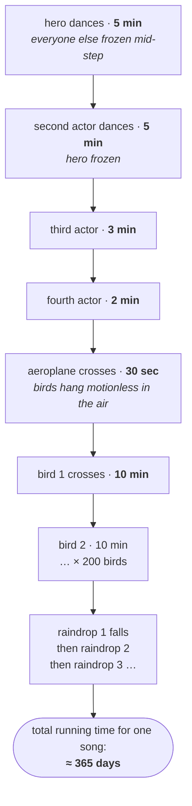
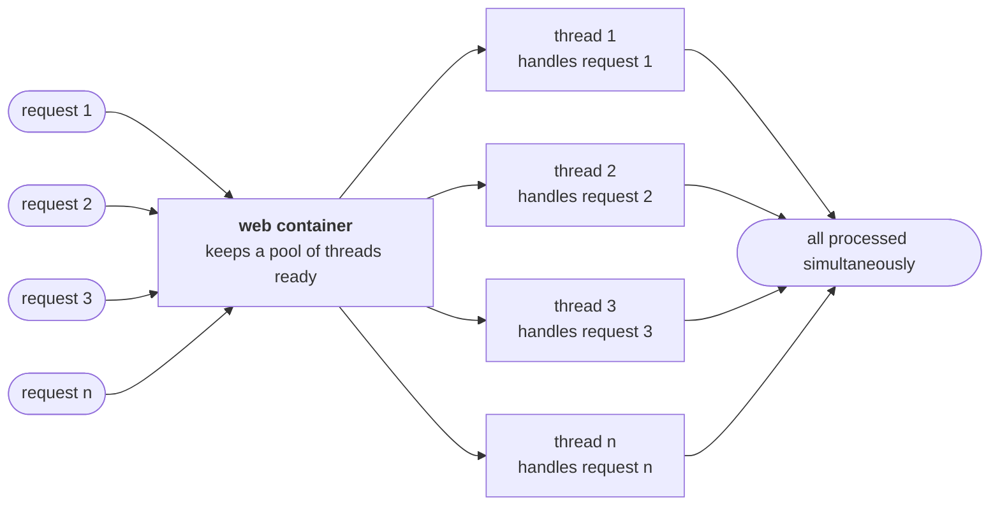

The definitions are done. The question that makes them stick is: **where would you actually reach for this?**

The best way in is not a program. It is a cinema screen.

---

## The 70 mm screen

Picture a wide theatre screen in the middle of a song sequence. Count what is happening on it:

- the hero is dancing
- three other actors are dancing alongside him
- an aeroplane is crossing the sky
- a flock of birds is flying across the frame
- it has started to rain

Five kinds of activity, all in one shot. Now impose one rule — **only one activity may happen at a time** — and watch what the film becomes.

While the hero dances, everyone else stands like a statue. The birds stop dead in mid-air. The aeroplane hangs there waiting its turn. Then, five minutes later, the next actor gets the screen and *the hero* freezes.

Two hundred birds at ten minutes each. Every raindrop queued behind the one before it. The song alone would run for the better part of a year, and the audience would tear the screen down long before the second bird made it across.

Now lift the rule. Everyone dances at once, the birds fly while the plane crosses, the rain falls through all of it — and the whole sequence takes **five minutes**.

> [!important] **Each of those activities is a thread.** Every dancer is a thread. The aeroplane is a thread. Every single bird is a thread, and so is every raindrop. Nothing about the *content* changed between the two versions — only whether the activities were allowed to run simultaneously. That difference is the difference between a five-minute song and a year-long one.

This is why animation and graphics work is the standard first example. The output *is* many independent things happening at once, so the code has to be many independent things happening at once.

---

## The application areas

Stated as a list, the way it is usually asked:

> **The main important application areas of multithreading are:**
> 1. **to develop multimedia graphics**
> 2. **to develop animations**
> 3. **to develop video games**
> 4. **to develop web servers and application servers**

| Area | The independent things running at once |
|---|---|
| Multimedia graphics | every element being drawn or moved in the frame |
| Animations | every object with its own motion — the dancer, the bird, the raindrop |
| Video games | each character, each projectile, physics, input, rendering, network |
| Web / application servers | **each incoming request** |

The first three are the same idea in different costumes. The fourth is the one you are most likely to be paid for, so it gets its own section.

---

## Servers: a thread per request

Here is the situation. You have a web server or an application server running. Requests start arriving — first request, second request, thousands more behind them.

Ask the question that the cinema example trained you to ask: **are these handled one at a time, or all at once?**

Take Gmail. Crores of users, all hitting it at once. If requests were served strictly one after another, your turn would come up sometime after your lifetime ended.

So they cannot be sequential. What happens instead:

**Every server maintains multiple threads internally.** When a request arrives, the container hands it to a thread from that pool — request 1 to thread 1, request 2 to thread 2, and so on. Those threads run simultaneously, so the requests are served simultaneously.

That is not a feature bolted on top of the server. It *is* the server. Underneath every web server and application server you have ever deployed to, the concept doing the work is multithreading.

> [!info] **The pool is finite, and its size is a number you can look up.** Tomcat ships with a bounded worker pool — the lecture quotes 60; a current Tomcat defaults to `maxThreads=200`. Either way the shape of the fact is what matters: the server can serve *that many* requests concurrently, and request number 201 waits for a thread to free up.
>
> This is worth carrying forward. "How many threads" is a **tuning decision** with a real ceiling behind it, not an infinite resource — which is exactly the problem the executor framework exists to manage, later in this chapter.
