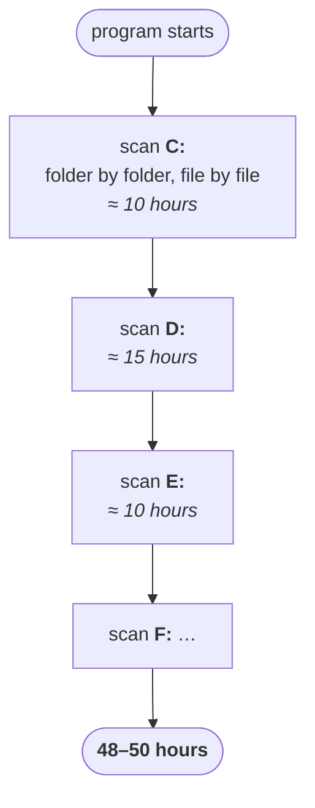
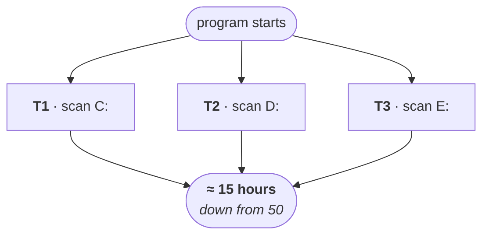
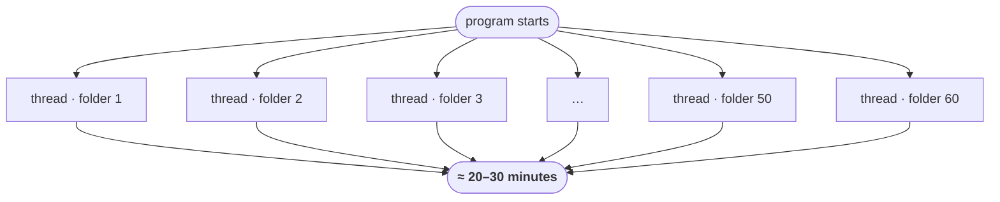

Cinema screens and Gmail are good for intuition. This one is a real freelance job, and it is the clearest demonstration of the whole idea, because the same program got made faster twice — first by a lot, then by a lot more.

---

## The requirement

A client posts a job on a freelancing site. The requirement is small enough to state in one line:

> Given a few keywords — say `SCJP` and `SCWCD` — scan **every file on the system** and print the name of every file that contains them.

Files live across `C:`, `D:`, `E:`, `F:`, in every folder, and there are lakhs of them. The client had already written the program. The problem was not correctness.

**It took 48 to 50 hours to finish.**

---

## Why it was slow

Reading their code showed the shape immediately. One flow of execution, walking everything in order:



Finish `C:` entirely. Then start `D:`. Then `E:`. Every drive queued behind the one before it.

Now apply the question from the thread based multitasking note: **why is `D:` waiting?**

Searching `C:` and searching `D:` have nothing to do with each other. `D:` is not reading a result from `C:`. It waits purely because of the order the code was written in.

---

## First fix: a thread per drive

Three independent jobs, so run them as three flows.



Fifty hours became about fifteen. Same machine, same logic, same files — the only change was that the independent jobs stopped queueing.

The client was delighted, and then immediately asked the follow-up every client asks: *fifteen hours is still too heavy. Can it go lower?*

---

## Second fix: a thread per folder

Drive level was too coarse. There were only three or four drives, so there could only ever be three or four flows — and one of them (the biggest drive) set the floor for the whole run.

So push the split down a level: **if it is a folder, give it its own thread.**



Instead of three threads, this produced fifty or sixty of them, each searching one folder. The search finished in **20 to 30 minutes**.

| Version | How the work was split | Time |
|---|---|---|
| Original | one flow, everything sequential | **48–50 hours** |
| Thread per drive | 3 flows | **≈ 15 hours** |
| Thread per folder | ~50–60 flows | **≈ 20–30 minutes** |

---

## What to take from it

The rule the case study is really teaching:

> **Wherever independent jobs exist in your application, identify them, and give each one its own thread.**

Everything else follows. Multiple threads run multiple jobs at once, total time falls, and performance improves — without changing a line of the logic that does the actual work.

The manpower version of the same arithmetic, which is how it usually gets explained:

| People on the job | Time |
|---|---|
| 1 | 10 hours |
| 2 | 5–6 hours |
| 3 | 3–4 hours |
| 10 | 1–2 hours |

> [!important] **Notice that the returns are already bending.** Ten people do not finish a ten-hour job in one hour — they finish it in one or two, and if you kept adding people the number would stop moving. The same is true of threads. The jump from 3 to 60 threads here bought a huge win because the work was **I/O bound on independent folders**; sixty threads all fighting over one CPU-bound calculation would not have.

> [!info] **And spawning a thread per folder by hand is not what you would write today.** A folder tree with ten thousand directories would create ten thousand threads, and each one costs real memory and real scheduling. The modern shape of this exact program is a fixed **thread pool** that you hand ten thousand *tasks* to — which is what the executor framework at the end of this chapter is for. The insight (find the independent jobs) is unchanged; only the machinery for running them has improved.

---

## Java's built-in support

One last point before the mechanics start, because it explains why this chapter is shorter than it would be in another language.

> **When compared with older languages, developing multithreaded applications in Java is very easy, because Java provides in-built support for multithreading with a rich API.**

The split is roughly:

| Who does the work | Share |
|---|---|
| Java API | **90%** |
| You | **10%** |

Take the most basic operation in the whole topic — starting a thread. What do you write?

```java
t.start();
```

That is your entire contribution. Registering the thread with the thread scheduler, all the low-level bookkeeping underneath it, and finally invoking `run()` — none of that is yours to implement. It already exists behind that one method call.

> [!important] **You are responsible for defining the job. The API is responsible for running it.** Your 10% is the code inside `run()` — what this thread should actually do. The other 90% is machinery you invoke rather than write. This is exactly the trade you make everywhere in Java, but it is starker here than anywhere else, because the machinery you are skipping is genuinely difficult.

The rich API in question:

| Type | What it is |
|---|---|
| `Thread` | the class representing a thread |
| `Runnable` | the interface representing a job that a thread can run |
| `ThreadGroup` | a group of threads managed together |
| `ThreadLocal` | per-thread storage |
| … | and more, all in `java.lang` |

That is the introduction complete: what multitasking is, the two kinds, what a thread is, why you would want one, and where they get used.

Next comes the first real mechanic, and the question that opens most interviews on this topic: **in how many ways can you define a thread?**
