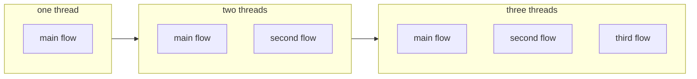
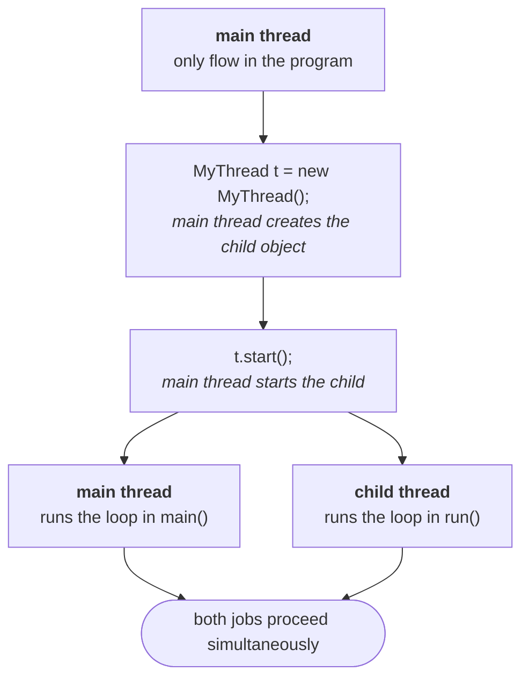

The introduction is done: multitasking, the two kinds, and why thread based multitasking is the one you program with. Now the mechanics start, and they start with a word that will be used ten thousand times over the next two days.

---

## What is a thread

Ask the question and you get a spread of answers: *a flow of execution*, *an independent job*, *a lightweight process*. All of them are in circulation, all of them are accepted, and they are pointing at the same object. For everything that follows, use this one:

> **A thread is a separate flow of execution.**

One flow means one thread. Add another flow and you have two threads. Each of those flows is running *something* — so the second half of the idea follows immediately:

> **Every thread has a job.**



Put the two halves together and the design rule from the case study falls out on its own: **two independent jobs → two threads.** Both run at once, both jobs finish inside the time one of them used to take.

---

## Two ways to define a thread

> **We can define a thread in the following two ways:**
> 1. **By extending `Thread` class**
> 2. **By implementing `Runnable` interface**

*"In how many ways can you define a thread?"* is frequently the first question asked on this topic, and the follow-up is always *which one is better*. This note does the first way. The second way, and the comparison, come next.

---

## Way 1 — extend `Thread`, override `run()`

```java
class MyThread extends Thread {
    public void run() {                       // the JOB of this thread
        for (int i = 0; i < 5; i++) {
            System.out.println("child thread");
        }
    }
}

public class Basic {
    public static void main(String[] args) {
        MyThread t = new MyThread();          // thread INSTANTIATION
        t.start();                            // STARTING the thread

        for (int i = 0; i < 5; i++) {         // job of the main thread
            System.out.println("main thread");
        }
    }
}
```

Three pieces of vocabulary come out of those few lines, and they get used precisely from here on:

| Code | Name for it |
|---|---|
| `class MyThread extends Thread` + overriding `run()` | **defining** a thread |
| whatever you write **inside** `run()` | the **job** of the thread |
| `MyThread t = new MyThread();` | thread **instantiation** |
| `t.start();` | **starting** the thread |

> [!info] **`run()` is an override, not a new method.** `Thread` already has a `run()`; you are replacing its version with yours. That detail looks pedantic right now, and then it explains three of the cases coming up.

---

## Who is executing what

This is the part to say out loud, because the wording is exactly what an interviewer wants back.

At the moment `main` begins, **how many threads exist? One — the main thread.** So:

- the main thread **creates** the child thread object
- the main thread **starts** the child thread
- **after `t.start()` there are two threads**, main and child
- the child thread executes `run()`; the main thread carries on with the rest of `main`



> [!important] **`main()` is a method. The main thread is a thread.** They are not the same thing, and the relationship between them is one-directional: the main thread is the one that *calls* `main()`. Once you separate those two words, "which thread executed this line?" becomes answerable for every line in the program.

---

## What actually comes out

Both loops run at the same time, so the output is **mixed** — and not mixed the same way twice. Five consecutive runs of exactly the program above, on JDK 25:

```
run 1 : child child child child child | main main main main main
run 2 : child main child main child main child main child main
run 3 : main child child child main main child child main main
run 4 : main main child child child child child main main main
run 5 : main main main child child child main main child child
```

Same code, same machine, same command — five different answers. That is not a bug, and the next note explains exactly who is responsible.

> [!question]- If the order isn't guaranteed, how can you build anything on it?
> Because you only split work into threads **when the jobs are independent**. If the child's job doesn't read what the main thread wrote, the interleaving cannot change the result — it only changes the transcript.
>
> Turn it around and you get the rule for when *not* to use threads: **if there is a dependency between two jobs, do not run them on separate threads.** The moment order matters, you either keep them sequential or you have to impose the order deliberately — which is what `join()` and synchronization are for, later in the chapter.

---

## "Every Java program has one thread" — nearly

The statement you will be asked for is: **every Java program has at least one thread, the main thread.** That is the answer to give.

The fuller truth is that the JVM starts a handful of its own **daemon threads** alongside it. Printing every live thread at the start of the simplest possible program on JDK 25:

```
non-daemon  main
daemon      Reference Handler
daemon      Finalizer
daemon      Signal Dispatcher
daemon      Notification Thread
daemon      Common-Cleaner
```

Garbage collection is the one everybody names, but it is not alone. Daemon threads get their own note later; for now just know that "one thread" means *one thread of yours*.

---

## What has changed since this lecture

Everything above still compiles and behaves exactly as described — the cases were re-run on JDK 25 to confirm it. But **extending `Thread` has gone from "one of two ways" to "the way you should almost never pick"**, for reasons that did not exist when this was recorded.

> [!warning] **`Runnable` is a lambda now (Java 8+).** `Runnable` has a single method, so it is a functional interface, and the whole ceremony collapses to one line:
>
> ```java
> Thread t = new Thread(() -> System.out.println("child thread"));
> t.start();
> ```
>
> No subclass, no override, no separate file. When the lecture compares the two approaches in the next section, weigh this in — the `Runnable` side got dramatically lighter after this was recorded.

> [!warning] **Extending `Thread` locks you out of virtual threads (Java 21+).** Virtual threads are the modern answer to "I need thousands of concurrent jobs", and they cannot be created by subclassing:
>
> ```java
> Thread v = Thread.ofVirtual().start(() -> System.out.println("virtual"));
> ```
>
> Verified on JDK 25: a `class MyThread extends Thread` instance reports `isVirtual() == false`, always — a subclass of `Thread` is a platform thread by construction. A virtual thread's class is `java.lang.VirtualThread`, and its default name is the **empty string** rather than `Thread-0`.
>
> So the inheritance objection to extending `Thread` (you burn your one superclass slot) now has a second, sharper edge: you also give up the cheapest concurrency Java has.

> [!info] **Default names are unchanged.** `Thread.currentThread().getName()` in `main` is still `main`, and the first platform thread you create is still `Thread-0`. Both confirmed on JDK 25.

Learn the `extends Thread` form anyway — it is what gets asked, it is what the next nine cases dissect, and every one of those cases teaches something about how `Thread` actually works.
