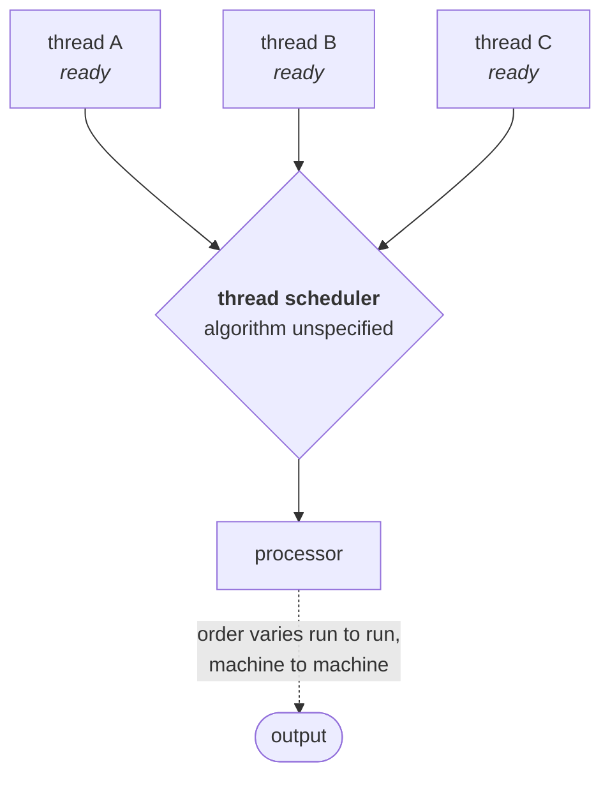
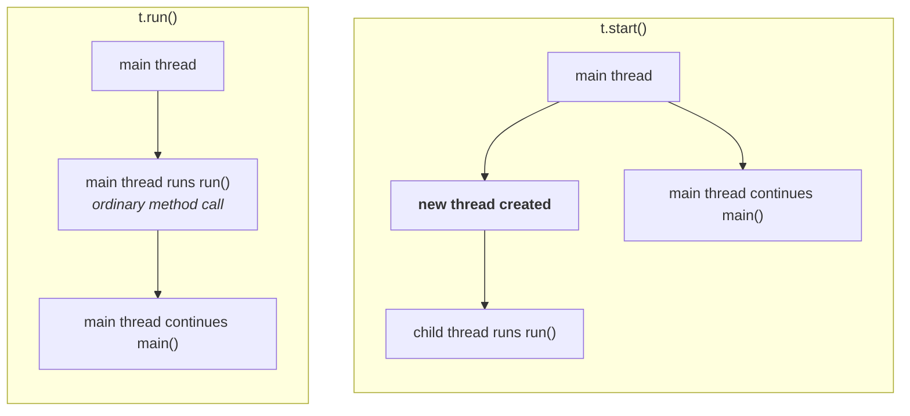

One nine-line program produced five different outputs in the previous note. That program is now going to be taken apart case by case — nine cases in total, spread over this note and the next two. The first three are all about the same question: **who actually starts a thread, and what happens if you skip them?**

---

## Case 1 — the thread scheduler

If several threads are ready to run, somebody has to pick. That somebody is the **thread scheduler**.

> **The thread scheduler is the part of the JVM responsible for scheduling threads. If multiple threads are waiting to get a chance of execution, the order in which they execute is decided by the thread scheduler.**
>
> **We cannot expect the exact algorithm the thread scheduler follows — it varies from JVM to JVM. Hence we cannot expect the thread execution order, and we cannot expect the exact output.**

It might be first-come-first-served. It might be round robin. It might be shortest job first. You do not know, and you are not supposed to write code that depends on knowing.



What follows from that is the rule for the rest of the chapter:

> [!important] **Whenever the situation comes to multithreading, there is no guarantee of the exact output — but we can state several possible outputs.**
>
> This is precisely how it is examined. A question will ask *"which of the following is a **possible** output?"* — never *"which is **the** output?"* — whenever a multithreaded program is on the paper.

For the `child thread` / `main thread` program, all of these are legal:

| # | Possible output |
|---|---|
| 1 | all five `main thread`, then all five `child thread` |
| 2 | all five `child thread`, then all five `main thread` |
| 3 | `main`, `child`, `main`, `child`, … strictly alternating |
| 4 | `child`, `main`, `child`, `main`, … alternating the other way |
| 5 | any other interleaving at all — two `main`, three `child`, one `main`, … |

**Any combination of the two lines is a possible output.** The only thing fixed is that each thread's own lines stay in its own order.

> [!warning] **"The scheduler is part of the JVM" is no longer the whole story.** When this was recorded, the sentence was already a simplification, and today it is worth stating precisely:
>
> - **Platform threads** — everything in this chapter until virtual threads appear — are mapped **one-to-one onto operating system threads**. The scheduling decision is made by the **OS scheduler**, not by the JVM. This is why the behaviour changes when you change machines, not just when you change JVMs.
> - Java *did* once schedule threads itself. Those were **green threads**, and they were dropped back in Java 1.3. (Durga's own agenda still lists "green thread" as a topic — that is how old this material's roots are.)
> - **Virtual threads (Java 21+)** bring JVM-level scheduling back: many virtual threads are multiplexed onto a small pool of carrier threads by a scheduler inside the JVM.
>
> The examinable sentence is unchanged and the *consequence* is unchanged — you cannot predict the order. Just know that for ordinary threads the decision is being made one level below the JVM.

---

## Case 2 — `t.start()` vs `t.run()`

This is one of the most asked questions in the topic, and the answer is short.

When you write `t.start()`, the JVM looks for `start()` on `MyThread`, does not find it, finds it on the parent `Thread`, and runs that. **`Thread`'s `start()` is what creates the new flow of execution**, and internally it calls your `run()`.

So what if you just call `run()` yourself and skip the middleman?

> **In the case of `t.start()`, a new thread is created, and that thread is responsible for executing `run()`.**
> **In the case of `t.run()`, no new thread is created — `run()` is executed like a normal method call by the main thread.**



Replace `t.start()` with `t.run()` in the program from the last note and the output stops being interesting. Verified on JDK 25 — printing the executing thread's name alongside each line:

```
child thread [main]
child thread [main]
child thread [main]
main thread [main]
main thread [main]
main thread [main]
```

Every line of `run()` first, then every line of `main()`, and **the entire output produced by only the main thread**.

> [!important] **The tell is that this output is repeatable.** Run it a thousand times, on a thousand machines, and it does not move — because there is only one thread. Non-determinism is *evidence* that a second thread exists. When multithreaded code gives you the same answer every single time, suspect that you never started a thread.

---

## Case 3 — why `start()` matters

The obvious follow-up: if `run()` holds the job, why is `start()` mandatory? Why can't calling `run()` spin up a thread by itself?

### The school admission analogy

You want to put your kid into a school. What is actually involved: check which school is good, check whether admission is even available, check the distance, check the transport, then go in person, pay the fee, and complete every joining formality. Only after all of that does the school treat your kid as a valid student.

Now skip all of it. Walk your kid to the school gate, say *"this is the school, enjoy, I'll collect you at five,"* and leave.

Within half an hour you are getting a phone call from the police — and the school certainly does not consider your kid enrolled. **The kid is at the right building. None of the formalities happened.**

A thread object is in exactly that position. `new MyThread()` puts the object in existence. It does not make it a thread the system knows about.

### What `start()` actually does

> ```
> start() {
>     1. register this thread with the thread scheduler
>     2. perform all other mandatory low-level activities
>     3. invoke run()
> }
> ```

Every one of those is a formality you never write and never see. You write `t.start()` — one line — and the registration, the low-level setup, and the call into your job all happen behind it.

> **Without executing `Thread`'s `start()` method, there is no chance of starting a new thread in Java. Due to this, `start()` is considered the heart of multithreading.**

> [!important] **`start()` is the best assistant a programmer has here.** Your responsibility is one thing only: define the job inside `run()`. Everything required to make that job into a real, scheduled thread is on the other side of a single method call. If it were not, every program that wanted a thread would have to reimplement it.

> [!warning] **The "70,000 lines inside `start()`" is rhetoric — the real thing is smaller and more interesting.** Here is `Thread.start()` in full, from the JDK 25 sources shipped with the JDK on this machine:
>
> ```java
> public void start() {
>     synchronized (this) {
>         // zero status corresponds to state "NEW".
>         if (holder.threadStatus != 0)
>             throw new IllegalThreadStateException();
>         start0();
>     }
> }
>
> private native void start0();
> ```
>
> Seven lines: one state check, then a **native** call. The "mandatory activities" are real, but they live in the virtual machine's C++ code, where a genuine OS thread gets created and handed to the scheduler — not in Java at all.
>
> Two things worth taking from the actual source rather than the story:
> - the `threadStatus != 0` check is the entire mechanism behind **Case 9** (`IllegalThreadStateException`), which arrives shortly
> - `start0()` being native is *why* you cannot write it yourself. The point of the analogy survives intact; only the line count was invented.
