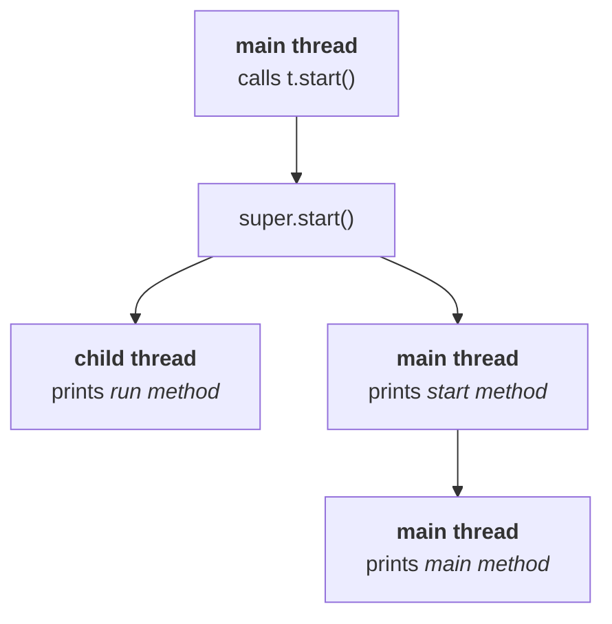

Cases 4 to 7 are all variations on one experiment: **take the two methods that matter, `run()` and `start()`, and deliberately do the wrong thing with them.** Each wrong thing produces a different, perfectly explainable output — and between them they pin down what those two methods really are.

---

## Case 4 — overloading `run()`

Overloading is legal on `run()` like any other method. Nothing stops you:

```java
class MyThread extends Thread {
    public void run() {
        System.out.println("no-arg run method");
    }
    public void run(int i) {
        System.out.println("int-arg run method");
    }
}

public class Overload {
    public static void main(String[] args) {
        new MyThread().start();
    }
}
```

Two methods, same name, different parameter lists — textbook overloading. And the output, verified on JDK 25:

```
no-arg run method
```

> **Overloading of `run()` is always possible, but `Thread`'s `start()` can only invoke the no-argument `run()`. The other overloaded methods have to be called explicitly, like a normal method call.**

> [!info] **You have seen this shape before.** Overloading `main()` is legal too, and the JVM still only ever calls `main(String[])`. Same rule, different method: **the runtime has one signature it knows about, and your extra overloads are just ordinary methods that nobody calls for you.**

---

## Case 5 — not overriding `run()` at all

```java
class MyThread extends Thread {}

public class NoOverride {
    public static void main(String[] args) {
        MyThread t = new MyThread();
        t.start();
    }
}
```

This compiles, and it starts a real thread. Trace the lookup: `t.start()` is not on `MyThread`, so `Thread`'s `start()` runs; it creates the thread and calls `run()`; `run()` is not on `MyThread` either, so **`Thread`'s own `run()` runs — and that one does nothing**.

Output, verified: nothing at all.

> **If we are not overriding `run()`, then `Thread`'s `run()` will be executed, which has an empty implementation — hence we won't get any output.**

> [!important] **It is highly recommended to override `run()`. If you don't want to, don't use multithreading at all** — a thread with no job is a thread that does nothing, at the cost of creating a thread. You have paid for the machinery and defined no work for it to do.

> [!warning] **"Empty implementation" is not quite what `Thread.run()` says today.** From the JDK 25 source:
>
> ```java
> public void run() {
>     Runnable task = holder.task;
>     if (task != null) {
>         Object bindings = scopedValueBindings();
>         runWith(bindings, task);
>     }
> }
> ```
>
> It is not empty — it **runs the `Runnable` you handed to the constructor**, if you handed one over. It only *behaves* as empty in this case because `new MyThread()` passed no target. Which is exactly the mechanism that makes the `Runnable` approach work in the first place, so this is worth holding on to for the next note rather than filing under trivia.

---

## Case 6 — overriding `start()`

Now break the important one.

```java
class MyThread extends Thread {
    public void start() {
        System.out.println("start method [" + Thread.currentThread().getName() + "]");
    }
    public void run() {
        System.out.println("run method [" + Thread.currentThread().getName() + "]");
    }
}

public class OverrideStart {
    public static void main(String[] args) {
        new MyThread().start();
        System.out.println("main method [" + Thread.currentThread().getName() + "]");
    }
}
```

`t.start()` now finds `start()` **on the child class**, so the child's version wins and `Thread`'s `start()` never runs. And `Thread`'s `start()` was the only thing that could have created a thread or called `run()`.

Verified output on JDK 25:

```
start method [main]
main method [main]
```

`run()` never executes. No thread is created. Both lines come from the main thread — which is why this output is identical on every run and every machine.

> **If we override `start()`, our `start()` will be executed just like a normal method call, and no new thread will be created.**

> [!important] **It is not recommended to override `start()`. If you do, there is no multithreading left to speak of** — you have replaced the one method that makes a thread with a method that prints something.

---

## Case 7 — overriding `start()` but calling `super.start()`

One line changes:

```java
class MyThread extends Thread {
    public void start() {
        super.start();                            // <-- the only difference
        System.out.println("start method");
    }
    public void run() {
        System.out.println("run method");
    }
}

public class SuperStart {
    public static void main(String[] args) {
        new MyThread().start();
        System.out.println("main method");
    }
}
```

`super.start()` reaches `Thread`'s `start()`, so a real thread *is* created. Now work out who executes what:



Two of the three lines — `start method` and `main method` — belong to the **main thread**, in that order. The third, `run method`, belongs to the **child thread** and can land anywhere.

That gives exactly three possible outputs:

| # | Output | Why |
|---|---|---|
| 1 | `run method` → `start method` → `main method` | child won the race immediately |
| 2 | `start method` → `run method` → `main method` | child slotted in between the main thread's two lines |
| 3 | `start method` → `main method` → `run method` | main thread finished both of its lines first |

> [!important] **`main method` before `start method` is impossible.** Those two lines are printed by the *same* thread, in the order they appear in the code. A single thread's own statements never reorder. Only the *child's* line is free to move — which is why there are three possibilities and not six.

> [!info] **Measured: all three are legal, but they are nowhere near equally likely.** Running this 40 times on JDK 25 gave `start / main / run` 39 times and `start / run / main` once. `run` first did not appear at all.
>
> Nothing is wrong with the theory — starting a thread takes long enough (a native call into the VM, then an OS thread) that the main thread almost always gets through its two `println`s first. On the slower machines this lecture was recorded on, the race was closer and all three showed up in a handful of runs.
>
> The lesson is the sharper version of Case 1: **rare is not impossible.** A race that loses 39 times out of 40 in a demo is exactly the kind that surfaces in production, on different hardware, at 3 a.m. Never conclude "the order is fine" from repeated runs — conclude it from the code.
