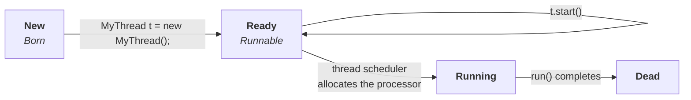

The last two cases are about a thread's **life** — the states it moves through, and what happens if you try to give it a second one.

---

## Case 8 — the life cycle of a thread

Four states, in the order your own code walks through them:



| State | You get there by | What it means |
|---|---|---|
| **New / Born** | `MyThread t = new MyThread();` | the object exists; the system knows nothing about it |
| **Ready / Runnable** | `t.start()` | *"I'm ready to run — somebody give me a turn"* |
| **Running** | the scheduler allocates the processor | `run()` is actually executing |
| **Dead** | `run()` completes | finished; and, as Case 9 shows, finished for good |

Read it as one sentence: **you create it, you start it, the scheduler picks it, it runs, it dies.**

> [!info] **A running thread does not only run.** It can call `sleep()` and enter a sleeping state, call `join()` and wait for another thread, call `wait()` and wait to be notified. Each of those is a detour out of *Running* and back again, and each one gets its own note later in this chapter. The four states above are the spine; those are the branches off it.

> [!warning] **Java has an actual state machine now, and it has six states, not four.** `Thread.State` (added in Java 5, readable via `t.getState()`) is what the JVM really tracks:
>
> | `Thread.State` | Maps to the diagram above |
> |---|---|
> | `NEW` | New / Born |
> | `RUNNABLE` | **Ready *and* Running merged into one** |
> | `BLOCKED` | waiting to acquire a monitor lock — arrives with synchronization |
> | `WAITING` | inside `wait()` or `join()` with no timeout |
> | `TIMED_WAITING` | inside `sleep(ms)`, `wait(ms)`, `join(ms)` |
> | `TERMINATED` | Dead |
>
> The merge is the interesting part: **the JVM does not distinguish "ready" from "running"**, because for platform threads that decision belongs to the OS scheduler and Java cannot see it. Both look like `RUNNABLE` from inside Java.
>
> Measured on JDK 25, a thread in each situation:
>
> ```
> before start        : NEW
> inside sleep(500)   : TIMED_WAITING
> inside wait()       : WAITING
> waiting for monitor : BLOCKED
> after run() returns : TERMINATED
> ```
>
> Learn the four-state diagram — it is what gets asked, and it is the right mental model. But `getState()` is the version you can actually print, and it is a real debugging tool: a thread stuck at `BLOCKED` means someone else holds a lock; stuck at `WAITING` means it is expecting a signal that may never arrive.

> [!warning] **Three life-cycle methods are effectively gone.** `Thread.stop()`, `suspend()` and `resume()` were deprecated for being unsafe, and since JDK 20 they no longer work at all — calling `t.stop()` on JDK 25 throws `UnsupportedOperationException` (verified). If older material offers them as ways to control a thread, ignore it; the modern answer is interruption and `volatile` flags.

---

## Case 9 — you cannot restart a thread

A thread's life cycle runs exactly once. Try to run it twice and Java refuses.

```java
public class Restart {
    public static void main(String[] args) throws Exception {
        Thread t = new Thread(() -> System.out.println("run method"));
        t.start();                       // valid — life cycle begins
        Thread.sleep(100);
        System.out.println("state = " + t.getState());
        t.start();                       // IllegalThreadStateException
    }
}
```

Verified output on JDK 25:

```
run method
state = TERMINATED
Exception in thread "main" java.lang.IllegalThreadStateException
        at java.base/java.lang.Thread.start(Thread.java:1416)
        at Restart.main(Restart.java:7)
```

> **After starting a thread, if we try to restart the same thread, we get a runtime exception: `IllegalThreadStateException`.**

Note that it **compiles fine**. There is nothing wrong with the syntax of calling `start()` twice; the object is simply not in a state where the call means anything. It fails at runtime, which is the only place the state is known.

> [!info] **You have already seen the code that throws it.** From Case 3, this is the whole of `Thread.start()`:
>
> ```java
> public void start() {
>     synchronized (this) {
>         // zero status corresponds to state "NEW".
>         if (holder.threadStatus != 0)
>             throw new IllegalThreadStateException();
>         start0();
>     }
> }
> ```
>
> `threadStatus == 0` means `NEW`. The very first thing `start()` does is check that the thread has never been started — so the rule is not a policy bolted on somewhere, it is the first line of the method. And the check is one-way: a `TERMINATED` thread is no closer to `NEW` than a running one.

> [!important] **A dead thread stays dead. If you need the job done again, create a new thread object.** This is also the first real argument for the executor framework at the end of the chapter: if every run of a job needs a brand-new `Thread`, then a program doing that job a million times creates a million threads. Pools exist because *threads* cannot be reused, but the *workers running your tasks* can be.

---

That closes the nine cases, and with them the first way of defining a thread. Everything here came from one small class that extends `Thread` and overrides `run()`.

Next: **the second way — implementing `Runnable`** — and the question the whole comparison exists to answer: *which of the two approaches is best?*
