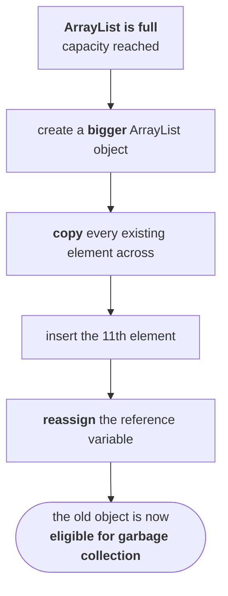

# Why collections exist

```java
int x = 10;
```

**One variable holds one value.** Two values, two variables. Three values, three variables.

**Now ten thousand values.** Can you declare ten thousand variables?

## Step one — arrays

> **An array is an indexed collection of a fixed number of homogeneous data elements.**

```java
int[] x = new int[10000];
```

**One reference variable now represents ten thousand values**, and they are told apart by index — the first at index 0, the second at index 1. **Readability is restored.**

> **The main advantage of an array is that we can represent a huge number of elements using a single variable, so the readability of the code is improved.**

That is a genuine advantage. But arrays have their own limits

---

# The limitations of arrays

## 1 — Arrays are fixed in size

> **Once we create an array there is no chance of increasing or decreasing the size based on our requirement. Hence, to use arrays we must know the size in advance — which may not be possible always.**

## 2 — Arrays can hold only homogeneous elements

```java
Student[] s = new Student[10000];
s[0] = new Student();      // ✅ valid
s[1] = new Customer();     // ❌ compile-time error
```

Measured on JDK 25:

```
error: incompatible types: Customer cannot be converted to Student
```

**This one has a workaround** — use an `Object[]`:

```java
Object[] o = new Object[10000];
o[0] = new Student();      // ✅
o[1] = new Customer();     // ✅
```

Both valid, because everything is an `Object`. Verified on JDK 25.

> [!info] **Notice this is the same manoeuvre `GENERICS/01` complains about.** Using `Object[]` to get heterogeneity is exactly what costs you type safety — the compiler can no longer stop you from putting a `Customer` where the code expects a `Student`, so the failure moves from compile time to runtime. **The workaround solves one problem by creating another**, which is why generics eventually arrived.

## 3 — No underlying data structure

The subtlest limitation, and the one that motivates the whole framework.

> **The array concept is not implemented based on some standard data structure, and hence ready-made method support is not available.
>  For every requirement we have to write the code explicitly, which increases the complexity of programming.**

**Want to search an array?** You write the search logic. **Want it sorted?** You write the sort logic. **Insert in the middle?** You write the shifting.

---

# Collections

> **To overcome the above problems of arrays, we should go for the collections concept.**

Each limitation, answered in order:

| | Arrays | Collections |
|---|---|---|
| **1** | fixed in size | **growable in nature** — increase **or** decrease based on requirement |
| **2** | only **homogeneous** elements | **both homogeneous and heterogeneous** |
| **3** | no underlying data structure → **no ready-made methods** | **every collection class is implemented on a standard data structure** → ready-made methods |

---

# So which one should you use?

Having spent half an hour on the advantages of collections, he stops and reverses the question.

> [!important] **Don't feel that collections are always the hero and arrays are always the villain.** There are cases where the array is the hero. **Arrays are highly recommended in some situations** — and knowing which is the actual interview answer.

> **There is a universal rule: if we want something, we should miss something. For every advantage there is some disadvantage also.**

**What do collections give you?** Growable nature. **What do you pay for it?** Performance.

## Why growth costs

```java
ArrayList l = new ArrayList();     // default capacity 10
```

Ten objects fit. Now add the eleventh:



> This much story, just to add one element.

**With 10 elements, copying 10 is no big deal.** Now scale it:

> **Suppose the current `ArrayList` contains one crore elements and I want to insert the one crore and first.** To insert one element, one crore elements must be copied.

> If you tell it today 'please insert one crore and one element', maybe after 10 years the `ArrayList` is going to tell you 'successfully inserted'.

**The growable nature is not free.** It is a job that happens automatically, and it affects the performance of the system.

---

# The comparison table

The deliverable of the session.

| | Arrays | Collections |
|---|---|---|
| **1. Size** | **fixed** — cannot increase or decrease | **growable** in nature |
| **2. Memory** | **not** recommended | **recommended** |
| **3. Performance** | **recommended** | **not** recommended |
| **4. Element types** | only **homogeneous** | **homogeneous and heterogeneous** |
| **5. Data structure** | **none** → no ready-made methods → more code, more complexity | **standard data structure** → ready-made method support |
| **6. What they hold** | **primitives and objects** | **objects only** |

> **Wherever memory is critical, better to go for collections. Wherever performance is critical, better to go for arrays.**

## Row 6, measured

```java
int[] prim = new int[3];              // ✅ primitives
ArrayList<Integer> l = new ArrayList<>();
l.add(10);                            // autoboxed to Integer
```

Verified on JDK 25: `l.get(0).getClass()` reports **`Integer`**, not `int`.

> [!info] **Autoboxing hides this, but does not change it.** `l.add(10)` looks like storing a primitive; the compiler inserts `Integer.valueOf(10)` and stores an object — exactly the mechanism from `JAVA-LANG-PACKAGE/10`. **The rule that collections hold only objects has never changed**; the compiler just stopped making you say so.

## Row 2 needs care — and this is where the measurement bites

**The claim memory-wise collections are recommended is about waste from over-allocation**, and in that sense it is right: an array of 10,000 slots holding 100 elements wastes 9,900 slots, while a collection grows to fit what you actually have.

**But for the same number of elements, a collection uses far more memory, not less.** Measured on JDK 25 with a 1 GB heap:

```
int[2,000,000]                 =  8,192 KB
ArrayList<Integer>, same data  = 39,500 KB
                        ratio  =  4.8x
```

> [!important] **A collection of boxed integers costs roughly five times a primitive array of the same data**, because each element is a separate `Integer` object with its own header, and the array stores a **reference** to it rather than the value.
>
> **So state row 2 precisely:** collections avoid the waste of guessing a size too large; primitive arrays are far more compact for the same data. **Both are true, and they are about different things.** If an interviewer pushes on `memory`, that distinction is the answer that shows you have measured it. This is also why the primitive-specialised types exist — `IntStream`, and `int[]` itself — and why libraries for numeric work avoid `List<Integer>` entirely.

---

# What this part established

| | |
|---|---|
| Why not many variables | **readability** collapses at scale |
| An array is | an **indexed collection of a fixed number of homogeneous elements** |
| Array advantage | huge number of elements, **one variable**, better readability |
| Array limitation 1 | **fixed in size** — must know the size in advance |
| Array limitation 2 | **homogeneous only** — `Object[]` works around it, at the cost of **type safety** |
| Array limitation 3 | **no underlying data structure** → no ready-made methods → you write everything |
| Collections fix | growable · heterogeneous · **standard data structures with ready-made methods** |
| The universal rule | **for every advantage there is a disadvantage** |
| What growth costs | create bigger object → **copy everything** → reassign → old object becomes garbage |
| At one crore elements | one insertion copies **one crore** elements |
| **Memory critical** | → **collections** (no over-allocation waste) |
| **Performance critical** | → **arrays** |
| Arrays hold | **primitives and objects** |
| Collections hold | **objects only** — autoboxing hides it, does not change it |
| Measured memory, same data | `int[]` **8 MB** vs `ArrayList<Integer>` **39 MB** — **4.8×** |
