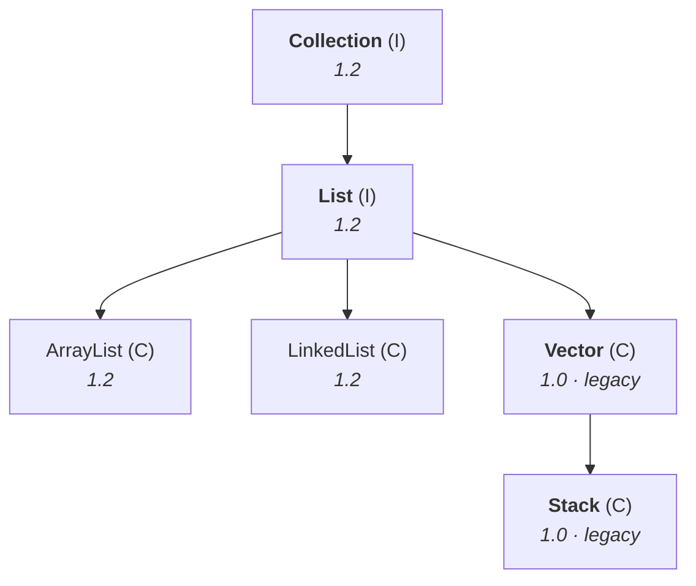
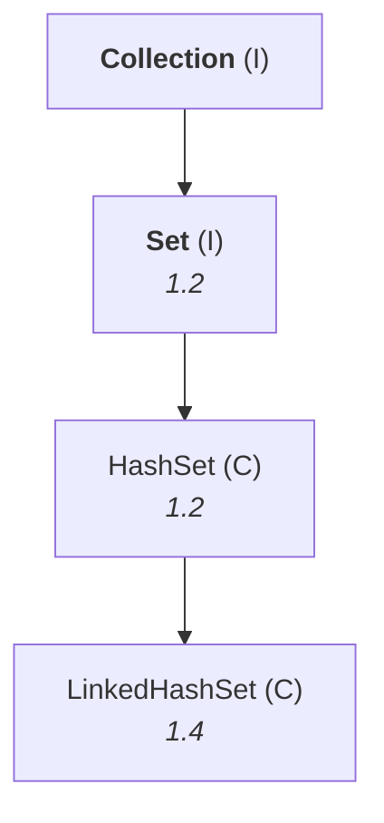
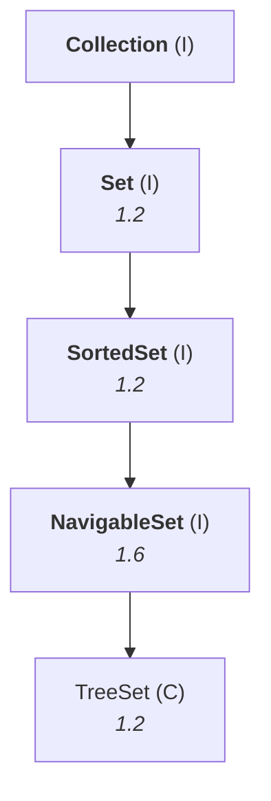
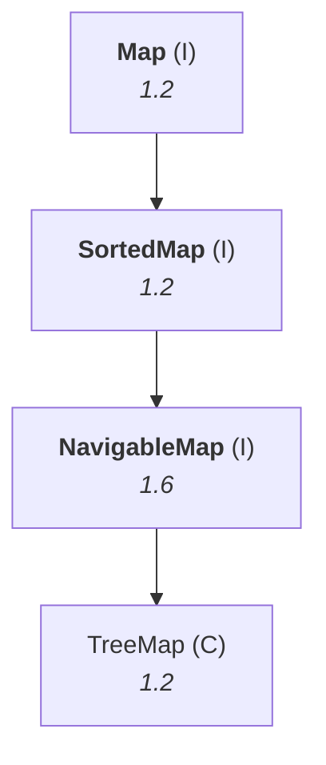
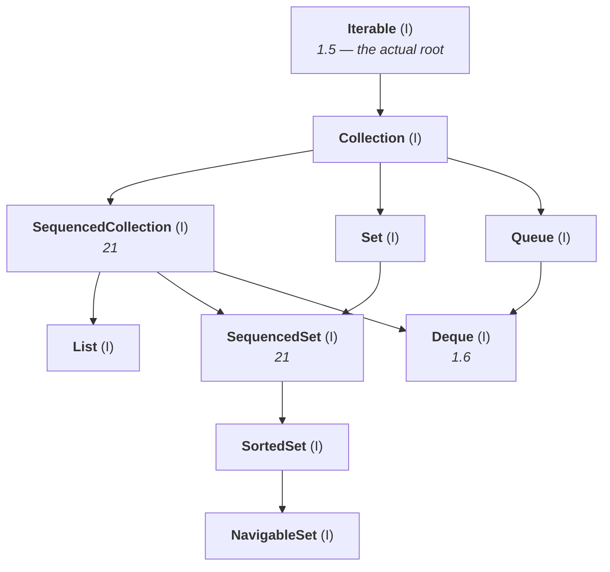

# The nine key interfaces

The whole collection framework hangs off nine interfaces. Learn what each one is *for* — the one
sentence that says when you would reach for it — and the rest of the chapter is filling in
implementation classes underneath names you already understand.

> **1.** `Collection` **2.** `List` **3.** `Set` **4.** `SortedSet` **5.** `NavigableSet`
> **6.** `Queue` **7.** `Map` **8.** `SortedMap` **9.** `NavigableMap`

He drills the list itself before explaining any of them, because *"how many key interfaces are there
in the collection framework?"* is asked on its own. **Nine.**

The split that organises all nine:

| | For | Interfaces |
|---|---|---|
| **Collection half** | a group of **individual objects** | `Collection`, `List`, `Set`, `SortedSet`, `NavigableSet`, `Queue` |
| **Map half** | a group of objects as **key–value pairs** | `Map`, `SortedMap`, `NavigableMap` |

> [!important] **`Map` is not a child of `Collection`.** *"Collection concept is the first half of the
> movie, map concept is the second half."* They are both part of the collection **framework**, but
> there is no inheritance between them — and he tells you to **underline** that, not strike it
> through. Confirmed on JDK 25: `Collection.class.isAssignableFrom(Map.class)` → **`false`**.

---

# 1 · `Collection` (I)

> **If we want to represent a group of individual objects as a single entity, then we should go for
> `Collection`.**

Four things to be able to say about it:

| | |
|---|---|
| **When to use** | a group of **individual objects** as a single entity |
| **What it holds** | the **most common methods** applicable to any collection object |
| **Its position** | generally considered the **root interface** of the framework |
| **Implementations** | **no concrete class implements `Collection` directly** |

**On the second point** — what counts as a "most common method"? Whatever you would want of *any*
collection, whether it turns out to be an `ArrayList`, a `LinkedList` or a `TreeSet`: add an object,
remove an object, ask whether it is empty, ask its size. Those live on `Collection` itself.

**On the fourth** — concrete classes implement the *child* interfaces. `ArrayList` and `LinkedList`
implement `List`; nothing implements `Collection` and stops there.

> [!important] **The true root is `Iterable`, not `Collection`.** Measured on JDK 25,
> `Collection`'s own superinterface list is **`[java.lang.Iterable]`** — so `Collection` has a parent,
> and calling it the root is a convenience rather than a fact.
>
> He is careful about this himself, for a different and better reason: *"in the total collection
> framework there are two parts — collection, and map. Map and collection, there is no relation at
> all. Then how can I consider `Collection` the root interface of the collection framework?"*
>
> **So the honest answer names both objections:** `Collection` is the root of the *collection* half
> only, and even there it sits under `Iterable` — which is what makes the for-each loop work on every
> collection.

---

# The interview question: `Collection` vs `Collections`

He flags this as *"the most commonly asked question in the interview room"*, and warns against the
answer people reach for first — that one is singular and one is plural, or that collections are a
group of collections. **Neither. They are different kinds of thing entirely.**

> **`Collection` is an interface.** If we want to represent a group of individual objects as a single
> entity, we should go for `Collection`.
>
> **`Collections` is a utility class** present in `java.util`, defining several utility methods for
> collection objects — sorting, searching, and so on.

Measured on JDK 25:

```
java.util.Collection  isInterface=true
java.util.Collections isInterface=false  final=true
```

**The one-word answer is "interface versus class"** — then add the "when to use" sentence for each,
and the question is fully answered.

> [!info] **The example that shows why `Collections` has to exist.** A `List` knows nothing about
> sorting — it preserves *insertion* order, and that is its whole character. So when you do want it
> sorted, the method cannot live on `List`. It lives on the utility class:
> ```java
> Collections.sort(l);
> ```

---

# 2 · `List` (I)

> **It is the child interface of `Collection`. If we want to represent a group of individual objects
> as a single entity where duplicates are allowed and insertion order must be preserved, then we
> should go for `List`.**

**Insertion order preserved** means exactly what it says: the order you added them in is the order
they sit in memory, and the order you get them back in.

## The four implementation classes

| Class | Version |
|---|---|
| `ArrayList` | 1.2 |
| `LinkedList` | 1.2 |
| **`Vector`** | **1.0** — legacy |
| **`Stack`** | **1.0** — legacy |



> **Anything that comes from the old generation is a legacy class.** `Vector` and `Stack` arrived in
> **1.0**, before the collection framework existed at all.

## The question that catches people

*`List` came in 1.2. `Vector` came in 1.0. **How can a 1.0 class implement a 1.2 interface?***

> **It could not, and it did not.** In **1.2, `Vector` and `Stack` were re-engineered** — modified,
> updated — **to implement `List`.** The link did not exist in 1.0 or 1.1; it was added when the
> framework was.

Confirmed on JDK 25: `List.class.isAssignableFrom(Vector.class)` → `true`, and `Stack`'s superclass
is `Vector`.

> [!warning] **Do not use `Vector` or `Stack` in new code.** Both synchronize every single method,
> which costs you on every call whether or not any other thread exists. Use **`ArrayList`** where you
> want a list, and **`ArrayDeque`** where you want a stack — `ArrayDeque` is faster than `Stack` for
> exactly the job `Stack` is named after. When you genuinely need a thread-safe list, the answer is
> `CopyOnWriteArrayList` or an explicitly synchronized wrapper, not `Vector`.

---

# 3 · `Set` (I)

> **It is the child interface of `Collection`. If we want to represent a group of individual objects
> as a single entity where duplicates are not allowed and insertion order is not preserved, then we
> should go for `Set`.**

`Set` is `List` with both properties flipped. That is the cleanest way to hold it.

| Class | Version |
|---|---|
| `HashSet` | 1.2 |
| `LinkedHashSet` | 1.4 |



---

# The interview question: `List` vs `Set`

Two differences, and they are the two properties that define each one:

| | `List` | `Set` |
|---|---|---|
| Duplicates | ✅ **allowed** | ❌ **not allowed** |
| Insertion order | ✅ **preserved** | ❌ **not preserved** |

> [!info] **"Not preserved" does not mean random.** In a `Set` the objects are arranged by **hash
> code** or by **sorting order**, depending on the implementation — there is a definite arrangement,
> it simply is not the one you added them in. What you cannot do is *predict* it from your insertion
> sequence.

---

# 4 · `SortedSet` (I)

> **It is the child interface of `Set`. If we want to represent a group of individual objects where
> duplicates are not allowed but all objects will be inserted according to some sorting order, then
> we should go for `SortedSet`.**

The PDF gives a second, shorter phrasing worth having as well:

> **If we want to represent a group of "unique objects" according to some sorting order, then we
> should go for `SortedSet`.**

---

# 5 · `NavigableSet` (I)

> **It is the child interface of `SortedSet`. It provides several methods for navigation purposes.**

*"What is the previous element? What is the next element?"* — that is navigation, and it is what the
name is telling you. **`NavigableSet` came in 1.6**, and `TreeSet` was re-engineered to implement it,
exactly as `Vector` had been for `List`.



**`TreeSet` is the only implementation class in that chain** — everything above it is an interface.
Confirmed on JDK 25: `NavigableSet.class.isAssignableFrom(TreeSet.class)` → `true`.

---

# 6 · `Queue` (I)

> **It is the child interface of `Collection`. If we want to represent a group of individual objects
> **prior to processing**, then we should go for the `Queue` concept.**

> [!important] **"Prior to processing" is the phrase to memorise** — it is the wording from the Java
> API itself, and it is what distinguishes `Queue` from every other collection. You are not storing
> these objects to keep them. You are holding them **until each one's turn comes to be processed.**

**Usually a queue follows first-in-first-out order**, but that is not a requirement:

> **Based on our requirement we can implement our own priority order also.** Such queues are
> `PriorityQueue`.

## The technical example

Before you can send ten thousand emails, you have to hold the ten thousand addresses somewhere. Take
the first, send it; take the second, send it. **The order you added them is the order the mail goes
out** — which is precisely first-in-first-out, so a queue is the right structure. Same for an SMS
blast to ten lakh mobile numbers.

> [!question]- **The two queues he still resents.** His own examples of "prior to processing", and
> they land the definition better than the technical one does.
>
> **The passport queue, around 2006–07.** His application was rejected and he was called in with a
> query, so he had to go in person and ask why. He joined the queue at **4 a.m.** He reached the
> officer at **11 a.m.** — seven hours. The officer looked at the file number and said the address
> proof was not valid, submit another one. **That exchange took thirty seconds.**
>
> Seven hours of queueing for thirty seconds of service. *"To get the service of 30 seconds I was
> there almost 7 hours in the queue."*
>
> **The dam queue at Tirupati.** He was there to teach a GATE class at 2 p.m. and arrived at 8 a.m.,
> so the institute suggested he visit the dam in the meantime. He paid 300 rupees for the special
> entry and stood in the queue for four or five hours — his attention the whole time on a class
> starting at 2 p.m. He got out around 4:30, came back at 6:30, taught until 8:30, and had a bus at
> 8:30.
>
> Both are the same shape: **you are in the queue not because the queue is where you want to be, but
> because it is the only way to reach the processing at the far end.**

## Implementation classes

`PriorityQueue`, `BlockingQueue`, and under `BlockingQueue`: `PriorityBlockingQueue`,
`LinkedBlockingQueue`, `SynchronousQueue`, and others.

> **The whole `Queue` concept came in 1.5.** It is the newest of the six collection-half interfaces.

> [!important] **`Deque` is the one this list is missing, and you will use it more than any of them.**
> Added in **1.6**, `Deque` (double-ended queue) extends `Queue` and lets you add and remove at both
> ends. **`ArrayDeque` is the modern answer to both "I want a queue" and "I want a stack"** — it beats
> `LinkedList` for the first and `Stack` for the second. Verified on JDK 25: `Deque` extends `Queue`,
> and `ArrayDeque` implements `Deque`.

---

# 7 · `Map` (I)

> **`Map` is not a child interface of `Collection`.** **If we want to represent a group of objects as
> key–value pairs, then we should go for `Map`.**

```
1  →  Durga
2  →  Ravi
3  →  Shiva
```

| | |
|---|---|
| Both key and value are | **objects** |
| Duplicate **keys** | ❌ **not allowed** |
| Duplicate **values** | ✅ **allowed** |

> [!info] **Note which way round he puts the example, and why.** He starts with *name → roll number*,
> then deliberately reverses it to *roll number → name*: **roll numbers do not repeat, names do.** The
> non-duplicating thing has to be the key. It is a small demonstration of the rule being used rather
> than recited.

**Where you meet maps in real work:** parameter name → parameter value, attribute name → attribute
value. *"In the servlets, form parameters, request attributes — all these things are internally
represented by using map concept only."*

## Implementation classes

| Class | Version |
|---|---|
| `HashMap` | 1.2 |
| `LinkedHashMap` | 1.4 |
| `WeakHashMap` | 1.2 |
| `IdentityHashMap` | 1.4 |
| **`Dictionary`** (abstract class) | **1.0** — legacy |
| **`Hashtable`** | **1.0** — legacy |
| **`Properties`** | **1.0** — legacy |

> [!warning] **`Hashtable` has a lowercase `t`.** `HashTable` with a capital `T` is a compile error —
> there is no such class. It is the single most common typo in this chapter.

Confirmed on JDK 25: `Hashtable`'s superclass is `Dictionary`, and `Properties`' superclass is
`Hashtable`.

---

# 8 · `SortedMap` (I)

> **It is the child interface of `Map`. If we want to represent a group of objects as key–value pairs
> according to some sorting order of keys, then we should go for `SortedMap`.**

> [!important] **The sorting is on the key, never the value.** *"In `SortedMap` the sorting should be
> based on key but not based on value — the value never participates in sorting."*

---

# 9 · `NavigableMap` (I)

> **It is the child interface of `SortedMap`, and it defines several methods for navigation
> purposes.**

`TreeMap` is the only implementation class. **`NavigableMap` came in 1.6**, `TreeMap` in 1.2 — the
same re-engineering story again.



---

# The hierarchy as it stands on a modern JDK

The diagrams above are the ones to draw in an interview, and they are how the framework is taught
everywhere. **The real hierarchy has two extra layers in it**, and they are worth recognising when
you see them in Javadoc.



> [!question]- **Deep dive — what `SequencedCollection` added, and why it was worth a new layer.**
> Open this if you have seen `getFirst()` in modern code and wondered where it came from.
>
> Java 21 (JEP 431) noticed something embarrassing: **every one of these collections has a
> first and a last element, and there was no common way to ask for either.** `List` used `get(0)`,
> `Deque` used `getFirst()`, `SortedSet` used `first()`, and `LinkedHashSet` had **no way at all** to
> get its last element without iterating the whole thing.
>
> Three interfaces were inserted to fix it — **`SequencedCollection`, `SequencedSet` and
> `SequencedMap`** — carrying one small, uniform set of methods. Measured on JDK 25,
> `SequencedCollection` declares exactly seven:
>
> ```
> getFirst   getLast
> addFirst   addLast
> removeFirst  removeLast
> reversed
> ```
>
> **`reversed()` is the interesting one:** it returns a reverse-ordered *view*, not a copy, so
> iterating a `List` backwards no longer needs an index loop.
>
> **What this changes in the diagrams above:** `List` extends `SequencedCollection` rather than
> `Collection` directly, `SortedSet` extends `SequencedSet`, and `SortedMap` extends `SequencedMap`.
> Measured on JDK 25 — `List`'s declared superinterface is `SequencedCollection`, whose own
> superinterface is `Collection`. **Nothing about the nine key interfaces changed**; a layer was
> inserted beneath them, and `List` is still a `Collection` by transitivity.

---

# The six legacy characters

> **The following are legacy characters present in the collection framework:**
>
> **1.** `Enumeration` (I)  **2.** `Dictionary` (AC)  **3.** `Vector` (C)
> **4.** `Stack` (C)  **5.** `Hashtable` (C)  **6.** `Properties` (C)

All six came in **1.0**, before the framework existed. *"Legacy means what — which is coming from old
generation."*

> [!info] **`(AC)` means abstract class.** *"AC means what — abstract class. Don't tell any other
> definition, air conditioner or something, air cooler."*

> [!important] **What to use instead, if the question turns practical.**
>
> | Legacy | Use instead |
> |---|---|
> | `Vector` | `ArrayList` |
> | `Stack` | **`ArrayDeque`** |
> | `Hashtable` | `HashMap`, or **`ConcurrentHashMap`** if you need thread safety |
> | `Enumeration` | `Iterator` |
> | `Dictionary` | `Map` |
>
> **`Properties` is the exception** — it is legacy by ancestry but still the standard way to read a
> `.properties` file, and you will meet it in live code.

---

# The version table

Every "which version?" answer in one place, because he asks it after each interface.

| Interface / class | Version |
|---|---|
| `Collection`, `List`, `Set`, `SortedSet`, `Map`, `SortedMap` | **1.2** |
| `ArrayList`, `LinkedList`, `HashSet`, `TreeSet`, `HashMap`, `WeakHashMap`, `TreeMap` | **1.2** |
| `LinkedHashSet`, `LinkedHashMap`, `IdentityHashMap` | **1.4** |
| **`Queue`** and the whole queue concept | **1.5** |
| **`NavigableSet`**, **`NavigableMap`**, `Deque` | **1.6** |
| `Enumeration`, `Dictionary`, `Vector`, `Stack`, `Hashtable`, `Properties` | **1.0** — legacy |

**The pattern behind the re-engineering questions:** whenever a class predates the interface it
implements, the link was added later. `Vector`/`Stack` → `List` in 1.2; `TreeSet` → `NavigableSet` and
`TreeMap` → `NavigableMap` in 1.6.

---

# What is still to come

He closes by naming the parts of the framework that are not interfaces, so you know the shape of the
rest of the chapter:

| | |
|---|---|
| **Sorting** | `Comparable` for **default natural sorting order**; `Comparator` for **customised sorting** |
| **Cursors** | to get objects out one by one — `Enumeration`, `Iterator`, `ListIterator` |
| **Utility classes** | `Collections` and `Arrays` |

---

# The collection king

> [!question]- **The story he ends on, and the reason it is not just a story.** A candidate's answer
> that should have ended the interview, and why it did the opposite.
>
> An MCA graduate — call him Ravi — with three years' experience, interviewing at a large services
> company. Because he was a three-year candidate, the interviewer was a project manager rather than a
> fresher, in a one-to-one technical round.
>
> **First question:** *"Do you know the collections concept?"*
>
> The expected answer is yes, or no, or *"basic idea is there"*. What Ravi said was:
>
> > **"If you don't mind — I am the collection king."**
>
> He had picked the phrase up from Durgasoft's own pamphlets and SMS campaigns: *"if you want to
> become collection king, attend today's collections workshop."*
>
> The interviewer took it badly, exactly as you would expect. **Second question:** *"I didn't get you.
> Why did you use the word collection king?"*
>
> > **"You can ask anything in collections, I can answer. And the king in that area is me."**
>
> At this point the interviewer had had enough and was ready to end it. Instead — being senior — he
> slid a **blank sheet of paper** across and said: *whatever you know about collections, write it on
> this paper. Because you are the king.*
>
> **Ravi drew the entire diagram in five to ten minutes.** Group of individual objects → `Collection`.
> Duplicates allowed, insertion order preserved → `List`, and its four classes. No duplicates, no
> insertion order → `Set`, and its classes. Sorting → `SortedSet`. Navigation → `NavigableSet` →
> `TreeSet`. Prior to processing → `Queue` and its classes. Key–value pairs → `Map` and its classes.
> Sorted by key → `SortedMap`. Navigation → `NavigableMap` → `TreeMap`. Legacy: `Hashtable`,
> `Properties`, `Dictionary`. Versions against every one.
>
> The interviewer asked **one further question** — *"have you done any research in this subject?"* —
> and forwarded him with a strong technical recommendation. He got the job.
>
> **The point is not the bravado.** It is that the entire chapter fits on one sheet of paper as a
> single connected diagram, and that being able to produce it from the "when would you use this"
> sentences is what separates knowing the framework from having memorised class names.

---

# What this part established

| | |
|---|---|
| How many key interfaces | **nine** |
| The collection half | `Collection`, `List`, `Set`, `SortedSet`, `NavigableSet`, `Queue` — **individual objects** |
| The map half | `Map`, `SortedMap`, `NavigableMap` — **key–value pairs** |
| `Map` and `Collection` | **no relation** — underline it |
| `Collection` | group of individual objects; holds the **most common methods**; **no concrete class implements it directly** |
| The actual root | **`Iterable`** — `Collection` extends it |
| **`Collection` vs `Collections`** | **interface** vs **utility class** in `java.util` |
| `List` | duplicates **allowed**, insertion order **preserved** |
| `List` classes | `ArrayList`, `LinkedList`, `Vector`, `Stack` |
| `Set` | duplicates **not allowed**, insertion order **not preserved** |
| `Set` classes | `HashSet`, `LinkedHashSet` |
| `SortedSet` | unique objects **in a sorting order** |
| `NavigableSet` | + **navigation** methods → `TreeSet` |
| `Queue` | **prior to processing**; usually FIFO, priority order possible |
| `Map` | key–value; **duplicate keys ❌, duplicate values ✅**; both are objects |
| `SortedMap` | sorted **by key**, never by value |
| `NavigableMap` | + navigation → `TreeMap` |
| Why `Vector` implements a newer interface | **re-engineered in 1.2**; same story for `TreeSet`/`TreeMap` in 1.6 |
| The six legacy characters | `Enumeration`, `Dictionary`, `Vector`, `Stack`, `Hashtable`, `Properties` |
| The extra modern layer | **`SequencedCollection` / `SequencedSet` / `SequencedMap`** (Java 21) |
| The one interface the nine omit | **`Deque`** — and `ArrayDeque` is what you should actually reach for |
