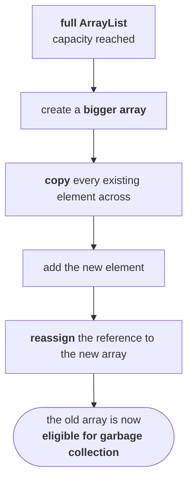

# The `Collection` interface — its methods

Note `02` said `Collection` holds the most common methods applicable to any collection object This is that list. They matter more than any other group of methods in the chapter, for one reason:

> **These are generalized base methods. You can apply them everywhere in the collection framework.**

`Collection` is the parent, so an `ArrayList`, a `LinkedList`, a `TreeSet` — every one of them inherits all of these. Learn them once and you have the vocabulary for every class in the chapter.

## The twelve

| Method | What it does |
|---|---|
| `boolean add(Object o)` | add **one** object |
| `boolean addAll(Collection c)` | add a **group** of objects |
| `boolean remove(Object o)` | remove **one** object |
| `boolean removeAll(Collection c)` | remove a **group** of objects |
| `void clear()` | remove **everything** |
| `boolean retainAll(Collection c)` | remove **everything except** that group |
| `boolean contains(Object o)` | is **this object** present? |
| `boolean containsAll(Collection c)` | are **all of these** present? |
| `boolean isEmpty()` | is it empty? |
| `int size()` | how many objects? |
| `Object[] toArray()` | convert the collection **to an array** |
| `Iterator iterator()` | get a **cursor** to walk the objects one by one |

They come in obvious pairs — a singular method and an `All` version taking a `Collection` — which is most of the list learned already.

> [!important] **`retainAll` is the one people get backwards.** 
> `removeAll(c)` removes the objects in`c`. 
> **`retainAll(c)` removes everything that is not in `c`** — it keeps the intersection. Both are removal methods; they just differ on which side of the line survives.

> [!question]- **Deep dive — the four removal methods, demonstrated on a classroom.** His way of separating them, and it makes `retainAll` impossible to get backwards afterwards.
>
> All four are `removal`, so the question is always **which** students leave the room.
>
> | | Said out loud | Method |
> |---|---|---|
> | **One person** | if any person named Ravi is here, can you please go out | `remove(ravi)` |
> | **A group** | all evening SCJP batch people, can you please go out | `removeAll(eveningBatch)` |
> | **Everybody** | today's class is completed, can you please all go | `clear()` |
> | **Everybody except a group** | except these new members, all the remaining people can you please go out | `retainAll(newMembers)` |
>
> The last one is a real situation: some people had come in **only** for the collections session, and he wanted to talk to exactly those. Everyone else leaves. **That is `retainAll` — you name who stays, not who goes.**

## `toArray()` — and why you would want it

The point is not conversion for its own sake. Note `01` established that **arrays out-perform collections**; collections win on flexibility. 

> All insertions and deletions are done. The collection will not change again. **Convert it to an array so the remaining operations are faster.**

`toArray()` returns an `Object[]`.

## `iterator()` — getting objects out one by one

A collection holds a group. To process them individually you need a **cursor**, and `iterator()` returns one. The three cursors get a session of their own later in the chapter.

> [!info] **`Collection` declares 15 abstract methods on JDK 25, not 12.** The extra three are `equals`, `hashCode` and the second `toArray(Object[])` overload.

> There are also **five `default` methods** — `stream()`, `parallelStream()`, `removeIf()`, `spliterator()` and `toArray(IntFunction)`— which arrived with Java 8 and are how a collection becomes a stream. 

> **The twelve above are still the right twelve to recite**; the rest are either inherited-from-`Object` declarations or the functional additions.

## No concrete class implements it

> **There is no concrete class which implements the `Collection` interface directly.**

Which is why there is nothing more to say about `Collection` — no class to examine, no constructors, no demo. Concrete classes implement its **children**.

---

# The `List` interface — index is the whole idea

> **`List` is the child interface of `Collection`. If we want to represent a group of individual objects as a single entity where duplicates are allowed and insertion order must be preserved, then we should go for `List`.**

The question worth asking, and the one he stops to answer: **how are those two things actually achieved?**

```
index:    0    1    2    3    4    5
        ┌────┬────┬────┬────┬────┬────┐
        │ A  │ B  │ C  │ D  │ E  │ A  │
        └────┴────┴────┴────┴────┴────┘
```

> **Insertion order is preserved via the index.** The first inserted element sits at index 0, the second at index 1, the third at index 2. The index **is** the record of the order you added them in. **Duplicates are differentiated by the index.** There are two `A`s above. They are not confusable, because one is **the `A` at index 0** and the other is **the `A` at index 5**.

> [!important] **Hence index plays a very important role in `List`.** Both defining properties are consequences of having an index, and — as the next section shows — **every method `List` adds on top of `Collection` takes or returns an index.** If you remember one word for `List`, it is **index**.

## The eight methods `List` adds

| Method | What it does |
|---|---|
| `void add(int index, Object o)` | insert **at a specific index** |
| `boolean addAll(int index, Collection c)` | insert a group **from this index onward** |
| `Object remove(int index)` | remove **the object at this index** |
| `Object get(int index)` | **retrieve** the object at this index |
| `Object set(int index, Object o)` | **replace** the object at this index |
| `int indexOf(Object o)` | **first** index of this object |
| `int lastIndexOf(Object o)` | **last** index of this object |
| `ListIterator listIterator()` | the **list-specific cursor** |

Every one of them mentions an index. That is the point.

> [!info] **`add(index, obj)` inserts; it does not overwrite.** If something is already at that index then that object will move to the next cell and everything after that shifts along. **`set(index, obj)` is the one that replaces.**

> [!info] **Why both `indexOf` and `lastIndexOf`?** Because duplicates are allowed. With `A` at both index 0 and index 5, `indexOf(A)` gives **0** and `lastIndexOf(A)` gives **5**. On a `Set` the pair would be pointless — which is a small illustration of why `List` has methods `Set` never needs.

---

# `ArrayList`

The first implementation class, and the one you will use most.

| | |
|---|---|
| **Underlying data structure** | **resizable array** (growable array) |
| **Duplicates** | ✅ allowed |
| **Insertion order** | ✅ preserved |
| **Heterogeneous objects** | ✅ allowed |
| **`null` insertion** | ✅ possible |

**Every collection class is implemented on top of some standard data structure** — that is one of the advantages of collections over arrays from note `01`, and it is why each class gets asked what is the underlying data structure? as its first question.

> [!important] **The two-exception rule, worth memorising once for the whole chapter.**
>
> > **In the entire collection framework, heterogeneous objects are allowed everywhere except `TreeSet` and `TreeMap`.**
>
> **Why those two:** in a tree, all objects are inserted **according to some sorting order**, and sorting requires **comparison**.You cannot compare a `Student` with a `Customer`, so the elements must be of one comparable type. Everywhere else there is no comparison, so mixed types are fine.

## The three constructors

**1 — empty, with a default initial capacity**

```java
ArrayList l = new ArrayList();
```

> Creates an empty `ArrayList` object with **default initial capacity 10**.

**2 — empty, with a capacity you choose**

```java
ArrayList l = new ArrayList(1000);
```

> Creates an empty `ArrayList` object with the **specified initial capacity**.

**Why you would:** if you already know ten thousand objects are coming, letting the list grow from 10 means repeatedly allocating a bigger array and copying everything across. Every time create a new object, copy, create a new object, copy — a big performance problem will come. Why don't you create a big `ArrayList` object at the beginning only?

**3 — from another collection**

```java
ArrayList l = new ArrayList(c);
```

> Creates an equivalent `ArrayList` for the given collection.

> [!important] **This third constructor exists in every collection class**, and it is how you convert between them. Have a `LinkedList` and want an `ArrayList`? A `HashSet` and want a `TreeSet`? **This is the inter-conversion mechanism for the whole framework**, so it is worth recognising as a pattern rather than as one class's constructor.

## How the array grows

When the list is full and you add one more, the internals do this:



**The growth rule, measured on JDK 25:**

> **new capacity = current capacity + (current capacity / 2)** — that is **1.5×**, rounded down.

```
 size | capacity
    1 |       10
   11 |       15
   16 |       22
   23 |       33
   34 |       49
   50 |       73
   74 |      109
  110 |      163
```

From the JDK 25 source of `ArrayList.grow()`:

```java
int newCapacity = ArraysSupport.newLength(oldCapacity,
        minCapacity - oldCapacity, /* minimum growth */
        oldCapacity >> 1           /* preferred growth */);
```

`oldCapacity >> 1` is a right-shift by one — integer division by two. So the new capacity is `oldCapacity + oldCapacity/2`, and **there is no `+ 1`**.

> [!important] **Older material teaches `new capacity = current × 3/2 + 1`**, which would give 10 → 16 → 25 → 38. That was the rule in the Java 6 era. **Measured on JDK 25 the sequence is 10 → 15 → 22 → 33**, so the `+ 1` is gone and the arithmetic is done as `n + n/2` rather than `n × 3 / 2`. The two differ by one at every step.
>
> **What has not changed is everything that matters about it:** growth is **multiplicative**, not by a fixed amount, so appending stays amortised O(1); each growth costs a full array copy; and the old array becomes garbage. That reasoning is the examinable part.

> [!important] **A brand-new `ArrayList()` has capacity 0, not 10.** Measured on JDK 25:
> ```
> capacity of a brand-new ArrayList() = 0
> ```
> The array of 10 is allocated **lazily, on the first `add()`**. The JDK keeps a shared empty array (`DEFAULTCAPACITY_EMPTY_ELEMENTDATA`) and only replaces it when an element actually arrives, so a list that is created and never used costs nothing.
>
> **Default initial capacity 10 is still the right answer** — that is the capacity the moment the list holds anything, and `DEFAULT_CAPACITY = 10` is still the constant's name in the source. Just know the allocation is deferred. `new ArrayList<>(1000)` is **not** deferred: it allocates 1000 immediately.

---

# The demo program

```java
import java.util.*;

class ArrayListDemo {
    public static void main(String[] args) {
        ArrayList l = new ArrayList();
        l.add("A");
        l.add(10);
        l.add("A");
        l.add(null);
        System.out.println(l);

        l.remove(2);
        System.out.println(l);

        l.add(2, "M");
        l.add("N");
        System.out.println(l);
    }
}
```

Measured on JDK 25:

```
[A, 10, A, null]
[A, 10, null]
[A, 10, M, null, N]
```

**Read each line against the properties above:**

| Output | What it proves |
|---|---|
| `[A, 10, A, null]` | **insertion order preserved** — `A, 10, A, null` is exactly the order added |
| | **duplicates allowed** — `A` appears twice |
| | **heterogeneous allowed** — a `String` and an `Integer` in one list |
| | **`null` allowed** |
| `[A, 10, null]` | `remove(2)` removed **the object at index 2**, which was the second `A` |
| `[A, 10, M, null, N]` | `add(2, "M")` **inserted** at index 2 and pushed `null` along; `add("N")` appended at the end because no index was given |

> [!info] **How a collection prints itself.** `System.out.println(l)` calls `toString()`, and every collection implements it the same way: **square brackets, comma-separated.** A `Map` prints in **curly braces** with `key=value` instead. Measured on JDK 25:
> ```
> collection toString: [A, 10, A, null]
> map toString:        {101=Durga, 102=Ravi}
> ```
> **Which bracket you see tells you which half of the framework you are looking at.**

## The compilation warning

Compiling that program gives:

```
Note: ArrayListDemo.java uses unchecked or unsafe operations.
Note: Recompile with -Xlint:unchecked for details.
```

> **It compiles and runs.** The warning is because the list was created without generics, so it holds `Object` and **you lose type safety** — the compiler cannot stop you putting a `Customer` where you meant a `Student`.

> [!important] **In real code, always write the type parameter.**
> ```java
> ArrayList<String> l = new ArrayList<>();
> ```
> The warning disappears, and the compiler enforces the element type for you. The raw form is used above only because this example is deliberately putting a `String`, an `Integer` and a `null` into one list to demonstrate that heterogeneous objects are allowed. **That demonstration is the one legitimate use of the raw form**, and even it would be better written `ArrayList<Object>`.

---

# What this part established

| | |
|---|---|
| `Collection`'s methods are | **generalized** — applicable to every collection class |
| Add | `add(o)` · `addAll(c)` |
| Remove | `remove(o)` · `removeAll(c)` · `clear()` · **`retainAll(c)`** |
| `retainAll(c)` | removes everything **except** `c` — names who **stays** |
| Query | `contains(o)` · `containsAll(c)` · `isEmpty()` · `size()` |
| Convert | `toArray()` — because **arrays are faster** once the structure is settled |
| Cursor | `iterator()` |
| Concrete implementations of `Collection` | **none, directly** |
| `List` is defined by | the **index** |
| Insertion order is preserved | **via the index** |
| Duplicates are distinguishable | **by the index** |
| The eight `List` methods | `add(i,o)` · `addAll(i,c)` · `remove(i)` · `get(i)` · `set(i,o)` · `indexOf(o)` · `lastIndexOf(o)` · `listIterator()` |
| `add(i,o)` vs `set(i,o)` | **insert and shift** vs **replace** |
| `ArrayList`'s data structure | **resizable / growable array** |
| `ArrayList` properties | duplicates ✅ · insertion order ✅ · heterogeneous ✅ · `null` ✅ |
| Heterogeneous objects banned in | **`TreeSet` and `TreeMap` only** — because sorting needs comparison |
| The three constructors | empty · with capacity · **from another collection** |
| The third constructor is | the **inter-conversion** mechanism, present in every collection class |
| Default initial capacity | **10** — allocated lazily on the first `add` |
| Growth | **new = current + current/2** (1.5×), then copy, then the old array becomes garbage |
| A collection prints as | `[a, b, c]`; a map prints as `{k=v}` |
| Raw type warning | **unchecked** — you lost type safety; use generics |
