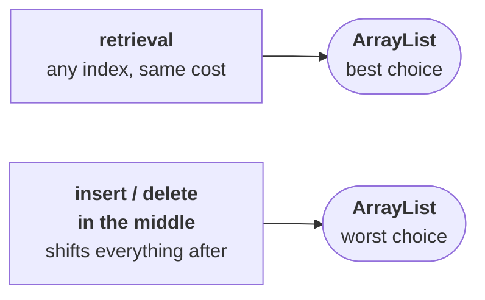
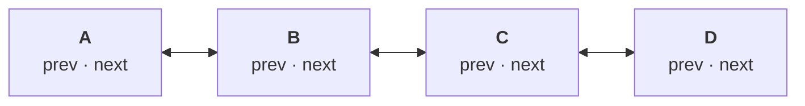

# Two interfaces every collection implements

Before any more classes, three conclusions that hold across the **whole** framework — not just
`ArrayList`. They come from asking what a collection is actually *for*.

> **Usually we can use collections to hold and transfer objects from one location to another
> location.**

> [!info] **The C++ word for the same idea is *container*, and it is the more honest name.** *"I want
> to transport these items from here to Bangalore — a container must be required. I want to transfer
> 10,000 litres of petrol — a container must be required."* A collection is a container: something you
> put objects into so you can move them around as one thing.

## Every collection implements `Serializable`

Take that transport requirement literally. You have a collection of `Student` objects in Hyderabad
and you want to send it **across the network** to London.

> To transfer any Java object across a network, **that object must be serializable.**

So if a collection is going to be transferable, every collection class has to support it — and every
one does. Confirmed on JDK 25 for `ArrayList`, `LinkedList`, `Vector`, `HashSet`, `TreeSet`,
`HashMap`, `TreeMap`, `Hashtable`, `ArrayDeque` and `PriorityQueue`: **all `Serializable`.**

## Every collection implements `Cloneable`

Now the London end has the collection and starts operating on it. Something goes wrong and the data
is disturbed. Asking Hyderabad to send it again is expensive — so instead:

> **The moment you receive it, create an exactly duplicate cloned object.** Operate on the duplicate.
> If something goes wrong the original is intact, and you can compare the updated values against the
> originals.

That is the backup argument from `JAVA-LANG-PACKAGE/13`, applied to collections. To support it, the
collection classes implement `Cloneable`.

> [!important] **"Every collection class implements `Cloneable`" is very nearly true, and the
> exceptions are worth knowing.** Measured on JDK 25:
>
> | Class | `Cloneable`? |
> |---|---|
> | `ArrayList`, `LinkedList`, `Vector`, `Stack` | ✅ |
> | `HashSet`, `LinkedHashSet`, `TreeSet` | ✅ |
> | `HashMap`, `TreeMap`, `Hashtable`, `ArrayDeque` | ✅ |
> | **`PriorityQueue`** | ❌ |
> | **`ConcurrentHashMap`** | ❌ |
>
> `Serializable`, by contrast, really is universal across all of them. So the safe form of the answer
> is: **every collection class is `Serializable`, and the classic ones are also `Cloneable`.**

---

# `RandomAccess`

> **`ArrayList` and `Vector` implement the `RandomAccess` interface, so that any random element can be
> accessed with the same speed.**

Take a list of a hundred thousand elements. *"What is the first element?"* — one second. *"What is the
tenth element?"* — the same one second. *"What is the one-lakh-th element?"* — still the same one
second. **Position makes no difference to the cost.**

That is what backs an array: the address of element *n* is computable directly, so nothing is walked.

| | `RandomAccess`? |
|---|---|
| **`ArrayList`** | ✅ |
| **`Vector`** | ✅ |
| `Stack` | ✅ — it extends `Vector` |
| `LinkedList` | ❌ |
| `HashSet`, `TreeSet`, `HashMap`, … | ❌ |

> **`RandomAccess` is present in `java.util`, and it does not contain any methods — it is a marker
> interface.** The required ability is provided automatically by the JVM.

Confirmed on JDK 25: `RandomAccess` is in `java.util` and declares **zero** methods. This is the same
marker-interface mechanism as `Cloneable` in `DECLARATIONS-AND-ACCESS-MODIFIERS/13`.

## The exam question this generates

```java
ArrayList l1  = new ArrayList();
LinkedList l2 = new LinkedList();
```

| Expression | Result | Why |
|---|---|---|
| `l1 instanceof Serializable` | **true** | every collection is |
| `l2 instanceof Cloneable` | **true** | `LinkedList` is |
| `l1 instanceof RandomAccess` | **true** | `ArrayList` implements it |
| **`l2 instanceof RandomAccess`** | **false** | **`LinkedList` does not** |

**That last row is the whole question.** Everything else is true for every collection; `RandomAccess`
is the one that discriminates.

---

# `ArrayList` — best and worst case

## Best: retrieval

> **`ArrayList` is the best choice if our frequent operation is retrieval**, because it implements
> `RandomAccess`.

## Worst: insertion or deletion in the middle

Take a list holding **one crore** elements, and insert at index 1:

```java
l.add(1, "M");
```

```
before:  A  B  C  D  E  …          ← one crore elements
              ↓ shift every one of them right
after:   A  M  B  C  D  E  …
```

> To make room for one element, **every element after it has to shift by one.** One crore shift
> operations to insert a single object.

*"If I ask today, can you please insert M in the first place — maybe after 6 months it's going to tell
successfully inserted."*

**Removal is the same in reverse.** `l.remove(1)` leaves a hole, and everything after it shifts left
to close it — one crore shifts again.

> **Insertion or deletion at the end is fine.** It is insertion or deletion **in the middle** that
> costs, because only then is there anything to shift.



---

# The interview question: `ArrayList` vs `Vector`

> *"If you attend 10 interviews, minimum 6 to 8 will have this question."*

| | `ArrayList` | `Vector` |
|---|---|---|
| **1. Methods** | every method is **non-synchronized** | most methods are **synchronized** |
| **2. Thread safety** | multiple threads may operate at a time → **not thread safe** | only one thread at a time → **thread safe** |
| **3. Performance** | relatively **high** — threads need not wait | relatively **low** — threads must wait |
| **4. Version** | **1.2**, non-legacy | **1.0**, **legacy** |

**Rows 2 and 3 are the same fact stated twice, from opposite sides** — and that is the useful way to
hold it. Synchronization is what buys thread safety, and waiting is what synchronization costs. You
cannot have one without the other.

> [!warning] **Do not answer this question by recommending `Vector`.** Its synchronization is
> per-method, which is almost never the granularity you want: `if (!v.contains(x)) v.add(x);` is two
> synchronized calls and still a race. When you genuinely need a concurrent list the answer is
> **`CopyOnWriteArrayList`**; when you need a concurrent map it is **`ConcurrentHashMap`**, not
> `Hashtable`. `Vector` survives for backward compatibility.

## The modern form of the question

> *"These days nobody asks the difference directly. They ask: **I want to use `ArrayList` only, but I
> want thread safety. How do you get a synchronized version of an `ArrayList` object?**"*

**By default an `ArrayList` is non-synchronized.** The `Collections` class converts it:

```java
public static List synchronizedList(List l)
```

```java
ArrayList l = new ArrayList();          // non-synchronized
List l1 = Collections.synchronizedList(l);   // synchronized
```

**And the same for the other two shapes:**

```java
public static Set synchronizedSet(Set s)
public static Map synchronizedMap(Map m)
```

Confirmed on JDK 25 — and there are more than three. `Collections` also provides
`synchronizedCollection`, `synchronizedSortedSet`, `synchronizedNavigableSet`,
`synchronizedSortedMap` and `synchronizedNavigableMap`, so whichever interface you are holding, there
is a wrapper for it.

> [!important] **The wrapper does not make iteration safe.** Every individual method call is
> synchronized, but a `for` loop over the returned list is many calls, and another thread can modify
> it between them. The Javadoc requires you to synchronize on the wrapper manually while iterating:
> ```java
> synchronized (l1) {
>     for (Object o : l1) { … }
> }
> ```
> This is the same granularity trap as `Vector`, which is why `CopyOnWriteArrayList` is usually the
> better answer.

---

# `LinkedList`

| | |
|---|---|
| **Underlying data structure** | **doubly linked list** |
| **Duplicates** | ✅ allowed |
| **Insertion order** | ✅ preserved |
| **Heterogeneous objects** | ✅ allowed |
| **`null` insertion** | ✅ possible |
| **Implements** | `Serializable`, `Cloneable` — but **not `RandomAccess`** |

## Why insertion in the middle is cheap

The nodes are **not stored in consecutive memory locations**. One element lives at one address, the
next somewhere else entirely, and each node carries the address of its neighbours:



**Insert `M` between `A` and `B`:** create a node for `M`, then reassign four pointers. **No shifting
at all**, because nothing depends on anything being adjacent in memory.

**Remove a node:** unhook it by pointing its neighbours at each other. The orphaned node becomes
eligible for garbage collection.

> **`LinkedList` is the best choice if our frequent operation is insertion or deletion in the
> middle.**

## Why retrieval is expensive

The mirror image, and he derives it the same way:

> *"What is the first element?"* — one second, it is right there.
> *"What is the second element?"* Its address is held **only by the first element**. You cannot talk
> to the second element directly. Ask the first, get the address, go there. **Two seconds.**
> *"What is the third?"* Three seconds. *"What is the one-lakh-th element?"* — *"after 10 years you may
> get it."*

> **`LinkedList` is the worst choice if our frequent operation is retrieval.**

> [!important] **The two classes are exact opposites, and that is the whole comparison.**
>
> | Frequent operation | Best | Worst |
> |---|---|---|
> | **Retrieval** | `ArrayList` | `LinkedList` |
> | **Insert / delete in the middle** | `LinkedList` | `ArrayList` |
>
> Neither is better. They trade the same two properties in opposite directions.

> [!question]- **The aside he builds on that, which is not about Java.** He stops the lecture for it,
> and it is the kind of thing that makes the technical point stick.
>
> *"If you are getting some advantage, automatically there should be some disadvantage also. If this
> person is strong in one area, compulsorily this person should be weak in another area."*
>
> Then the human version: it is common to feel that **everyone else is doing fine and only you have
> problems** — *"except me all the remaining are very happy, except me all the remaining are very
> worthy people, only the person facing the problem is myself."*
>
> His answer is that every person has their own strengths and their own weaknesses, without exception
> — he names Narendra Modi and Obama as people who obviously have both. *"If this person is having
> only positive points and no negative points, clear indication: this person is not a human being."*
>
> **The people with a positive attitude are the ones who assume everyone else has problems too** —
> that the other person is *"also a normal person like me"*. The people with a negative attitude
> assume they are uniquely burdened. *"If you have such a type of feeling, please remove that from
> your mind."*
>
> It is the same shape as `ArrayList` and `LinkedList`: **strength in one dimension is bought with
> weakness in another**, and expecting something with no weaknesses is expecting something that does
> not exist.

## Constructors — only two

```java
LinkedList l = new LinkedList();              // empty
LinkedList l = new LinkedList(Collection c);  // equivalent list for a given collection
```

> **There is no capacity constructor**, because *capacity* is not applicable to a linked list. Capacity
> only means something when objects are stored in consecutive memory locations — and here they are
> not.

Confirmed on JDK 25: `LinkedList` has **2** public constructors; `ArrayList` has **3**.

> [!info] **That is a genuinely nice piece of reasoning to be able to reproduce.** The missing
> constructor is not an oversight; it is the underlying data structure showing through the API. If you
> can explain *why* `LinkedList` has no capacity argument, you have understood what a linked list is.

## The six specific methods

> **`LinkedList` is commonly used to develop stacks and queues.** To support that, it defines six
> specific methods:

```java
void addFirst(Object o)      void addLast(Object o)
Object getFirst()            Object getLast()
Object removeFirst()         Object removeLast()
```

**Because a stack is last-in-first-out and a queue is first-in-first-out**, both need cheap access at
the ends — which is exactly what a linked list is good at.

> [!question]- **The lab-exam aside these methods came out of.** Why he expects you to have met this
> requirement already.
>
> In the CSE data structures lab, the recurring programs were:
>
> - array-based implementation of **stack** and **queue**
> - **linked-list-based** implementation of stack and queue
> - sorting — bubble, selection, insertion
> - searching — linear, binary
>
> His point is about which ones students bothered to write on their smuggled slips: the **array**
> implementations are easy and the **linked-list** ones are difficult, so the linked-list slips were
> the ones worth carrying. Same for bubble sort over selection sort, and binary search over linear
> search.
>
> *(The technology moved from slips to pen drives to just leaving the program dump on the lab machine
> before the exam started.)*
>
> The reason it is here: **linked-list-based stacks and queues are a thing you have already
> implemented by hand**, which is why `LinkedList` shipping those six methods is worth noticing.

> [!important] **`LinkedList` implements `Deque`, so it has far more than six.** Verified on JDK 25.
> `Deque` adds `offerFirst`, `offerLast`, `pollFirst`, `pollLast`, `peekFirst`, `peekLast`, `push`,
> `pop` and more — the same six operations in forms that **return a value instead of throwing** when
> the list is empty. `getFirst()` on an empty list throws `NoSuchElementException`; `peekFirst()`
> returns `null`.
>
> **For a new stack or queue, use `ArrayDeque` rather than `LinkedList`** — it does the same job with
> better cache behaviour and no per-element node object.

---

# The demo program

```java
import java.util.*;

class LinkedListDemo {
    public static void main(String[] args) {
        LinkedList l = new LinkedList();
        l.add("durga");
        l.add(30);
        l.add(null);
        l.add("durga");
        System.out.println(l);

        l.set(0, "software");
        System.out.println(l);

        l.add(0, "vijay");
        System.out.println(l);

        l.removeLast();
        System.out.println(l);

        l.addFirst("ccc");
        System.out.println(l);
    }
}
```

Measured on JDK 25:

```
[durga, 30, null, durga]
[software, 30, null, durga]
[vijay, software, 30, null, durga]
[vijay, software, 30, null]
[ccc, vijay, software, 30, null]
```

| Step | Effect |
|---|---|
| the four `add`s | insertion order preserved, **duplicates** (`durga` twice), **heterogeneous** (`String` + `Integer`), **`null`** all fine |
| `set(0, "software")` | **replaces** index 0 — `durga` becomes `software` |
| `add(0, "vijay")` | **inserts** at index 0 and pushes everything along |
| `removeLast()` | drops the trailing `durga` — a `LinkedList`-specific method |
| `addFirst("ccc")` | prepends — the other `LinkedList`-specific method |

**The first line alone proves all four properties from the table above**, which is why this program is
worth keeping.

---

# What this part established

| | |
|---|---|
| A collection is a | **container** — to hold and transfer objects |
| Every collection implements | **`Serializable`** — so it can cross a network |
| Nearly every collection implements | **`Cloneable`** — for a backup copy (**not** `PriorityQueue` / `ConcurrentHashMap`) |
| `RandomAccess` | **`ArrayList`, `Vector`** (and `Stack`) — **not `LinkedList`** |
| `RandomAccess` is | in **`java.util`**, **no methods** — a **marker interface** |
| The exam row that matters | `l2 instanceof RandomAccess` → **false** for a `LinkedList` |
| `ArrayList` best / worst | **retrieval** / **insert-delete in the middle** |
| Why the middle is costly | every later element must **shift** |
| `LinkedList` best / worst | **insert-delete in the middle** / **retrieval** |
| Why the middle is cheap | reassign a few **pointers**; nothing is adjacent in memory |
| Why retrieval is costly | each node knows only its **neighbour's** address — you must walk |
| `ArrayList` vs `Vector` | non-synchronized vs synchronized · not thread safe vs thread safe · fast vs slow · 1.2 vs 1.0 legacy |
| Synchronized `ArrayList` | **`Collections.synchronizedList(l)`** — also `synchronizedSet`, `synchronizedMap` |
| The wrapper's limit | **iteration is still unsafe** — synchronize manually, or use `CopyOnWriteArrayList` |
| `LinkedList`'s data structure | **doubly linked list** |
| `LinkedList` constructors | **two** — no capacity, because capacity is meaningless without contiguity |
| The six specific methods | `addFirst` · `addLast` · `getFirst` · `getLast` · `removeFirst` · `removeLast` |
| Why those six | `LinkedList` is used to build **stacks and queues** |
| For a new stack or queue | use **`ArrayDeque`** |
