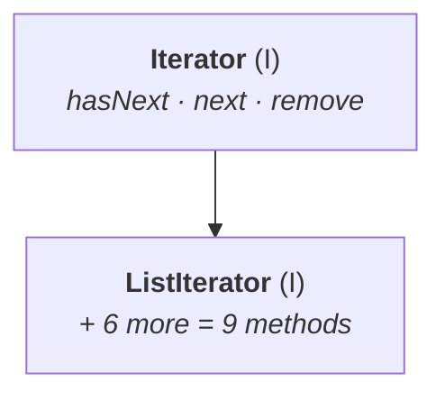

# Limitations of `Enumeration`

`Enumeration` already exists and already walks a collection one object at a time. So why are there two more cursors?

> If the old concept is there and still I'm going for some new concept, that means the old concept contains some problems.

**Two problems.**

## 1 — It only works on legacy classes

> **We can apply the `Enumeration` concept only for legacy classes, and hence it is not a universal cursor.**

| Want an `Enumeration` for… | |
|---|---|
| `Vector` | ✅ |
| `Stack` | ✅ |
| `ArrayList` | ❌ |
| `LinkedList` | ❌ |

`Enumeration` came in **1.0**, so it only knows about the classes that existed then. Note `05` got one from `Vector.elements()` — and `elements()` is a `Vector` method, not a `Collection` method. There is nowhere to get an `Enumeration` for the modern classes.

## 2 — Read access only

> **By using `Enumeration` we can get only read access, and we can't perform remove operations.**

`Enumeration` has two methods — `hasMoreElements()` and `nextElement()`. Neither removes anything.

> [!question]- **The damaged mango, and why removal is the operation you actually want.** He continues the box-of-mangoes example from note `05`, and it is the cleanest argument for why `Enumeration` is not enough.
>
> You take the first mango and eat it. The second, and eat it. **You pick up the third and find it is damaged.** Three options:
>
> 1. **Throw it out** — remove it from the box entirely
> 2. **Put it back in the box** — where it will spoil the others
> 3. **Eat it anyway** — mango cost is almost 20 rupees, why should we waste it, no one is observing
>
> **Which is recommended? Throw it out.** The object is damaged, it is not required, and leaving it in the box risks the rest.
>
> **But `Enumeration` has no remove capability.** You can see the damaged mango and you cannot take it out of the box. That is the limitation, and it is why `Iterator` exists.

> **To overcome the above limitations, we should go for `Iterator`.**

---

# Cursor 2 — `Iterator`

Both problems answered at once:

> **1.** We can apply the `Iterator` concept **for any collection object**, and hence **it is a universal cursor**.
> **2.** By using `Iterator` we can perform **both read and remove** operations.

## How to get one

`iterator()` is declared on **`Collection`** itself — which is exactly why it works everywhere:

```java
public Iterator iterator()
```

```java
Iterator itr = c.iterator();    // c is any collection object
```

> [!info] **The two facts are the same fact.** `Enumeration` is obtained from a `Vector` method, so it is stuck with `Vector`. `Iterator` is obtained from a `Collection` method, and every collection class implements `Collection` — so it reaches all of them. **Where the method is declared determines how universal the cursor is.**

## Three methods

| Method | |
|---|---|
| `public boolean hasNext()` | is there a next element? |
| `public Object next()` | give me the next object |
| **`public void remove()`** | **remove the current object** |

**The third one is the whole point** — it is what `Enumeration` lacks.

> [!info] **The method names got shorter, for the reason note `05` gave.** `hasMoreElements` → `hasNext`, `nextElement` → `next`. `Enumeration` is 1.0; `Iterator` is 1.2, when the naming style had changed.

## The demo

```java
import java.util.*;

class IteratorDemo {
    public static void main(String[] args) {
        ArrayList l = new ArrayList();
        for (int i = 0; i <= 10; i++) l.add(i);
        System.out.println(l);

        Iterator itr = l.iterator();
        while (itr.hasNext()) {
            Integer i = (Integer) itr.next();
            if (i % 2 == 0)
                System.out.println(i);
            else
                itr.remove();
        }
        System.out.println(l);
    }
}
```

Measured on JDK 25:

```
before: [0, 1, 2, 3, 4, 5, 6, 7, 8, 9, 10]
0 2 4 6 8 10
after:  [0, 2, 4, 6, 8, 10]
```

**The last line is what `Enumeration` could not do.** The odd numbers are not merely skipped in the output — they are **gone from the list**.

> [!warning] **This is the only safe way to remove while looping — a `for-each` loop throws.** Measured on JDK 25:
> ```java
> for (Object o : l2)
>     if ((Integer) o % 2 != 0) l2.remove(o);
> ```
> ```
> java.util.ConcurrentModificationException
> ```
> The collection detects that it was structurally modified behind the loop's back and fails fast. **The cursor's own `remove()` is exempt**, because the cursor knows about the change and updates itself.
>
> **The modern one-liner for exactly this job** is `removeIf`, added with the Java 8 default methods on `Collection`:
> ```java
> l3.removeIf(x -> x % 2 != 0);     // [0, 2, 4, 6, 8, 10]
> ```
> Same result, no cursor, no cast. **Use it when all you want is conditional removal**; reach for the explicit `Iterator` when you need to do something else in the same pass.

---

# Limitations of `Iterator`

`Iterator` fixed `Enumeration`'s problems and has two of its own.

## 1 — Forward only

> **By using `Enumeration` and `Iterator` we can always move only towards the forward direction, and we can't move towards the backward direction. These are single-direction cursors, but not bidirectional cursors.**

`hasNext`, `next`, `next`, `next`… There is no `hasPrevious`. If the cursor is sitting in the middle of a list, why don't you ask what is the previous element? — the element is obviously there, and neither cursor can reach it.

## 2 — Read and remove only

> **By using `Iterator` we can perform only read and remove operations, and we can't perform replacement and addition of new objects.**

You cannot **replace** the current object with a different one, and you cannot **add** a new object mid-iteration.

> **To overcome the above limitations, we should go for `ListIterator`.**

---

# Cursor 3 — `ListIterator`

> **1.** By using `ListIterator` we can move **either to the forward direction or to the backward direction**, and hence **it is a bidirectional cursor**.
> **2.** By using `ListIterator` we can perform **replacement and addition of new objects**, in addition to read and remove operations.

**Both `Iterator` limitations, answered in order.**

## It is a child of `Iterator`

> **`ListIterator` is the child interface of `Iterator`, and hence all methods present in `Iterator` are by default available to `ListIterator`.**



Confirmed on JDK 25: `Iterator.class.isAssignableFrom(ListIterator.class)` → **`true`**.

## How to get one

```java
public ListIterator listIterator()
```

```java
ListIterator ltr = l.listIterator();    // l is any List object
```

**Declared on `List`, not on `Collection`** — which is why it is not universal.

## The nine methods

**Three for forward movement:**

| | |
|---|---|
| `public boolean hasNext()` | is there a next element? |
| `public Object next()` | give me it |
| `public int nextIndex()` | what is its index? |

**Three for backward movement — the exact mirror:**

| | |
|---|---|
| `public boolean hasPrevious()` | is there a previous element? |
| `public Object previous()` | give me it |
| `public int previousIndex()` | what is its index? |

**Three extra operations:**

| | |
|---|---|
| `public void remove()` | remove the current object |
| `public void add(Object o)` | **add** a new object after the current one — **permanently**, into the list |
| `public void set(Object o)` | **replace** the current object |

Confirmed on JDK 25 — `ListIterator` declares exactly **9** abstract methods:
`hasNext, next, nextIndex, hasPrevious, previous, previousIndex, remove, add, set`.

> [!info] **The `nextIndex` / `previousIndex` pair exists because this is a list cursor.** Index is the defining idea of `List` (note `03`), so the list-specific cursor is the one that can tell you where it is. A `Set` has no indices, which is another reason `ListIterator` cannot be universal.

## The demo

```java
import java.util.*;

class ListIteratorDemo {
    public static void main(String[] args) {
        LinkedList l = new LinkedList();
        l.add("balakrishna");
        l.add("venkatesh");
        l.add("chiranjeevi");
        l.add("nagarjuna");
        System.out.println(l);

        ListIterator ltr = l.listIterator();
        while (ltr.hasNext()) {
            String s = (String) ltr.next();
            if (s.equals("venkatesh"))        ltr.remove();
            else if (s.equals("chiranjeevi")) ltr.set("chiranjeevi-charan");
            else if (s.equals("nagarjuna"))   ltr.add("akhil");
        }
        System.out.println(l);
    }
}
```

Measured on JDK 25:

```
before: [balakrishna, venkatesh, chiranjeevi, nagarjuna]
after:  [balakrishna, chiranjeevi-charan, nagarjuna, akhil]
```

| Operation | Effect |
|---|---|
| `remove()` on `venkatesh` | **gone** from the list |
| `set("chiranjeevi-charan")` | `chiranjeevi` **replaced** |
| `add("akhil")` on `nagarjuna` | **`akhil` appended** after it |

**All three extra operations in one pass**, and the list is permanently changed by each.

---

# The most powerful cursor, and its catch

> **The most powerful cursor is `ListIterator`. But its limitation is that it is applicable only for `List` objects — it is not a universal cursor.**

> [!important] **Neither cursor is strictly better, and the trade is the same shape as `ArrayList` vs `LinkedList` in note `05`.** `Iterator` reaches every collection but does little. `ListIterator` does everything but reaches only lists. **Power was bought with reach.**

---

# The comparison table

This is the deliverable of the session — the answer to what is the difference between the three cursors?

| Property | `Enumeration` | `Iterator` | `ListIterator` |
|---|---|---|---|
| **Where it applies** | only **legacy** classes | **any** collection object | only **`List`** objects |
| **Is it legacy?** | ✅ **yes** — 1.0 | ❌ no — 1.2 | ❌ no — 1.2 |
| **Movement** | single direction (**forward only**) | single direction (**forward only**) | **bidirectional** |
| **Allowed operations** | **read** | **read, remove** | **read, remove, replace, add** |
| **How to get it** | `elements()` of **`Vector`** | `iterator()` of **`Collection`** | `listIterator()` of **`List`** |
| **How many methods** | **2** | **3** | **9** |

**Read the "how to get it" row against the "where it applies" row.** They are the same fact: the interface a cursor's factory method lives on is exactly the set of classes that cursor can reach.

> [!info] **Two small modern additions to the method counts.** On JDK 25 `Iterator` also has two `default` methods — **`remove()` is itself a default** that throws `UnsupportedOperationException` unless overridden, and **`forEachRemaining()`** consumes the rest in one call. `Enumeration` gained **`asIterator()`**, which adapts a legacy `Enumeration` into an `Iterator`. **The counts of 2, 3 and 9 are still the right answer** — those are the abstract methods.

---

# Internal implementation of cursors

The loophole a student raised, and it is a genuinely good question.

> `Enumeration` is an interface, `Iterator` is an interface, `ListIterator` is an interface. **For interfaces we can't create objects** — so how am I getting an `Enumeration` object?

> **You are not.** It is not an `Enumeration` object — it is an **`Enumeration` interface implemented class object**.

**So which class?** Ask it directly:

```java
import java.util.*;

class CursorDemo {
    public static void main(String[] args) {
        Vector v = new Vector();
        Enumeration e  = v.elements();
        Iterator i     = v.iterator();
        ListIterator l = v.listIterator();

        System.out.println(e.getClass().getName());
        System.out.println(i.getClass().getName());
        System.out.println(l.getClass().getName());
    }
}
```

Measured on JDK 25:

```
java.util.Vector$1
java.util.Vector$Itr
java.util.Vector$ListItr
```

**Read the `$` notation** — before the `$` is the outer class, after it the inner class:

| Output | What it is |
|---|---|
| `Vector$1` | an **anonymous inner class** inside `Vector` — the number means it has no name |
| `Vector$Itr` | a **named inner class** `Itr` inside `Vector` |
| `Vector$ListItr` | a named inner class `ListItr` inside `Vector` |

> **Inside the `Vector` class there are inner classes which implement these interfaces.** You are getting objects of those implementation classes — never of the interface.

This is `INNER-CLASSES` doing real work in the JDK: `Vector$1` is exactly the anonymous inner class from `INNER-CLASSES/03`, and the `$` naming is what note `01` of that chapter established.

> [!info] **Each collection class has its own cursor implementations.** Measured on JDK 25:
> ```
> ArrayList.iterator()     -> java.util.ArrayList$Itr
> ArrayList.listIterator() -> java.util.ArrayList$ListItr
> HashSet.iterator()       -> java.util.HashMap$KeyIterator
> ```
> Each class ships an inner class that knows how to walk **its own** data structure — walking an array is nothing like walking a linked list. **The interface is what makes them interchangeable to you.**
>
> The `HashSet` line is a preview of something the map sessions will make explicit: a `HashSet` is backed by a `HashMap`, so its iterator is the map's **key** iterator.

---

# What this part established

| | |
|---|---|
| `Enumeration` limitation 1 | **legacy classes only** — not a universal cursor |
| `Enumeration` limitation 2 | **read only** — cannot remove |
| `Iterator` applies to | **any collection object** — a **universal cursor** |
| Why it is universal | `iterator()` is declared on **`Collection`** |
| `Iterator`'s three methods | `hasNext()` · `next()` · **`remove()`** |
| Removing inside a for-each loop | ❌ **`ConcurrentModificationException`** — use the cursor's `remove()` |
| The modern equivalent | **`removeIf(predicate)`** |
| `Iterator` limitation 1 | **forward only** — single-direction cursor |
| `Iterator` limitation 2 | **read and remove only** — no replace, no add |
| `ListIterator` is | the **child interface of `Iterator`** |
| `ListIterator` movement | **bidirectional** |
| `ListIterator` operations | read · remove · **replace (`set`)** · **add** |
| `ListIterator`'s nine methods | 3 forward · 3 backward · 3 extra |
| How to get each | `Vector.elements()` · `Collection.iterator()` · `List.listIterator()` |
| Method counts | **2** · **3** · **9** |
| The most powerful cursor | **`ListIterator`** — but **`List` objects only** |
| Cursors are not interface objects | they are **implemented-class** objects |
| The implementation classes | `Vector$1` (anonymous) · `Vector$Itr` · `Vector$ListItr` |
| `Outer$Inner` means | outer class before the `$`, inner class after; **a number means anonymous** |
