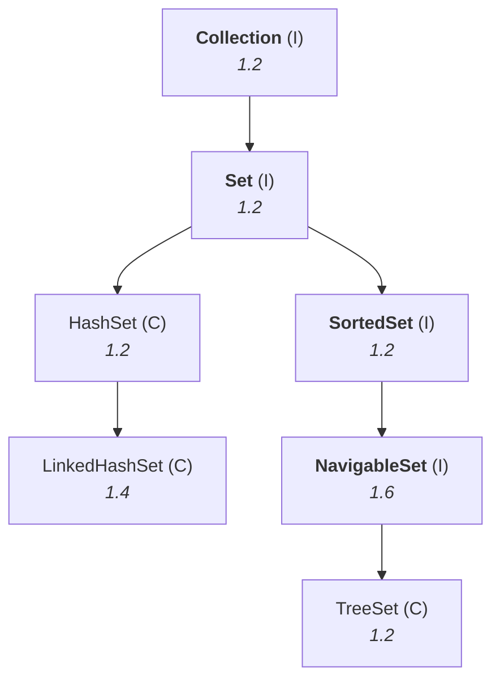

# The `Set` interface

The second half of the collection module. `List` is finished; this is everything under `Set`.



> **`Set` is the child interface of `Collection`. If we want to represent a group of individual
> objects as a single entity where duplicates are not allowed and insertion order is not preserved,
> then we should go for `Set`.**

## `Set` adds nothing

> [!question]- **The prank he plays before telling you.** Worth reading because the punchline is the
> actual fact.
>
> *"Collection contains 12 methods, we discussed already. Then `Set` itself contains how many
> methods? So do you know — almost around **58 methods** are there. These 58 methods we are going to
> discuss. **Are you ready for 58 methods?**"*
>
> A pause. Then:
>
> *"So 58 is not there — just I'm checking what about your feeling if I use 58."*

> **`Set` interface doesn't contain any new method, and we have to use only `Collection` interface
> methods.**

Confirmed on JDK 25: `Set` declares **15** abstract methods and `Collection` declares **15** — the
same names. `Set` restates them for documentation purposes; it introduces nothing.

**So there is nothing to learn here.** Everything from note `03`'s `Collection` table applies
unchanged, and we go straight to the implementation classes.

---

# `HashSet`

| | |
|---|---|
| **Underlying data structure** | **hash table** |
| **Duplicates** | ❌ **not allowed** |
| **Insertion order** | ❌ **not preserved** — based on **hash code of objects** |
| **`null` insertion** | ✅ possible — **only once** |
| **Heterogeneous objects** | ✅ allowed |
| **Implements** | `Serializable`, `Cloneable` — **not `RandomAccess`** |
| **Best choice for** | **search** operations |

> [!important] **Why `null` only once.** `null` is allowed, but a `Set` forbids duplicates — and a
> second `null` would be a duplicate. The two rules combine; there is no special rule about `null`.

> [!info] **Why hashing is best for search, and it connects to `JAVA-LANG-PACKAGE/02`.** *"Search
> algorithm number one up to today is nothing but hashing."* A hash table computes **where** an object
> should be from the object itself, so finding it costs one computation rather than a scan. That is
> also why `hashCode()` mattered so much in note `02` of the `java.lang` chapter — a bad `hashCode`
> destroys exactly this property, which is what the 913 ms vs 3 ms measurement showed.

## What happens when you insert a duplicate

```java
HashSet h = new HashSet();
h.add("A");
h.add("A");     // duplicate
```

> **We won't get any compile-time or runtime error. The `add()` method simply returns `false`.**

Measured on JDK 25:

```
add(A) first time  = true
add(A) second time = false
```

**`add()` returns `boolean`** — that is the mechanism. `true` means it went in, `false` means it was
already there. **No exception is thrown**, which is why a silently-ignored duplicate is easy to miss.

---

# Constructors, and the fill ratio

> [!info] **Learn these four carefully, because they repeat.** The framework has several
> hashing-based classes — `HashSet`, `LinkedHashSet`, `HashMap`, `LinkedHashMap`, `WeakHashMap`,
> `IdentityHashMap` — and **they all take the same four constructors.** Learn them once here and the
> later classes cost nothing.

**1 — default**

```java
HashSet h = new HashSet();
```

> Creates an empty `HashSet` object with **default initial capacity 16** and **default fill ratio
> 0.75**.

**2 — with a capacity**

```java
HashSet h = new HashSet(int initialCapacity);
```

**3 — with a capacity and a fill ratio**

```java
HashSet h = new HashSet(int initialCapacity, float fillRatio);
```

**4 — from another collection**

```java
HashSet h = new HashSet(Collection c);
```

> Creates an equivalent `HashSet` for the given collection. **This constructor is meant for
> inter-conversion between collection objects** — the same pattern as note `03`.

Confirmed on JDK 25: `HashSet` has exactly **4** public constructors.

## What fill ratio means

> **After filling how much ratio a new `HashSet` object will be created — that ratio is called the
> fill ratio, or load factor.**

**The contrast with `ArrayList` is what makes it clear.** An `ArrayList` with capacity 10 waits until
all 10 slots are used; the 11th element triggers the new array. **It waits for 100%.**

A `HashSet` does not wait for 100%:

> **Fill ratio 0.75 means: after filling 75% ratio, a new `HashSet` object will be created.**

```
capacity 16, fill ratio 0.75  →  16 × 0.75 = 12
                                 the 13th element triggers the resize
```

Measured on JDK 25 — watching the internal table grow:

```
brand-new table = 0   (lazily allocated)
after first put = 16
size 13 -> table grew to 32   (threshold was 12)
size 25 -> table grew to 64   (threshold was 24)
size 49 -> table grew to 128  (threshold was 48)
```

**Exactly as taught.** From the JDK 25 source:

```java
static final int DEFAULT_INITIAL_CAPACITY = 1 << 4;   // aka 16
static final float DEFAULT_LOAD_FACTOR = 0.75f;
```

> [!question]- **Deep dive — why 75% rather than 100%, and why a hash table cannot wait.** The reason
> the two classes differ, which is a fair follow-up question.
>
> An `ArrayList` can wait until it is completely full because **a full array still works perfectly** —
> element *n* is still at slot *n*, and lookup is still instant. Fullness costs it nothing.
>
> A hash table is different. It computes a slot from the object's hash code, and when two objects
> compute the same slot they **collide** and have to share it — which turns a one-step lookup into
> walking a small list. **The fuller the table, the more often that happens.** At 100% full, every
> single insert must collide, and the structure degenerates into a linear scan: the one property you
> chose a hash table for is gone.
>
> **0.75 is the compromise** — empirically, low enough that collisions stay rare, high enough that
> memory is not wasted on empty slots. Resizing early is the price of keeping lookups constant-time.
>
> Raising it (`new HashSet(16, 0.9f)`) saves memory and costs speed; lowering it does the reverse.

---

# The `HashSet` demo

```java
import java.util.*;

class HashSetDemo {
    public static void main(String[] args) {
        HashSet h = new HashSet();
        h.add("B");
        h.add("C");
        h.add("D");
        h.add("Z");
        h.add(null);
        h.add(10);
        System.out.println(h.add("Z"));
        System.out.println(h);
    }
}
```

Measured on JDK 25:

```
false
[null, B, C, D, Z, 10]
```

| What the output proves | |
|---|---|
| `false` | the duplicate `Z` was **rejected without an exception** |
| `null` present | **`null` insertion is possible** |
| `10` alongside strings | **heterogeneous objects allowed** |
| order is not `B C D Z null 10` | **insertion order not preserved** |

> [!important] **He deliberately refuses to predict the order, and that is the right instinct.**
> *"HashSet inserts based on hash code. **I don't know what is the hash code of these objects, that's
> why I don't know what is the output.**"*
>
> **Never memorise a `HashSet`'s printed order.** It is a function of the hash codes and the table
> size, both of which can change between JDK versions. The examinable fact is that the order is *not*
> insertion order — not what the order actually is.

---

# `LinkedHashSet`

> **It is the child class of `HashSet`. It is exactly the same as `HashSet` including constructors and
> methods, except for the following differences.**

| | `HashSet` | `LinkedHashSet` |
|---|---|---|
| **Underlying data structure** | **hash table** | **hash table + linked list** (hybrid) |
| **Insertion order** | ❌ not preserved | ✅ **preserved** |
| **Introduced in** | **1.2** | **1.4** |

**That is the entire difference.** Confirmed on JDK 25: `LinkedHashSet`'s superclass is `HashSet`, and
it has the same **4** constructors.

## The same program, one word changed

Replace `HashSet` with `LinkedHashSet` in the demo above:

```
false
[B, C, D, Z, null, 10]
```

**`B C D Z null 10` — exactly the order they were added.** The duplicate is still rejected; only the
ordering changed.

> [!info] **The name tells you the implementation.** `linked` means it maintains a **linked list**
> running through the entries in insertion order, alongside the hash table that does the lookups. You
> get `HashSet`'s search performance **and** a predictable order, at the cost of the extra links.

## Where you would actually use it

> **In general we can use `LinkedHashSet` to develop cache-based applications, where duplicates are
> not allowed and insertion order is preserved.**

> [!question]- **Deep dive — what a cache is, and why those two properties are exactly what it
> needs.** His explanation of caching, which is worth having independently of collections.
>
> **Primary memory (RAM)** is fast. **Secondary memory (hard disk)** is permanent but slow. If the
> fast component has to talk to the slow one on every operation, **the overall speed of the system is
> the slow one's speed.**
>
> *"Two bulls pulling a cart — one bull is very slow, the other is fast. **There is no use of the fast
> one**, because the other is slow. Only if both are fast can the cart move fast."*
>
> **So you put a third memory in the middle: the cache.** Repeated results and repeatedly-required
> code live there. Before going to secondary memory you check the cache; if it is there, you are done
> at cache speed. Cache memory is **costly**, which is why it is small and why what goes in it matters.
>
> **Now the two properties.** A cache must not store the same result twice — *"duplicate code is not
> allowed"* — so **duplicates must be rejected**. And the entries must stay in the order they were
> saved, so that the oldest can be identified and evicted — so **insertion order must be preserved**.
>
> **`LinkedHashSet` is the structure that satisfies both.** `HashSet` fails the second; `List` fails
> the first.

---

# `SortedSet`

> **`SortedSet` is the child interface of `Set`. If we want to represent a group of individual objects
> according to some sorting order without duplicates, then we should go for `SortedSet`.**

Examples of what "some sorting order" means in practice: student objects by roll number, names in
alphabetical order, employee objects by ascending employee ID, integers in ascending order.

## Why `SortedSet` has methods when `Set` had none

A genuinely good derivation, and it comes from mathematics rather than Java.

> [!question]- **Deep dive — the set-theory argument for why `first()` cannot exist on `Set`.** This
> is the reason the method list appears at exactly this level of the hierarchy.
>
> From ordinary set theory, take three sets:
>
> ```
> {1, 2, 3}     {3, 2, 1}     {2, 1, 3}
> ```
>
> **Are these equal?** Yes — a set is defined by *which* elements it contains, not the order they are
> written in. All three are the same set.
>
> **Now ask: what is the first element?** In the first it looks like 1, in the second 3, in the third
> 2. But the sets are equal, so they cannot have different first elements. **The question is
> meaningless** — "first" is not a property a set has.
>
> **That is why `Set` has no `first()` method.** It would be a method for a question that cannot be
> asked.
>
> **Now make it a sorted set** — elements inserted in sorting order, `1, 2, 3`. *"Now can you tell what
> is the first element? **One.** What is the last? **Three.**"* Once there is an order, "first" and
> "last" become well-defined.
>
> > **`SortedSet` defines specific methods, and these methods are not applicable for a normal `Set`.**
>
> This is a rare thing to be able to show: **an interface's method list following from what is
> logically askable about the type.**

## The six specific methods

Take this sorted set:

```
100  101  104  106  110  115  120
```

| Method | Returns | On this set |
|---|---|---|
| `Object first()` | the **first** element | `100` |
| `Object last()` | the **last** element | `120` |
| `SortedSet headSet(Object obj)` | elements **less than** `obj` | `headSet(106)` → `100 101 104` |
| `SortedSet tailSet(Object obj)` | elements **greater than or equal to** `obj` | `tailSet(106)` → `106 110 115 120` |
| `SortedSet subSet(Object a, Object b)` | **≥ `a` and < `b`** | `subSet(101, 115)` → `101 104 106 110` |
| `Comparator comparator()` | the **underlying sorting technique** | see below |

> [!important] **The boundary rules are the examinable part, and they are not symmetric.**
>
> - **`headSet(x)` excludes `x`** — strictly less than
> - **`tailSet(x)` includes `x`** — greater than *or equal to*
> - **`subSet(a, b)` includes `a` and excludes `b`** — inclusive at the start, exclusive at the end
>
> The `subSet` convention is the same half-open interval used by `String.substring` and by
> `List.subList`: **start inclusive, end exclusive.** Recognising that pattern is easier than
> memorising three separate rules.

## `comparator()`

Elements in a sorted set went in according to *some* order. `comparator()` tells you which.

> **It returns a `Comparator` object which describes the underlying sorting technique** — ascending,
> descending, and so on.

> [!important] **If you are using the default natural sorting order, `comparator()` returns `null`.**
> `null` is not an error here; it means *"no custom comparator — the elements are sorting
> themselves."*
>
> **Default natural sorting order** means:
> - **numbers** → ascending order
> - **`String` objects** → alphabetical order
>
> Customised sorting is the `Comparator` interface, and it gets its own session — *"a big concept, 3
> hours we are going to spend."*

Confirmed on JDK 25: `SortedSet` declares exactly these **six** abstract methods — `first`, `last`,
`headSet`, `tailSet`, `subSet`, `comparator`.

> [!info] **`SortedSet` also carries the Java 21 sequenced methods as defaults** — `getFirst`,
> `getLast`, `addFirst`, `addLast`, `removeFirst`, `removeLast`, `reversed` — inherited from
> `SequencedCollection` (note `02`). **`getFirst()` and `first()` do the same thing** on a `SortedSet`;
> `first()` is the one this chapter uses and the one an exam will ask for.

---

# What this part established

| | |
|---|---|
| `Set` | duplicates ❌, insertion order ❌ |
| `Set`'s own methods | **none** — use `Collection`'s |
| `HashSet` data structure | **hash table** |
| `HashSet` order | based on **hash code**, not insertion |
| `HashSet` `null` | allowed **once** |
| `HashSet` best for | **search** — hashing is the fastest search |
| Inserting a duplicate | **no exception** — `add()` returns **`false`** |
| The four constructors | default · capacity · capacity + fill ratio · from a collection |
| These four repeat in | every hashing class — `HashMap`, `LinkedHashMap`, `WeakHashMap`, … |
| Default initial capacity | **16** |
| Default fill ratio | **0.75** |
| Fill ratio means | resize after filling that **ratio**, not at 100% |
| Why not 100% | a full hash table **collides on every insert** and stops being fast |
| Measured resize | table 16 → 32 at the **13th** element = 16 × 0.75 |
| `LinkedHashSet` is | the **child class of `HashSet`** |
| Its data structure | **hash table + linked list** |
| Its one difference | **insertion order is preserved** |
| Its use case | **cache-based applications** — no duplicates, order kept |
| `SortedSet` | unique objects **in a sorting order** |
| Why `Set` has no `first()` | in set theory `{1,2,3} == {3,2,1}`, so "first" is **meaningless** |
| `SortedSet`'s six methods | `first` · `last` · `headSet` · `tailSet` · `subSet` · `comparator` |
| `headSet(x)` | **excludes** `x` |
| `tailSet(x)` | **includes** `x` |
| `subSet(a,b)` | **includes `a`, excludes `b`** |
| `comparator()` returns `null` | when the **default natural sorting order** is in use |
| Default natural order | numbers → **ascending**; strings → **alphabetical** |
