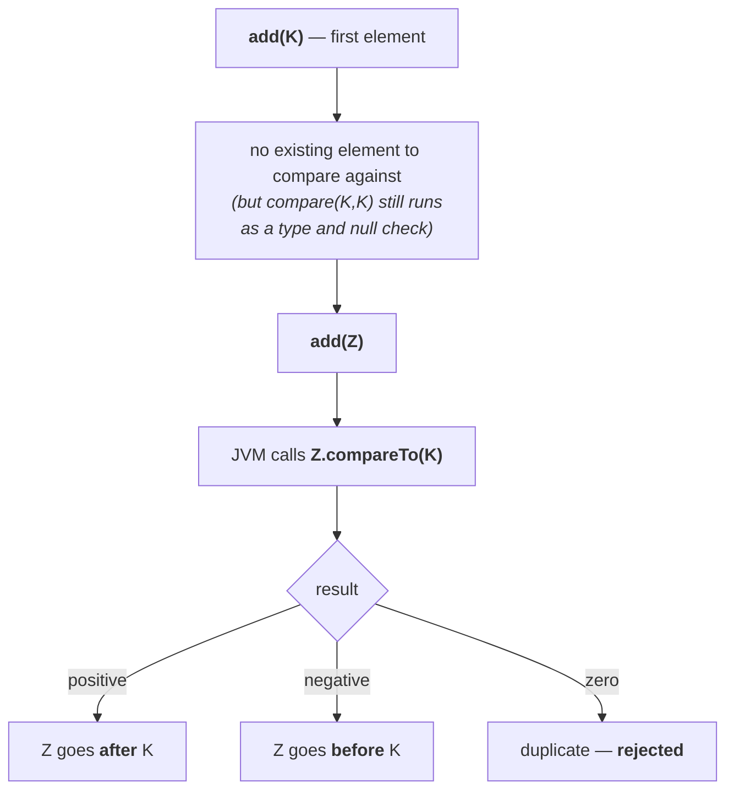

# `TreeSet`

> [!info] **Why there is no `SortedSet` demo.** *"For `SortedSet`, can you please explain a demo
> program? You can't — because `SortedSet` is an interface. If it were a class I could create an object
> and show it."* `TreeSet` is its implementation class, so this is where the behaviour becomes visible.
>
> `NavigableSet` is deferred to its own session on the 1.6 enhancements.

| | |
|---|---|
| **Underlying data structure** | **balanced tree** |
| **Duplicates** | ❌ not allowed |
| **Insertion order** | ❌ not preserved — objects go in by **sorting order** |
| **Heterogeneous objects** | ❌ **not allowed** — `ClassCastException` |
| **`null` insertion** | ❌ **not allowed** (see below) |
| **Implements** | `Serializable`, `Cloneable` — not `RandomAccess` |
| **Sorting** | **default natural** or **customised** |

**`TreeSet` is one of the two exceptions to the heterogeneous rule** from note `03` — the other being
`TreeMap`. The reason is the same: sorting requires **comparison**, and you cannot compare a
`String` with an `Integer`.

---

# The four constructors

> [!important] **Learn these carefully — they repeat verbatim for `TreeMap`.** *"Even in the next
> classes we are going to cover `SortedMap`, `TreeMap` — same terminology, copy paste."*

**1 — default natural sorting order**

```java
TreeSet t = new TreeSet();
```

> Creates an empty `TreeSet` where the elements will be inserted according to **default natural
> sorting order**.

**2 — customised sorting order**

```java
TreeSet t = new TreeSet(Comparator c);
```

> Creates an empty `TreeSet` where the elements will be inserted according to **customised sorting
> order**, specified by the `Comparator` object.

**3 and 4 — inter-conversion**

```java
TreeSet t = new TreeSet(Collection c);
TreeSet t = new TreeSet(SortedSet s);
```

The `SortedSet` version **carries the source's sorting across**; the plain `Collection` version has no
sorting to carry, so **default natural sorting order is used**.

Confirmed on JDK 25: `TreeSet` has exactly **4** public constructors.

> [!important] **The thumb rule to carry through the rest of the chapter:**
>
> | Constructor argument | Sorting |
> |---|---|
> | **no argument** | **default natural** sorting order → `Comparable` |
> | **`Comparator`** | **customised** sorting order → `Comparator` |
>
> *"Remember this thumb rule, because we are going to use these two words minimum 10 times."*

---

# Demo 1 — default natural sorting order

```java
import java.util.*;

class TreeSetDemo {
    public static void main(String[] args) {
        TreeSet t = new TreeSet();
        t.add("A");
        t.add("a");
        t.add("B");
        t.add("Z");
        t.add("L");
        System.out.println(t);
    }
}
```

Measured on JDK 25:

```
[A, B, L, Z, a]
```

**Note where lowercase `a` lands — at the end, not the start.**

> [!important] **Small `a` is bigger than capital `A`.** Their Unicode values are **97** and **65**,
> and *"default natural sorting order"* for strings means comparing those numbers. So every capital
> letter sorts before every lowercase one. Measured on JDK 25: `'a'=97  'A'=65`.
>
> This is the single most common surprise in string sorting, and it is why `"Zebra"` comes before
> `"apple"`.

## Adding a heterogeneous object

```java
t.add("A");
t.add(10);      // Integer into a TreeSet of Strings
```

Measured on JDK 25:

```
java.lang.ClassCastException: class java.lang.String cannot be cast to class java.lang.Integer
```

---

# `null` acceptance

He gives this its own heading, and there is a version story attached.

> **Whenever we add an object to a `TreeSet`, comparison must be performed.** Where does `null` go —
> before `A` or after `A`? To decide, `null` has to be compared with an existing element, and
> comparing anything with `null` gives a `NullPointerException`.

**Measured on JDK 25:**

| | Result |
|---|---|
| non-empty `TreeSet`, then `add(null)` | ❌ `NullPointerException` |
| **empty** `TreeSet`, `add(null)` as the **first** element | ❌ `NullPointerException` |
| `add(null)` first, then `add("A")` | ❌ `NullPointerException` |

> **`null` is not allowed in a `TreeSet` — not even as the first element.**

> [!important] **Older material says the first element is a special case, and it was true through
> Java 6.** The reasoning was sound: the first element has nothing to be compared *against*, so no
> comparison happens and `null` slips in. It was Java 7 that closed the loophole, and Durga Sir
> demonstrates the change live by switching JDKs mid-lecture — *"1.6 gives you `null`, 1.7 gives you
> `NullPointerException`."*
>
> **The fix is one line in `TreeMap`**, visible in the JDK 25 source:
> ```java
> private void addEntryToEmptyMap(K key, V value) {
>     compare(key, key);   // type (and possibly null) check
>     ...
> ```
> The first element is now **compared with itself**, purely to force the null check and the type check
> to happen. So *"`null` — such a type of story is not applicable for `TreeSet`."*

> [!important] **The same line means the first element is type-checked too.** A single non-`Comparable`
> object in an otherwise empty `TreeSet` fails immediately:
> ```java
> TreeSet t = new TreeSet();
> t.add(new Student("durga"));     // the only element
> ```
> ```
> java.lang.ClassCastException: class Student cannot be cast to class java.lang.Comparable
> ```
> **You do not need two elements to trigger the error.** `compare(key, key)` is the whole reason.

---

# Demo 2 — homogeneous but not comparable

The point of this example: **homogeneous is not sufficient.** All the objects can be the same type and
the `TreeSet` can still refuse them.

```java
import java.util.*;

class TreeSetDemo1 {
    public static void main(String[] args) {
        TreeSet t = new TreeSet();
        t.add(new Student("durga"));
        t.add(new Student("ravi"));
        System.out.println(t);
    }
}

class Student {
    String name;
    Student(String n) { name = n; }
    public String toString() { return name; }
}
```

Measured on JDK 25:

```
java.lang.ClassCastException: class Student cannot be cast to class java.lang.Comparable
```

**Both objects are `Student`s** — perfectly homogeneous. The failure is that `Student` does not
implement `Comparable`, so the `TreeSet` has no way to order them.

> **If we are depending on default natural sorting order, compulsorily the objects should be
> homogeneous AND comparable. Otherwise we will get a runtime exception saying
> `ClassCastException`.**

**Read the error message itself** — `cannot be cast to java.lang.Comparable` names exactly what is
missing. That is the tell that distinguishes this failure from the heterogeneous one, whose message
names two concrete classes instead.

## What "comparable" means

> **An object is said to be comparable if and only if the corresponding class implements the
> `Comparable` interface.**

| Class | `Comparable`? |
|---|---|
| `String` | ✅ |
| All **wrapper classes** — `Integer`, `Double`, `Byte`, … | ✅ |
| `StringBuffer` | ✅ *(see below)* |
| A class you wrote, without implementing it | ❌ |

Confirmed on JDK 25 with `javap java.lang.String`:

```
public final class java.lang.String implements java.io.Serializable,
        java.lang.Comparable<java.lang.String>, java.lang.CharSequence, ...
```

> [!important] **Older material uses `StringBuffer` as the example of a non-comparable class, and that
> no longer works.** `StringBuffer` and `StringBuilder` **gained `compareTo` in Java 11**
> (JDK-8137326), so a `TreeSet` of `StringBuffer` now sorts happily:
> ```java
> TreeSet t = new TreeSet();
> t.add(new StringBuffer("A")); t.add(new StringBuffer("Z"));
> t.add(new StringBuffer("L")); t.add(new StringBuffer("B"));
> ```
> ```
> [A, B, L, Z]
> ```
> Measured on JDK 25, and `javap` confirms `StringBuffer implements ... Comparable<StringBuffer>`.
> Bisected with `--release`: fails at **10**, compiles at **11**.
>
> **The rule is unchanged** — homogeneous *and* comparable — but you need a genuinely non-comparable
> class to demonstrate it, which is why the example above uses a hand-written `Student`. If an exam
> paper asks about `TreeSet` and `StringBuffer` expecting `ClassCastException`, it is testing Java 10
> or earlier.

---

# The `Comparable` interface

| | |
|---|---|
| **Package** | **`java.lang`** |
| **Methods** | **one** — `compareTo` |

Confirmed on JDK 25: package `java.lang`, exactly **1** declared method, named `compareTo`.

```java
public int compareTo(Object obj)
```

## Why the return type is `int` and not `boolean`

Compare two objects and there are **three** possible answers:

1. `obj1` should come **before** `obj2`
2. `obj1` should come **after** `obj2`
3. `obj1` and `obj2` are **equal** — a duplicate, which a `TreeSet` will reject

> **`boolean` covers only two cases. Three cases need `int`** — negative, positive and zero.

## The contract

For `obj1.compareTo(obj2)`:

| Returns | Meaning |
|---|---|
| **negative** | `obj1` has to come **before** `obj2` |
| **positive** | `obj1` has to come **after** `obj2` |
| **zero** | `obj1` and `obj2` are **equal** |

> [!important] **The sign is what matters, not the magnitude.** *"Maybe minus one, minus 100, minus
> 1000, minus 10000 — all are equal. Value is not important, sign only."* Never write code that depends
> on `compareTo` returning a particular number.

## Measured

```java
class Tester {
    public static void main(String[] args) {
        System.out.println("A".compareTo("Z"));
        System.out.println("Z".compareTo("K"));
        System.out.println("A".compareTo("A"));
        System.out.println("A".compareTo(null));
    }
}
```

Measured on JDK 25:

```
-25
15
0
java.lang.NullPointerException
```

| Call | Result | Why |
|---|---|---|
| `"A".compareTo("Z")` | **−25** | `A` comes **before** `Z` → negative |
| `"Z".compareTo("K")` | **15** | `Z` comes **after** `K` → positive |
| `"A".compareTo("A")` | **0** | equal |
| `"A".compareTo(null)` | **`NullPointerException`** | — |

**That last line is the null-acceptance rule from earlier, seen at its source.** `TreeSet` rejects
`null` because `compareTo` does.

> [!info] **Learn this contract properly, because `Comparator` reuses it.** The next session's
> `compare()` method has the same three-way negative/positive/zero return, so *"if you are able to
> understand this terminology, the next things will become a bit easy."*

---

# How `TreeSet` and `compareTo` connect

The question worth asking: **how does the JVM decide the order?**

```java
TreeSet t = new TreeSet();
t.add("K");
t.add("Z");
t.add("A");
t.add("A");
System.out.println(t);
```

```
[A, K, Z]
```

**One `A`**, because duplicates are rejected. And the order is alphabetical. But *how*?

> **Whenever we try to insert an object into a `TreeSet`, if we are depending on default natural
> sorting order, internally the JVM calls the `compareTo()` method.**



## Which object is `obj1`?

> [!important] **This is where most people get confused, and it is worth fixing once.**
>
> In `obj1.compareTo(obj2)`:
>
> | | |
> |---|---|
> | **`obj1`** | the object **which is to be inserted** — the new one |
> | **`obj2`** | the object **which is already inserted** — the one in the set |
>
> So inserting `Z` into a set that already holds `K` calls **`Z.compareTo(K)`**, not the other way
> round. **The incoming object is always the one the method is called on.**
>
> Getting this backwards inverts your entire sort order, which is exactly the bug that shows up when
> people write their first `compareTo`.

---

# What this part established

| | |
|---|---|
| `TreeSet` data structure | **balanced tree** |
| Duplicates / insertion order | ❌ / ❌ — objects go in by **sorting order** |
| Heterogeneous objects | ❌ — **`ClassCastException`** |
| Why | sorting needs **comparison**, comparison needs one type |
| The four constructors | no-arg · **`Comparator`** · `Collection` · `SortedSet` |
| **The thumb rule** | **no argument → default natural** · **`Comparator` → customised** |
| Small `a` vs capital `A` | **`a` is bigger** — Unicode 97 vs 65 |
| `null` in a `TreeSet` | ❌ **never**, not even as the first element |
| Why the first element is not exempt | `TreeMap` runs **`compare(key, key)`** as a type and null check |
| Homogeneous is not enough | objects must also be **comparable** |
| Comparable means | the class **implements `Comparable`** |
| Comparable classes | `String`, all **wrapper** classes, `StringBuffer` *(since Java 11)* |
| Not comparable | any class you wrote without implementing it |
| The failure | `ClassCastException: ... cannot be cast to java.lang.Comparable` |
| `Comparable` lives in | **`java.lang`**, **one** method — `compareTo` |
| Return type is `int` because | there are **three** outcomes, not two |
| negative / positive / zero | **before** / **after** / **equal** |
| Only the **sign** matters | never depend on the magnitude |
| `"A".compareTo(null)` | **`NullPointerException`** — the root of the `null` rule |
| Who calls `compareTo` | the **JVM**, on every insertion |
| `obj1` is | the object **being inserted**; `obj2` is the one **already there** |
