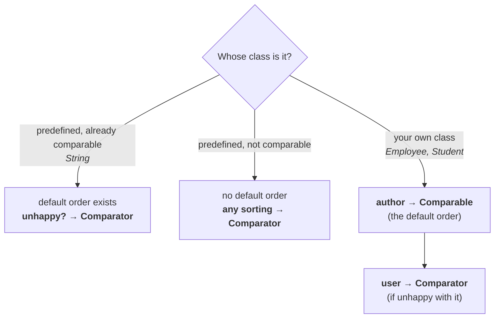

# Example 1 — strings in reverse alphabetical order

> **Write a program to insert string objects into a `TreeSet` where all elements should be inserted
> according to reverse of alphabetical order.**

**Default natural sorting order for strings is alphabetical**, so this is the opposite of what you get
for free.

```java
import java.util.*;

class TreeSetDemo2 {
    public static void main(String[] args) {
        TreeSet t = new TreeSet(new MyComparator());
        t.add("Roja");
        t.add("Shobharani");
        t.add("Rajakumari");
        t.add("Gangabhavani");
        t.add("Ramulamma");
        System.out.println(t);
    }
}

class MyComparator implements Comparator {
    public int compare(Object obj1, Object obj2) {
        String s1 = (String) obj1;
        String s2 = obj2.toString();
        return -s1.compareTo(s2);
    }
}
```

**Without a comparator**, measured on JDK 25:

```
[Gangabhavani, Rajakumari, Ramulamma, Roja, Shobharani]
```

**With the comparator:**

```
[Shobharani, Roja, Ramulamma, Rajakumari, Gangabhavani]
```

> [!info] **How alphabetical order breaks ties.** `Rajakumari`, `Ramulamma` and `Roja` all begin with
> `R`. Compare the second character: `a`, `a`, `o` — so `Roja` sorts last of the three. The first two
> are still tied, so compare the third: `j` vs `m` — `Rajakumari` before `Ramulamma`. **Comparison
> proceeds character by character until they differ.**

## Two ways to write the same reversal

```java
return -s1.compareTo(s2);      // negate the result
return s2.compareTo(s1);       // swap the arguments
```

Both give the identical output, verified on JDK 25 — this is rows 4 and 5 of note `09`'s table seen
on real data.

## Two ways to get the `String` out

```java
String s1 = (String) obj1;        // typecast
String s2 = obj2.toString();      // toString()
```

> [!important] **Which one to use, and it matters in the next example.**
>
> - **Typecast** when the elements really are `String`s. It fails loudly (`ClassCastException`) if one
>   is not, which is often what you want.
> - **`toString()`** when the elements are *not* `String`s but have a useful string form — a
>   `StringBuffer`, say. **Typecasting a `StringBuffer` to `String` would fail**; `toString()` converts
>   it.

---

# Example 2 — sorting `StringBuffer` objects

```java
TreeSet t = new TreeSet(new MyComparator());
t.add(new StringBuffer("A"));
t.add(new StringBuffer("Z"));
t.add(new StringBuffer("K"));
t.add(new StringBuffer("L"));
System.out.println(t);
```

```java
class MyComparator implements Comparator {
    public int compare(Object obj1, Object obj2) {
        String s1 = obj1.toString();      // typecast would fail here
        String s2 = obj2.toString();
        return s1.compareTo(s2);
    }
}
```

Measured on JDK 25:

```
[A, K, L, Z]
```

> [!important] **Read carefully what is being stored and what is being compared.** The objects going
> into the `TreeSet` are **`StringBuffer` objects**. The sorting is done on their **`String` forms**.
> *"We are adding `StringBuffer` objects into the `TreeSet`, but the sorting is defined based on
> `String` sorting."*
>
> **The comparator decouples the two.** What you store and what you order by need not be the same
> thing — which is the whole reason a comparator is a separate object.

> [!question]- **Deep dive — the trace, and why `obj1` is the incoming object.** Follow one insertion
> and the `obj1`/`obj2` rule from note `08` becomes concrete.
>
> `new StringBuffer("A")` is added first — no comparison needed.
>
> Now `t.add(new StringBuffer("Z"))`. The JVM calls **`compare(Z, A)`**:
>
> - **`obj1`** is `StringBuffer("Z")` — **the object being inserted**
> - **`obj2`** is `StringBuffer("A")` — **the object already there**
>
> Inside: `s1 = "Z"`, `s2 = "A"`, and `"Z".compareTo("A")` returns **positive**, because `Z` comes
> after `A` alphabetically.
>
> **The JVM takes that positive and acts on it** — the new `StringBuffer("Z")` goes to the right of
> `StringBuffer("A")`. It never inspects the objects itself; it only reads the sign.

## Removing the comparator

```java
TreeSet t = new TreeSet();          // no comparator
t.add(new StringBuffer("A"));
```

Older material expects a `ClassCastException` here, because `StringBuffer` did not implement
`Comparable`. **On JDK 25 it works and sorts alphabetically** — `StringBuffer` gained `compareTo` in
Java 11, as note `08` records.

> [!important] **The teaching point survives the change, and it is the important half.**
>
> > **If we are depending on default natural sorting order, the objects must be homogeneous AND
> > comparable. But if we are defining our own sorting by `Comparator`, then the objects need not be
> > comparable — and need not be homogeneous either.**
>
> **A comparator supplies the ordering from outside**, so nothing is required of the elements
> themselves. That is why the next example can mix two unrelated types in one `TreeSet`.

---

# Example 3 — heterogeneous objects, sorted by length

> **Write a program to insert `String` and `StringBuffer` objects into a `TreeSet` where the sorting
> order is increasing length order. If two objects have the same length, then consider their
> alphabetical order.**

**Two types in one `TreeSet`** — which note `03` said was impossible. It is possible here precisely
because a comparator is supplied.

```java
import java.util.*;

class TreeSetDemo12 {
    public static void main(String[] args) {
        TreeSet t = new TreeSet(new MyComparator());
        t.add("A");
        t.add(new StringBuffer("ABC"));
        t.add(new StringBuffer("AA"));
        t.add("XX");
        t.add("ABCD");
        t.add("A");
        System.out.println(t);
    }
}

class MyComparator implements Comparator {
    public int compare(Object obj1, Object obj2) {
        String s1 = obj1.toString();
        String s2 = obj2.toString();
        int l1 = s1.length();
        int l2 = s2.length();

        if (l1 < l2)       return -1;
        else if (l1 > l2)  return +1;
        else               return s1.compareTo(s2);
    }
}
```

Measured on JDK 25:

```
[A, AA, XX, ABC, ABCD]
```

**Walk the output against the requirement:**

| Element | Length | Why it is here |
|---|---|---|
| `A` | 1 | shortest — and the second `"A"` was rejected as a **duplicate** |
| `AA` | 2 | tied with `XX` on length, so **alphabetical** decides — `AA` first |
| `XX` | 2 | |
| `ABC` | 3 | |
| `ABCD` | 4 | longest |

> [!important] **The `else` branch is the whole trick, and it is the difference between a correct
> comparator and a broken one.**
>
> Returning **`0`** when the lengths are equal would mean *"these are duplicates"* — and the `TreeSet`
> would throw one away. Measured on JDK 25 with `return 0` in the `else`:
> ```
> [A, AA, ABC, ABCD]
> ```
> **`XX` is gone.** It has the same length as `AA`, so it was discarded.
>
> **Returning `s1.compareTo(s2)` instead** falls back to a *secondary* ordering — alphabetical — which
> keeps both and puts them in a defined order. **This is the standard shape of a multi-key
> comparator:** decide on the primary key, and when it ties, delegate to the next one.

> [!info] **The modern one-liner for exactly this.** Java 8's comparator combinators express the same
> thing without the `if`/`else`:
> ```java
> Comparator.comparingInt((Object o) -> o.toString().length())
>           .thenComparing(Object::toString)
> ```
> `thenComparing` **is** the `else` branch. Worth recognising, because you will meet it far more often
> than the hand-written form in real code.

## Removing the comparator here

```java
TreeSet t = new TreeSet();
t.add("A");
t.add(new StringBuffer("B"));
```

Measured on JDK 25:

```
ClassCastException
```

**This still fails**, and for the original reason: without a comparator, the `TreeSet` asks the
elements to compare themselves, and a `String` cannot compare itself to a `StringBuffer`. **Supplying
a comparator is what makes heterogeneous elements possible.**

---

# When to use `Comparable`, when to use `Comparator`

A student asks the obvious question during the break:

> *"Why don't we just override `compareTo()`? Then our own `compareTo()` would execute, and we would
> not need `Comparator` at all."*

**The answer depends on whose class it is.** He splits every class into three groups.

## Group 1 — predefined comparable classes

**Example: `String`.** Default natural sorting order is already available, because the class already
implements `Comparable`.

> **If you are not satisfied with the default natural sorting order, go for `Comparator`.**

**Why not override `compareTo()`?** To change it you would have to modify `java.lang.String` itself.
It is a **predefined class** — you cannot change it, and you would not want to.

## Group 2 — predefined non-comparable classes

**Example: a predefined class with no natural order of its own.** There is no default sorting order at
all.

> **If you want any sorting, compulsorily go for `Comparator`.**

Same reason: you cannot add `compareTo()` to a class you did not write.

## Group 3 — our own classes

**Examples: `Employee`, `Student`, `Customer`.**

Here there are **two people**, and the split between them is the actual answer:

| | Responsibility |
|---|---|
| **The person who WRITES the class** | define the **default natural sorting order** by implementing **`Comparable`** |
| **The person who USES the class** | if satisfied with that order, use it directly. **If not satisfied, define their own sorting with `Comparator`** |

> [!info] **They are usually different people, even though both are programmers.** *"Some people wrote
> the `String` class, and I am using it."* An `Employee` class is written by one developer and consumed
> by others — so the class's author gets one chance to pick a sensible default, and every consumer
> gets unlimited chances to override it locally.



> [!important] **The one-sentence version:** **`Comparable` is for the class's author; `Comparator` is
> for the class's consumer.** You can only implement `Comparable` on a class you control, and you can
> always write a `Comparator` for a class you do not.
>
> This also explains why a class gets **one** `Comparable` and **any number** of `Comparator`s — there
> is one author, and many consumers with different needs.

---

# What this part established

| | |
|---|---|
| Reverse alphabetical | `-s1.compareTo(s2)` **or** `s2.compareTo(s1)` |
| Getting a `String` from the argument | **typecast** when it is a `String`; **`toString()`** when it is not |
| A comparator decouples | **what is stored** from **what is sorted on** |
| Sorting `StringBuffer` by its text | `obj.toString()` inside `compare()` |
| With a comparator, elements need not be | **comparable** — or **homogeneous** |
| Without one | `ClassCastException` for mixed types |
| Multi-key sorting | primary key first; on a tie, **delegate to a secondary key** |
| Returning `0` on a tie | ❌ treats them as **duplicates** — one is discarded |
| Returning `s1.compareTo(s2)` on a tie | ✅ keeps both, in a defined order |
| The modern equivalent | `Comparator.comparingInt(...).thenComparing(...)` |
| Predefined **comparable** class | default order exists → **`Comparator`** to change it |
| Predefined **non-comparable** class | no default order → **`Comparator`** for any order |
| Your own class — **author** | implements **`Comparable`** — the default order |
| Your own class — **user** | writes a **`Comparator`** if unhappy with the default |
| Why not just override `compareTo()` | you **cannot modify a predefined class** |
| The one-sentence version | **`Comparable` = author, `Comparator` = consumer** |
