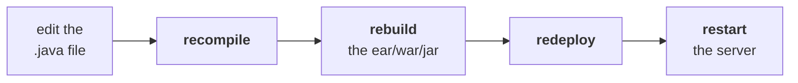

# `Hashtable`

The first of the two legacy map classes.

| | |
|---|---|
| **Underlying data structure** | **hash table** |
| **Insertion order** | ❌ not preserved — based on **hash code of keys** |
| **Duplicate keys** | ❌ not allowed |
| **Duplicate values** | ✅ allowed |
| **Heterogeneous objects** | ✅ allowed, for **both** keys and values |
| **`null` key** | ❌ **not allowed** |
| **`null` value** | ❌ **not allowed** |
| **Implements** | `Serializable`, `Cloneable` — not `RandomAccess` |
| **Every method** | **synchronized** → the object is **thread safe** |
| **Best choice for** | **search** operations |

> [!info] **The class and its data structure share a name.** The underlying data structure for `Hashtable` is hash table only. Hash table is a standard data structure; Java's class is implemented on it and took the name.

## `null` is banned outright

Measured on JDK 25:

```
null VALUE -> NullPointerException
null KEY   -> NullPointerException
```

> **`null` — such a type of story is not applicable for `Hashtable`**, for either the key or the value.

> [!important] **This is the sharpest `HashMap` vs `Hashtable` difference after synchronization**, and it is asked directly:
>
> | | `HashMap` | `Hashtable` |
> |---|---|---|
> | `null` key | ✅ **once** | ❌ |
> | `null` values | ✅ **any number** | ❌ |
> | Methods | non-synchronized | **synchronized** |
> | Thread safe | ❌ | ✅ |
> | Performance | **high** | low |
> | Version | 1.2 | **1.0 — legacy** |

## The four constructors

Same shape as every hashing class — **with one number changed:**

```java
Hashtable h = new Hashtable();                                  // capacity 11, fill ratio 0.75
Hashtable h = new Hashtable(int initialCapacity);
Hashtable h = new Hashtable(int initialCapacity, float fillRatio);
Hashtable h = new Hashtable(Map m);
```

> [!important] **Default initial capacity is 11, not 16.** `HashSet`, `HashMap` and `LinkedHashMap` all default to **16**; `Hashtable` defaults to **11**. The fill ratio is **0.75** in every case.
>
> **This is a favourite exam trip-up.** The odd number is a leftover from 1.0, when a prime capacity was thought to spread hash codes more evenly.

Confirmed on JDK 25: **4** constructors, and `Hashtable`'s superclass is **`Dictionary`**.

---

# How hashing actually stores the entries

The best part of this session — not theory, but a program that makes the bucket layout visible.

## The instrument

```java
class Temper {
    int i;
    Temper(int i) { this.i = i; }

    public int hashCode() { return i; }        // we choose the hash code
    public String toString() { return i + ""; }
}
```

> [!info] **Both overrides exist to make the internals observable.** `hashCode()` normally returns something unpredictable from `Object`, so **we override it to return a number we chose** — now we know exactly where each key should land. `toString()` prints that number, so the output is readable. `i + ""` converts the `int` to a `String`, because `toString()` must return a `String`.

## The program

```java
import java.util.*;

class HashtableDemo {
    public static void main(String[] args) {
        Hashtable h = new Hashtable();
        h.put(new Temper(5),  "A");
        h.put(new Temper(2),  "B");
        h.put(new Temper(6),  "C");
        h.put(new Temper(15), "D");
        h.put(new Temper(23), "E");
        h.put(new Temper(16), "F");
        System.out.println(h);
    }
}
```

## Where each entry lands

**Default capacity 11 means 11 buckets, numbered 0 to 10.** A key with hash code **n** goes to bucket **`n % 11`**:

| Key | hash code | bucket | |
|---|---|---|---|
| `5` | 5 | **5** | |
| `2` | 2 | **2** | |
| `6` | 6 | **6** | |
| `15` | 15 | **4** | 15 % 11 = 4 |
| `23` | 23 | **1** | 23 % 11 = 1 |
| `16` | 16 | **5** | 16 % 11 = 5 — **collides with key 5** |

```
bucket 10  |
bucket  9  |
bucket  8  |
bucket  7  |
bucket  6  |  6=C
bucket  5  |  16=F  →  5=A          ← two entries in one bucket
bucket  4  |  15=D
bucket  3  |
bucket  2  |  2=B
bucket  1  |  23=E
bucket  0  |
```

> **Within a bucket, multiple entries can be stored — no problem at all.** That is what a collision is, and it is handled rather than being an error.

## The printing rule

> **From top to bottom. Within a bucket, from right to left.**

Reading the diagram that way gives `6=C, 16=F, 5=A, 15=D, 2=B, 23=E`.

Measured on JDK 25:

```
{6=C, 16=F, 5=A, 15=D, 2=B, 23=E}
```

**Exactly the predicted order.**

## Change the hash code, change the output

Same program, `hashCode()` now `return i % 9;`:

| Key | `i % 9` | bucket |
|---|---|---|
| `5` | 5 | 5 |
| `2` | 2 | 2 |
| `6` | 6 | 6 |
| `15` | **6** | 6 — collides with key 6 |
| `23` | **5** | 5 — collides with key 5 |
| `16` | **7** | 7 |

Measured on JDK 25:

```
{16=F, 15=D, 6=C, 23=E, 5=A, 2=B}
```

## Change the capacity, change the output

Back to `return i;`, but `new Hashtable(25)` — **25 buckets**, so every key from 2 to 23 gets its own:

Measured on JDK 25:

```
{23=E, 16=F, 15=D, 6=C, 5=A, 2=B}
```

**Plain descending order**, because nothing collides and the buckets are read top to bottom.

> [!important] **Three runs, three different orders, same six entries.** The order out of a hash-based collection is a function of **the hash codes** and **the capacity** — change either and the output changes. **This is the proof behind insertion order is not preserved**, and it is why note `07` refused to predict a `HashSet`'s order.
>
> All three outputs reproduce exactly on JDK 25, a decade after the recording — the bucket mechanics have not moved.

> [!question]- **Deep dive — what modern `HashMap` does that this model does not show.** Worth knowing, because it is a common follow-up question.
>
> The bucket model above is accurate, and since **Java 8** `HashMap` adds one refinement: when a single bucket accumulates **8 or more** entries (`TREEIFY_THRESHOLD = 8`, visible in the JDK source), that bucket's linked list is converted into a **red-black tree**.
>
> **Why:** a bucket with **n** colliding entries costs O(n) to search as a list, but O(log n) as a tree. With a bad `hashCode()` that sends everything to one bucket, the difference between O(n) and O(log n) is the difference between a hung server and a slow one — this change was made partly as a defence against hash-collision denial-of-service attacks.
>
> **It shrinks back** to a list at `UNTREEIFY_THRESHOLD = 6` when entries are removed.
>
> `Hashtable` never got this — another reason it is legacy.

---

# `Properties`

> The most valuable concept, especially for our real-time coding.

## The problem it solves

Suppose your program hard-codes a database username and password:

```java
String user = "scott";
String password = "tiger";
```

**The client requires credentials to change every three months.** To change `tiger` to `tiger123` you must edit the source, and then:



> **Two to three hours of work, and the application is down for it — for one password change.**

> **If anything changes frequently, it is never recommended to hard-code it in the Java program.**

**Put it in a separate properties file instead.** Change the file, restart nothing, recompile nothing.

## What makes `Properties` different from any other map

> **In a normal map — `HashMap`, `Hashtable`, `TreeMap` — the key and value can be any type. But in `Properties`, both the key and the value should be `String` type only.**

**Because a properties file is text**, and everything read out of it is text.

Confirmed on JDK 25: `Properties`' superclass is **`Hashtable`** — so it is a map by inheritance, with the string restriction layered on top.

## The methods

```java
Properties p = new Properties();     // the only constructor you need
```

| Method | |
|---|---|
| `String getProperty(String name)` | the **value** for this property name |
| `String setProperty(String name, String value)` | **add or replace**; returns the **old value** |
| `Enumeration propertyNames()` | **all** property names |
| `void load(InputStream is)` | **read** the file into the object |
| `void store(OutputStream os, String comment)` | **write** the object back to a file |

> [!info] **`setProperty` behaves exactly like `put`** — if the name already exists, the old value is replaced and **returned**; if it is new, it returns `null`. Same contract as note `11`.

> [!info] **`propertyNames()` returns an `Enumeration`, not a `Set`.** That is the legacy cursor from note `05` — `Properties` is a 1.0 class, so it hands you a 1.0 cursor. Modern code uses `stringPropertyNames()`, which returns a `Set<String>`.

## The demo

**`abc.properties`:**

```
user=scott
password=tiger
url=jdbc:oracle:thin:@localhost:1521:xe
```

```java
import java.util.*;
import java.io.*;

class PropertiesDemo {
    public static void main(String[] args) throws Exception {
        Properties p = new Properties();
        FileInputStream fis = new FileInputStream("abc.properties");
        p.load(fis);
        System.out.println(p);

        System.out.println(p.getProperty("user"));
        System.out.println(p.setProperty("nag", "9999"));

        FileOutputStream fos = new FileOutputStream("abc.properties");
        p.store(fos, "Updated by Durga");
        fos.close();
    }
}
```

Measured on JDK 25:

```
whole object    = {password=tiger, user=scott, url=jdbc:oracle:thin:@localhost:1521:xe}
get user        = scott
get missing     = null
setProperty new = null
setProperty dup = scott
```

**And the file after `store()`:**

```
#Updated by Durga
#Sat Aug 15 10:13:14 IST 2026
nag=9999
password=tiger
url=jdbc\:oracle\:thin\:@localhost\:1521\:xe
user=scott2
```

| | |
|---|---|
| `load()` | the file's contents are now **in the map** |
| `getProperty("nosuch")` | **`null`** — a missing name, not an exception |
| `store()` | writes it back, with **your comment and a timestamp** as `#` lines |
| the escaped `\:` | `store()` **escapes** the characters that are special in the format |

> [!info] **`store()` escapes on the way out and `load()` unescapes on the way in.** The colons in the JDBC URL come back written as `\:` — that is the format protecting itself, and reading the file with `load()` returns the original string. **Do not hand-edit those escapes out.**

> [!important] **`Properties` is the one legacy class you will still use.** It is legacy by ancestry — a `Hashtable` subclass from 1.0 — but reading a `.properties` file is exactly what it is for, and nothing replaced it. **Do not put it in the same sentence as `Vector` and `Stack`** when asked what to avoid.

---

# What this part established

| | |
|---|---|
| `Hashtable` data structure | **hash table**, ordered by **hash code of keys** |
| `null` key / `null` value | ❌ **both banned** — `NullPointerException` |
| vs `HashMap` | synchronized vs not · thread safe vs not · slow vs fast · 1.0 legacy vs 1.2 |
| Default initial capacity | **11** — not 16 |
| Default fill ratio | **0.75** |
| `Hashtable`'s superclass | **`Dictionary`** |
| A key with hash code **n** goes to | bucket **`n % capacity`** |
| Two keys in one bucket | a **collision** — both are stored |
| Printing order | **top to bottom**, and **right to left** within a bucket |
| Change the `hashCode()` | the output order changes |
| Change the capacity | the output order changes |
| Which is why | **insertion order is not preserved** is unpredictable, not merely different |
| Modern `HashMap` extra | a bucket of **8+** entries becomes a **red-black tree** |
| `Properties` exists because | anything that **changes frequently** must not be hard-coded |
| The cost of hard-coding | recompile → rebuild → redeploy → restart |
| `Properties` keys and values | **`String` only** |
| Its superclass | **`Hashtable`** |
| The methods | `getProperty` · `setProperty` · `propertyNames` · **`load`** · **`store`** |
| `store()` writes | your **comment**, a **timestamp**, and **escaped** values |
| Still used today | ✅ — legacy by ancestry, current in practice |
