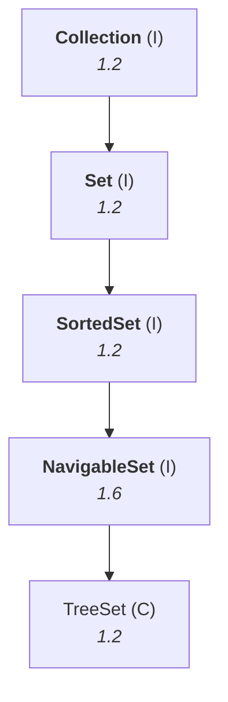
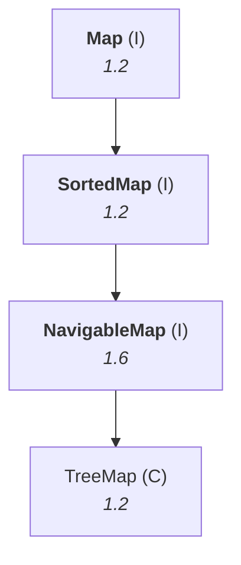

# The 1.6 version enhancements

> **As part of 1.6, the following two concepts were introduced in the collection framework:**
> **1.** `NavigableSet`  **2.** `NavigableMap`

These are the last two of the nine key interfaces from note `02`, deferred until now.

---

# What gap they fill

The best motivation in the chapter, because it starts by showing what the **existing** methods
already do, and then finds the hole.

## The flight timings

Take every departure from an airport as a `SortedSet`:

```
0030  0145  0230  0345  0420  0530  0645  0730
0920  1025  1230  1425  1530  1820  2020  2325  2359
```

**Questions the existing methods already answer:**

| Question | Method |
|---|---|
| What is the **first** flight? | `first()` → `0030` |
| What is the **last** flight? | `last()` → `2359` |
| What flights are **before 10:00**? | `headSet(1000)` |
| What flights are **after 10:00**? | `tailSet(1000)` |
| What flights between **07:00 and 12:00**? | `subSet(700, 1200)` |

**Now the question that has no method:**

> *"Before 10:00, what is the **last** flight?"* — not the list of them, just the one.

> [!question]- **He asks each interface in turn, and each one gives up.** The dramatisation of an API
> gap, and it is a genuinely good way to show why an interface exists.
>
> *"`SortedSet`, can you tell me — before 10:00, what is the last flight?"*
> **`SortedSet` completely hands up.** *"Boss, there is no method with me."*
>
> *"Then `Set`, can you please provide?"* — **"Sorry boss, I can't provide."**
>
> *"Then `Collection`, can you please provide?"* — **"Sorry boss, I can't provide."**
>
> **That is a gap.** And `headSet(1000)` does not close it: it returns *every* flight before 10:00,
> and you would have to take the last element of that yourself.
>
> **"Before 10:00" and "after 10:00" are navigation** — and navigation support was not available in
> `Collection`, `Set` or `SortedSet`. **To fill those gaps, `NavigableSet` came in 1.6.**

---

# `NavigableSet`

> **It is the child interface of `SortedSet`, and it defines several methods for navigation
> purposes.**



## The four navigation methods

**They are two questions × two boundary rules**, which is the way to hold them:

| | **strictly** | **or equal** |
|---|---|---|
| **going down** (highest below) | `lower(e)` | `floor(e)` |
| **going up** (lowest above) | `higher(e)` | `ceiling(e)` |

| Method | Returns |
|---|---|
| `floor(e)` | the **highest** element which is **≤ e** |
| `lower(e)` | the **highest** element which is **< e** |
| `ceiling(e)` | the **lowest** element which is **≥ e** |
| `higher(e)` | the **lowest** element which is **> e** |

**Against the flight timings:**

- `floor(1000)` → **0920** — *"either 10:00 or before 10:00, the last flight"*
- `lower(1000)` → **0920** — *"strictly before 10:00, the last flight"*
- `ceiling(1000)` → **1025** — *"either 10:00 or after, the first flight"*
- `higher(1000)` → **1025** — *"strictly after 10:00, the first flight"*

> [!important] **`floor`/`ceiling` include the argument; `lower`/`higher` exclude it.** The names are
> borrowed from mathematics — the **floor** of a number is the largest integer not above it, the
> **ceiling** the smallest not below it — and they mean exactly that here.
>
> **The mnemonic that survives an exam:** *floor is below you and you are standing on it* (so
> inclusive); *lower is strictly lower than you*.

## The three remaining methods

| Method | |
|---|---|
| `pollFirst()` | **remove and return** the first element |
| `pollLast()` | **remove and return** the last element |
| `descendingSet()` | returns a `NavigableSet` **in reverse order** |

---

# The demo

```java
import java.util.*;

class NavigableSetDemo {
    public static void main(String[] args) {
        TreeSet<Integer> t = new TreeSet<Integer>();
        t.add(1000); t.add(2000); t.add(3000); t.add(4000); t.add(5000);

        System.out.println(t);
        System.out.println(t.ceiling(2000));
        System.out.println(t.higher(2000));
        System.out.println(t.floor(3000));
        System.out.println(t.lower(3000));
        System.out.println(t.pollFirst());
        System.out.println(t.pollLast());
        System.out.println(t.descendingSet());
        System.out.println(t);
    }
}
```

Measured on JDK 25:

```
set              = [1000, 2000, 3000, 4000, 5000]
ceiling(2000)    = 2000
higher(2000)     = 3000
floor(3000)      = 3000
lower(3000)      = 2000
pollFirst()      = 1000
pollLast()       = 5000
descendingSet()  = [4000, 3000, 2000]
set now          = [2000, 3000, 4000]
```

**Read the pairs against each other** — this is where the inclusive/exclusive difference shows:

| | Result | Why |
|---|---|---|
| `ceiling(2000)` | **2000** | 2000 itself qualifies — **≥** includes it |
| `higher(2000)` | **3000** | 2000 is excluded — **>** is strict |
| `floor(3000)` | **3000** | 3000 itself qualifies — **≤** includes it |
| `lower(3000)` | **2000** | 3000 is excluded — **<** is strict |

**The last two lines matter too.** `descendingSet()` shows `[4000, 3000, 2000]` — only three elements,
because `pollFirst()` and `pollLast()` **removed** 1000 and 5000. The final print confirms the set
itself is `[2000, 3000, 4000]`.

> [!important] **`poll` removes; the navigation methods do not.** `ceiling`, `higher`, `floor` and
> `lower` are pure queries and leave the set untouched. **`pollFirst` and `pollLast` mutate it** — the
> same `poll` naming as `Queue` in note `15`, meaning *take it out and hand it to me*.

> [!info] **When nothing qualifies, you get `null`, not an exception.** Measured on JDK 25 with
> `[10, 20, 30]`: `lower(10)` → **`null`** and `higher(30)` → **`null`**. Nothing is strictly below the
> minimum or above the maximum, so there is nothing to return.

> [!info] **`TreeSet<Integer>` is the generic form.** `new TreeSet()` accepts any object;
> `new TreeSet<Integer>()` accepts only `Integer`. The generic version is what you write in real code —
> it is `GENERICS/01`'s type safety applied here.

---

# `NavigableMap`

> **It is the child interface of `SortedMap`, and it defines several methods for navigation
> purposes.**



**The same methods, renamed for maps** — *"copy paste, but instead of set terminology we use map
terminology."*

| `NavigableSet` | `NavigableMap` | |
|---|---|---|
| `floor(e)` | **`floorKey(k)`** | highest key ≤ k |
| `lower(e)` | **`lowerKey(k)`** | highest key < k |
| `ceiling(e)` | **`ceilingKey(k)`** | lowest key ≥ k |
| `higher(e)` | **`higherKey(k)`** | lowest key > k |
| `pollFirst()` | **`pollFirstEntry()`** | remove and return the **first entry** |
| `pollLast()` | **`pollLastEntry()`** | remove and return the **last entry** |
| `descendingSet()` | **`descendingMap()`** | the map in reverse order |

> [!info] **Note the `Key` and `Entry` suffixes, and why they differ.** The four navigation methods
> return a **key**, because that is what you navigate by. The two `poll` methods return an **entry** —
> *"only the key you can't remove"*, since removing an entry means removing the pair.

Measured on JDK 25 with `{101=A, 103=B, 104=C, 107=D, 125=E}`:

```
ceilingKey(104)  = 104
higherKey(104)   = 107
floorKey(104)    = 104
lowerKey(104)    = 103
pollFirstEntry() = 101=A
pollLastEntry()  = 125=E
descendingMap()  = {107=D, 104=C, 103=B}
```

**Identical behaviour to the set**, one level of indirection away.

---

# The re-engineering, one last time

**`NavigableSet` and `NavigableMap` came in 1.6. `TreeSet` and `TreeMap` came in 1.2.**

**So how does a 1.2 class implement a 1.6 interface?** The same answer as `Vector` and `List` in note
`02`: **the classes were re-engineered in 1.6 to implement the new interfaces.**

> [!info] **This is the third time the pattern appears**, and it is worth recognising as a pattern
> rather than three facts: `Vector`/`Stack` → `List` in 1.2, `LinkedList` → `Queue` in 1.5,
> `TreeSet`/`TreeMap` → `Navigable*` in 1.6. **Whenever a class predates the interface it implements,
> the link was retro-fitted.**

---

# What this part established

| | |
|---|---|
| The 1.6 enhancements | **`NavigableSet`** and **`NavigableMap`** |
| `NavigableSet` is | the child of **`SortedSet`** |
| `NavigableMap` is | the child of **`SortedMap`** |
| Why they exist | `Collection`/`Set`/`SortedSet` had **no navigation support** |
| The gap | *"before 10:00, what is the **last** flight?"* |
| `floor(e)` | highest element **≤ e** — **inclusive** |
| `lower(e)` | highest element **< e** — **strict** |
| `ceiling(e)` | lowest element **≥ e** — **inclusive** |
| `higher(e)` | lowest element **> e** — **strict** |
| When nothing qualifies | returns **`null`** |
| `pollFirst()` / `pollLast()` | **remove** and return — these mutate |
| The navigation methods | **do not** mutate |
| `descendingSet()` | the set in **reverse order** |
| Map equivalents | `floorKey` · `lowerKey` · `ceilingKey` · `higherKey` · `pollFirstEntry` · `pollLastEntry` · `descendingMap` |
| Navigation returns a **key** | `poll` returns an **entry** |
| The implementation classes | **`TreeSet`** and **`TreeMap`**, re-engineered in **1.6** |
