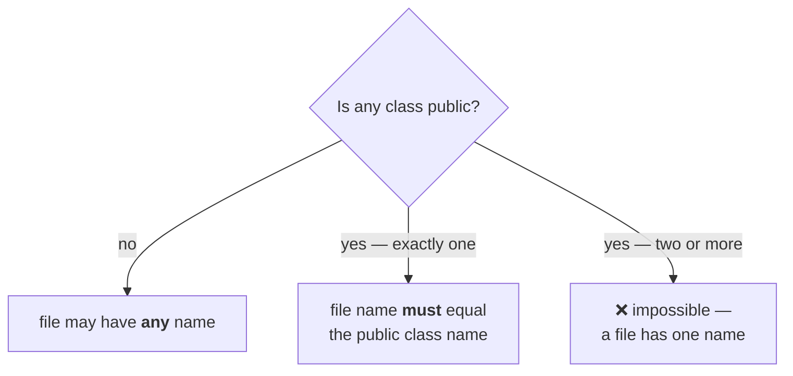

# How many classes a Java program can hold

> **1. A Java program can contain any number of classes.**

```java
class A { }
class B { }
class C { }
```

> **2. At most one class can be declared `public`** — *at most* meaning **zero or one**.
> **3. If there is a public class, the name of the program and the name of the public class must match.** Otherwise, compile-time error.
> **4. If there is no public class, any name can be used. No restrictions.**

## Case 1 — no public class

```java
class A { }
class B { }
class C { }
```

Save it as `D.java`. Measured on JDK 25 — **compiles fine.** Save it as `A.java`, `B.java` or
`Z.java`; all fine. No public class means no constraint.

## Case 2 — one public class, wrong file name

```java
class A { }
public class B { }
class C { }
```

saved as **`D.java`**. Measured on JDK 25:

```
D.java:2: error: class B is public, should be declared in a file named B.java
public class B { }
       ^
```

> *"The compiler very decently provides the information."* It does not just reject the file — it tells you the exact name it wants.

Save the identical code as **`B.java`** and it compiles.

## Case 3 — two public classes

```java
class A { }
public class B2 { }
public class C2 { }
```

saved as `B2.java`. Measured on JDK 25:

```
B2.java:3: error: class C2 is public, should be declared in a file named C2.java
```

Read what the compiler is really saying: `B2` is fine — it is public and the file is `B2.java`. It is **`C2`** that has no home. Since a file has only one name, **only one class can be public**, and the "at most one" rule falls out of the naming rule rather than being a separate law.



---

# Compiling vs running

A second program, this time with `main` in several classes:

```java
class A {
    public static void main(String[] args) { System.out.println("A class main"); }
}
class B {
    public static void main(String[] args) { System.out.println("B class main"); }
}
class C {
    public static void main(String[] args) { System.out.println("C class main"); }
}
class D { }
```

saved as **`D.java`** — legal, since no class is public.

## One class file per class

```
$ javac D.java
$ ls
A.class  B.class  C.class  D.class
```

> **Whenever we compile a Java program, a separate `.class` file is generated for every class present in that program.**

Four classes, four class files. And note what is **not** there: there is no file named after the *program*. 
Measured on JDK 25 — compiling `D.java` produces `A.class`, `B.class`, `C.class` and
`D.class`, because `D` happens to be a class here. Had the file been named `Durga.java`, no `Durga.class` would appear.

> **Class file names are based on the classes present in the program, not on the name of the program.**

## The distinction to memorise

> **We compile a Java *program* (a source file). We run a Java *class*.**

Look at what each command takes as its argument:

| Command | Argument |
|---|---|
| `javac D.java` | the **name of the program** — with `.java` |
| `java A` | the **name of a class** — no extension |

## Which `main` runs

> **Whenever we execute a Java class, the corresponding class's `main` method is executed.**

Measured on JDK 25:

```
$ java A
A class main

$ java B
B class main

$ java C
C class main
```

Three `main` methods in one file is not ambiguous at all — you name the class, you get that class's `main`.

## When it goes wrong

**Running a class with no `main`:**

```
$ java D
Error: Main method not found in class D, please define the main method as:
   public static void main(String[] args)
or a JavaFX application class must extend javafx.application.Application
```

**Running a class that does not exist:**

```
$ java Durga
Error: Could not find or load main class Durga
Caused by: java.lang.ClassNotFoundException: Durga
```

**The two conclusions:** no `main` in the class you named → runtime failure about `main`; no class file at all → runtime failure about the class.

> [!important] The second failure names `ClassNotFoundException`, not `NoClassDefFoundError` — and
> the difference is itself an interview question.** `ClassNotFoundException` is a **checked `Exception`, thrown when a class is looked up by name and is not on the classpath.
> 
> `NoClassDefFoundError` is an **`Error`**, thrown when the class *was* present at compile time but is missing at run time, or when its static initialiser already failed once. 
> A missing main class is the first case, so that is what the launcher reports.

> [!info] **Single-file source launch — you can skip `javac` entirely for a one-file program:**
> ```
> $ java Fq.java
> [works with the fully qualified name]
> ```
> Measured on JDK 25. It compiles in memory and runs the first class it finds — handy for exactly the
> throwaway experiments this chapter is full of. It does not change any rule above.

---

# One class per file — why it is worth the discipline

Everything above says you *may* put many classes in one file. The next section says do not.

> **It is not recommended to declare multiple classes in a single source file. Declare only one class per source file, and keep the program name the same as the class name.**

> **The main advantage of this approach: readability and maintainability of the code will be improved.**

---

# Import statements


```java
class Test {
    public static void main(String[] args) {
        ArrayList l = new ArrayList();
    }
}
```

Measured on JDK 25:

```
error: cannot find symbol
  symbol:   class ArrayList
  location: class Test
```

> The compiler is saying, very politely: *"You are using some class named `ArrayList`. Where is it available? First let me know, then only I can compile."*

## The doubt he raises about the compiler

> *"If the compiler really doesn't know anything about `ArrayList`, how did it identify that
> `ArrayList` is a **class**? Maybe the compiler is acting."*

A fair suspicion — and testable. Use the same unknown name three different ways and see what the
compiler calls it. Measured on JDK 25:

| Code | `symbol:` reported |
|---|---|
| `ArrayList l = new ArrayList();` | `class ArrayList` |
| `System.out.println(ArrayList);` | `variable ArrayList` |
| `ArrayList();` | `method ArrayList()` |

> [!important] **So the compiler really is innocent.** It does not know what `ArrayList` is. It reports the **role you used the name in** — 
> used like a class, it says class; 
> used like a variable, it says variable; 
> used like a method, it says method. 
>
> It is describing your syntax back to you, not consulting any knowledge of the JDK.

---

# What this part established

|                                 |                                                                             |
| ------------------------------- | --------------------------------------------------------------------------- |
| Classes per program             | **any number**                                                              |
| Public classes per program      | **at most one** — zero or one                                               |
| If there is a public class      | the file name **must** match it                                             |
| If there is no public class     | **any** file name                                                           |
| The error                       | `class B is public, should be declared in a file named B.java`              |
| Class-with-`main` and file name | **no relation at all**                                                      |
| Class files generated           | **one per class**, named after the **classes**, not the program             |
| We compile                      | a Java **program** (source file)                                            |
| We run                          | a Java **class**                                                            |
| Which `main` runs               | the one in the class you named                                              |
| Class with no `main` (1.6)      | `NoSuchMethodError: main`                                                   |
| Class with no `main` (JDK 25)   | `Error: Main method not found in class D`                                   |
| Missing class (1.6)             | `NoClassDefFoundError`                                                      |
| Missing class (JDK 25)          | `Could not find or load main class` / `ClassNotFoundException`              |
| Since Java 11                   | `java File.java` runs a single file with no `javac`                         |
| Recommended                     | **one class per source file**, file named after it                          |
| Why                             | readability and maintainability — the 250-classes-in-3-files search problem |
| Unknown name used as a class    | `cannot find symbol: class ArrayList`                                       |
| …as a variable                  | `cannot find symbol: variable ArrayList`                                    |
| …as a method                    | `cannot find symbol: method ArrayList()`                                    |
| What that proves                | the compiler reports the **role you used**, it knows nothing                |
| Fully qualified name            | `java.util.ArrayList` — the complete path, nothing left to ask              |
| Its cost                        | longer code, worse readability                                              |
| Import statement                | acts as a **typing shortcut** — nothing more                                |
