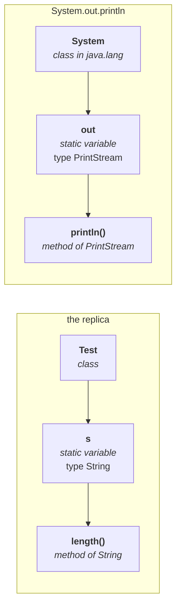

# Recap

> **According to Sun, static import improves readability. According to worldwide programming experts,
> static import reduces readability and creates confusion — so if there is no specific requirement, it
> is not recommended.**
>
> **Usually we access static members using the class name. Whenever we write a static import, we can
> access them directly, without the class name.**

This part uses that mechanism to answer a much more commonly asked question.

---

# "Explain `System.out.println`"

> *"Very silly things you can expect in the interview room — but the unfortunate thing is most people
> are unable to answer this type of question. Can you explain about `System.out.println`? You never
> expect it, but you are not in a position to answer it."*

He builds the answer by first constructing a **replica you already understand**, then mapping it.

## The replica

```java
class Test {
    static String s = "java";
}
```

Now find the length of that string:

```java
System.out.println(Test.s.length());
```

Measured on JDK 25:

```
4
```

**Take that expression apart, piece by piece:**

| Piece | What it is |
|---|---|
| `Test` | a **class** name |
| `s` | a **static variable** present in the `Test` class, of type `java.lang.String` |
| `.length()` | a **method** present in the **`String`** class |

**Why is `Test.s` written that way?** Because `s` is a static variable, and static variables are
accessed **through the class name**. And why can you call `.length()` on it? Because `Test.s` **is** a
`String`, so any `String` method applies.

## Now the same shape, for real

```java
System.out.println("hello");
```

| Piece | What it is |
|---|---|
| `System` | a **class** present in the **`java.lang`** package |
| `out` | a **static variable** present in the `System` class, of type **`PrintStream`** |
| `println` | a **method** present in the **`PrintStream`** class |



**Identical structure.** `System.out` is not magic syntax — it is a static variable being read through
its class name, exactly like `Test.s`.

> **And where does the output go?** `out` points to the **standard output device**, which is the
> **console**. Whatever you write through it is printed there.

That is the whole answer, and it is why the replica was worth building.

---

# Static import applied to `out`

Since `out` is *just* a static variable, the previous session's trick applies to it.

**Without a static import**, `out` alone means nothing. Measured on JDK 25:

```java
out.println("hello");
```
```
error: cannot find symbol
  symbol:   variable out
```

**With one:**

```java
import static java.lang.System.out;

class Out {
    public static void main(String[] args) {
        out.println("hello");
        out.println("hi");
    }
}
```

Measured on JDK 25:

```
hello
hi
```

> **`System` is gone from every call site.** Write the import once and `out.println(…)` works
> everywhere in the file.

> [!info] **You have seen this style before.** In servlets you write `PrintStream out = response.getWriter();`
> and then `out.println(...)` — the same shape, reached a different way.

---

# Ambiguity in static imports

The same trap as ordinary imports, one level down.

Every number-type wrapper class — `Byte`, `Short`, `Integer`, `Long`, `Float`, `Double` — has a static
`MAX_VALUE`. Import two of them wholesale:

```java
import static java.lang.Integer.*;
import static java.lang.Byte.*;

System.out.println(MAX_VALUE);
```

Measured on JDK 25:

```
error: reference to MAX_VALUE is ambiguous
```

**Exactly the `java.util.Date` vs `java.sql.Date` problem**, with static members instead of classes.

---

# The resolution order — and it is NOT the same as for normal imports

This is the examinable payoff of the part, and he sets it up as a trap.

**Three sources of `MAX_VALUE` at once:**

```java
import static java.lang.Integer.MAX_VALUE;   // explicit static import
import static java.lang.Byte.*;              // implicit static import

class R1 {
    static int MAX_VALUE = 999;              // the current class's own
    public static void main(String[] args) {
        System.out.println(MAX_VALUE);
    }
}
```

**Which one wins?** Most of the class answers *"Integer — because explicit import has the highest
priority."* That is the rule from the previous session.

> *"Who told you, man? **That rule is applicable for normal import, not for static import.** Static
> import rules are different from normal import rules. Don't copy-paste everywhere."*

> **While resolving static members, the highest priority goes to the CURRENT CLASS's static members.
> Then explicit static import. Then implicit static import.**

Measured on JDK 25, removing one source at a time:

| Sources present | Output | Winner |
|---|---|---|
| current class + explicit + implicit | **999** | the **current class** |
| explicit + implicit | **2147483647** | **`Integer`** (explicit) |
| implicit only | **127** | **`Byte`** (implicit) |

## The two orders side by side

| | Normal import | **Static import** |
|---|---|---|
| 1 | **explicit** class import | **current class** static members |
| 2 | classes in the **current working directory** | **explicit** static import |
| 3 | **implicit** class import | **implicit** static import |

> [!important] **Why the difference makes sense.** For a *class* name there is no "current class" tier
> — a class is not a member of the class using it, so the list starts at the imports. For a *static
> member* there is, and the language resolves what is **declared right here** before it looks anywhere
> else. Your own declarations always win over anything imported.
>
> *"Our class only contains one static variable — what is the need of bringing it from `Integer` or
> `Byte`?"*

---

# What this part established

| | |
|---|---|
| `System` | a **class** in **`java.lang`** |
| `out` | a **static variable** in `System`, of type **`PrintStream`** |
| `println` | a **method** of **`PrintStream`** |
| Where output goes | `out` points to the **standard output device** — the console |
| The replica that explains it | `Test.s.length()` — class · static variable · method of that type |
| `import static java.lang.System.out;` | lets you write **`out.println(...)`** |
| Without it | `cannot find symbol: variable out` |
| Two wholesale static imports | `reference to MAX_VALUE is ambiguous` |
| **Static import order** | **current class → explicit → implicit** |
| **Normal import order** | explicit → current working directory → implicit |
| The trap | the two orders are **different** — do not reuse the normal-import rule |
| Measured | **999** → **2147483647** → **127** as each source is removed |
