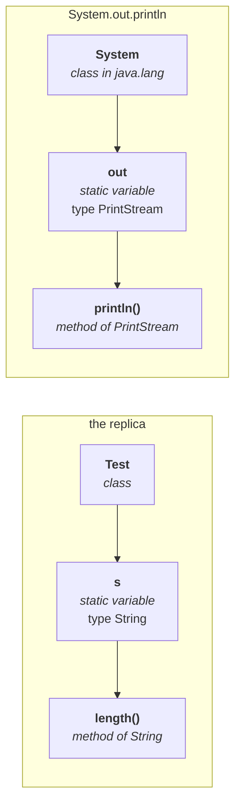

## The Java 1.5 context

Before explaining it, he places it among its siblings — everything that arrived in **Java 1.5**:

| |
|---|
| for-each loop |
| var-arg methods |
| autoboxing / auto-unboxing |
| generics |
| covariant return types |
| `Queue` (collections) |
| annotations |
| enum |
| **static import** |

> [!question]- **Deep dive — the movie analogy, and why he calls static import the flop of 1.5.** Kept
> because it is how he frames the whole feature, and because the verdict is still the industry's.
>
> Before any film is released, the producer and director hold an audio function and promise it will
> *"break Tollywood records, Bollywood records, world records."* Then one fine day the movie releases —
> **and the audience decides whether it is a hit or a flop.** He remembers one such function for a film
> called *Orange*, where a speaker promised it would be huge. *"How much hit was that movie? You can
> decide — it is nothing but a flop movie."*
>
> **The same publicity happened for Java 1.5.** *"Some people conducted a press meet saying: after
> releasing 1.5, all the remaining languages are going to be packed, because we are redefining total
> Java once again."* Then the release came, and worldwide programmers — the audience — judged the
> features. Most were genuinely excellent, *"each and every feature's target is to simplify the
> programmer's life."*
>
> **But not every new concept is a hit.** *"There is one concept which is a flop concept in the 1.5
> version — static import."* And by 1.6 the message had changed: *"if there is no specific requirement,
> it is not recommended to use static import."*

> **According to Sun, static import reduces the length of the code and improves readability.**
> **According to worldwide programming experts, static import creates confusion and reduces readability. 
> Hence, if there is no specific requirement, it is not recommended.**

## What it actually does

**Without static import** — static members are accessed through the class name, as always:

```java
System.out.println(Math.sqrt(4));
System.out.println(Math.max(10, 20));
System.out.println(Math.random());
```

Write `Math.sqrt` twenty times and you type `Math` twenty times. *"Why don't you remove that class name from the static method?"*

**Drop the class name and it breaks.** Measured on JDK 25:

```
error: cannot find symbol   symbol: method sqrt(int)
error: cannot find symbol   symbol: method max(int,int)
error: cannot find symbol   symbol: method random()
3 errors
```

**Now add a static import for one of them:**

```java
import static java.lang.Math.sqrt;
```

Measured on JDK 25 — **2 errors.** `sqrt` is fixed; `max` and `random` are not. The count dropping from 3 to 2 is the demonstration.

**And for all of them:**

```java
import static java.lang.Math.*;

class SI2 {
    public static void main(String[] args) {
        System.out.println(sqrt(4));
        System.out.println(max(10, 20));
        System.out.println(random());
    }
}
```

Measured on JDK 25, run twice:

```
2.0
20
0.3957307810140398
```
```
2.0
20
0.6260858894147701
```

`sqrt(4)` prints `2.0` rather than `2` because `Math.sqrt` returns `double`, and `random()` changes on every run.

> **Usually we access static members using the class name. Whenever we write a static import, we can access static members directly, without the class name.**

> [!important] **The spelling trap.** The concept is called **static import**, but what you write is
> **`import static`** — in that order. *"While writing we have to write `import static`, but while
> pronouncing, `static import` is the popular one."* 
> 
> Note also: import the **name only** — `sqrt`, not `sqrt()`.

---
# Explain `System.out.println`

## The replica

```java
class Test {
    static String s = "java";
}
```

Now find the length of that string:

```java
System.out.println(Test.s.length());
```

Measured on JDK 25:

```
4
```

**Take that expression apart, piece by piece:**

| Piece | What it is |
|---|---|
| `Test` | a **class** name |
| `s` | a **static variable** present in the `Test` class, of type `java.lang.String` |
| `.length()` | a **method** present in the **`String`** class |

**Why is `Test.s` written that way?** Because `s` is a static variable, and static variables are accessed **through the class name**. And why can you call `.length()` on it? Because `Test.s` **is** a `String`, so any `String` method applies.

## Now the same shape, for real

```java
System.out.println("hello");
```

| Piece | What it is |
|---|---|
| `System` | a **class** present in the **`java.lang`** package |
| `out` | a **static variable** present in the `System` class, of type **`PrintStream`** |
| `println` | a **method** present in the **`PrintStream`** class |



**Identical structure.** `System.out` is not magic syntax — it is a static variable being read through its class name, exactly like `Test.s`.

> **And where does the output go?** `out` points to the **standard output device**, which is the **console**. Whatever you write through it is printed there.


---

# Static import applied to `out`

**Without a static import**, `out` alone means nothing. Measured on JDK 25:

```java
out.println("hello");
```
```
error: cannot find symbol
  symbol:   variable out
```

**With one:**

```java
import static java.lang.System.out;

class Out {
    public static void main(String[] args) {
        out.println("hello");
        out.println("hi");
    }
}
```

Measured on JDK 25:

```
hello
hi
```

> **`System` is gone from every call site.** Write the import once and `out.println(…)` works everywhere in the file.

---

# Ambiguity in static imports

The same trap as ordinary imports, one level down.

Every number-type wrapper class — `Byte`, `Short`, `Integer`, `Long`, `Float`, `Double` — has a static `MAX_VALUE`. Import two of them wholesale:

```java
import static java.lang.Integer.*;
import static java.lang.Byte.*;

System.out.println(MAX_VALUE);
```

Measured on JDK 25:

```
error: reference to MAX_VALUE is ambiguous
```

**Exactly the `java.util.Date` vs `java.sql.Date` problem**, with static members instead of classes.

---

# The resolution order — and it is NOT the same as for normal imports


**Three sources of `MAX_VALUE` at once:**

```java
import static java.lang.Integer.MAX_VALUE;   // explicit static import
import static java.lang.Byte.*;              // implicit static import

class R1 {
    static int MAX_VALUE = 999;              // the current class's own
    public static void main(String[] args) {
        System.out.println(MAX_VALUE);
    }
}
```

**Which one wins?** Most of the class answers *"Integer — because explicit import has the highest priority."* That is the rule from the previous session.

**While resolving static members,

> the highest priority goes to the CURRENT CLASS's static members.
> Then explicit static import. 
> Then implicit static import

Measured on JDK 25, removing one source at a time:

| Sources present | Output | Winner |
|---|---|---|
| current class + explicit + implicit | **999** | the **current class** |
| explicit + implicit | **2147483647** | **`Integer`** (explicit) |
| implicit only | **127** | **`Byte`** (implicit) |

## The two orders side by side

| | Normal import | **Static import** |
|---|---|---|
| 1 | **explicit** class import | **current class** static members |
| 2 | classes in the **current working directory** | **explicit** static import |
| 3 | **implicit** class import | **implicit** static import |

> [!important] **Why the difference makes sense.** For a *class* name there is no "current class" tier — a class is not a member of the class using it, so the list starts at the imports. 
>
> For a *static member* there is, and the language resolves what is **declared right here** before it looks anywhere else. Your own declarations always win over anything imported.
>


---

# What this part established

| | |
|---|---|
| `System` | a **class** in **`java.lang`** |
| `out` | a **static variable** in `System`, of type **`PrintStream`** |
| `println` | a **method** of **`PrintStream`** |
| Where output goes | `out` points to the **standard output device** — the console |
| The replica that explains it | `Test.s.length()` — class · static variable · method of that type |
| `import static java.lang.System.out;` | lets you write **`out.println(...)`** |
| Without it | `cannot find symbol: variable out` |
| Two wholesale static imports | `reference to MAX_VALUE is ambiguous` |
| **Static import order** | **current class → explicit → implicit** |
| **Normal import order** | explicit → current working directory → implicit |
| The trap | the two orders are **different** — do not reuse the normal-import rule |
| Measured | **999** → **2147483647** → **127** as each source is removed |
