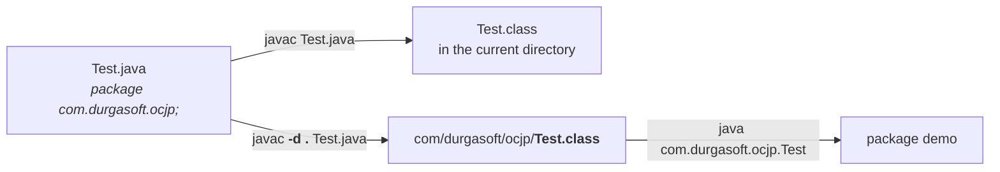

# What a package is

Start with the ordinary English word, not the programming one.

> *"South India tour package, North India tour package, Europe tour package."* And in his own
> business: Core Java + Advanced Java + Oracle are three related courses, so they are sold as the
> **basic package**. Struts + Hibernate + Spring are three frameworks, so they are the **frameworks
> package**. Core to web services, everything — the **complete package**.

> **A package is a group of related things.**

Translated into Java:

> **A package is an encapsulation mechanism to group related classes and interfaces into a single
> unit.**

| Package | Groups |
|---|---|
| `java.sql` | everything for **database operations** — `Connection`, `DriverManager`, `Statement` |
| `java.io` | everything for **file I/O** — `FileWriter`, `BufferedWriter`, `PrintWriter`, `FileReader`, `BufferedReader` |
| `java.net` | everything for **networking** |
| `java.rmi` | everything for **remote method invocation** |
| `java.util` | **general utilities** |

**Encapsulation here just means grouping** — related things travelling together under one name.

---

# The four advantages

## 1. Resolving naming conflicts

> [!info] **The analogy — chief ministers.** India has one CM for Telangana, one for Andhra Pradesh,
> one for Tamil Nadu, one for Karnataka. *"Assume states are not there — then how many CMs are
> possible?"* **One.** The states are what allow many.
>
> **Packages are the states.** One `Date` in `java.util`, another `Date` in `java.sql`. Take the
> packages away and only one `Date` could exist in the whole language.

`java.util.Date` and `java.sql.Date` are unambiguous **because** of the package prefix. That uniqueness
is what a package buys you first.

## 2 and 3. Modularity and maintainability

Group the classes for order processing into one package, the classes for order delivery into another:

```
com.xyz.order.process
com.xyz.order.delivery
```

Together they are the **order module**; elsewhere there is a payment module, a transaction module.

> **Modularity of the application is improved, and so is maintainability** — because *"instead of
> keeping all the things in one clumsy place"*, you can point at the part you need to change.

## 4. Security

```java
class Test { }      // no modifier = default access
```

> **Default access means package-level access** — the class is visible **only within its own package**.
> An outsider cannot touch it.

> *"My package acts as a wall for this class."*

Measured on JDK 25 — a default-access class in `packa`, used from `packb`:

```
error: Hidden is not public in packa; cannot be accessed from outside package
```

> *"Assume packages are not there — then how would you restrict an outside person from accessing this
> one?"* Without packages there is no boundary to be inside or outside of, so there is nothing to
> enforce.

---

# The naming convention

Packages exist for unique identification — so their names must be unique. What in the world is
guaranteed unique?

> *"Client name? Not unique — there is X Infosys, M Infosys, Y Infosys. Company name, service provider
> name — names are not unique."*

> **The internet domain name.** How many websites are named `gmail.com`? One. `yahoo.com`? One.
> `durgasoft.com`? One. **Domain names are unique by nature** — so borrow that uniqueness.

> **The universally accepted naming convention for packages: use the internet domain name in reverse.**

```
com.icicibank.loan.housing.Account
```

Read it in pieces:

| Piece | Meaning |
|---|---|
| `com.icicibank` | the client's **internet domain name, reversed** |
| `loan` | the **module** name |
| `housing` | the **sub-module** name |
| `Account` | the **class** name |

> *"If I saw this line anywhere — on a piece of paper on the road — I would know: this class relates to
> icicibank, the loan module, housing loan. The remaining thing I'm not required to check."* The name
> alone locates the code in the organisation.

---

# Writing and compiling with a package

```java
package com.durgasoft.ocjp;

public class Test {
    public static void main(String[] args) {
        System.out.println("package demo");
    }
}
```

`package` is a Java keyword.

## Compiling without `-d`

```
$ javac Test.java
```

**Compiles fine** — there is no rule that a package statement forces anything. But measured on JDK 25,
the class file lands here:

```
Test.class
```

In the **current working directory**, flat. *"But `Test` is related to `com.durgasoft.ocjp`, and you
are placing `Test.class` in the current working directory — that is meaningless."*

## Compiling with `-d`

```
$ javac -d . Test.java
```

Measured on JDK 25:

```
com/durgasoft/ocjp/Test.class
```

**The folder structure was created and the class file placed inside it.**

| | Meaning |
|---|---|
| `-d` | **destination** to place generated `.class` files |
| `.` | the **current working directory** |

> **If the corresponding package structure is not already available, this command itself will create
> it.** You do not have to make `com`, then `durgasoft`, then `ocjp` by hand.

## Any directory can be the destination

`.` is not special — any valid directory works:

```
$ javac -d f: Test.java      (Windows)
$ javac -d newdir Test.java
```

and the package structure is created **under that directory**.

**The destination does not have to exist first — `javac` creates it.** Measured on JDK 25:

```
$ javac -d newdir Test.java
compiled
newdir/com/durgasoft/ocjp/Test.class
```

> [!important] **The only failure is a destination that cannot be created** — an unwritable or
> impossible path:
> ```
> $ javac -d /no/such/place Test.java
> error: error while writing Test: could not create parent directories
> ```
> **Missing is fine; uncreatable is the error.**

## Running it

```
$ java com.durgasoft.ocjp.Test
package demo
```

> **At the time of execution, we must use the fully qualified name.**

And walking into the folder does not help — measured on JDK 25:

```
$ java Test
Error: Could not find or load main class Test
```

> *"I want to enter inside `com`, and from there give `java Test` — it won't work."* The class's real
> name **is** `com.durgasoft.ocjp.Test`; the folders are just where the bytes live.



---

# Conclusion 1 — at most one package statement

```java
package pack1;
package pack2;

public class A { }
```

> **In any Java source file there can be at most one package statement** — *at most one* meaning one or
> zero. More than one is a compile-time error.

Measured on JDK 25:

```
Two.java:2: error: class, interface, enum, or record expected
package pack2;
^
```

**Read why that is the message.** After a package statement the compiler expects an optional import,
and then a **type declaration**. It finds another `package` instead, and reports what it *was* looking
for. The list names every kind of type declaration there is — `record` included.

---

# Conclusion 2 — package must come first

```java
import java.util.*;
package pack1;

public class B { }
```

> **In any Java program the first non-comment statement should be the package statement** (if there is
> one). Comments may appear anywhere; the package statement must come before any import.

Measured on JDK 25:

```
Order.java:2: error: class, interface, annotation type, enum, record, method or field expected
package pack1;
^
```

> [!important] **The two mistakes give two different messages, so do not expect them to match.** Two
> package statements gives `class, interface, enum, or record expected`; an import before a package
> gives the longer `class, interface, annotation type, enum, record, method or field expected`. The
> *cause* is the same in both — the compiler wanted a type declaration and got a `package` — but it was
> at a different point in the file, so the set of things it would have accepted differs.

---

# The valid Java source file structure

Putting both conclusions together:

| Order | What | How many |
|---|---|---|
| 1 | **package** statement | **at most one** |
| 2 | **import** statements | **any number** |
| 3 | **class / interface / enum** declarations | **any number** |

> **And this order is important.**

## The question he sets, and the trap in it

*How many class, interface or enum declarations are allowed?* The options: **at least one**, **any
number**, **at most one**, **exactly one**.

Most of the class answers **at least one** — surely a program must declare *something*.

> [!important] **The answer is "any number", and the proof is a file with nothing in it.**
>
> Measured on JDK 25 — an **empty file** named `Empty.java`:
> ```
> $ javac Empty.java
> $
> ```
> **It compiles.** No error, no class file, no complaint.
>
> > **An empty source file is a valid Java program.**
>
> Once that is true, *at least one* is dead, and everything weaker follows.

**Hence all five of these are valid Java source files:**

| | Contents |
|---|---|
| 1 | *(nothing at all)* |
| 2 | `package pack1;` |
| 3 | `import java.util.*;` |
| 4 | `package pack1;` + `import java.util.*;` |
| 5 | `class Test { }` |

---

# What this part established

| | |
|---|---|
| A package is | a group of **related things** — classes and interfaces in one unit |
| It is an | **encapsulation (grouping) mechanism** |
| Advantage 1 | resolve **naming conflicts** — unique identification |
| Advantage 2 | improves **modularity** |
| Advantage 3 | improves **maintainability** |
| Advantage 4 | **security** — a default-access class is invisible outside its package |
| The error for that | `Hidden is not public in packa; cannot be accessed from outside package` |
| Naming convention | **internet domain name in reverse** — the only reliably unique thing |
| Full shape | `com.icicibank` · `loan` · `housing` · `Account` = domain · module · sub-module · class |
| `javac Test.java` | class file lands in the **current working directory**, flat |
| `javac -d . Test.java` | class file lands in the **package structure**, which is created if missing |
| `-d` means | **destination** for generated class files |
| Non-existent destination (his JDK) | `directory not found` |
| Non-existent destination (JDK 25) | **created automatically**; only fails if uncreatable |
| Running | requires the **fully qualified name** |
| Package statements per file | **at most one** |
| That error (JDK 25) | `class, interface, enum, or record expected` — `record` added in Java 16 |
| Package must be | the **first non-comment statement** |
| That error (JDK 25) | a **different, longer** message than the duplicate-package one |
| Valid structure | package (≤1) → imports (any) → type declarations (any) — **order matters** |
| An empty source file | **is a valid Java program** |
