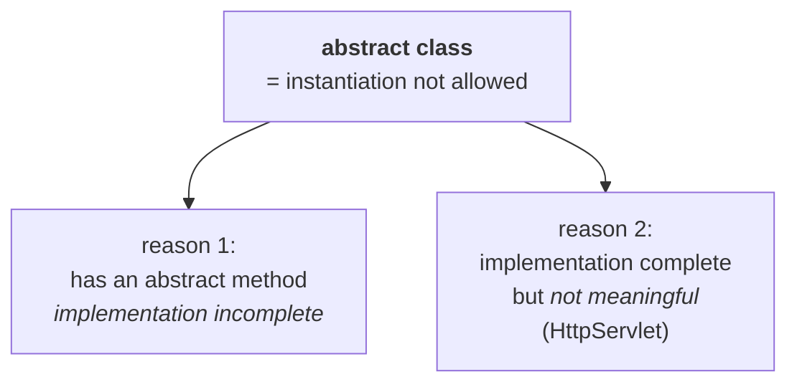

# Where `abstract` can go

> **`abstract` is a modifier applicable for classes and methods, but not for variables.**

Same shape as `strictfp`, and for the same reason — both describe *behaviour*, and a variable has none.

---

# Abstract methods

## The problem they solve

```java
class Vehicle {
    public int getNoOfWheels() {
        return ???;
    }
}
```

**How many wheels does a vehicle have?** Two, three, four — *we don't know.* It depends on the type of
vehicle.

> *"At the vehicle level we can't implement. Unless and until we know the type of vehicle, we can't
> implement."*

But the method still belongs in `Vehicle` — every vehicle has *some* number of wheels. So you need a
way to **declare a method without implementing it**:

> **Even though we don't know about the implementation, we can still declare a method — with the
> `abstract` modifier.**
>
> **For abstract methods, only the declaration is available, not the implementation. Hence an abstract
> method declaration ends with a semicolon.**

```java
public abstract int getNoOfWheels();
```

Measured on JDK 25 — put a body on it and it is rejected:

```java
public abstract void m1() { }
```
```
error: abstract methods cannot have a body
```

## Who implements it

> **The child classes are responsible for providing the implementation of the parent class's abstract
> methods** — because the child *is* a specific type of vehicle, so the child knows the answer.

```java
abstract class Vehicle {
    public abstract int getNoOfWheels();
}
class Bus extends Vehicle {
    public int getNoOfWheels() { return 7; }
}
class Auto extends Vehicle {
    public int getNoOfWheels() { return 3; }
}
```

Measured on JDK 25:

```
Bus  : 7
Auto : 3
```

> [!info] **Why a bus has seven wheels and an auto has three.** Six wheels plus the **stepney** — the
> spare. *"Don't ask tomorrow why it is 7 instead of 6."* And the auto gets three because *"the auto
> wallah is a very poor person, he may not maintain a stepney."*

## What you gain by declaring it in the parent

The fair objection: *we are not providing any implementation here, the child provides it — so why
declare it in the parent at all? Why not just delete the line?*

> [!important] **Because of what the declaration forces.**
> > **By declaring an abstract method in the parent class, we provide guidelines to the child classes:
> > which methods the child compulsorily has to implement.**
>
> *"Hey child — if any class extends `Vehicle`, compulsorily you should provide implementation for this
> `getNoOfWheels` method."* **That guarantee is the product.**
>
> Delete the line and the child *may* implement it or *may not* — both are legal, and nobody can rely
> on it. The abstract method converts a hope into a compile-time requirement.

## Illegal combinations

> **Any modifier that talks about implementation forms an illegal combination with `abstract`** —
> because an abstract method **has** no implementation.

Measured on JDK 25, all six:

| Combination | Result |
|---|---|
| `abstract final` | ❌ `illegal combination of modifiers: abstract and final` |
| `abstract native` | ❌ `illegal combination of modifiers: abstract and native` |
| `abstract synchronized` | ❌ `illegal combination of modifiers: abstract and synchronized` |
| `abstract static` | ❌ `illegal combination of modifiers: abstract and static` |
| `abstract private` | ❌ `illegal combination of modifiers: abstract and private` |
| `abstract strictfp` | ❌ `illegal combination of modifiers: abstract and strictfp` |

**Read each one as a sentence and the contradiction is obvious:** `final` says nobody may override it
(but somebody must); `native` says the body is written in another language (but there is no body);
`synchronized` says the body takes a lock (there is no body); `static` says it belongs to the class
(but overriding needs an instance); `private` says nobody can see it (but a child must); `strictfp`
says the body's arithmetic is strict (there is no body).

---

# Abstract classes

## The definition worth having

Asked *"what is an abstract class?"*, **90% of people answer "a class that contains at least one
abstract method."** That is true but backwards — it describes a symptom, not the concept.

> **For any Java class, if we are not allowed to create an object — because of partial implementation
> — such a class we declare with the `abstract` modifier. That is, for abstract classes, instantiation
> is not possible.**

> **An abstract class is a class with *partial* implementation, not complete implementation.**

Measured on JDK 25:

```java
abstract class T3 { }
T3 t = new T3();
```
```
error: T3 is abstract; cannot be instantiated
```

## Why "at least one abstract method" forces "abstract class"

> **If a class contains at least one abstract method, we must compulsorily declare the class as
> abstract** — otherwise, compile-time error.

Measured on JDK 25:

```java
class B2 { public abstract void m1(); }
```
```
error: B2 is not abstract and does not override abstract method m1() in B2
```

> [!question]- **Deep dive — the vehicle in the market, on *why* the rule exists.** Not a syntax
> argument, and the story is the reason it sticks.
>
> **Assume the rule did not exist** — a class with an abstract method need not be abstract. Then I can
> create an object:
>
> ```java
> Vehicle v = new Vehicle();
> ```
>
> *"I created one beautiful vehicle object, and I bring this object to the market."* A visitor comes
> and asks the obvious question:
>
> > **"How many wheels does your vehicle have?"**
>
> That is a call to `getNoOfWheels()`. And the answer is:
>
> > *"Oh — I don't know how many wheels this vehicle has. I can't tell. Can you please ask my child
> > class? My child can answer."*
>
> *"And this person is going to give left and right — if this object is unable to answer, why did you
> bring it to the market?"*
>
> > **It is not a meaningful object, because it is not in a position to respond properly.**
>
> So: at least one abstract method means the implementation is **incomplete**, and an incomplete object
> should never exist. Declaring the class `abstract` is how you stop it from being created.

## An abstract class need not have any abstract methods

The reverse direction, and the part most people get wrong.

> **Even though a class doesn't contain any abstract method, we can still declare the class as abstract
> — if we don't want instantiation for that class. That is, an abstract class can contain zero abstract
> methods.**

Measured on JDK 25:

```java
abstract class Z { public void m1() { System.out.println("concrete"); } }
```

Compiles fine. Every method concrete, and the class is still abstract.

> *"With that implementation you may not be satisfied. In that case, creating an object is
> meaningless."*

> [!info] **His real-world example: `HttpServlet`.** `HttpServlet` **is abstract, and it contains no
> abstract methods at all.** It has `doGet`, `doPost`, `doPut` — all implemented.
>
> **But look at what those implementations do:** they send an *error* back to the client. That is all.
> *"Only with error information we can't do anything."* So creating an `HttpServlet` object and calling
> `doGet` on it is meaningless — the implementation exists but is not a useful service.
>
> How do you stop people from creating one? **Declare the class abstract.** Nothing about abstract
> methods enters into it — the class is abstract because *instantiating it would be pointless*, which
> is exactly the definition above.



---

# Extending an abstract class

> **If we are extending an abstract class, we should provide implementation for each and every abstract
> method of the parent class. Otherwise, we have to declare the child class as abstract** — and then the
> **next level child class** becomes responsible.

Measured on JDK 25 — a parent with two abstract methods, a child implementing one:

```java
abstract class P { public abstract void m1(); public abstract void m2(); }
class C extends P { public void m1() { } }
```
```
error: C is not abstract and does not override abstract method m2() in P
```

**Read the message as the two ways out it offers:** either make `C` abstract, or override `m2()`. Take
the first:

```java
abstract class C2 extends P2 { public void m1() { } }
```

Compiles fine. `C2` has discharged half the obligation and passed the rest down.

---

# `final` vs `abstract`

Two conclusions, one at method level and one at class level, and both are the same contradiction.

## At method level

> **Abstract methods must compulsorily be overridden in child classes to provide implementation,
> whereas final methods cannot be overridden. Hence `final abstract` is an illegal combination for
> methods.**

## At class level

> **For final classes we cannot create a child class, whereas for abstract classes we must create a
> child class to provide proper implementation. Hence `final abstract` is illegal for classes too.**

Measured on JDK 25:

```java
final abstract class FA { }
```
```
error: illegal combination of modifiers: abstract and final
```

> [!important] **Compare this with `abstract strictfp` from the previous part.** `abstract strictfp` is
> illegal for **methods** but **legal for classes** — because at class level the two modifiers govern
> *different members* (concrete methods vs abstract ones), so they never meet.
>
> **`final abstract` has no such escape.** At both levels the two words contradict each other about the
> *same* thing: *must be extended* versus *cannot be extended*. That is why this pair is illegal
> everywhere and that one is not.

---

# What this part established

| | |
|---|---|
| `abstract` applies to | classes and methods — **not** variables |
| Abstract method | **declaration only**, no implementation, ends with a **semicolon** |
| With a body | ❌ `abstract methods cannot have a body` |
| Who implements it | the **child classes** |
| Why declare it in the parent | to **force** every child to implement it — a compile-time guarantee |
| Illegal with `abstract` | `final`, `native`, `synchronized`, `static`, `private`, `strictfp` |
| The pattern | anything that **talks about implementation** contradicts having none |
| Abstract class | a class with **partial implementation** — **instantiation not possible** |
| The error | `T3 is abstract; cannot be instantiated` |
| ≥1 abstract method ⇒ | the class **must** be abstract |
| Why | an incomplete object cannot answer for itself — *the vehicle in the market* |
| Abstract class with **zero** abstract methods | **legal** — e.g. `HttpServlet` |
| Extending an abstract class | implement **every** abstract method, **or** declare the child abstract |
| Then | the **next level** child class inherits the obligation |
| `final abstract` | ❌ illegal at **both** class and method level |
| Contrast | `abstract strictfp` is illegal for methods but **legal** for classes |
