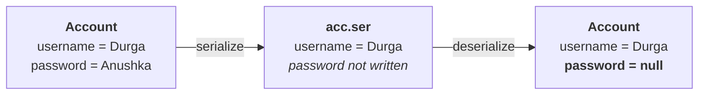

# The `native` modifier

> **`native` is a modifier applicable only for METHODS.** We cannot apply it anywhere else.

Measured on JDK 25:

```java
native class T { }        // error: modifier native not allowed here
class T { native int x; } // error: modifier native not allowed here
```

## What a native method is

> **The methods which are implemented in non-Java — mostly C or C++ — are called native methods, or
> foreign methods.**

> [!info] *"Don't feel native methods are the methods which are coming from our native place."*

---

# Why Java needs them at all

He sets this up as a genuine puzzle before answering it.

> [!question]- **Deep dive — "Java has this many stars, so why depend on C?"** The way he frames the
> question, which is more interesting than the answer alone.
>
> Telugu cinema gives every actor a title: **superstar** (Krishna; Rajinikanth in Tamil; Amitabh in
> Bollywood), **megastar** (Chiranjeevi), **power star** (Pawan Kalyan), **mega power star** (Ram
> Charan), **stylish star** (Allu Arjun), **rebel star**, **young rebel star** (Prabhas), **real star**,
> **people's star**.
>
> **Java has just as many titles:** simple, robust, secure, object-oriented, multi-threaded, platform
> independent, architecture neutral…
>
> > *"These many stars are there for Java. Still, why are we depending on that bloody C/C++ code with
> > this native keyword?"*
>
> **Because there are areas where Java is not up to the mark**, and the keyword exists to fill exactly
> those gaps.

## The three objectives

> **1. To improve performance of the system.**

> *"Wherever performance discussion is going on, being a Java programmer it is not recommended to open
> your mouth."* Performance is the area where Java is weakest against C. Implement that one critical
> section in C/C++ and bring it in with `native`.

> **2. To achieve machine level or memory level communication.**

> **Java is a programmer-friendly language, not a machine-friendly language.** C can talk directly to
> the machine; Java cannot. *"That's why wherever device drivers are there, wherever operating systems
> have to be designed, compulsorily we should go for C, not Java."*

> **3. To use already existing legacy non-Java code.**

> *"It is already there, boss. What is the need of developing it once again?"* Performance may not even
> matter — you simply want functionality that already exists in C.

## The example that is in the JDK

`hashCode()` is generated **from the object's address** — and *"in Java there is no way to identify the
address of an object."* So that area was implemented in C/C++ and exposed with `native`.

Measured on JDK 25:

```
$ javap -p java.lang.Object | grep -i hashcode
  public native int hashCode();
```

**His example, verified from the JDK's own source.**

---

# How you actually use it

> **Pseudo code to use `native` in Java — three steps:**

**1. Load the native library.** It must be loaded when the class is loaded — which means a **static
block**, since that is what runs at class loading time:

```java
class Native {
    static {
        System.loadLibrary("nativeLibraryPath");
    }
```

**2. Declare the native method** — ending with a **semicolon**:

```java
    public native void m1();
}
```

**3. Invoke it** like any other method:

```java
class Client {
    public static void main(String[] args) {
        Native n = new Native();
        n.m1();
    }
}
```

> [!info] **What is hidden behind those three steps.** Mapping `m1()` onto the right function in the
> right DLL takes **JNI — the Java Native Interface** — and a number of interfaces you would have to
> write. *"Being a programmer, you people just need to be aware of the pseudo code."*

---

# The rules that follow

## No body

> **For native methods the implementation is already available in old languages, and we are not
> responsible for providing it. Hence a native method declaration must end with a semicolon.**

Measured on JDK 25:

```java
public native void m1() { }
```
```
error: native methods cannot have a body
```

**The same shape as an abstract method** — declaration only, semicolon at the end — but for the
opposite reason: an abstract method has **no implementation yet**; a native method's implementation
**already exists elsewhere**.

## `abstract` + `native` is illegal

> **For native methods implementation IS already available. For abstract methods implementation must
> NOT be available. Hence `abstract native` is an illegal combination for methods.**

Measured on JDK 25:

```
error: illegal combination of modifiers: abstract and native
```

## `native` + `strictfp` is illegal

> **`strictfp` means all floating-point calculations follow IEEE 754. But IEEE 754 is a Java-language
> guarantee — there is no guarantee that C or C++ follows it. Hence `native strictfp` is an illegal
> combination for methods.**

Measured on JDK 25:

```
error: illegal combination of modifiers: native and strictfp
```

> [!important] **Both illegal pairs come from the same observation:** `native` says *the body lives
> outside Java*. So anything that makes a claim **about the body** — that there isn't one (`abstract`),
> or that its arithmetic obeys a Java rule (`strictfp`) — contradicts it.

---

# The cost

> **The main advantage of `native` is that performance will be improved.**
>
> **But the main disadvantage is that it breaks the platform independent nature of Java.**

Because C and C++ are **platform dependent languages**, and depending on them makes your Java program
depend on them too.

> [!info] **And `hashCode()` shows it.** *"On this system `hashCode` generates one number. Change the
> system and there may be a chance of generating another number."* The method is not implemented in
> Java, so its result is not portable — which is precisely why you must never treat a hash code as a
> stable identity across runs or machines.

---

# The `transient` modifier

> **`transient` is a modifier applicable only for VARIABLES.** Not for methods, not for classes.

Measured on JDK 25:

```java
class T { transient void m1() { } }   // error: modifier transient not allowed here
class T { transient int x; }          // valid
```

> **`transient` plays its role in the serialization context** — and nowhere else.

## Serialization, in one line each

| | |
|---|---|
| **serialization** | saving the state of an object **to a file**, or sending it **across a network** |
| **deserialization** | reading the state of an object back |

And a file lives on the hard disk, so this is **permanent storage** — which is where the problem starts.

## Why the keyword exists

> [!question]- **Deep dive — the email address and the password.** His argument for why permanent
> storage is a security question, not just a storage question.
>
> *"I want to share a valuable document related to SCJP. Can you please share your mail ID?"* Everyone
> in the class is willing.
>
> **"Can you please share your password also?"**
>
> *"No one is going to share, I'm sure."*
>
> **A mail ID you can publish anywhere. A mail ID plus a password is dangerous** — *"there may be a
> chance of misuse."*
>
> An `Account` object is the same: `username = "Durga"` is fine to save; `password = "Anushka"` is not.
> **Save the object and the password is on the hard disk permanently, in the clear.**

> **At the time of serialization, if we don't want to save the value of a particular variable — to meet
> a security constraint — such a variable we declare `transient`.**

## What actually happens to the value

> **The JVM ignores the original value and saves the DEFAULT value to the file.**

Measured on JDK 25:

```java
class Account implements Serializable {
    String username = "Durga";
    transient String password = "Anushka";
}
```

```
before: Durga / Anushka
after : Durga / null
```

**And with a primitive:**

```java
class Acc2 implements Serializable { int a = 10; transient int b = 20; }
```
```
a = 10, b = 0
```

> [!important] **Read what that means precisely.** `transient` does **not** remove the field from the
> object — after deserialization it is still there, holding **the default value for its type**: `null`
> for a reference, `0` for an `int`, `false` for a `boolean`. The value was never written, so on the way
> back there is nothing to restore.



> [!info] **This closes a loop from note 12.** `transient` is forbidden on interface variables — because
> an interface has no objects, so there is no serialization, so there is nothing for `transient` to
> exclude. Seeing what it actually does here makes that reasoning concrete.

---

# What this part established

| | |
|---|---|
| `native` applies to | **methods only** |
| A native method is | implemented in **non-Java** — C or C++; a **foreign method** |
| Objective 1 | improve **performance** |
| Objective 2 | **machine / memory level** communication — Java cannot talk to the machine directly |
| Objective 3 | reuse **existing legacy non-Java code** |
| The JDK's own example | `public native int hashCode()` — verified with `javap` |
| Three steps to use it | **load the library** (static block) → **declare** the method → **invoke** it |
| Behind the scenes | **JNI**, the Java Native Interface |
| Native method body | ❌ `native methods cannot have a body` — ends with a semicolon |
| `abstract native` | ❌ implementation must not exist vs already exists |
| `native strictfp` | ❌ no guarantee C/C++ follows IEEE 754 |
| Advantage | **performance** |
| Disadvantage | **breaks platform independence** — visible in `hashCode()` |
| `transient` applies to | **variables only** |
| Where it matters | **serialization** |
| What it does | the JVM **ignores the original value and writes the default** |
| After deserialization | `null` for references, `0` for `int` — the field still exists |
| Why interfaces forbid it | no objects ⇒ no serialization ⇒ nothing to exclude |
