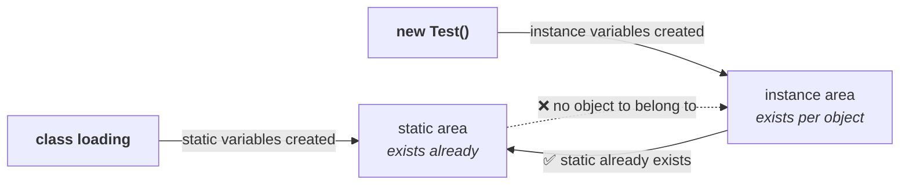

# Where `static` can go

> **`static` is a modifier applicable for methods and variables, but not for classes.**
>
> **We cannot declare a top-level class as `static` — but we CAN declare an inner class as `static`. Such inner classes are called static nested classes.**

That second half is the exception that trips people: `static class Foo { }` at the top of a file is an error, but the identical line **inside** another class is fine. (This connects to the 5-vs-8 modifier count from part 05 — `static` is one of the three extra modifiers inner classes get.)

---

# The difference the whole part rests on

> **In the case of instance variables, a separate copy is created for every object.**
> **In the case of static variables, a single copy is created at class level and shared by every object of that class.**

## The measured demonstration

```java
class Copy {
    static int x = 10;      // static   — one copy, shared
    int y = 20;             // instance — one copy per object

    public static void main(String[] args) {
        Copy t1 = new Copy();
        t1.x = 888;
        t1.y = 999;

        Copy t2 = new Copy();
        System.out.println(t2.x + " " + t2.y);
    }
}
```

**What does `t2` print?** The candidate answers he offers: `10 20`, `888 999`, `888 20`, `10 999`, or a compile error.

Measured on JDK 25:

```
888 20
```

**Trace it:**

| Step | What happens |
|---|---|
| class loading | `x = 10` created — **once**, at class level |
| `new Copy()` → `t1` | a copy of `y = 20` created **for t1** |
| `t1.x = 888` | changes **the one shared** `x` |
| `t1.y = 999` | changes **t1's own** `y` |
| `new Copy()` → `t2` | a **fresh** copy of `y = 20` created for t2 |
| `t2.x` | **888** — same single copy `t1` modified |
| `t2.y` | **20** — t2's own copy, untouched by `t1.y = 999` |

> **Change a static variable through any reference and the change is visible to all objects, because there is only one copy. Change an instance variable through one reference and the other objects are unaffected, because each has its own.**

> [!info] **And note `t1.x` is legal at all.** You **can** access a static variable through an object reference — it just doesn't mean what it looks like. `t1.x` and `t2.x` are the same variable.

---

# Static area vs instance area

> **We cannot access instance members directly from a static area. But we can access static members from both instance and static areas directly.**

The reason is about **when things exist**:



> A static variable is created at the very beginning, at the time of class loading. That's why from anywhere you can access it. But an instance variable is always related to an object — and a static area is nowhere related to an object.

---

# The four-declaration question

This is the exam shape the rule produces. Four declarations:

```java
1.  int x = 10;
2.  static int x = 10;
3.  public void m1() { System.out.println(x); }
4.  public static void m1() { System.out.println(x); }
```

**Within the same class, which two can be taken simultaneously?**

Measured on JDK 25 — all six pairings:

| Pair | What it is | Result |
|---|---|---|
| **1 & 3** | instance variable + instance method | ✅ **valid** |
| **1 & 4** | instance variable + **static** method | ❌ `non-static variable x cannot be referenced from a static context` |
| **2 & 3** | static variable + instance method | ✅ **valid** |
| **2 & 4** | static variable + static method | ✅ **valid** |
| **1 & 2** | two variables **named `x`** | ❌ `variable x is already defined in class Q` |
| **3 & 4** | two methods **named `m1()`** | ❌ `method m1() is already defined in class Q` |

**The first four are the rule.** The last two are the extra options he adds afterwards, and they are the more interesting ones:

> [!important] **1 & 2 — an instance variable and a static variable cannot share a name.** Instance variable and local variable with the same name? Allowed. Static variable and local variable with the same name? Allowed. **Instance variable and static variable with the same name? Not allowed.**
>
> They live in the same scope — the class body — so one shadows nothing, it simply collides.

> [!important] **3 & 4 — and this one is the real lesson.**
> ```java
> public void m1() { }
> public static void m1() { }
> ```
> Most people expect this to work: one is an instance method, the other is a static method — surely they're different.
>
> **They are not.** Measured on JDK 25: `method m1() is already defined in class Q`.
>
> > **The signature of a method is its name plus its argument types. The return type and the modifiers are NOT part of the signature.**
>
> Both are `m1()`. Same signature, same class — a duplicate, regardless of `static`. This is the same rule that governs overloading, arriving from an unexpected direction.

---

# What this part established

| | |
|---|---|
| `static` applies to | **methods and variables** — not classes |
| Top-level class + `static` | ❌ |
| Inner class + `static` | ✅ — a **static nested class** |
| Instance variable | a **separate copy for every object** |
| Static variable | **one copy at class level**, shared by all objects |
| When each is created | static at **class loading**; instance at **object creation** |
| `t2.x` after `t1.x = 888` | **888** — same single copy |
| `t2.y` after `t1.y = 999` | **20** — t2 has its own |
| Instance members from a static area | ❌ `non-static variable x cannot be referenced from a static context` |
| Static members | ✅ from **both** areas |
| Instance + static variable, same name | ❌ `variable x is already defined` |
| Instance + static method, same name | ❌ `method m1() is already defined` |
| A method's **signature** is | its **name + argument types** — **not** the return type, **not** the modifiers |
