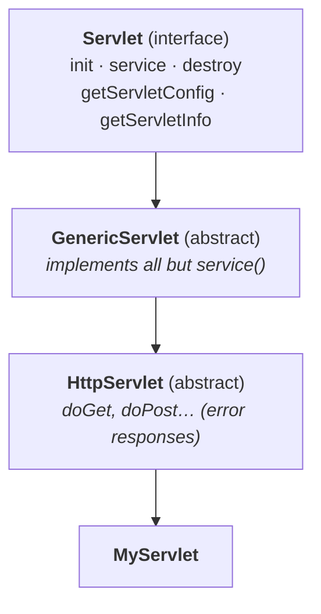

# Marker interfaces

Named at the top of the session as *"the most valuable concept for the interview room."*

## The definition, and the half everybody forgets

Asked what a marker interface is, the class answers: *"an interface which doesn't contain any
methods."*

He tests that immediately:

```java
interface X { }
```

*"This interface doesn't contain any method. Is it a marker interface?"* **No.** So the definition
cannot be right on its own.

> [!important] **Most people know only the first half. There are two conditions:**
> > **1. If an interface doesn't contain any methods, AND**
> > **2. by implementing that interface our objects get some ability —**
> > **such interfaces are called marker interfaces.**
>
> The empty interface above fails the second test. It marks nothing, so it is just an empty interface.

**Also known as:** **ability interfaces** or **tag interfaces** — *"because they are tagged with some
ability."*

## The examples

| Interface | The ability it confers |
|---|---|
| `Serializable` | the object can be **saved to a file** and **sent across a network** |
| `Cloneable` | the object can produce an **exactly duplicate cloned object** |
| `RandomAccess` | the collection supports **fast random access** |
| `SingleThreadModel` | the object is accessed by **only one thread at a time** |

Measured on JDK 25 — all three of the JDK ones really are empty:

```
public interface java.io.Serializable {
public interface java.lang.Cloneable {
public interface java.util.RandomAccess {
```

```
java.io.Serializable       methods: 0
java.lang.Cloneable        methods: 0
java.util.RandomAccess     methods: 0
```

> [!info] **A warning he gives about `Cloneable`.** *"Don't feel `clone()` is available inside
> `Cloneable`."* The `clone()` method lives in **`Object`**, not in `Cloneable`. The interface is
> genuinely empty — it only flags that calling `clone()` is permitted.

## The ability, demonstrated in one word

**`Cloneable` — without it.** Measured on JDK 25:

```java
class Cat {
    int age = 5;
    public Cat copy() throws CloneNotSupportedException { return (Cat) this.clone(); }
}
```
```
caught: java.lang.CloneNotSupportedException: Cat
```

**With it** — the only change is `implements Cloneable`:

```java
class Rat implements Cloneable {
    int age = 5;
    public Rat copy() throws CloneNotSupportedException { return (Rat) this.clone(); }
}
```
```
cloned, age = 5, same object? false
```

**A genuine second object.** Same code, one word added.

**`Serializable` — the same experiment.** Measured on JDK 25:

```
without Serializable -> java.io.NotSerializableException: Student
with Serializable    -> saved to file, 65 bytes
```

---

# The question this raises

> **Without having any methods, how do the objects get some ability in marker interfaces?**

He calls this a big doubt for the majority, and expects it in interviews. The answer is built through
a long analogy first.

> [!question]- **Deep dive — why nobody starts their career in New York City.** The analogy he uses to
> explain who supplies the ability, and it is the centrepiece of the session.
>
> *"After completing this Java course, where will you start your trials?"* The class answers Hyderabad,
> Bangalore, Chennai, Pune, Noida, Mumbai. A thousand students would give the same list.
>
> **"Why don't you start your trials in New York City? Or California? Or at least London?"**
>
> *"Even in your dreams you never got this thought."* So he asks what is actually stopping them, and
> collects the answers:
>
> | Problem | |
> |---|---|
> | **vitamin M** | money — *"the highest common problem"* |
> | **passport and visa** | some have no passport; others have one but no visa |
> | **new environment** | nobody to provide support or guidance |
> | **food** | *(he dismisses this — KFC and Domino's are everywhere)* |
> | **homesickness** | *"without my parents I can't live alone"* — Hyderabad is 10 hours from home; the US is not |
> | **the XYZ problem** | *"without her I can't live alone"* — the Telugu-movie airport scene, hero about to leave for the US, heroine arrives at the last minute |
>
> **He then removes every one of them.** Money — covered until your first salary. Passport — a known
> person at the passport office, one week. Visa — a known person at the embassy. New environment — our
> guest house, our people, lodging and boarding for six months. Guidance — someone there the whole
> time. Homesick — **bring your parents too.** The XYZ problem — **bring XYZ as well.**
>
> **"Now, how many of you will start your trials in New York City?"** *Everyone.*
>
> > **The difference between approach one and approach two: in the first, you have to take care of
> > everything yourself. In the second, someone is there to provide the support.**
>
> **That someone is the JVM.**

## The answer

He makes the parallel concrete with a second story: somebody in London asks him to send a Java object
across the network. His honest answer is *"I can't."*

> *"I don't know how to convert this object into network-supported form. If any network-related issues
> arise, I don't know how to handle them. Assume 70 lakh lines of code are required to send one object
> across the network — and worse, 12 network-related languages are involved."*

**If the programmer had to do all of that, no programmer would ever send an object anywhere.** So:

> **Internally, the JVM is responsible for providing the required ability.**
>
> *"You are not required to do anything. The total required ability, my JVM is going to provide
> internally. But for which class's objects do you want that ability? For that class, keep one word:
> `implements Serializable`."*

**And why does the JVM do this?**

> **To reduce the complexity of programming, and to make the Java language as simple as possible.**

> [!important] **The two interview answers, in the form he wants them:**
> - *Without having any methods, how do objects get ability in marker interfaces?* → **Internally the
>   JVM is responsible for providing the required ability.**
> - *Why is the JVM providing that ability?* → **To reduce complexity of programming and to make Java
>   as simple as possible.**

## Can we create our own marker interface?

*"Nothing is impossible."*

> **Yes — but customization of the JVM is required.**

The existing JVM knows how to supply *serializable* and *cloneable* abilities. It has never heard of
your `Sleepable` or `Jumpable`, so implementing them buys your objects nothing unless something
supplies the behaviour.

> [!info] **And a JVM is not Sun's private property.** Tomcat ships one; WebLogic ships **JRockit**,
> built by BEA and later Oracle, not by Sun; WebSphere has its own. *"Product development teams design
> their own JVMs."* So customising one is real work, but it is not forbidden — and **how** to do it is
> *"not in the programmer's scope."*

---

# Adapter classes

## The problem

```java
interface X {
    void m1(); void m2(); void m3(); void m4(); void m5();   // …up to m1000
}
```

You want to implement `X`, but you only care about **`m3`**.

> **If we implement an interface, we must provide implementation for each and every method of that
> interface — whether it is required or not.**

Measured on JDK 25:

```java
class NoAd implements X2 { public void m3() { } }
```
```
error: NoAd is not abstract and does not override abstract method m5() in X2
```

So you write your 10 useful lines — and **999 dummy methods** around them.

> **The problem with this approach: it increases the length of the code and reduces readability.**

## The solution

> **An adapter class is a simple Java class that implements an interface with only empty
> implementations.**

```java
abstract class AdapterX implements X {
    public void m1() { }
    public void m2() { }
    public void m3() { }
    public void m4() { }
    public void m5() { }
}
```

Now **extend the adapter instead of implementing the interface**:

```java
class Test extends AdapterX {
    public void m3() { System.out.println("only m3 implemented"); }
}

class Sample extends AdapterX {
    public void m5() { System.out.println("only m5 implemented"); }
}
```

Measured on JDK 25:

```
only m3 implemented
only m5 implemented
Test is an X? true
```

**Two things to notice.** Each class overrides exactly the one method it cares about — the rest arrive
from the parent by inheritance. And `Test` is still an `X`: `AdapterX implements X`, so
`Test extends AdapterX` **indirectly implements `X`**, and nothing about the type relationship is lost.

> **Write the adapter once, use it any number of times.** Without it, `Test`, `Sample` and `Demo` would
> each need 1000 method implementations.

## Why the adapter should be abstract

Every method in the adapter has an **empty** body. Create an object of it and call a method — you get
**nothing back**.

> *"Then what is the use of creating an object and calling these methods? Waste."*

> **Hence it is highly recommended to declare the adapter class `abstract`.**

Which is exactly the case from part 06: **an abstract class may contain zero abstract methods**, when
the implementations exist but are not meaningful. `HttpServlet` was the example there; an adapter class
is the same shape.

> [!info] **And note what an adapter class is not.** *"It is not a language-level feature. It is a
> programmer's trick"* — an approach, not a keyword.

---

# The real example — servlets

> **A servlet can be developed in three ways:**
> **1. by implementing the `Servlet` interface**
> **2. by extending `GenericServlet`**
> **3. by extending `HttpServlet`**



**The `Servlet` interface has five methods:** `init`, `service`, `destroy`, `getServletConfig`,
`getServletInfo`.

**Implement it directly** and you must write all five — *"I'm not having any initialization activity.
Whether you have or not, you should write `init()`, then only will it compile."*

> *"That's why nobody uses this approach. Even for your first demo program you never have the dare to
> implement the `Servlet` interface directly."*

**Extend `GenericServlet`** and it has already implemented four of the five, leaving only `service()`.

> **More or less, `GenericServlet` acts as an adapter class for the `Servlet` interface.**

> [!important] **Why "more or less" and not simply "is".** *"Strictly speaking, an adapter class
> contains only methods with empty implementation. But in `GenericServlet` there is beautiful,
> genuinely useful implementation for some methods."* An adapter's bodies are empty; `GenericServlet`'s
> are real. **The pattern is the same; the definition does not fit exactly** — and he is careful to say
> so rather than overstate it.

---

# What this part established

| | |
|---|---|
| Marker interface — condition 1 | contains **no methods** |
| — condition 2 | implementing it **gives objects some ability** |
| Both conditions needed | an empty interface alone is not a marker interface |
| Also called | **ability** interfaces, **tag** interfaces |
| Examples | `Serializable`, `Cloneable`, `RandomAccess`, `SingleThreadModel` |
| `clone()` lives in | **`Object`**, not in `Cloneable` |
| Without `Cloneable` | `CloneNotSupportedException` |
| Without `Serializable` | `NotSerializableException` |
| Where the ability comes from | **the JVM, internally** |
| Why | to **reduce complexity** and keep Java **simple** |
| Our own marker interface? | **yes — but JVM customization is required** |
| A JVM is | not Sun-only — JRockit, Tomcat's, WebSphere's all exist |
| Adapter class | a Java class implementing an interface with **only empty implementations** |
| The problem it solves | implementing 1000 methods to use 1 |
| Use it by | **extending** the adapter instead of implementing the interface |
| Type relationship | preserved — the child is still an instance of the interface |
| Declare the adapter | **`abstract`** — its implementations are meaningless |
| It is | a **programmer's trick**, not a language feature |
| Three ways to write a servlet | implement `Servlet` · extend `GenericServlet` · extend `HttpServlet` |
| `GenericServlet` is | **more or less** an adapter class — its bodies are real, not empty |
