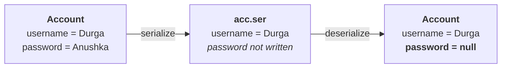

# The `transient` modifier

> **`transient` is a modifier applicable only for VARIABLES.** Not for methods, not for classes.

Measured on JDK 25:

```java
class T { transient void m1() { } }   // error: modifier transient not allowed here
class T { transient int x; }          // valid
```

> **`transient` plays its role in the serialization context** — and nowhere else.

## Serialization, in one line each

| | |
|---|---|
| **serialization** | saving the state of an object **to a file**, or sending it **across a network** |
| **deserialization** | reading the state of an object back |

And a file lives on the hard disk, so this is **permanent storage** — which is where the problem starts.

## Why the keyword exists

> [!question]- **Deep dive — the email address and the password.** His argument for why permanent storage is a security question, not just a storage question.
>
> I want to share a valuable document related to SCJP. Can you please share your mail ID? Everyone in the class is willing.
>
> **Can you please share your password also?**
>
> No one is going to share, I'm sure.
>
> **A mail ID you can publish anywhere. A mail ID plus a password is dangerous** — there may be a chance of misuse.
>
> An `Account` object is the same: `username = "Durga"` is fine to save; `password = "Anushka"` is not. **Save the object and the password is on the hard disk permanently, in the clear.**

> **At the time of serialization, if we don't want to save the value of a particular variable — to meet a security constraint — such a variable we declare `transient`.**

## What actually happens to the value

> **The JVM ignores the original value and saves the DEFAULT value to the file.**

Measured on JDK 25:

```java
class Account implements Serializable {
    String username = "Durga";
    transient String password = "Anushka";
}
```

```
before: Durga / Anushka
after : Durga / null
```

**And with a primitive:**

```java
class Acc2 implements Serializable { int a = 10; transient int b = 20; }
```
```
a = 10, b = 0
```

> [!important] **Read what that means precisely.** `transient` does **not** remove the field from the object — after deserialization it is still there, holding **the default value for its type**: `null` for a reference, `0` for an `int`, `false` for a `boolean`. The value was never written, so on the way back there is nothing to restore.



> [!info] **This closes a loop from note 12.** `transient` is forbidden on interface variables — because an interface has no objects, so there is no serialization, so there is nothing for `transient` to exclude. Seeing what it actually does here makes that reasoning concrete.

---

# What this part established

| | |
|---|---|
| `transient` applies to | **variables only** |
| Where it matters | **serialization** |
| What it does | the JVM **ignores the original value and writes the default** |
| After deserialization | `null` for references, `0` for `int` — the field still exists |
| Why interfaces forbid it | no objects ⇒ no serialization ⇒ nothing to exclude |
