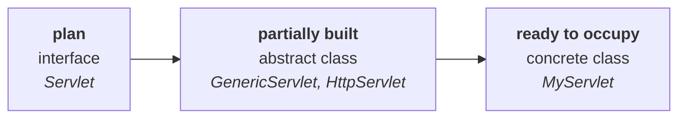

# When to use which

Three constructs, and the choice between them comes down to **how much of the implementation you
know**.

> **1. If we don't know anything about implementation and just have a requirement specification —
> go for an INTERFACE.**
>
> **2. If we are talking about implementation but not completely (partial implementation) —
> go for an ABSTRACT CLASS.**
>
> **3. If we are talking about implementation completely and are ready to provide service —
> go for a CONCRETE CLASS.**

> [!info] **And at the end, a concrete class is always required.** *"With an interface or an abstract
> class we can't do anything. At the end, the compulsorily required concept is the concrete class."*
> The first two are stages on the way; only the third can be instantiated and used.

## The building analogy

> [!question]- **Deep dive — building a 1,000-floor building.** His analogy for the three stages, and
> the reason the progression feels obvious afterwards.
>
> **You want to construct a 1,000-floor building. What comes first?** The **plan**. Nobody starts
> construction directly.
>
> > **The plan never talks about implementation — it just says "this is the specification."**
> > **The plan is the interface.**
>
> Construction starts. 1,000 floors were planned; **600 are finished** and work continues.
>
> > **A partially completed building is the abstract class.**
>
> One fine day it is finished, and you can move in — live there, start your business there.
>
> > **A fully completed building, ready to use, is the concrete class.**

## The servlet example, mapped

| Stage | Servlet world |
|---|---|
| **interface** — pure specification | **`Servlet`** — *"if you want to develop your own servlet, these are the five methods"* |
| **abstract class** — partial | **`GenericServlet`**, **`HttpServlet`** |
| **concrete class** — complete, ready to serve | **your own servlet** |



---

# Interface vs abstract class — the eight differences

Named as the highest-value interview question in the chapter: *"if you attend 10 interviews, in
minimum 8 this question is there."*

Everything below measured on JDK 25.

| # | | **Interface** | **Abstract class** |
|---|---|---|---|
| **1** | **When to use** | you know **nothing** about implementation — just a requirement specification | you know it **partially** |
| **2** | **Methods** | an abstract method is always **`public` and `abstract`**; bodies are allowed only as `default`, `static` or `private` | methods **need not** be public or abstract — **concrete methods allowed** |
| **3** | **Method modifiers** | cannot use `protected`, `final`, `synchronized`, `native`, `strictfp` | **no restrictions** |
| **4** | **Variables** | every variable is always **`public static final`** | variables **need not** be — private, instance and non-final all allowed |
| **5** | **Variable modifiers** | cannot use `private`, `protected`, `transient`, `volatile` | **no restrictions** |
| **6** | **Variable initialization** | **compulsory at the time of declaration** | not required at declaration |
| **7** | **Static / instance blocks** | ❌ not allowed | ✅ allowed |
| **8** | **Constructors** | ❌ not allowed | ✅ allowed |

## Rows 7 and 8, measured

```java
interface T { static { int x = 10; } }
interface T { { int x = 10; } }
```
```
error: initializers not allowed in interfaces
error: initializers not allowed in interfaces
```

```java
interface T { T() { } }
```
```
error: <identifier> expected
```

**The last message is worth reading.** The compiler does not say *"constructors are not allowed"* — it
does not even parse `T()` as a constructor, because inside an interface a name followed by parentheses
can only be a method, and a method needs a return type. The concept does not exist there.

**In an abstract class all three are fine.** Measured on JDK 25 — static block, instance block and
constructor all compile, as do `private` / `transient` / `volatile` / `protected` variables and
`private` / `static` / `synchronized` / `final` methods.

> [!important] **Rows 1, 4, 6, 7 and 8 are the ones that still make the two constructs genuinely
> different** — and rows 7 and 8 are the cleanest, because no version of Java has ever given an
> interface a constructor or an initialiser block.
>
> **Rows 2 and 3 are the ones people state too strongly.** An interface is not *100% pure abstract*:
> it may carry `default`, `static` and `private` methods with bodies. What stays true is that a method
> **without** a body is implicitly `public abstract`. Detail in note `12`, and in `JAVA-8-FEATURES/05`.

---

# The loophole: why an abstract class has a constructor

The question this table provokes, and he flags it as the important one:

> **We cannot create an object for an abstract class — but an abstract class can contain a
> constructor. What is the need?**

Measured on JDK 25, both halves are true at once:

```java
abstract class P2 { P2() { } }      // constructor: fine
P2 p = new P2();                    // error: P2 is abstract; cannot be instantiated
```

## The one-line answer

> **The abstract class constructor is executed whenever we are creating a CHILD class object, to
> perform initialization of the child object.**

*"Keep this answer in your mind"* — it is the whole thing, and the rest is why it matters.

## Why the child needs it

Every `Person` has a hundred properties — name, age, colour, height, weight, qualification… A
`Student` adds one of its own, a roll number. So a `Student` object carries **101 properties**, of
which **100 are inherited**.

**Without a constructor in `Person`**, every subclass has to initialise all 101 itself:

```java
class Student extends Person {
    Student(String name, int age, /* …98 more… */ int rollno) {
        this.name = name;
        this.age = age;
        // …98 more assignments…
        this.rollno = rollno;
    }
}
```

And `Employee`, `Customer`, `Teacher` each repeat the same 100 lines.

**With a constructor in `Person`**, each subclass initialises only what is its own:

```java
abstract class Person {
    String name; int age;
    Person(String name, int age) {
        this.name = name; this.age = age;
        System.out.println("Person constructor ran");
    }
}

class Student extends Person {
    int rollno;
    Student(String name, int age, int rollno) {
        super(name, age);
        this.rollno = rollno;
        System.out.println("Student constructor ran");
    }
}
```

Measured on JDK 25:

```
Person constructor ran
Student constructor ran
Durga 30 101
```

**Both constructors ran, parent first**, and the `Student` object came out fully initialised.

> [!important] **So the constructor is not there to build a `Person`.** It is there so that the
> inherited half of a `Student` can be initialised in one place instead of being copied into every
> subclass. **The benefit is code reusability** — and it is why "you can't instantiate it" and "it has
> a constructor" are not in conflict.

---

# What this part established

| | |
|---|---|
| No implementation knowledge, just a spec | **interface** |
| Partial implementation | **abstract class** |
| Complete implementation, ready to serve | **concrete class** |
| Always needed at the end | the **concrete class** |
| The analogy | **plan** → **partially built** → **ready to occupy** |
| The servlet mapping | `Servlet` → `GenericServlet` / `HttpServlet` → your own servlet |
| Difference 1 | purpose — how much implementation you know |
| Difference 2 | interface methods **public + abstract**; abstract class methods need not be |
| Difference 3 | interface method modifiers restricted; abstract class **unrestricted** |
| Difference 4 | interface variables **public static final**; abstract class variables need not be |
| Difference 5 | interface variable modifiers restricted; abstract class **unrestricted** |
| Difference 6 | interface variables must be initialized **at declaration** |
| Difference 7 | static/instance blocks — ❌ interface, ✅ abstract class |
| Difference 8 | constructors — ❌ interface, ✅ abstract class |
| ⚠️ Rows 2, 3, 5 | softened by Java 8/9 `default`, `static`, `private` methods |
| Why an abstract class has a constructor | it runs when a **child object** is created, to initialise the **inherited** part |
| The benefit | **code reusability** — the shared initialisation lives in one place |
