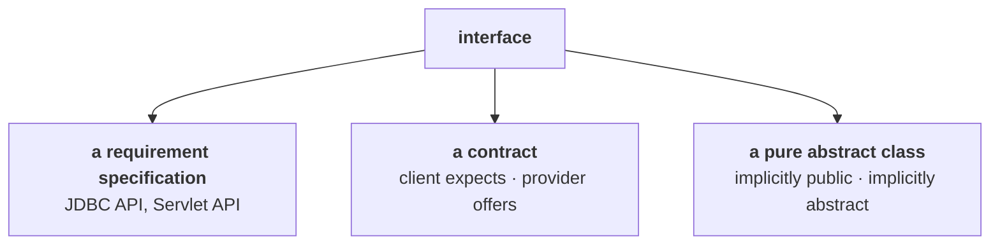

# What is an interface?

He opens by naming this as the question interviewers are least often satisfied with — one area where most of the time the interview person may not be satisfied with our answer.

The reason is that there are **several** correct definitions, and you can give a right one that isn't the one being fished for:

> If the interviewer is expecting '100% pure abstract class' and you say 'any service requirement specification', he may not be satisfied. And if you say '100% pure abstract class', his expectation may be 'any contract between client and service provider'.

So the plan is: learn all three, then combine them.

---

# Definition 1 — any service requirement specification

> **Any service requirement specification (SRS) is considered as an interface.**

## Example 1 — the JDBC API

**JDBC API is a requirement specification to develop a database driver.**

- **Some people define it** — the specification itself.
- **Database vendors implement it** — and each vendor's implementation is their driver.

| Vendor | Their implementation is called |
|---|---|
| Oracle | the **Oracle driver** |
| MySQL | the **MySQL driver** |
| IBM | the **DB2 driver** |

> [!info] **The clue is in the name.** What is the I in JDBC **API**? — Application Programming **Interface**. The word was there all along.

## Example 2 — the Servlet API

**Servlet API is a requirement specification to develop a web server**, and the web server vendor is responsible for implementing it.

| Vendor | Their server |
|---|---|
| Apache | **Tomcat** |
| BEA (now Oracle) | **WebLogic** |
| IBM | **WebSphere** |

> [!question]- **Deep dive — the payoff of a shared specification, and a question from the class.** The practical consequence, which is the reason specifications exist at all.
>
> **You develop one web application and deploy it on Tomcat. It works.** Tomorrow you want to deploy the same application on WebLogic — will it work? **Yes.** The day after, on WebSphere? **Yes.**
>
> Because all these people implemented a common requirement specification. Your application is written against the **specification**, not against any one vendor — so any conforming implementation can host it. That portability **is** the product of the interface.
>
> A student asks: WebLogic is an application server, so how does it implement the Servlet API? **Inside every application server there is a built-in web server**, and that web server is what implements the Servlet API.

---

# Definition 2 — a contract between client and service provider

A client arrives with a requirement: I want a college automation system. The services I need are `getAttendance`, `getMarks`, `updateMarks`… a hundred services. Anyone interested in providing an implementation?

A service provider answers: Yes boss, I'll implement all of them. They sign the contract; the provider implements.

**The same document, read from two directions:**

> **From the client's point of view, an interface defines the set of services he is EXPECTING.** **From the service provider's point of view, an interface defines the set of services he is OFFERING.**
>
> **Hence any contract between a client and a service provider is considered as an interface.**

> [!info] **The example closest to home.** You pay 3,000 rupees for the SCJP course, and the syllabus lists 20 topics. That is the contract between Durgasoft and yourself. Cover only 10 and you would not accept it — we are not following the contract. The list of 20 topics **is** the interface.

## The ATM screen

The best version of this idea, because you can see it.

```
┌──────────────────────────┐
│      Withdraw            │
│      Mini Statement      │
│      Balance Inquiry     │
│      …                   │
└──────────────────────────┘
```

> What is this one? **GUI — Graphical User Interface.**

**The same screen, both directions again:** it shows what the bank is **offering**, and it shows what the customer can **expect**. So the screen is the contract between customer and bank.

> [!question]- **Deep dive — the two ATM stories, on what a contract actually obliges.** He tests the idea by breaking it twice, and the pair is what makes the point land.
>
> **Story 1 — a listed service fails.** You swipe your card and ask for 10,000. The processing starts, the counting begins — and the power goes off. No money comes out, but you get a message saying **10,000 has been debited** from your account. You call the bank.
>
> Are the bank people responsible for this issue? **Yes.** Sir, within 24 hours your money will automatically be credited back. If it doesn't happen, we are responsible — contact your home branch. **Withdraw is on the screen, so the bank owns the outcome.**
>
> **Story 2 — a service that was never listed.** This ATM has no deposit facility. You put 10,000 in an envelope, write your account number on it, drop it into the machine and go home. Tomorrow the money has not been credited. You call the bank.
>
> **They are not responsible.** Bank people are not offering this kind of service.
>
> > **These are the services we are going to offer. If anywhere there is a problem in THESE services, let us know — we will solve it.**
>
> **That is exactly what an interface guarantees and what it does not.** A method on the interface is a promise you can hold the implementation to. Anything not on it was never promised, no matter how reasonable it seems.

---

# Definition 3 — a pure abstract class

> **Inside an interface, a method with no body is always `public` and `abstract`, whether we declare it or not. Hence an interface is considered a pure abstract class.**

Measured on JDK 25 — the source says only `void m1();`:

```java
interface Pa { void m1(); }
```

```
$ javap Pa
interface Pa {
  public abstract void m1();
}
```

**The compiler supplied `public` and `abstract`.** You wrote neither.

> [!important] **Say pure abstract class, not 100% pure abstract class.** An interface may also hold **`default` and `static`** methods with bodies, and **`private`** ones, so it is not literally 100% abstract any more. The precise sentence — and the one that will not be contradicted — is:
>
> **every method in an interface is implicitly `public`, and implicitly `abstract` unless it is `default`, `static` or `private`.**
>
> Methods with bodies are covered in full in `JAVA-8-FEATURES/05`.

---

# The summary definition

Since any one definition risks missing what the interviewer wants, combine them:

> **Any service requirement specification, or any contract between a client and a service provider, or a pure abstract class — is an interface.**

> Then definitely what he expected will be there in our statement, and he is going to be convinced.



---

# Declaring and implementing an interface

```java
interface Interf {
    void m1();
    void m2();
}
```

A client with two required services. A service provider implements them with the **`implements`** keyword:

```java
class ServiceProvider implements Interf {
    public void m1() { System.out.println("m1 implemented"); }
    public void m2() { System.out.println("m2 implemented"); }
}

class Impl {
    public static void main(String[] args) {
        Interf i = new ServiceProvider();
        i.m1();
        i.m2();
    }
}
```

Measured on JDK 25:

```
m1 implemented
m2 implemented
```

## The two ways to get it wrong

**Implement only some of the methods.** Measured on JDK 25:

```java
class Half implements I2 { public void m1() { } }
```
```
error: Half is not abstract and does not override abstract method m2() in I2
```

**Contractually:** you signed for two services and delivered one.

**Implement them without `public`.** Measured on JDK 25:

```java
class Weak implements I3 { void m1() { } }
```
```
error: m1() in Weak cannot implement m1() in I3
```

> [!important] **This is the mistake that catches everyone, and it follows from definition 3.** The interface method is implicitly **`public`** — `javap` proved it above. An overriding method may never **reduce** visibility, so writing `void m1()` (default access) in the implementation class is an attempt to narrow `public` to package-private.
>
> **Every method implementing an interface method must be declared `public`.**

---

# What this part established

| | |
|---|---|
| Why this question is hard | several correct definitions — give the wrong right one and the interviewer is unsatisfied |
| Definition 1 | any **service requirement specification** — JDBC API, Servlet API |
| Who defines vs implements | the spec's authors define; the **vendor** implements |
| JDBC implementations | Oracle driver, MySQL driver, DB2 driver |
| Servlet API implementations | Tomcat (Apache), WebLogic (Oracle), WebSphere (IBM) |
| Why that matters | one application runs on **all** of them |
| Definition 2 | any **contract between client and service provider** |
| From the client's side | the services he is **expecting** |
| From the provider's side | the services he is **offering** |
| What a contract obliges | the listed services — **and nothing else** (the two ATM stories) |
| Definition 3 | a **pure abstract class** |
| Proof | `javap` shows `public abstract` where the source wrote neither |
| The precise version | implicitly `public`; implicitly `abstract` **unless** `default`, `static` or `private` |
| The summary answer | give **all three** joined by `or` |
| Keyword | **`implements`** |
| Partial implementation | ❌ `is not abstract and does not override abstract method` |
| Non-public implementation | ❌ `cannot implement` — interface methods are implicitly **public** |
