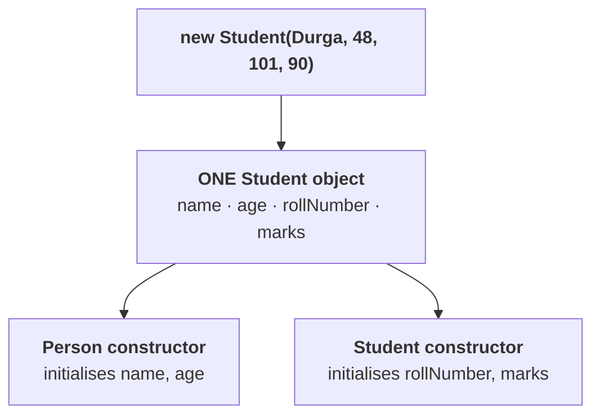

# What the parent constructor is actually for

Note `15` established that a constructor **initialises** rather than creates. This part applies that
to inheritance, and the answer falls out of it.

## The setup

```java
class Person {
    String name;
    int age;

    Person(String name, int age) {
        this.name = name;
        this.age = age;
    }
}
```

**Two properties.** Now a child:

```java
class Student extends Person {
    int rollNumber;
    int marks;
    …
}
```

**Count the properties of a `Student` object:**

| Coming from | Properties |
|---|---|
| `Person` | `name`, `age` |
| `Student` itself | `rollNumber`, `marks` |
| **total** | **4** |

## Who initialises which

A `Student` object has four fields, so all four must be initialised. But the child constructor does not
have to do all of it:

```java
class Student extends Person {
    int rollNumber, marks;

    Student(String name, int age, int rollNumber, int marks) {
        super(name, age);              // parent handles the inherited two
        this.rollNumber = rollNumber;  // child handles its own
        this.marks = marks;
    }
}
```

```java
Student s = new Student("Durga", 48, 101, 90);
```

| Property | Initialised by |
|---|---|
| `name` | **`Person`'s constructor**, via `super(name, age)` |
| `age` | **`Person`'s constructor** |
| `rollNumber` | `Student`'s constructor |
| `marks` | `Student`'s constructor |

> **The parent constructor is responsible for performing initialization of the properties which are
> coming from the parent. The child constructor takes care of the child-specific properties.**



## The conclusion that matters

> [!important] **Both constructors ran — for one object.**
> > **Both parent and child constructors are executed for the CHILD object's initialization only.**
>
> *"Can you please tell — is a parent object created? **No.** Parent properties come to the child, and
> to perform initialization of those properties the parent constructor runs."*
>
> **This is the answer to doubt 3 from note `15`,** and note `17` proves it with a measurement rather
> than an argument.

> [!info] **Why this is worth doing at all.** Without the parent constructor, `Student` would have to
> assign `name` and `age` itself — and so would `Teacher`, `Employee`, `Customer` and every other
> subclass. **The shared initialisation lives in one place instead of being copied into each child.**
> Note `18` scales this up to show exactly how much it saves.

---

# What this part established

| | |
|---|---|
| A `Student` object holds | **4** properties — 2 inherited, 2 its own |
| The parent constructor initialises | the **inherited** properties |
| The child constructor initialises | the **child-specific** properties |
| `super(name, age)` | hands the inherited half to the parent |
| Constructors executed | **both** — parent first |
| Objects created | **one** |
| Both constructors serve | the **child object's** initialization only |
| The benefit | shared initialisation written **once** |
