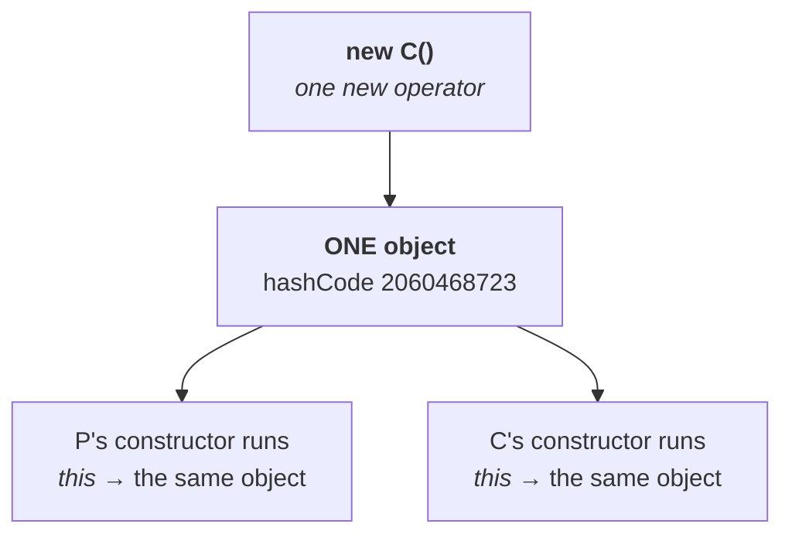

# The claim under test

> **"Whenever we are creating a child class object, automatically a parent object will be created."**

> *"In your regular college classes, or in your books, or somewhere, this type of statement is very
> common."*

He puts it to the class. A few hands go up for **yes**. And rather than argue, he designs a
**measurement**.

---

# The experiment

**The idea:** every object has a **hash code** — a number identifying it. If a child object *and* a
parent object are both created, there are **two** objects, so there must be **two different** hash
codes. If only one object exists, every hash code printed will be **the same**.

```java
class P {
    P() { System.out.println("parent constructor, this.hashCode() = " + this.hashCode()); }
}

class C extends P {
    C() { System.out.println("child  constructor, this.hashCode() = " + this.hashCode()); }
}

class Test {
    public static void main(String[] args) {
        C c = new C();
        System.out.println("in main,           c.hashCode() = " + c.hashCode());
    }
}
```

**Why this works:** `this` inside a constructor means *the current object*. If the parent constructor
were initialising a **separate parent object**, its `this` would be a different object with a
different hash code.

## The result

Measured on JDK 25:

```
parent constructor, this.hashCode() = 2060468723
child  constructor, this.hashCode() = 2060468723
in main,           c.hashCode() = 2060468723
```

**One number, three times.**

> [!important] **The conclusion, and it is a measurement rather than an opinion:**
> > **Whenever we are creating a child class object, the parent constructor will be executed — but a
> > parent object will NOT be created.**
>
> `this` in the parent constructor **is the child object**. There is no second object for it to refer
> to.

## Why the misconception is so common

> *"Most people don't know the job of a constructor — that is the problem. They feel: constructor
> executed, therefore object created. So the parent constructor executed, therefore a parent object was
> created."*

**Note `15` already broke that chain.** A constructor does not create anything — `new` does. And `new`
was written **once**.

> **Count the `new` operators, not the constructors.** One `new`, one object. Two constructors ran, both
> for that same object.



---

# What this part established

| | |
|---|---|
| The claim | creating a child object also creates a parent object |
| The test | compare **hash codes** — two objects would give two numbers |
| The result | **the same hash code** in the parent constructor, the child constructor, and `main` |
| Therefore | **one** object exists |
| Parent constructor | **is executed** |
| Parent object | **is NOT created** |
| Why people believe otherwise | they think a constructor creates an object |
| The rule to count by | **one `new`, one object** — regardless of how many constructors run |
