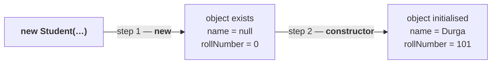

# The questions this series answers

He opens by listing the doubts that will be settled over the next hour and a half — worth having up front, because every note from here to `21` is answering one of them:

1. **We can't create an object for an abstract class, but an abstract class can contain a constructor. What is the need?**
2. **We can't create an object for an abstract class directly — but indirectly we can. Valid or not?**
3. **Whenever we create a child class object, a parent object is automatically created. Valid or not?**
4. **We can't create objects for either an abstract class or an interface — so why can an abstract class contain a constructor while an interface cannot?**
5. **Inside an interface we can take only abstract methods; inside an abstract class we can also take only abstract methods if we want. So can an interface be replaced by an abstract class?**

> Most of this misunderstanding exists because people don't know the job of a constructor. That is the problem.

So he starts there.

---

# `new` vs the constructor

```java
Student s = new Student("Durga", 101);
```

What am I doing? — creating a `Student` object. **But two separate things are happening**, and almost everyone attributes both to the wrong one.

> [!important] **The distinction the whole series rests on:**
> > **The main objective of the `new` operator is to CREATE an object.**
> > **The main purpose of a constructor is to INITIALIZE that object.**
>
> Most of the people are going to feel the purpose of a constructor is to create an object. **No.** The purpose of a constructor is to initialize an object. Who is responsible for creating it? The `new` operator.

## Traced step by step

```java
class Student {
    String name;
    int rollNumber;

    Student(String name, int rollNumber) {
        this.name = name;
        this.rollNumber = rollNumber;
    }
}
```

`new Student("Durga", 101)` runs in two stages:

| Stage | Who | What happens |
|---|---|---|
| **1** | **`new`** | the object is created, and its instance variables come into existence **with default values** — `name = null`, `rollNumber = 0` |
| **2** | **the constructor** | `this.name = name` replaces `null` with `Durga`; `this.rollNumber = rollNumber` replaces `0` with `101` |

**Look at what the constructor body actually contains: assignment statements.** Assignment is meant for initialization. There is nothing in there that creates anything.

## Which runs first

> **First the object is created by the `new` operator, and then initialization is performed by the constructor.**

> [!info] **His analogy.** A baby has to be born. After the baby is born, we will think about the naming ceremony. You cannot name a child who does not exist yet — and you cannot initialise an object that has not been created.



---

# What this part established

| | |
|---|---|
| Purpose of **`new`** | to **create** an object |
| Purpose of a **constructor** | to **initialize** that object |
| The common error | believing the constructor creates the object |
| Order | **`new` first**, then the constructor |
| Why that order | you cannot initialise something that does not exist |
| What a constructor body holds | **assignment statements** — initialisation, not creation |
