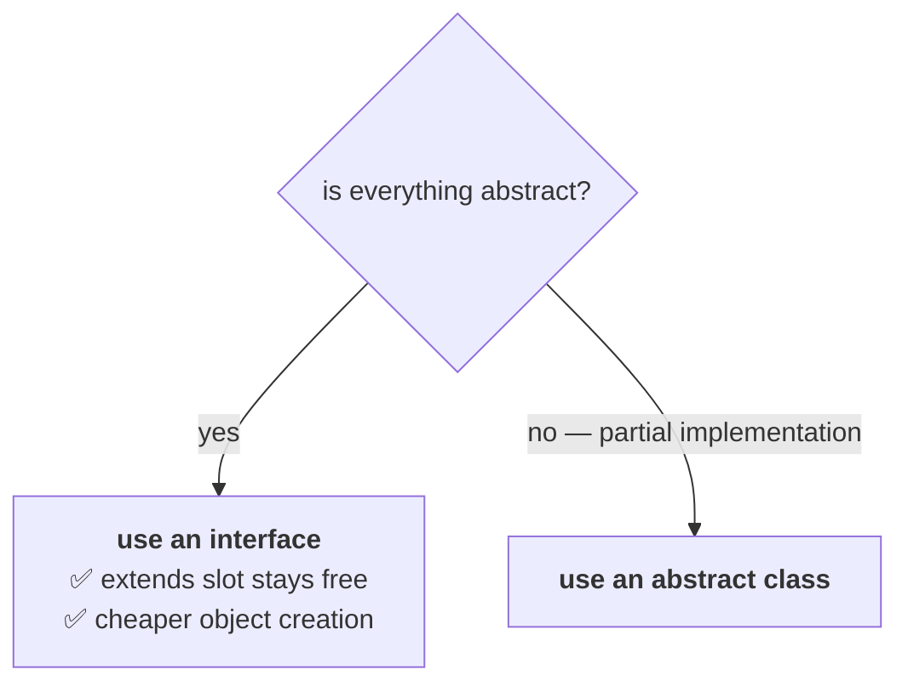

# The question

Inside an interface you can take only abstract methods. Inside an abstract class you *may* take only
abstract methods too, if you choose. So:

> **Can we replace the interface concept with an abstract class?**

> [!info] **His first answer is a logical one, before any technical detail.** *"If you could replace
> it, why did the Java people provide two concepts? They would have introduced only one. Two concepts
> exist, which means they are not interchangeable."*

> **Yes, we can replace an interface with an abstract class — but it is not a good programming
> practice.**

---

# Why not, before the technical reasons

> [!question]- **Deep dive — recruiting an IAS officer to sweep the floor.** His analogy for why a
> working solution can still be the wrong one.
>
> Durgasoft has 19 or 20 classrooms, and they all need sweeping at the end of the day. So he places an
> advertisement:
>
> > **WANTED: SWEEPERS**
> > *Eligibility: must be an IAS officer, minimum 20+ years of government service.*
>
> *"Definitely, within one or two hours I will get a phone call from some officer."*
>
> **Now — if you hand an IAS officer a broom, will the room get swept?** Yes. It will. **But you are
> misusing the role.** An officer's range is large; he has top-level work to do. Recruiting one for a
> low-level activity wastes what he is.
>
> > **An interface never talks about implementation — it is the low-level, lightweight concept. An
> > abstract class CAN talk about implementation. Using an abstract class where an interface belongs is
> > recruiting an IAS officer for sweeping purposes.**

---

# The two technical reasons

## 1. You lose the inheritance benefit

**Implementing an interface leaves your one `extends` slot free:**

```java
interface X { void m1(); }
class A { }

class Test1 extends A implements X {   // ✅
    public void m1() { }
}
```

Measured on JDK 25 — **valid.** You implement the interface **and** still extend a class.

**Extending an abstract class uses the slot up:**

```java
abstract class X2 { }
class A2 { }

class Test2 extends X2, A2 { }         // ❌
```

Measured on JDK 25:

```
error: '{' expected
```

> **While implementing an interface we can extend any other class, and hence we won't miss the
> inheritance benefit. While extending an abstract class we cannot extend any other class — and hence
> we are missing the inheritance benefit.**

## 2. Object creation becomes costly

An interface has **no instance variables, no instance blocks, no constructors** (notes `14` and `19`).
An abstract class can have all three.

| | On `new Test()` |
|---|---|
| `class Test implements X` | nothing from the interface has to run |
| `class Test extends X` | the **parent constructor** runs, the **parent instance blocks** run, and so on up the chain |

> *"Assume two minutes is enough to create an object in the first case. In the second, almost twenty
> minutes."*

> [!info] **His numbers are deliberately illustrative** — *"don't ask how exactly you are telling 2
> minutes and 20 minutes, just for basic idea purposes."* The **direction** is what is real: extending
> an abstract class runs more initialisation machinery than implementing an interface does.



> **If everything is abstract, it is highly recommended to go for an interface — not an abstract
> class.**

---

# The Java 8 objection

A student raises it, and it is the right question to ask:

> *"From 1.8 onwards, inside an interface I can take `default` methods and `static` methods — so
> concrete methods can go in an interface. Then aren't an interface and an abstract class the same?"*

> **No. An interface with default methods is never equal to an abstract class.**

**The differences that survive** — from note `14`, the rows Java 8 did not touch:

| | Interface | Abstract class |
|---|---|---|
| instance variables | ❌ all variables are `public static final` | ✅ |
| constructors | ❌ | ✅ |
| static / instance blocks | ❌ | ✅ |
| how many you can inherit | **many** | **one** |

> [!info] **His way of putting it.** *"Which is the rich person — an interface or an abstract class? The
> abstract class. An interface is just a low-level person; it never talks about implementation. Even
> interface default methods are dummy methods — not there to provide proper implementation."*
>
> A `default` method exists so an interface can gain a method **without breaking every existing
> implementer** (see `JAVA-8-FEATURES/05`). That is a compatibility mechanism, not a bid to become an
> abstract class.

---

# What this part established

| | |
|---|---|
| Can an abstract class replace an interface? | **technically yes** |
| Should it? | **no — not a good programming practice** |
| The analogy | recruiting an **IAS officer for sweeping** |
| Technical reason 1 | extending uses your **only `extends` slot** — you lose inheritance |
| Measured | `extends A implements X` ✅ · `extends X, A` ❌ |
| Technical reason 2 | **object creation is costlier** — parent constructor and instance blocks must run |
| The rule | **if everything is abstract, use an interface** |
| Java 8 objection | `default`/`static` methods do **not** make an interface an abstract class |
| What still separates them | instance variables, constructors, blocks, and **multiple** inheritance |
